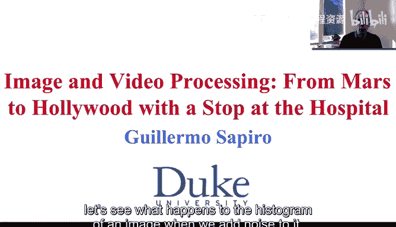
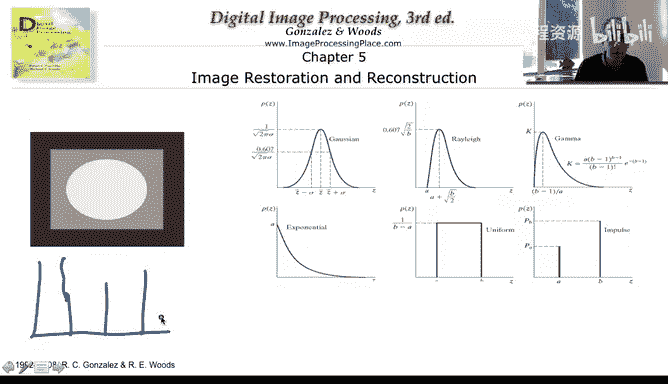

# 图像与视频处理：P33：噪声与直方图

## 概述
在本节课中，我们将要学习噪声如何影响图像的直方图。我们将通过一个简单的示例，观察不同噪声类型如何改变原始图像的直方图形状，并学习如何通过分析直方图来识别噪声类型。

---

## 原始图像与直方图
上一节我们介绍了噪声的基本概念，本节中我们来看看噪声对图像直方图的具体影响。

我们使用一个非常简单的图像作为示例。该图像仅包含三个区域，因此只有三个像素值。如果我们绘制该图像的直方图，会看到三个不同高度的尖峰。实际上，我们看到的只是三个近似于狄拉克δ函数的尖峰，分别代表黑色区域、灰色区域和浅色区域。每个尖峰的高度取决于对应区域的面积。

---

## 添加噪声后的直方图变化
当我们向图像添加具有特定分布的噪声时，直方图将从这三个δ函数变为其他形状。让我们看看具体会发生什么。

以下是三个添加了不同噪声的示例：

*   **高斯噪声**：在第一个示例中，我们向原始图像添加了高斯噪声。直方图中清晰地显示出三个高斯分布的形状。这一点非常重要，它将帮助我们在仅获得图像的情况下估计噪声参数，我们将在下一个视频中看到这一点。
*   **瑞利噪声**：在第二个示例中，我们看到一种与瑞利噪声概率分布函数非常相似的形状。它有些倾斜，然后下降，与高斯分布略有不同。这些形状明显不同，例如高斯分布是对称的，而瑞利分布不是。请记住，这些是噪声的概率分布函数，我们并不期望看到完美的函数形状，所有这些都是概率性的。
*   **伽马噪声**：在第三个示例中，我们看到伽马噪声。同样，在每个原始像素值周围，其形状与伽马噪声的实际概率分布函数非常相似。

---

## 通过直方图识别噪声类型
现在我们已经了解了基本原理，让我们通过练习来巩固知识。我将向你提问。

观察下图，你认为我们向原始图像添加了哪种噪声？

（此处应有一幅添加了噪声的图像直方图，但原文未提供具体图片描述）

我认为，如果我们仅仅比较形状，得出答案并不困难。请记住，如果我们只有原始图像，其直方图是代表黑、灰、白区域的三个不同高度的δ函数。而现在我们非常清楚地看到了指数函数的形状。因此，这是**指数噪声**。

仅从图像本身很难看出这是高斯噪声、指数噪声还是瑞利噪声。你需要经过训练才能仅从图像中观察出来，但从直方图中识别则要容易得多。

现在，作为真正的专家，我再次提问：下图中的噪声是什么类型？

（此处应有一幅添加了噪声的图像直方图，但原文未提供具体图片描述）

请思考一下并给出答案。同样，这是原始直方图，现在我们实际上看到的是均匀分布。因此，我们可以清楚地看出这是**均匀噪声**。基本上，在原始直方图尖峰的周围，我们看到了平坦的区域。

请注意，在此图像中，整个图像添加的是同一种类型的噪声。否则，例如，如果我们在这个区域添加高斯噪声，而在其他区域添加均匀噪声，那么我们将会在这里看到一个高斯分布，而在其他两个区域看到均匀分布。也就是说，我们会看到这些分布的组合。

最后，这是**椒盐噪声**。通常，从原始图像中识别椒盐噪声并不困难，我们可以看到黑点或白点。但我也想说明在直方图中的表现：直方图基本上保持δ函数的形状。当然，如果原始图像中没有黑色，那么黑色位置会出现一个新的δ函数；如果原始图像中已有黑色，则该处的δ函数会变得更高，白色同理。

---

## 总结
本节课中，我们一起学习了噪声如何改变图像的直方图。我们看到，添加高斯噪声会使直方图呈现高斯分布形状，添加均匀噪声会形成平坦区域，而添加椒盐噪声则主要影响直方图两端尖峰的高度。因此，我们可以通过分析直方图的形状来估计图像中存在的噪声类型，有时甚至可以估计噪声的参数，这为我们后续的图像去噪处理奠定了基础。我们将在下一个视频中进一步探讨如何利用这些信息。