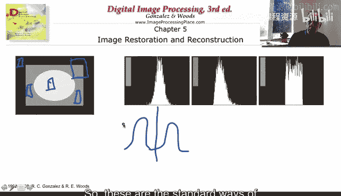
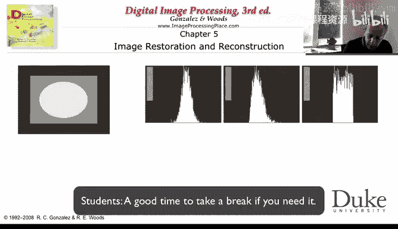
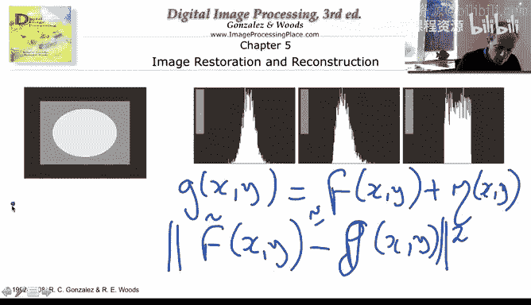

# 杜克大学《图像与视频处理：从火星到好莱坞，途中停靠医院｜Image and Video Processing： From Mars to Hollywood 》 - P34：34_04_05_5-噪声估计-时长-10-41-可选休息点-05-03.zh_en - GPT中英字幕课程资源 - BV1KYBrBxEsH

Let's see if we can use the inograms then to basically estimate the noise。

 we need to estimate both the shape of the noise basically the function of the noise is Gaussian is uniform is salt and pepper。

 and once we estimate that we need to estimate actually the parameters of that。

So we' are going to use the same image that we have seen before this very simple image。

 And let's assume for a moment that you manage to go into a region that has only in the original image。

 only one type of pixel values。 So one gray value for all the pixels there in the original image and we see that illustrated here。

 If we manage to do that， then we go and plot the histogram。

 the distribution of pixel values for that region。 For example。

 this will be the distribution of the pixel values。 Now， when we see these， basically。

 we can immediately guess what type of noise is here。

 So I'm going to ask you what type of noise was added to this region that will give us this histogram shape。

It's very easy to see that basically， this is a Gaussian noise。 We are now expert。

 So the moment we see this， we immediately recognize it now that we know that it' Gaussian。

 basically， we need to estimate the average and the variance。 And that's very easily done by just。

Computing it from the pixel values。Maybe it was really nice。As here， that was added。

 if that's the case， we once again used the is distribution。

To basically decide and compute the average and the variance。 And with that。

 we can try to invert it as we are going to discuss in a few minutes。Here， again。

 we are complete experts now in noise。 So it's very clear that was basically uniform noise added to that region。

 And once again， we can variously estimate basically the region of the noise where the uniform noise was added and what's actually the value that was added or the probability of those values。

Now， what happens if we don't know， No， don't know the type of noise。 Then it's very easy。

 Let's assume that this is the distribution that we observe so we can go and try。 We try Gaussian。

 and we fit the best possible Gaussian to this distribution。 We try really， we try gamma。

 we try uniform。 we basically go and fit using standard tools for function fitting。

 We basically fit the best of each one of the distributions。

 and the one that produces the smallest error。 that's the one that we pick。

 Maybe that was in the original distribution of the noise。

 But hopefully that's a good enough approximation for that noise。

 So this is the way that we can estimate noise。 If we find a region。😊，That has， basically。

Uniform original pixel values。 If not， we're gonna to have to work a bit more。 So， first of all。

 people try to do that with relatively small regions。 If you have a small region。

 you have a larger probability that you' are picking uniform regions。

 The problem with small regions is you don't have enough pixel values to estimate your averages and your standard deviations or your variances。

 For example， if I pick a region of only one pixel。

 I won't be able to estimate any statistics on the noise from that pixel。

If you pick too large of a region。You have the risk that you're basically getting into。

Very distinct pixel values in the original image， two or more。 And then what will happen here。

 we already know we actually going to have Instagramograms that look like this。

 Basically have two ps。If that happens， then there are techniques to try to detect that there is more than one peak in the histogram。

 and if that happens， basically either you make the region smaller or you separate。The histogram。

 And then you do an estimate for each one of the regions independently。

The other thing to be very careful is that you might need to do this type of estimates in every region in the image。

 because nothing guarantees unless you know that in advance that the noise is uniform noise is the same all around。

 If it's the same all around， then you can just go and pick a number of regions。In the image。

Do your estimates and for example， average all the estimates。

 so you compute the mean and standard deviation or variance for each one of the regions and then you say。

 hey， my noise is this distribution but I'm going to average all the means that I compute。

 I'm going to average all the variances I computed and that's going to be my estimate。

So these are the standard ways of computing the noise from your image。 Now， why is this very useful。

As we say in the very beginning， our model here。 and I'm going to remove for a second。

 the deterioration part of the image I'm going to see there is just noise。 We say G of X， Y。

Is basically my original image。And the noise。Was added。Now。

 once I estimate the parameters of my noise and the type of my noise， with experience， for example。

 I know what type of filters work well for different types of noise。 For example。

 for Gaussian filtering， we already saw the average filter。

 basically say the mean filter and also the nonloc means that if we manage to capture regions that are either uniform or similar across the image。

 Then averaging is great。 If I have a pixel distribution。

 let's say around0 averageveraging we basically almost get rid of of that noise。

 the same for uniform noise。 So depending on the noise type， we basically can use different filters。

Salt and pepper noise。 medium filter is a great filter for salt and pepper noise。

 We know that salt and pepper are kind of isolated。 We actually saw an example in the previous week。

 their isolated points and basically when we compute the medium。

 which is basically eliminate those isolated points and end up replacing them by the pixel values around them。

 So knowing the type of noise help us to basically decide and decide which type of filters。

 which type of operations are we going to do to be able to recover the original image from the basically De from the noisy image。

 We're going to see in a few weeks when we go to more advanced techniques that also。😊。

Knowing the type of noise can basically enter the design of the algorithm in a completely different fashion。

 for example， if we are going to basically know that we are dealing with Gaussian noise，Remember。

 we're trying to get an estimate。If。That is very similar。

Or as similar as possible to the original one。 If we know that the noise is Gaussian。

 we're also going basically constrain。TheThis is G。 I apologize for that。 This is G。So。

 for a Gaussian noise。The error between these two has to behave as Gaussian noise。Okay。

 so this is my estimate， my D noise image。 This is my noise image， what I observe。This。

Should be as close as possible to the original image。Lets assume as identical to the original image。

 Then the difference between these two should have a Gaussian distribution。

So I expect my noise to have a Gaussian distribution。

 and we're going to see that we can impose that by basically imposing some。

Properties on the mean square error， basically the error square or the difference between my observe。

And my estimated image。Now， if my basically noise was estimated to be uniform。

 then I'm have to impose here a different error。 For example。

 we are going to see that if the noise the noise sorry is exponential what we are going to try to do is my estimate minus my observation but without the square That's what we are going to try to measure and make sure that that basic behaves in the way I expect from an exponential noise。

 So once again the key concept is if you know the noise then you know that your estimate minus your observation has to behave like that noise so if I。

No， my noise is uniform， and I compute my estimate。

 and my estimate minus the observation gives me a Gaussian distribution。 I say， okay。

 I made two possible mistakes here。 Either I estimated wrong my noise or I basically did a wrong thenoing。

 because I didn't get back what I assume was the type of noise。

 And this is how you basically put back your noise estimate into your design of image restoration techniques。

 once again， something that we didn't see in image enhancement。

 but we actually can see in image restoration。 We push it back to the sign of the filter or to basically select parameters of the filter。

 Of course， if I have more noise， more salt and pepper noise。

 I may need to decide on the size of my medium filter window in a different fashion that if I have less noise。

 So this is how you basically once again put by。That information into the design。

We have talked a lot about this。 But remember， the original model had here the age function。

 the take radiation function。 So let's just spend in the next video some time discussing it。

 Thank you very much。