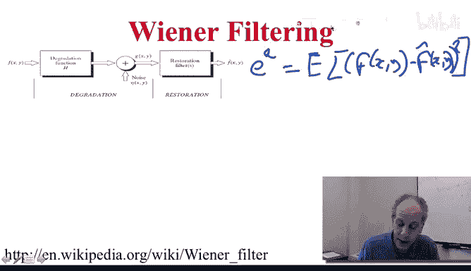
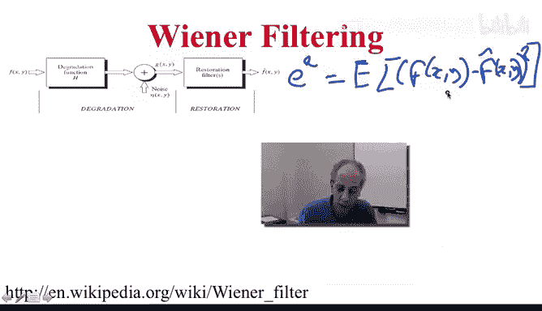
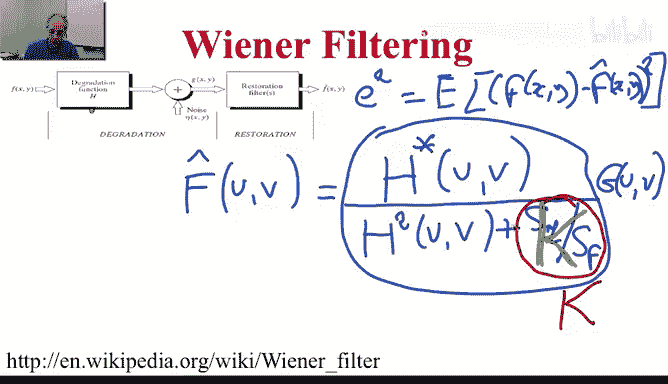

# 图像与视频处理：P36：维纳滤波

## 概述
在本节课中，我们将要学习维纳滤波。这是一种用于图像复原的强大技术，旨在从退化的观测图像中恢复出原始图像。我们将了解其基本原理、数学表达，并通过实例展示其相较于逆滤波的优越性。

## 基本退化模型
上一节我们介绍了图像退化的基本模型。该模型描述了我们如何从原始图像得到观测图像的过程。

以下是该模型的组成部分：
*   **退化滤波器**：代表导致图像模糊的因素，例如运动模糊或散焦。
*   **噪声**：在成像或传输过程中引入的随机干扰。
*   **观测图像**：我们最终看到的、已经退化的图像。

我们的目标是从观测图像出发，设计一个滤波器来重建出尽可能接近原始图像的复原图像。

## 维纳滤波的核心思想
本节中我们来看看维纳滤波的设计目标。其核心思想是**最小化复原信号与原始信号之间的均方误差**。

该误差的数学定义为：
`MSE = E[ |f - \hat{f}|^2 ]`
其中，`f` 是原始信号，`\hat{f}` 是复原信号，`E[·]` 表示期望值。

你可能会问，既然我们不知道原始信号 `f`，如何计算这个误差？关键在于，我们不需要知道 `f` 的具体值，只需要知道它的一些**统计特性**（例如其功率谱）。

## 维纳滤波器的形式
通过最小化上述均方误差，我们可以推导出最优的复原滤波器，即维纳滤波器。

在频域中，复原信号的傅里叶变换 `\hat{F}(u, v)` 由以下公式给出：
`\hat{F}(u, v) = [ H*(u, v) / ( |H(u, v)|^2 + S_n(u, v)/S_f(u, v) ) ] * G(u, v)`

让我们来解释这个公式中的各个部分：
*   `H(u, v)`：退化滤波器的傅里叶变换。
*   `H*(u, v)`：`H(u, v)` 的复共轭。
*   `|H(u, v)|^2`：`H(u, v)` 的模的平方。
*   `S_n(u, v)`：噪声的功率谱。
*   `S_f(u, v)`：原始信号的功率谱。
*   `G(u, v)`：观测图像的傅里叶变换。

**功率谱**是信号相关函数的傅里叶变换的幅度。它描述了信号能量在频域的分布。要使用理想的维纳滤波器，我们需要知道信号和噪声的功率谱。

## 实际应用中的简化
在实际应用中，精确估计信号和噪声的功率谱 `S_f(u, v)` 和 `S_n(u, v)` 通常很困难。

因此，一个广泛使用的简化方法是用一个常数 `K` 来替代比值 `S_n(u, v)/S_f(u, v)`。于是，滤波器简化为：
`\hat{F}(u, v) = [ H*(u, v) / ( |H(u, v)|^2 + K ) ] * G(u, v)`

这样，我们只需要估计一个常数 `K`，大大简化了问题。`K` 的估计可以基于图像特性或通过迭代优化实现。

## 维纳滤波 vs. 逆滤波
现在，我们通过实例来对比维纳滤波和之前学过的逆滤波的效果。逆滤波的公式非常简单：
`\hat{F}(u, v) = G(u, v) / H(u, v)`

它直接除以退化滤波器。当 `H(u, v)` 的值很小（接近零）或存在噪声时，逆滤波会放大噪声，导致复原结果极不稳定。

以下是几个对比示例的结果分析：

**示例一：大气湍流模糊复原**
*   **原始图像**：清晰的图像。
*   **退化图像**：经过高斯模糊（模拟湍流）的图像。
*   **逆滤波结果**：复原效果很差，图像充满振铃和噪声放大效应。
*   **维纳滤波结果**：复原效果出色，图像清晰度得到极大恢复。

**示例二：运动模糊加噪声复原**
我们来看一个更复杂的例子，图像同时存在运动模糊和不同强度的噪声。

以下是不同噪声水平下的复原效果对比：
*   **高噪声水平**：
    *   逆滤波结果近乎灾难，无法识别内容。
    *   维纳滤波结果显著更好，能恢复出主要结构和纹理。
*   **中等噪声水平**：
    *   逆滤波结果依然很差。
    *   维纳滤波结果非常出色。
*   **极低噪声水平**（此时模糊是主要退化因素）：
    *   逆滤波结果有所改善，但仍不理想。
    *   维纳滤波结果近乎完美。

这些例子清楚地表明，在已知退化滤波器 `H(u, v)` 的情况下，即使简单地用一个常数 `K`，维纳滤波也远比逆滤波更强大、更稳定。

## 总结
本节课中我们一起学习了维纳滤波。
*   我们首先回顾了图像退化的基本模型。
*   然后，我们了解了维纳滤波的目标是最小化均方误差。
*   我们推导并解释了维纳滤波器在频域中的数学形式。
*   针对实际应用，我们介绍了用常数 `K` 简化滤波器的方法。
*   最后，通过多个实例对比，我们直观地看到了维纳滤波在图像复原方面相比逆滤波的显著优势，尤其是在处理噪声和避免不稳定放大方面。

维纳滤波是一种强大而实用的图像复原工具，它通过引入信号和噪声的统计信息，有效地平衡了去模糊和抑制噪声之间的矛盾。