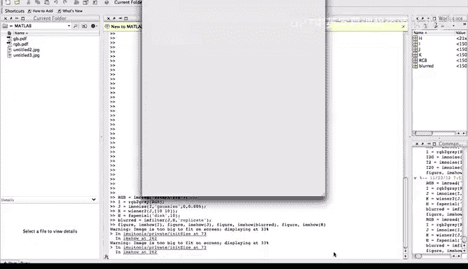
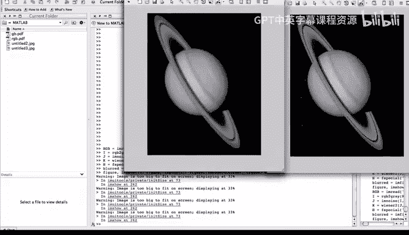
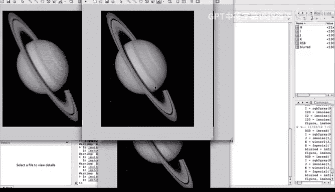
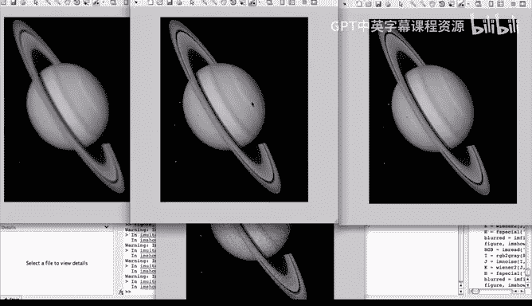

# 杜克大学《图像与视频处理：从火星到好莱坞，途中停靠医院｜Image and Video Processing： From Mars to Hollywood 》 - P37：37_04_08_8-演示：维纳滤波与盒式滤波-时长-03-19.zh_en - GPT中英字幕课程资源 - BV1KYBrBxEsH

ello and welcome back。 Let us see the inner filter in action once again， using Matlav。

As we have done before， we start by loading an image。 This is the same image we have seen before。

 the Saturn image。 Remember， that was a color image。

 So we' are going to transform it into a black and white image， the same operation as we did before。

 Then we're going to add gaussian noise as we see here， we have seen this before。

 when we were showing the different types of noise。 And we see here， the variances。

Now we are go and apply the Vner filter。 This is operation in Madla that applies the Vnyner filter to this image that we have just basically created by adding Gaussian noise。

Now， before I show you the result of the Venner filter。

 I want to compare that with a different filter。 Basically。

 I want to compare it with the local averaging for that， I'm creating a disk of Radius 10。

 and I'm basically filtering the noise image with that disk。

 This is basically this operation is basically computing the local average。

With a window of reduced 10。 don't worry about this。

 This is just a what is telling mad love what to do at the boundary conditions。

 So basically we are going to have the original image。 We are going to have the noisy image。

 We are going to have the blurlair image， local averaging。

 and we're going have a result of inner filtering， So let's see the results。Once again。

 we are loading all the images。

And this will help us to see how nice viner filtering can work。

We see again the original image。That we have seen in the past。This is the noisy image。

This is the result of vner filtering and this is the result of ping or local averaging so see how nicely vner filtering has been able to recover restore a lot of the original image starting from this noisy image and it has done a much better job that the local averaging let me move the image closer and we can see the difference this is clearly a much sharper image than what we obtain knowing basically doing the local averaging so Vner as we can see can do a fantastic job when we provide some information and in this case actually the vner is estimating the information so this is basically the implementation that we saw at the end of the previous video the simplest implementation of the venner filtering and is still able to do a great job。

In restoring the image， starting from this noisy image。 Let me once again， this was the original。

 the noisy。 Of course， the inner filter as I know this original image starts from this noisy image。

 And instead of creating a blurry version of it creates a really sharp version。

 So it's doing a really， really good job。 and we can see much better than the local averaging that blurs。

 So by this， we conclude the demo on the V filtering。 Thank you very much。

