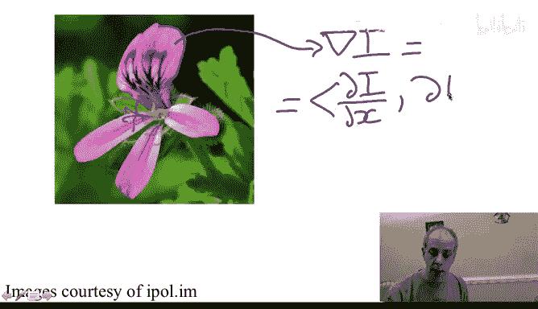
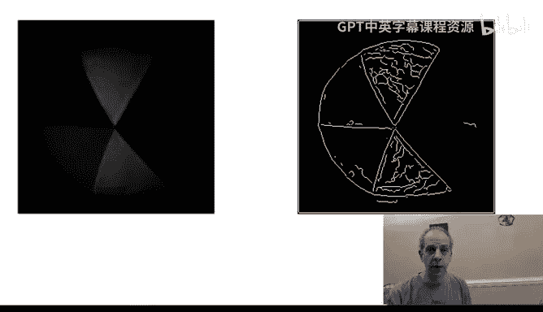

# 杜克大学《图像与视频处理：从火星到好莱坞，途中停靠医院｜Image and Video Processing： From Mars to Hollywood 》 - P40：40_05_02_2-边缘与区域-时长-05-17.zh_en - GPT中英字幕课程资源 - BV1KYBrBxEsH

Hello and welcome back。 What type of information in images can we use for image and video segmentation。

 In particular， I want to discuss a bit about edges and regions。

Let's just look at one very nice image of a flower。

 We are going to assume that we want to segment out this flower。

 We want to separate the flower from the background。 There are certain regions like here。😊。

Where there is a very clear boundary。 So we have discussed， for example， edges and gradients。

Remember， the gradient。That we represent in this form。 its just nothing else。

Than the vector of the derivative in the image。The root of the image in the ex direction。

 Ter of the image。

In the Y direction。We talk about how to implement that few weeks ago， for example。A derivative。

In the xgg direction， we could do with a simple filter of plus one。

us1 and minus1 Now if we take this derivative and we compute the magnitude of the vector because there are very clear differences in both sides of the flower in this region。

 very clearly that will help us to separate the flower from the background and we're going to see very often using the gradient as part of our image segmentation algorithm。

On the other hand， we see here。We might also get gradients。

 but we don't want these gradients to be part of the segmentation。

 their are differences inside the flower that we don't want them to appear。

 so clearly we can use these borders， these edges or these gradients we don't want to use the ones inside and that makes our life a bit more difficult but it also tells us that we are not really looking for a uniform region inside the flower if we were to put that as a constraint in our segmentation。

 we will not get very far because inside the flower things change a lot。

 we're actually looking for big differences between the flower and the background and therefore edges are going to be very important to segment these flower as we are going to see in the future videos。

But lets us look at a slightly different image。Looking at now at this image。

We clearly see a ball here。Although they're basically lemon mees。Get the pen。

 There are basically no edges here。We see the ball。But we don't see any edges。

 but we understand the shape。 So here we are not going to be able to use edge information。

 There are no edges。 If we were to compute a gradient in this region。Here。Any pixel here。

 we will try to compute the gradient。 That gradient will be 0 or very low and won't help us to find the border。

 to find the object of interest。 On the other hand， we could use shape。We could use reach。Okay。

 so we could try to understand that this is kind of a uniform region， kind of a uniform region。

 and actually， we can use that fact to basically help us obtain the segmentation。

Let's us see the edges of this image to further illustrate that edges won't help in this case。

 So here I took the green channel of the color image that we just saw。 and I computed in this case。

 I use Matla。 I computed edges。 So we see some spurious edges。Those don't bother us too much。

 we learn in the past how to get rid of them， for example， by pre filtering the image。

 removing the noise before we get nice edges here， but no edges here。

 This is a tiny edge because there is probably a very weak boundary here， but no edges here。So。

We will need other types of information in order to be able to segment this ball out of the background looks very simple that edges are not sufficient。

What I want to show you in the next videos is how to incorporate multiple sources of information。

 First， we're going to start in the next video with half transform that is going to help us to integrate shape that we know if we are looking for a line。

 we can put that into the segmentation or detection algorithm。

 If we are looking for a circle like here， we can incorporate that into the algorithm。

 And we do that with the half transform。 I see in the next video for that。 Thank you。😊。

