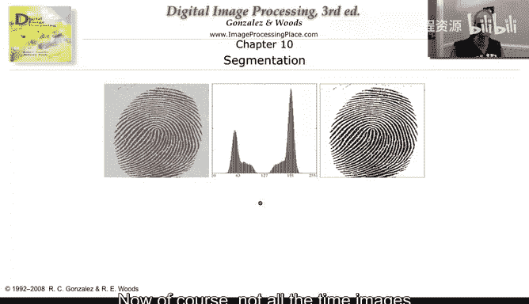
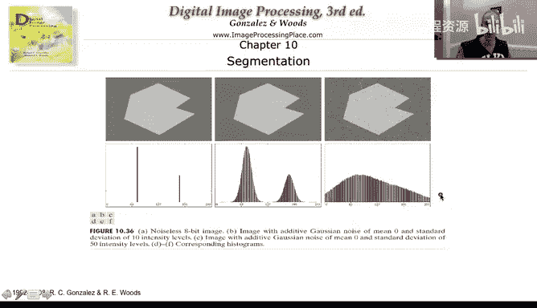
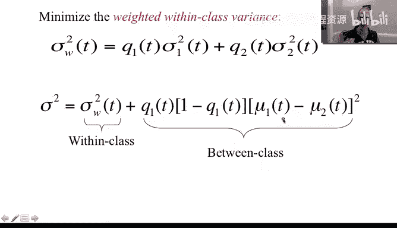
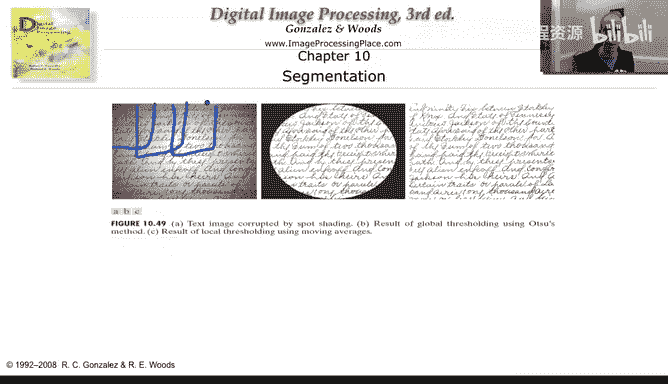
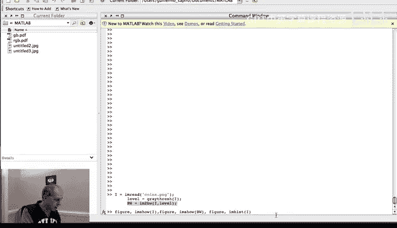
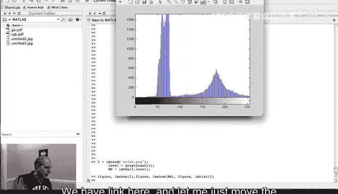
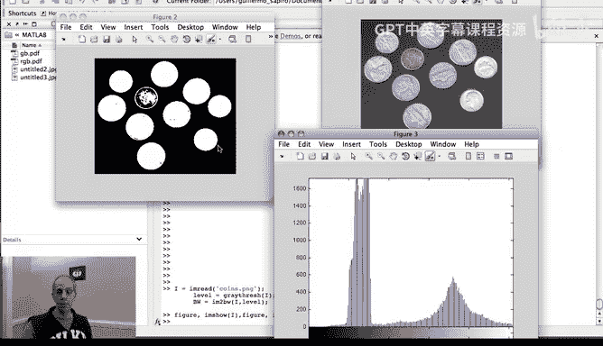

# 图像与视频处理：P43：大津分割法与演示 🎯

## 概述
在本节课中，我们将学习一种经典的图像分割方法——大津法（Otsu's Method）。这是一种基于图像直方图、通过自动寻找最佳阈值来分割图像的技术。我们将从基本思想入手，逐步理解其数学原理、实现方式，并通过实例演示其应用。

---

## 基本思想与动机

上一节我们介绍了边缘检测在图像分割中的重要性。本节中，我们来看看一种不依赖于边缘，而是关注图像区域内部像素值均匀性的分割方法。

大津法的核心思想是分析图像的直方图。如果图像中我们想要分割出的物体和背景具有不同的像素值范围，其直方图通常会呈现**双峰**（bimodal）分布。例如，在一个指纹图像中，指纹纹路和背景会形成两个明显的峰值。通过在这两个峰之间选择一个合适的阈值，就能简单有效地将目标与背景分离。

大津法的目标就是**自动地**找到这个最佳阈值。

---

## 方法的适用性与局限性

并非所有图像都像指纹那样具有完美的双峰直方图。让我们通过几个例子来理解大津法的适用场景。

*   **理想情况**：对于二值图像或添加了少量高斯噪声的图像，直方图仍保持较好的双峰性，大津法可以毫无问题地找到阈值并完成分割。
*   **挑战情况**：当噪声非常强时，直方图的双峰特性会消失，分布变得分散。此时，大津法将难以找到一个有效的阈值，分割会失败。
*   **解决方案思路**：作为图像处理者，我们并不惧怕噪声。可以先对图像进行**去噪**处理，恢复其直方图的双峰特性，然后再应用大津法，就能重新获得良好的分割效果。

大津法试图找到一个阈值，使得分割后的两个类别（例如前景和背景）各自的内部像素值变化尽可能小。换句话说，它希望每个类别都尽可能“紧凑”。

这里需要注意一个重要特点：大津法完全基于**直方图**工作，丢失了像素的**空间位置关系**。这意味着，即使像素在图像中位置相距甚远，只要灰度值相似，就会被归为同一类。我们将在后续课程中学习考虑像素空间关系的算法。

---

## 算法原理与实现

大津法的基本目标非常简单：**最小化加权类内方差**。我们假设图像通过阈值 `T` 被分为两类（如前景C1和背景C2）。

以下是需要最小化的**加权类内方差公式**：
`σ_w^2(T) = ω_1(T) * σ_1^2(T) + ω_2(T) * σ_2^2(T)`
其中：
*   `T`：待寻找的阈值（0到255之间）。
*   `ω_1`， `ω_2`：两类像素出现的概率（从归一化直方图获得）。
*   `σ_1^2`， `σ_2^2`：两类像素值的方差。

这个公式衡量了在给定阈值 `T` 下，两个类别的“松散”程度。我们的目标就是找到使 `σ_w^2(T)` 最小的 `T`。

### 实现方法
有两种主要的实现思路：

1.  **直接穷举法**：这是最直接的方法。遍历 `T` 从0到255的所有可能值，对每个 `T` 计算上述公式，记录使结果最小的 `T`。这种方法已经非常快速高效。
2.  **递归优化法**：通过一些代数推导，可以发现最小化类内方差等价于**最大化类间方差**。而图像的总方差是常数，因此有：
    `σ_总^2 = σ_w^2(T) + σ_b^2(T)`
    其中 `σ_b^2(T)` 是类间方差。最大化 `σ_b^2(T)` 更高效，因为计算概率 `ω` 和均值 `μ` 的公式可以以递归方式快速更新。当 `T` 从 `t` 增加到 `t+1` 时，新的概率和均值可以通过简单的加法从旧值得到，无需重新计算所有像素。

无论采用哪种方法，核心步骤都是遍历所有可能的 `T`，找到最优解。

---

## 处理非均匀背景：局部大津法

标准的全局大津法有一个局限：它假设整个图像的背景是均匀的。如果背景亮度不均匀（例如，图像一侧亮一侧暗），直方图可能无法形成清晰的双峰，导致全局阈值分割失败。

为了解决这个问题，我们可以使用**局部大津法**。其思路是：
*   将图像划分为多个小块（窗口）。
*   在每个小块内独立应用大津法，计算一个局部最优阈值。
*   这些窗口可以是**不重叠的块**，也可以是**滑动的重叠窗口**。
*   最后，可以将这些局部阈值进行平均或插值，生成一个平滑变化的阈值图，用于最终分割。

以下是应用示例：
*   **全局阈值失败**：对一幅背景不均匀的文字图像使用全局大津法，暗部背景和文字可能被错误的阈值合并。
*   **局部阈值成功**：采用滑动窗口进行局部大津阈值处理，可以很好地适应背景变化，成功分割出文字。

这种方法体现了图像处理中的一个常见理念：核心算法（如最小化类内方差）是固定的，但可以根据具体应用场景（全局、分块、滑动窗口）以不同方式灵活实施。

---

## MATLAB 演示

现在，让我们在MATLAB环境中看看大津法的实际应用。操作步骤非常简单：

1.  **加载图像**：读入待处理的图像。
2.  **计算最优阈值**：调用MATLAB的 `graythresh` 函数，该函数实现了大津算法，返回归一化的最优阈值 `level`。
3.  **应用阈值分割**：使用 `im2bw` 或 `imbinarize` 函数，根据上一步得到的阈值对图像进行二值化。

让我们观察结果：

*   **左侧图像**：原始图像及其直方图。直方图呈现明显的双峰，预示着大津法会有好效果。
*   **右侧图像**：应用大津法自动计算的阈值进行分割的结果。分割效果相当不错，成功分离了物体。

对于另一幅图像（硬币），由于硬币部分边缘区域与背景亮度非常接近，这些部分被错误地归为了背景。这提醒我们，对于复杂图像，可能需要局部阈值或更高级的技术来获得完美分割。

但核心优势是显而易见的：对于许多图像，我们无需手动指定阈值，大津法可以**自动**为我们计算出一个有效的分割阈值。

---

## 总结

本节课中，我们一起学习了一种经典、简单而强大的图像分割算法——大津法。

*   **核心思想**：通过分析图像直方图，自动寻找一个阈值，使得分割后两类的**加权类内方差最小**（或类间方差最大）。
*   **实现方式**：可通过遍历所有可能阈值并计算目标函数来实现，计算高效。
*   **优点**：完全自动，无需手动设置参数，对具有双峰直方图的图像效果很好。
*   **局限性**：忽略像素空间信息；对背景不均匀或噪声过强的图像效果不佳。
*   **改进**：可通过**局部大津法**（分块或滑动窗口）来应对非均匀背景的挑战。

遗憾的是，并非所有图像都简单到可以用大津法或霍夫变换完美分割。我们将需要更高级的技术来处理它们，这将是本周后续视频的主题。