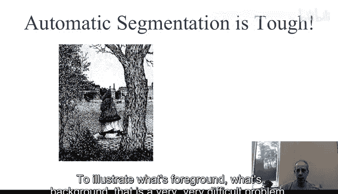
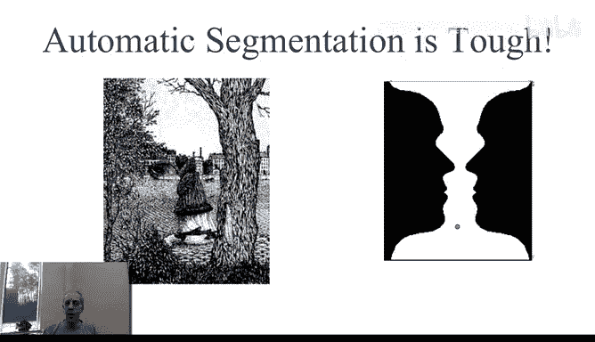
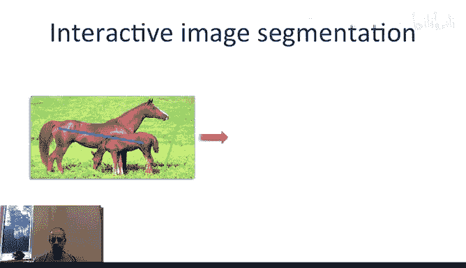
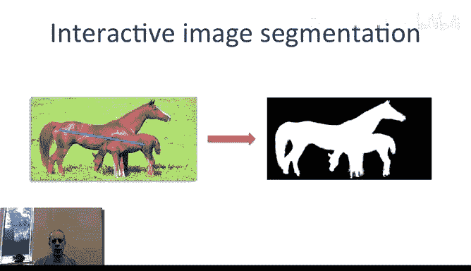
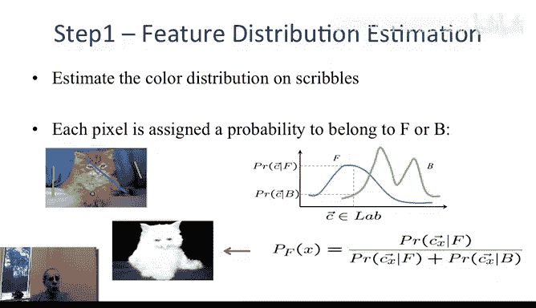
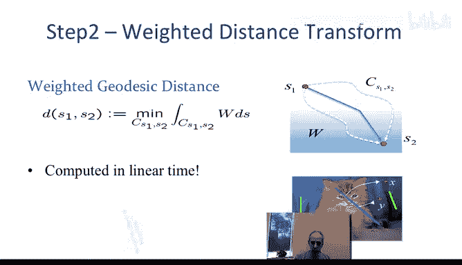
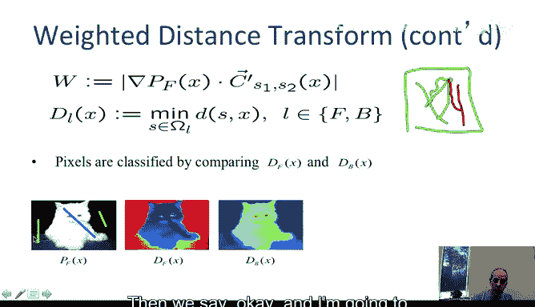
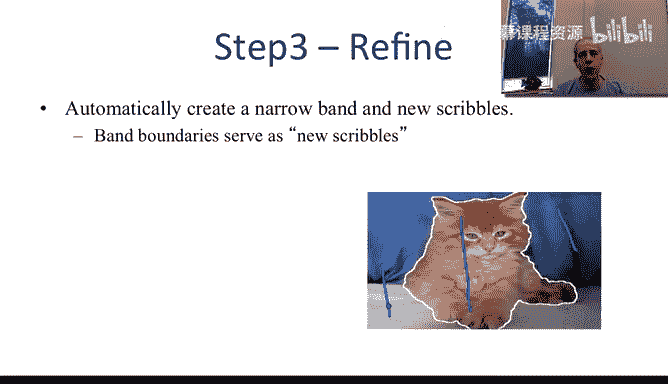
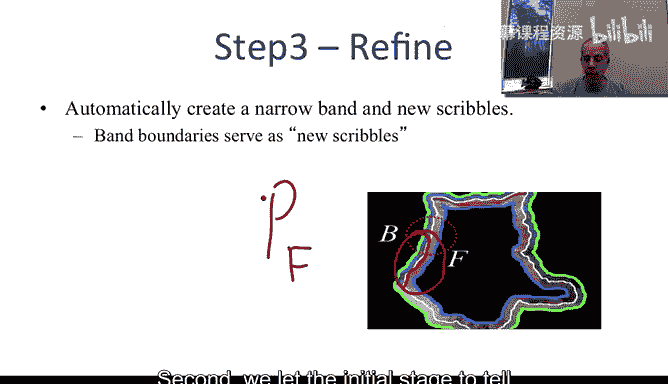
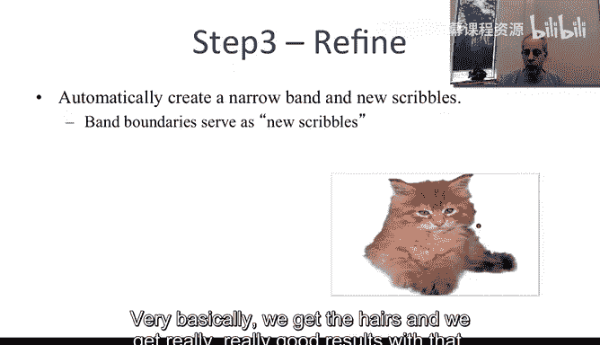

# 图像与视频处理：从火星到好莱坞，途中停靠医院｜P45：45_05_07_7-交互式图像分割 🎨

在本节课中，我们将要学习**交互式图像分割**。图像与视频分割是图像处理领域的重要课题，其应用范围从电影工业到医学成像。然而，分割本身是一个极具挑战性的问题。本节课程将介绍如何通过引入用户交互，让用户提供少量线索来辅助计算机完成复杂的分割任务。

---

## 图像分割的固有挑战 🤔

上一节我们介绍了图像分割的重要性，本节中我们来看看其固有的困难性。图像分割之所以困难，是因为计算机难以自动理解图像中哪些部分是用户感兴趣的“前景”，哪些是“背景”。

以下是两个极具挑战性的分割示例：

*   **隐藏的面孔**：一幅看似普通的森林图画，仔细观察会发现许多伪装的面孔。算法若不知道面孔的大致位置，很难将其分割出来。
*   **双重意象**：一幅画中同时包含“树与房屋”和“一张人脸”两种解读。算法无法自行判断用户想分割的是树、人脸，还是其中的女士。



这些例子表明，明确“前景”与“背景”的定义对计算机而言非常困难。著名的“鲁宾之杯”图像也说明了这一点，我们既可以将其看作两个侧面轮廓，也可以看作一个酒杯。




---





## 交互式分割的基本思路 ✏️

为了解决上述问题，我们引入**交互式图像分割**。核心思想是让用户提供少量、简单的提示，来指导分割算法。

具体方法是：用户使用不同颜色的笔刷，在图像上随意涂抹（scribble）一些线条或区域。
*   标记为**前景**（例如用红色）。
*   标记为**背景**（例如用蓝色）。


算法将基于这些标记来理解用户的意图，并完成后续的精细分割。我们的目标是要求用户提供**尽可能少的交互**，避免繁琐的精确描边。

---

## 利用颜色分布建立概率模型 📊

在获得用户的涂鸦标记后，我们首先利用这些信息建立颜色概率模型。

以下是具体步骤：
1.  **收集样本**：分别收集所有被用户标记为“前景”和“背景”的像素点的颜色值。
2.  **构建分布**：基于这些样本，分别建立前景和背景的颜色概率分布模型。颜色空间可以是RGB或其他，记为向量 **C**。
3.  **计算概率**：对于图像中的任意一个像素，其颜色为 **C**，我们可以计算它属于前景或背景的概率：
    *   属于前景的概率：`P_foreground(C)`
    *   属于背景的概率：`P_background(C)`
4.  **归一化决策**：通常，我们计算一个归一化的“前景概率”：
    ```
    P_F(C) = P_foreground(C) / [P_foreground(C) + P_background(C)]
    ```
    这个值越接近1，表示该像素颜色与用户标记的前景区域越相似，越可能是前景。

基本理念是：**颜色与用户标记的前景相似的像素，应倾向于被划分为前景；与标记的背景相似的像素，应倾向于被划分为背景**。



仅应用此概率模型，我们就能得到一个初步的分割结果，大致勾勒出目标物体（如一只猫）的轮廓。


然而，这种方法可能存在问题。例如，猫的黑色眼睛可能与用户标记的某些背景暗色区域颜色相似，导致被误判为背景。这表明仅靠颜色相似性还不够，我们需要引入空间连续性信息。

---

## 引入测地距离进行精细分割 🗺️

为了改进分割，我们引入**测地距离**的概念。这类似于在日常生活中寻找从A点到B点的“最小代价路径”。路径上不同地段的“通行难度”（权重w）不同。

我们将此概念应用于图像：
*   **目标**：对于图像中每个像素，计算它到**前景涂鸦集**和**背景涂鸦集**的最小代价路径。
*   **权重定义**：路径代价权重 `w` 与前景概率 `P_F` 的梯度相关。沿着路径，如果 `P_F` 变化平缓（梯度小），则通行代价低；如果 `P_F` 变化剧烈（梯度大），则通行代价高。
    ```
    w ∝ |∇P_F|
    ```
*   **决策规则**：比较两个距离。
    *   如果到前景涂鸦的测地距离 **小于** 到背景涂鸦的测地距离，则该像素被判为**前景**。
    *   反之，则判为**背景**。




这个计算过程可以非常高效地完成（线性时间复杂度），例如使用**Dijkstra算法**等图论方法。最终，我们能得到一条清晰、准确的前景-背景边界。

---

## 迭代优化提升分割精度 🔄

通过上述步骤，我们得到了一个初步的分割边界。我们可以利用这个结果进行**全自动的迭代优化**，以进一步提升精度。



以下是迭代优化流程：
1.  **生成新涂鸦**：基于初步分割边界，向内（前景侧）和向外（背景侧）各收缩一小段距离，自动生成新的“前景涂鸦带”和“背景涂鸦带”。
    
2.  **重建概率模型**：基于这些更靠近真实边界的新涂鸦，重新计算颜色概率分布 `P_F`。这些新样本能更好地反映边界附近区域的特征。
3.  **重新计算测地距离**：使用更新后的 `P_F`，再次运行测地距离计算。
4.  **得到优化结果**：通过比较新的测地距离，获得更精确的分割边界。此过程可以局部重复进行，对边界不同段落逐一优化。

经过这一轮迭代，分割结果在物体边缘（如发丝）处会变得非常精确。


---



## 算法鲁棒性与应用实例 ✅

一个优秀的算法应具备**鲁棒性**，即对于用户不同的涂鸦输入，只要意图一致，应能产生稳定、相似的分割结果。

下图展示了同一图像在不同用户涂鸦下的分割结果，最终边界基本一致，证明了算法的鲁棒性。用户无需精确描边，只需大致指示前景和背景即可。






该算法已应用于实际产品（如Adobe Photoshop）。分割完成后，可以轻松进行背景替换等操作。


---

## 总结 📝

本节课中我们一起学习了**交互式图像分割**的核心流程：
1.  **用户交互**：用户提供前景和背景的简单涂鸦标记。
2.  **颜色建模**：基于涂鸦建立前景和背景的颜色概率模型 `P_F`。
3.  **测地距离分割**：利用 `P_F` 定义路径权重，计算每个像素到前景/背景涂鸦集的最小代价路径，根据距离比较完成分割。
4.  **迭代优化**：利用初始分割结果自动生成新涂鸦，迭代优化以提升边缘精度。

这种方法以最小的用户交互代价，有效解决了全自动分割的歧义性问题，并在实践中取得了广泛应用。