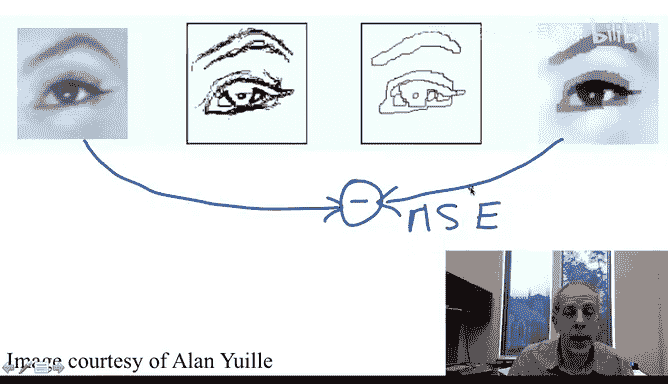
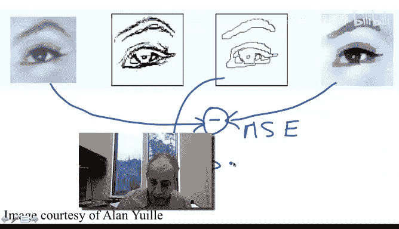

# 杜克大学《图像与视频处理：从火星到好莱坞，途中停靠医院｜Image and Video Processing： From Mars to Hollywood 》 - P47：47_05_09_9-芒福德-沙模型-时长-05-50.zh_en - GPT中英字幕课程资源 - BV1KYBrBxEsH

Hello and welcome back。 I want to discuss now the Manforsha image segmentation technique。

 and I'm going to do that with one example。Let's just look at this image。

 We talk that image segmentation means labeling the image。

 We want to label every segment that has some coherence in it with a different name with a different number。

 One way of doing that is， of course。Basically painting that segment with a uniform or very smooth gray value。

 And that's the type of stuff that the manfor Sha algorithm and technique tries to do。

 Lets us discuss that Here we have an original image。Don't pay attention to this， too。

 for the moment， it's going be very clear in just a few seconds。

And this is the result of one implementation of Manforsha image segmentation。

So very rich gray values become just a few smooth segments Look like almost like quantization when we talk about image compression。

 So the first part is that we want to approximate the original image by just a few segments that are either constant or very smooth。

 Of course we want an approximation。 So one of the terms that this manforsha needs to include is a penalty from deviating too much from the original image。

 Of course， piecewise smooth or piecewise constant I could basically make this whole image white。

So that's one very smooth segment， that is very far if I do that。

 it will be very far from the original image。 So one of the things is we have to somehow penalize for the difference between these two images。

 For example， the means square error。We already talk about it very early on in this class。

 So one penalty is the mean square error。 We want to get a pieceway smooth。Version of this image。

 but not verify from it。Now， you might wonder， okay。

 if you are gonna penalize for the means wherever， why not to keep the image itself。

That's very clever， but we don't achieve any segmentation。 So how do I know。

 I don't achieve any segmentation， Because I'm going to add a term that penalizes for having too many boundaries in the segmented image。

 So these are the regular edges。 of this image， very strong edges。

 These are boundaries of the segments that we have here。I don't want to have too many。

 I don't want to have all these。 I'm going to penalize for the number of edges for how many。

 how much do I pay for having boundaries。 So that will be another term。 I'm going to basically。

 on one hand， I want to penalize for very large differences。 And on the other hand。

 I'm going to penalize for。

Edgeges。So if you have too much edges， you're going to pay a price big so if I keep the image。

As it is， I have no error here， but I have a lot of edges， Basically， every pixel。Becomes a segment。

So I'm paying a very large penalty for edges。 If I have a flat image。

 I don't pay any penalty for edges by I pay a very high penalty for error。

 and then I have to do a compromise between these two and that's what man for Sha。

Basic concept is to write formulations that compromise between a representation of the image that is too far from the original image。

 We want to simplify representation， not too far from the original image。

 And we also don't want to pay。A high price and get too many segments。 Now。

 there are many ways of doing this。 There is some beautiful mathematical theory behind different formulations that do this compromise。

 Some theory relates even to compression。 You have to compress this image。 and this edges。

 and then you try to optimize for that。😊，You alsoum might need to compress for the error and some very beautiful techniques in the framework of what's called variational formulations and energy formulations。

 really a lot of very beautiful mathematical theory which actually relates to the mathematical theory that we are going to be discussing next week when we talk about geometric differential equations and geometric variational problems。

 but here is the concept and very often in image processing you have a concept and the multiple ways of implementing that concept and I want to make sure that you basically learn during this class the concept behind manfor I should also mention to you that this concept of approximation and penalty for too many ages applies also beyond image segmentation and people have extended the framework of manforha type of formulations to image registration and many many。

The other image and video processing problems。 Thank you very much。 See you in the next video。

