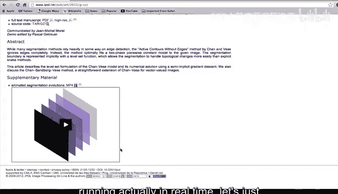
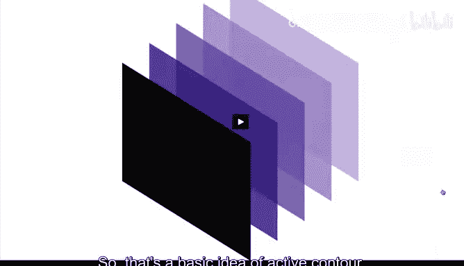
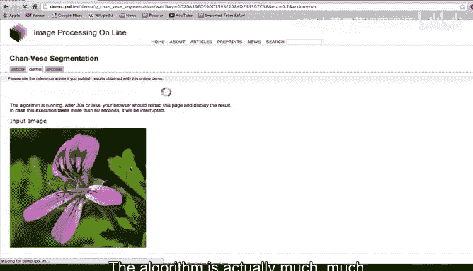
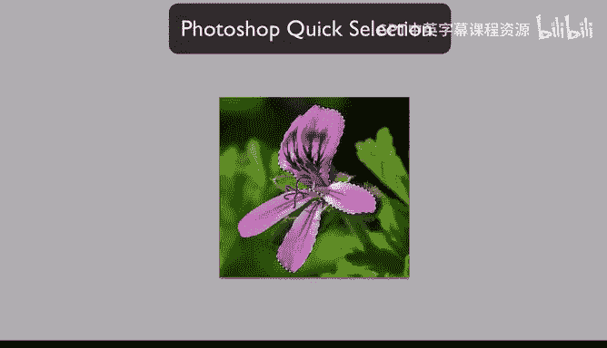

# 杜克大学《图像与视频处理：从火星到好莱坞，途中停靠医院｜Image and Video Processing： From Mars to Hollywood 》 - P48：48_05_10_10-主动轮廓导论与IPOL、Photoshop演示-时长-05-58.zh_en - GPT中英字幕课程资源 - BV1KYBrBxEsH

Hello and welcome back Active contours also called snakes are very important in image and video processing。

 they appear in a number of commercial products and are very useful for numerous image and video segmentation Let me illustrate the basic concept behind active contours。

The idea is that you start from one or multiple curves。 For example， I'm going to draw a curve。

That surrounds the flower， which is my object of interest。

 And the basic idea behind active contours is to design velocities that will move this curve。

Towards the flower， hopefully， as the curve moves， it's going to end up。In the border of the flower。

 So we need basically to design velocities that will move。

Any initial contour towards the contour of interest， which is the boundary of the object of interest。

 Now， I can write down the formulation for this and the equations for this。

 But I think it's better if we first learn the material that is coming next week as a background。

 And that will help us。To write this in a much， much elegant form。 So this week。

 instead of writing down the exact way of active contours。

 I'm going to just illustrate you some examples to motivate you and get you very excited to learn the background material that we're going to learn next week。

 So let's go and watch some movies with examples of active contours inside the image processing online package and inside Adobe's Photoshop。

 So let's just observe that right now。In order to illustrate one of the examples of active contours。

 we're going to be using again the image processing online website， where as we have seen before。

 there is many very interesting image processing algorithms implemented。

 In particularly now we are in the Chen Ve webage， which is an implementation of one of the approaches for Act contours developed by Tony Chan and Luminni Da Vei。

 before we show you one of the examples running actually in real time。

 Let's just basically run the demo provided by the author of this website。

So here we see conts evolving。 This is a very clear example of a contour evolving towards the segment。

 Here we have another one。 Just look at this one。And here we see once again how contours are evolving。

 And yet， once again。 So that's the basic idea of active contours。

 This was a very fast video just to illustrate one of the examples。 but I's just run one。

 So we're going to have more time to look at it。 We're going to run the them on as we have done in the past for other algorithms。

 I'm going to pick this example， at just one example。 I'm not going to change the parameters。

 We don't know exactly since we haven't discussed the technique what this parameter means。

 So I'm going to just lift the default， and I'm going to run it。

Remember， now it' running as we see here， but it's running in the server that is provided by the image processing online。

 The algorithm is actually much， much faster than we can see。 it actually can be run on real time。

 but it run on the server and here is the result we see once again， initial contours。

 these blue contours at the very beginning are the initial contours， and then we see the boundaries。

 the curves have evolved toward those boundaries， the curve have evolved to segment out the object of interest。

 There is some spurious objects and we are going to understand why they happen。

 but mostly it has done a great job basically in finding the boundaries of the flower which is probably the object of interest for this image and we see once again these contours evolving and this is。

 as I say， something that we are going to learn next week。😊。

The formulas exactly the math behind it。 But this illustrates the idea。

 Thank you for this part of the video。It's now time to illustrate using Adobe Photoshop one implementation of active contours in particular we're going to be using this tool in active contours that is a selection tool and look what's going to happen。

 please observe my mouse。Look how I'm moving the mouse and the contours are being automatically attracted to the boundary of the flower。

You how I just click and it basically catching the flower。 I almost didn't move my mouse。

 I just click inside the object of interest， and we capture the flower。 Let me do that again here。

 I'm going to just click and is capturing this part of the flower。 So you see how we can help。

 and we have already learned about user interaction by doing a few clicks inside the flower Basically。

 a technique related to active contours。 move my clicks towards the boundaries of the object of interest。

 This is a very， very interesting technique。This time implemented inside Adobe Photoshop。

 and this provides an aero demo of active conour type of approaches。 Thank you。

These examples that we just saw should motivate you for the material that is coming next week。

 Before we go into that， we have a couple of additional， very。

 very exciting things to learn about video segmentation。 So I see you in the next video。 Thank you。😊。

