# 图像与视频处理：P49：Adobe Roto Brush幕后技术 🎬

在本节课中，我们将要学习Adobe After Effects中一个强大的视频分割算法——Roto Brush。我们将探讨其背后的核心概念，包括如何利用局部信息、结合形状与颜色先验知识，以及如何实现用户友好的实时交互，从而在电影和广告等行业中实现高精度的视频对象分割。

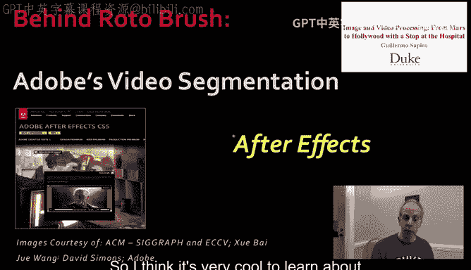

---

## 视频分割的核心要求 🎯

上一节我们介绍了Roto Brush的基本背景，本节中我们来看看一个实用的视频分割系统需要满足哪些基本要求。

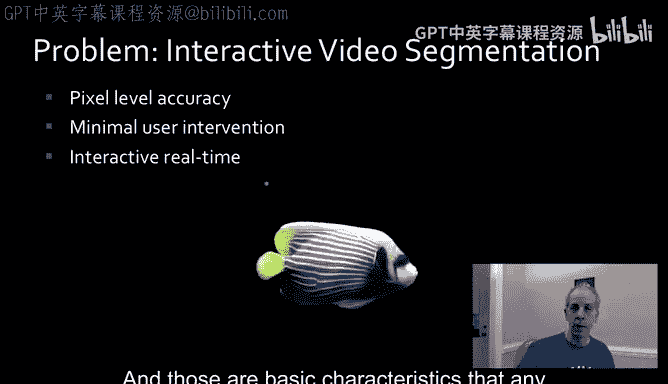

当我们在进行视频分割，特别是用于广告或电影工业时，系统需要具备一些基本特性。

*   **高精度**：需要能够实现像素级甚至亚像素级的分割。
*   **用户参与**：由于问题极具挑战性，用户需要参与其中。用户参与的方式必须非常舒适。
*   **实时交互**：用户需要能够与计算机实时交互，不能等待数小时才看到结果。

这些是此类系统需要具备的基本特性，Roto Brush当然也具备这些特性。

---

## 视频分割面临的挑战 🤔

现在我们需要高质量的分割。这意味着我们需要以非常高的质量分割视频，以达到像素级精度。这是一段我们之前看过的视频。

为什么这如此具有挑战性？原因有很多，有些我们已经见过，有些我想再回顾一下。以下是我们在视频（以及图像）分割中遇到的一些挑战。

*   **颜色分布重叠**：例如，球员穿着白色球衣，但观众席上也有穿白色衣服的人。球员穿着蓝色球衣，但背景中也有蓝色区域。颜色信息不足以进行准确分割。
*   **边界模糊**：在某些例子中，物体边界非常模糊，难以确定物体的确切结束位置。
*   **拓扑结构变化（视频特有）**：物体的整体形状会发生变化。例如，手臂在一帧中与身体分离，在下一帧中又接触到身体，形成了一个“洞”。这种由于物体关节运动带来的变化使得问题极具挑战性。

---

## Roto Brush算法的关键特性 ✨

那么，Roto Brush及其背后的分割算法需要具备哪些类型的特性呢？这也是许多视频分割方法需要具备的。

*   **准确性**：我们已经讨论过这一点。
*   **鲁棒性**：鲁棒性不仅指图像可能变化，还指我们可能面对非常丰富多样的数据。我们希望算法对所有数据都尽可能有效。
*   **实用性**：这与用户干预有关。我们希望确保用户的参与能让结果变得更好，而不是破坏已有的满意部分。它必须是一个自然、简单的工作流程。
*   **计算效率**：视频通常每秒有24到30帧。我们不希望处理每一帧都需要数小时，而是希望在舒适的交互时间内完成。

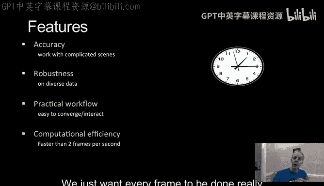

---

## 算法的主要步骤 🚀

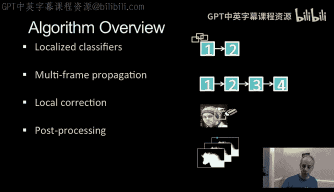

接下来我将描述的算法包含四个主要步骤。

1.  **逐帧分割**：从一帧分割到下一帧。
2.  **多帧传播**：将分割结果向前传播多帧。
3.  **局部修正**：允许用户进行局部修正。
4.  **后处理**：这是一个概念，因为我们是在分割视频而不仅仅是静态图像，我们需要确保跨帧的一致性。

我们将看到许多非常酷的例子。让我们从**局部分类器**开始。

---

## 局部分类器 🧩

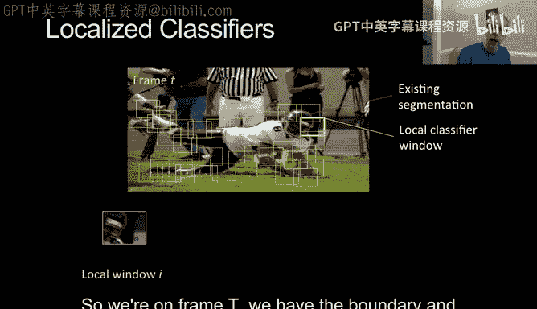

上一节我们概述了算法步骤，本节中我们来详细看看第一步的核心：局部分类器。

让我解释一下什么是局部分类器。

我们假设从一个给定帧的分割结果开始。这个分割结果可能是手动获得的，也可能是通过静态图像分割方法得到的。我们想将这个分割传播到下一帧，这是我们面临的第一个挑战。

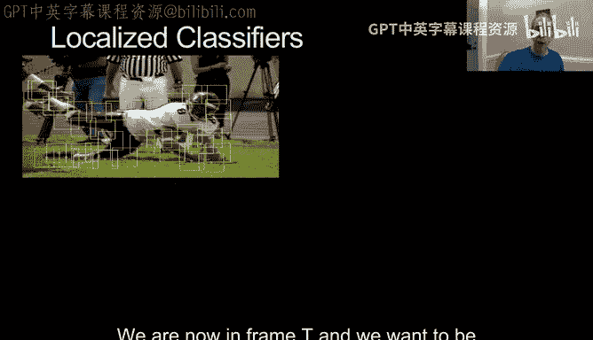

我们将使用所谓的**局部分类器**。我们将在计算出的分割边界周围放置窗口。这些窗口环绕整个边界，每个像素或每隔几个像素都有一个窗口，并且它们之间有重叠。

对于每一个这样的窗口，我们都有非常重要的信息。我们在第T帧，有物体的边界以及其内部和外部。

---

## 利用局部信息：形状与颜色先验 📐🎨

现在，因为我们有了这些窗口，我们在每个窗口内有两个非常重要的特征。

1.  **形状先验**：我们认为下一帧会有相似的形状。在正常视频中，帧与帧之间物体的变化不会太大。
2.  **颜色模型**：我们知道在前景中期望出现什么类型的颜色，在背景中期望出现什么类型的颜色。对于每个窗口都是如此。

让我们看看如何使用这些信息。我们现在在第T帧，我们想要分割出第T+1帧。我们有一系列环绕边界的窗口，现在我想分割出这里的球员。

我们要做的第一件事是将这些窗口移动到新帧。我们可以直接复制它们的位置，或者使用**运动估计**来移动它们。运动估计类似于视频压缩中的做法：对于每个局部窗口，我们在前一帧周围寻找最相似的块，然后将窗口移动到那个位置。

现在我们在需要分割的新帧中有了这些窗口。我选取两个窗口为例：一个在当前帧（已知分割），一个在未来帧（需要确定分割）。

我们将红色曲线（已知）转移到蓝色位置（估计），但我们还不完全相信蓝色曲线。我们需要调整它。

对于这个我们称之为“训练”的窗口（因为我们已经有它的信息），我们有一个形状先验和颜色分布。我们大致相信曲线应该在这里，并且我们有前景和背景的颜色分布。这里写的“GMM”代表**高斯混合模型**，这是一种近似前景和背景颜色分布的方法。你可以简单地理解为颜色的概率分布。

我们将尝试结合这些信息来找到蓝色曲线的确切位置。红色曲线移动到蓝色位置，但我们允许它在一定范围内移动。这为我们提供了关于它应该在哪里的信息。我不允许它完全改变，因为我不期望帧与帧之间有完全的形状变形或颜色变化。

这为我提供了关于颜色的良好先验。对于这里的每个像素，我可以说，你更可能是前景还是背景？这样我们可以得到一张概率图。核心思想是**合并形状先验和颜色先验**。

如何合并它们将是我们接下来要解释的。重要的是，从我们已经知道的信息中，我们可以为每个块得到形状概率和颜色概率，合并它们，然后得到每个像素属于前景或背景的概率。这对于从上一帧移动过来的每一个局部块都会发生。

因此，我们将其整合，得到整个图像的概率图。然后，例如使用**图割**算法，我们可以得到一个分割结果。这样，我们就能从当前帧推进到下一帧。在此之前，我必须解释如何进行这种合并。

---

## 合并形状与颜色先验 🤝

对于合并，我们必须记住我们同时拥有颜色和形状信息。基本思想如下：

*   如果颜色分布**分离得很好**，就信任颜色。
*   如果颜色分布**重叠严重**，就信任形状。
*   如果情况**模棱两可**，就信任两者并合并它们。

我们从上一帧获得颜色分布和可信的分割结果，从而得到形状先验和颜色先验。

*   **如果颜色分布分离得很好**：那么颜色概率的可信度就高。形状先验的约束可以放宽，允许边界在距离先验曲线较远的范围内移动。
*   **如果颜色分布重叠严重**：那么颜色信息的可信度就低。形状先验的约束带会变窄，要求新边界必须更接近预测的位置。颜色重叠越严重，这个约束带就越窄。

这是三个来自视频的真实例子。
1.  球员背部区域，颜色分离得很好。
2.  另一个区域，颜色分离不那么明显。
3.  图像显示前景和背景的区分非常不清晰。

在所有情况下，我们都得到颜色和形状信息。区别在于，一旦我们给出形状先验（类似一条曲线），我们允许这条曲线影响新边界位置的程度不同。如果我们非常信任颜色，我们就大幅扩展形状先验的允许范围；如果我们不那么信任颜色，这个范围就变窄；当颜色分布基本不提供信息时，形状先验就来“拯救”局面，施加一个非常窄的约束带。

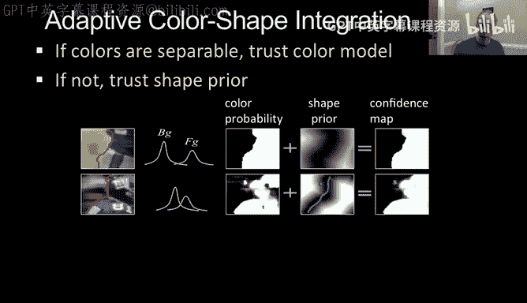

颜色概率总是来自前一帧的颜色。先验置信度的实际形状取决于我们在这里的置信度。我们将两者相加，归一化，就得到了之前例子中的概率图。例如，在颜色太相似无法使用的地方，形状先验因为前一帧分割得很好，帮助我们继续下一帧的分割。

这是一个非常重要的概念：**我们合并不同类型的信息以获得想要的分割结果**。

---

## 局部性的重要性 🏞️

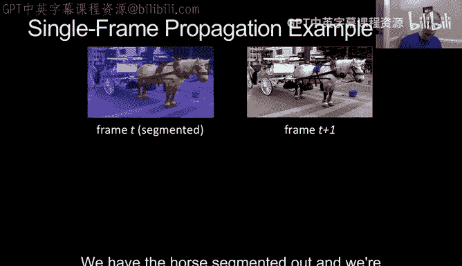

让我们举例说明这有多重要。这里有一帧，马被分割出来，我们想要分割下一帧。

首先，为什么是局部的？记住，有了这一帧，我们在其周围放置了块。一切都是局部的，虽然它们重叠并共享信息。如果我们不这样做，而是将整个帧视为一个块，那么颜色变化太大，分布基本上没有意义，我们将无法分割出马。

如果我们使用局部颜色模型，结果会好得多，因为我们只关心每个边界像素周围的情况。然而，仍然存在问题：马是白色的，马车也是白色的，所以那里的颜色帮助不大。这时形状先验就来拯救了。它为下一帧提供了颜色和形状信息。

当我们结合局部性、形状和颜色先验时，我们得到了非常好的概率图。正如我之前所说，使用如图割这样的算法，可以立即得到很好的分割，并将分割传播到下一帧。

因此，**局部性**以及**结合形状和颜色**对于获得准确的分割非常重要。我们很快会看到，局部性除了我刚才解释的之外，对于帮助用户更友好地与图像交互也很重要。

这就是我们如何从一帧推进到下一帧。但我们不想只处理一帧，我们想处理多帧，该怎么做呢？

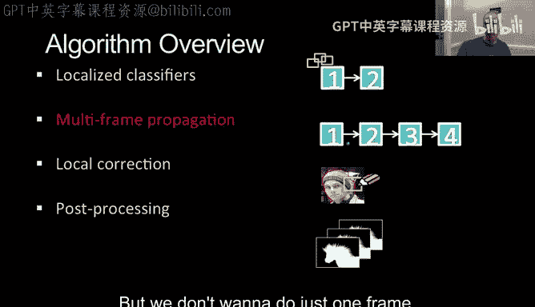

---

## 多帧传播与稳定性 🔄

上一节我们学会了如何分割下一帧，本节中我们来看看如何将分割稳定地向前传播多帧。

首先想到的基本思路是：分割第一帧，然后到下一帧，再从这一帧的分割到下一帧，如此持续下去，尽可能远地推进。

但这有一个根本性问题：我们非常信任第一帧（可能是手动分割的）。基于此，算法产生的结果可能不完美。如果我将这个不完美的结果传播到下一帧，那么这里产生的错误也会传播下去。这意味着我的形状先验和颜色分布估计中的错误会传播。

解决这个问题的一种方法是：为了稳定系统，为什么不让颜色先验也影响后面的帧呢？为什么不让它们持续移动并影响后续帧呢？这是我们非常信任的帧，所以让它向前移动信息。记住，我们是基于局部块工作的。因此，我们让这些局部信息向前移动。这样，后续的每一帧也能从我们非常信任的原始帧和原始分割中获得一些信息。

通过这种方式，我们的分割不仅传播了一帧，而且传播了多帧。再次强调，因为我们是在局部工作，我们不需要全局信任它，只需要局部信任。这些信息可以传播多帧以帮助稳定系统。

我们实际上可以迭代，使用当前分割作为下一次分割的初始条件或先验，等等。在这种框架中这是一个选项。但关键部分是**尽可能多地将我们信任的信息向前传播多帧**。

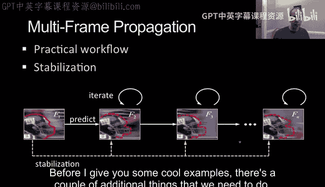

在我给你们看一些很酷的例子之前，我们还需要做几件事。

---

## 用户局部修正 ✏️

无论我们开发的算法多么出色，视频分割都是一个非常棘手的问题。特别是如果我们要分割电影素材，我们需要允许用户在算法中进行修正。记住，当我们信任一帧时，我们真的信任它，所以我们最好确保一直到后面的所有帧都处于良好状态。

这里有一个例子。我们进行了分割传播，然后发现到这里都很好，但这里出现了一个错误。我们如何让用户修复这个错误？

这时，**基于局部块的工作方式**再次提供了很大帮助。我们基本上想去修复它。有许多软件包可以帮助我们修复。我想再次说明这一点。

我们在这里修复了错误。但当然，记住之前有传播。之前出现的错误已经传播开了。现在我希望我做的修正也能传播。如果我对过去发生的情况感到满意，我不希望我的修正反向影响之前的帧。

因为我们一切都是基于局部块、局部补丁的，这很好。我们去查看受我最近修复影响的每一个块或补丁。由于我们之前做了运动估计，我们知道这些块在下一帧会移动到什么位置。我们在未来帧中也有它们的位置，然后我们只在这些块中进行修复。也许我们可以扩展几个块以使修复更连续，但我们肯定不会让修正的传播影响到很远的地方。这就是我们实现**局部控制**的方式。

因此，这些局部块不仅帮助我们获取局部特征，还帮助我们实现更快的交互。看看现在修复后会发生什么。我们进行了修复，错误被修正了。让我再展示一遍。我们有一个错误，但当我们修复它时，我们让那个修复传播到未来帧中对应的块。然后一切都修复了，我们可以继续从这一帧开始向前分割。

这非常酷。这是第三步，即**局部修正**。

---

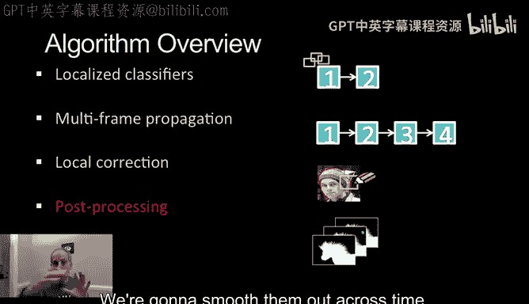

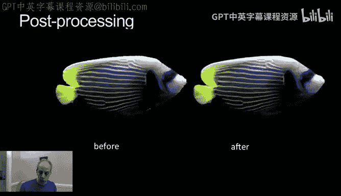

## 跨帧后处理与平滑 ✨

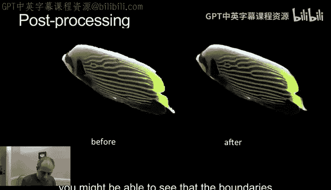

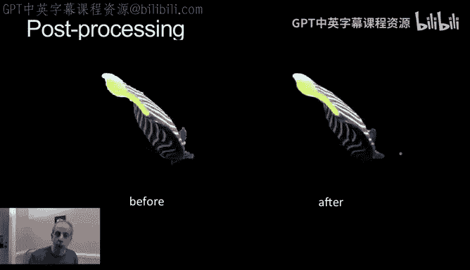

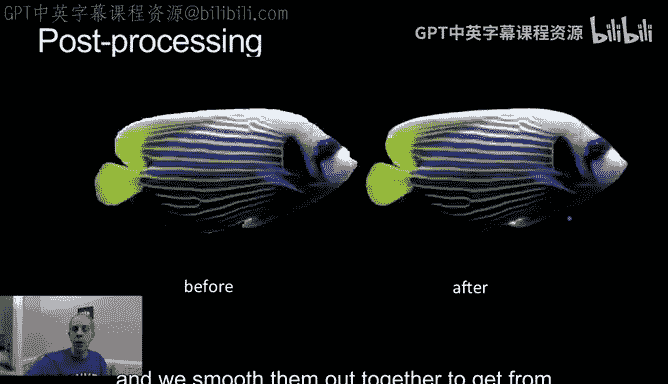

最后一点是，到目前为止我们得到了逐帧的分割。但这是一个视频，我们需要分割结果在帧与帧之间是连贯、一致的。实现这一点的一种方法是进行平滑处理：我们有了每帧的分割，我们将跨时间平滑它们，进行正则化以使它们看起来更好。

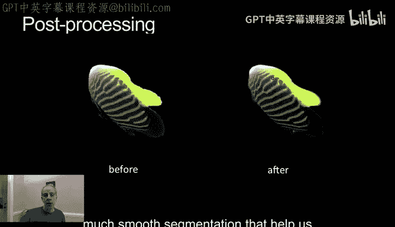

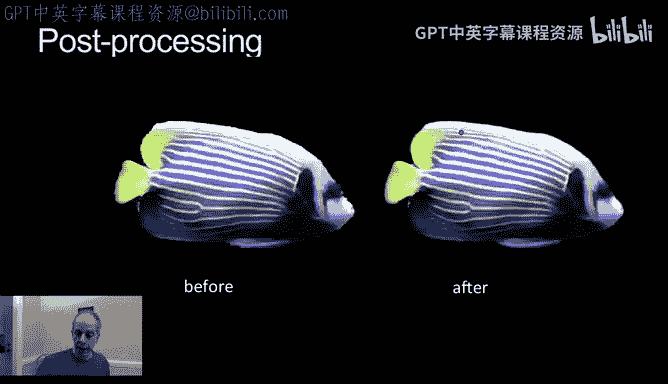

我想向你们展示一下效果。你们可能能看到这里的边界有些粗糙，而这里则平滑得多。我们基本上获取多帧的分割结果，并将它们一起平滑处理。从这种粗糙的分割，到更美观、更平滑的分割，这有助于我们将这个物体放入其他电影中或实现不同的特效。

---

## 效果展示 🎥

现在到了展示这项非常酷的技术的例子的时候了。

这是一个我们之前见过多次的例子。我们分割出了这个人，效果看起来非常好。它包含了所有组件：修复、平滑等，看起来非常棒。

这是我们看过多次的例子，我们看到了一个特殊情况：我们模糊了背景。这是我们在之前介绍性视频中见过的一种特效。我们分割出球员，然后将他们放在模糊的背景中，以突出球员并吸引观众的注意力。

一些额外的非常棒的特效例子：
*   原始视频中，我们分割出冲浪的女士（面临水花、拓扑变化等挑战）。分割出来后，我们可以制作非常棒的特效，比如改变人物身上的光线，而不影响背景。
*   另一个例子，我们从背景中分割出球员。看这个问题多难：背景全是蓝色和白色或蓝色和灰色，与球员颜色非常混淆。但我们有形状信息，这有很大帮助。一旦我们分割出球员，我们就可以修改背景，例如显著地模糊它。
*   还有一个特效例子，我们在这里分割出演员，然后可以在多个位置重复他。这里最大的挑战是分割。演员的衬衫与背景有很好的对比度，所以颜色信息很重要。同时，演员在移动但没有完全变形，所以形状先验也很关键。

---

## 总结 📝

本节课中我们一起学习了流行的视频分割技术之一——特别是内置于Adobe After Effects中的Roto Brush——背后的原理。

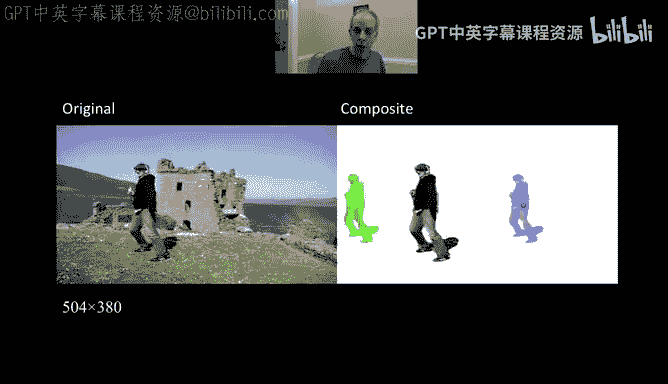

我们了解到它包含许多组件：
*   它利用**形状**和**颜色**信息。
*   它采用**局部化**的结构和学习方式。
*   局部化既是为了进行更准确的预测，也是为了在用户需要修正时提供更友好的交互。

所有这些概念结合在一起，才实现了这种**高精度**且**用户友好**的视频分割。

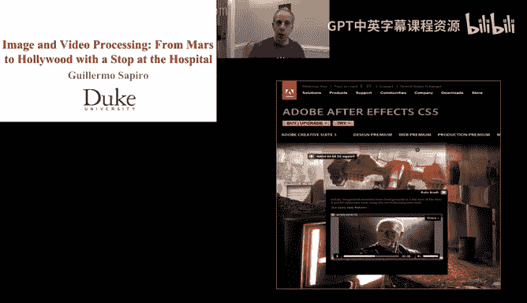

非常感谢，希望你喜欢这节课，我们下个视频再见。