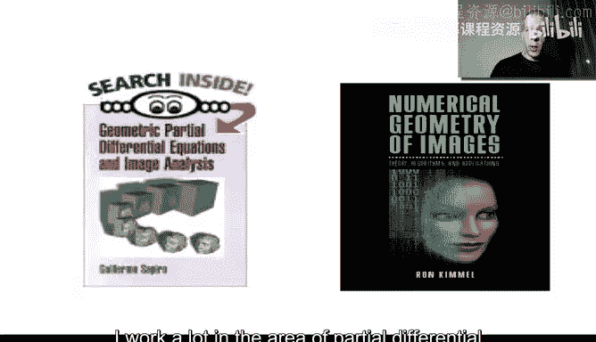
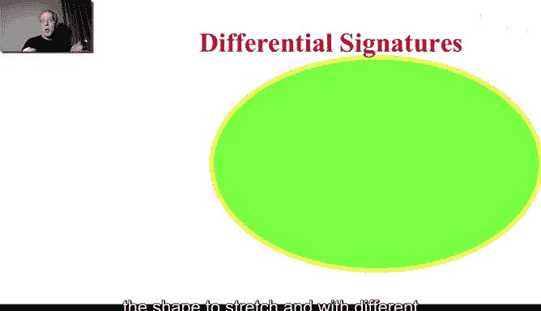
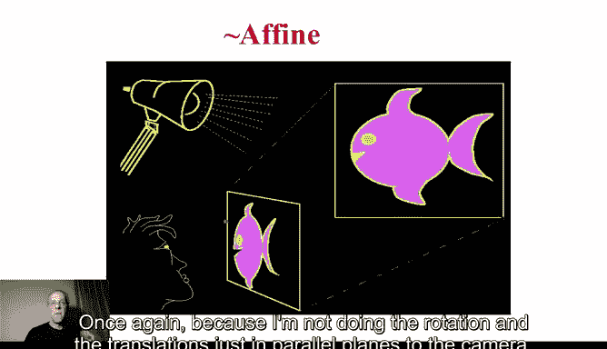
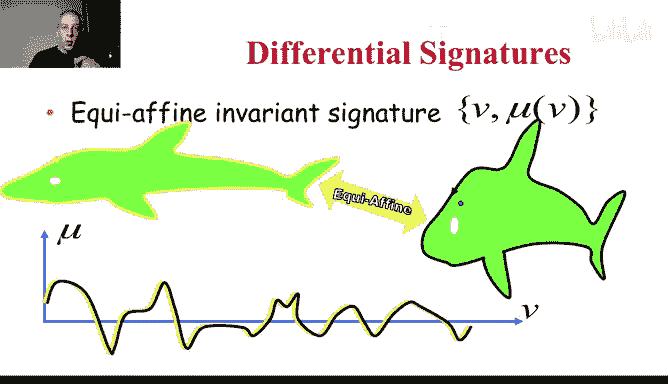

# 杜克大学《图像与视频处理：从火星到好莱坞，途中停靠医院｜Image and Video Processing： From Mars to Hollywood 》 - P52：52_06_02_2-平面微分几何-时长-38-33-可选休息点-12-46-21-03和.zh_en - GPT中英字幕课程资源 - BV1KYBrBxEsH

Hello， we are going to start with some background in the area of。Planar differential geometry。

 theory of differential geometry and the understanding of curves on the plane。 Before I do that。

 I want to provide some credit。 I work a lot in the area of partial differential equations in image processing。

 And some time ago， I wrote a book。 My good colleague and friend Ron Kimel also wrote a book in the area。

 and we used to give a lot of talks independently。 I get full semester classes。

 He gives full semester classes。 and sometimes we give together tutorials on this subject。

 A lot of the slides I'm using during this week， come from those tutorials。

 and I want to thank Professor Kimel for letting me share some of his slides and combine them with mine so I can provide the topic of partial differential equations in this week。

 So thank you， Professor Kimimel， for that。

Now let's talk about curves so we can describe what do I mean by differential geometry of curves。

 So what's a curve on the plane， a curve on the plane， we define a coordinate system。

 and this is for convenience。We have the x axis and the y axis。

 and then we define a curve parameterized by p。 we call p the parameter p runs between 0 and1。

 and for every value of p， we get a coordinate in this axis and coordinate in this axis and that's a coordinate of one point on the curve。

 So basically， for example， for p equals 0。1， we get this point。 Then for a different p like 0。7。

 we get another point and so on。 So I'm sure you get the idea。

 basically different values of p between 0 and1， give us different points on the curve。 Now。

 if a curve is close like here， what we have is that C at 0。Is equal to C at one。

 So it starts and ends basically on the same point。 And that's a close curve。 Now。

 you're very familiar with this concept。 Maybe you're not so familiar with curves， but for sure。

 you're familiar with functions。 So functions， you have a coordinate system X。And y as here。

 And you have a function that for every value of x。

 there is one unique value of y that doesn't happen in normal curves。In that case。

 your curve is parameterized by this coordinate itself。 So we get C of x equal。

The first coordinate is x by itself。 That's the first coordinate。

 and the second is some function of8。So these are just functions that you are very familiar with。

 again， the difference between a function and a general curve is that for each one of these。

Coordinate each one of the Xs， there is only one y。 And that's why it's called a function。

 There is a basically a unique value。 So it's a particular case of a curve。

 We could think about curves also as a generalization of functions on the plane。Now。

 once we understand the curve， which is parameterized by this P。

 and we're going to discuss a lot about P in the next few minutes。

 there is a couple of very important concepts of curves on the plane。And two of them are。The tangent。

And the normal and also what we call the curvature， which we're going to explain in a second。

 let's start from the tangent。Basically， we have a curve。

And we can take the derivative of this curve。 So this is where differential equations。

 differential geometry starts to appear。 C underscore P stands for the derivative of C。Taken by P。

 So it's basically C P。 It is a simplifyimplified notation of the derivative of C。With respect to Pe。

Which is， of course， a vector。Is the derivative of fx with respect to P C is a function of P。

 so I'm allowed to take a derivative of that。Y is a function of P。 So this is what we have here。

 and we normalize by its length。 We want to get a unit length。 and that's actually very。

 very important。 As we are going to see there is a particular parameterization called S that provides us a tangent that has unit length。

 And were going to use that a lot。 And we're going to see how we go from P to S。

 But the basic idea is that we take a derivative of this curve。

 And you learn in your basic calculus class that the derivative of a function， gives you a vector。

 which is perpendicular， which is sorry， it's tangent to that function。 And a second。

 we are going to talk about perpendicular。 So once again。

 the derivative of a function gives you a vector， which is tangent to that function。

 So the derivative of this curve a vectors， which are tangent。

And they don't have to have unit length， so we normalize them。

 and there is one particular parameterization we are going to write S that will give us a unit length。

 and again， we are going to see how we go from one to the other。Now， what。

We are gonna now that we have the tangent。 and in particular， bear with me for a second， we have。

The curve parameters in such a way that the tangent， meaning the derivative， is always unit length。

What do I mean by unit length that they basically the magnitude。Of the derivative vector。

Is equal to one。Okay， you need length。Let's assume that I can basically write a curve instead of a function of P。

 a function of a different parameter S that gives me unit length。Now， length means。

And I'm going to write this down and explain again means that the inner product of the vector with itself is equal1 if you don't remember what's the inner product between two vectors is basically you multiply the first coordinate of vector 1 by the first coordinate of vector 2 and to that you sum the product of the second coordinate of each vector。

 so it's x of the first times x of the second plus y of the first times y of the second。

So that means that we have unit length。Let's take a derivative of this。

 So I'm going to take a derivative。According to us， in both sides。

So this is the derivative of a constant is always unit length， so this。Becomes 0。

The derivative of this。Is like any other product。 Is the derivative of the first。

Times the second plus the derivative of the second times the first。 But because these are equal。

 then this is two times。They their product。Of the first derivative。With the second derivatives。

 like any other product。ok。😊，The two I can eliminate。And this means that the first derivative。

 according to a length， is perpendicular to the second derivative。Once again， just to remind you。2。

 the inner product of two vectors is equal to 0。 if and only if one vector is perpendicular to the other。

 So from here。We get that C S， the first derivative is perpendicular。To the second derivative。Now。

 the magnitude of the first derivative is one。The second derivative we have it here is perpendicular to the first one all the time when we are taking derivatives。

 according to S。 The first is unit vector。 The second is perpendicular to it。

So this is the second derivative。Now， it doesn't have to be a unique vector。Most of the time。

 it won't。And we call the magnitude of that second derivative。 We call the curvature。

This is the curvature。Okay， this is one definition of the curvature。

 It basically tells us how much the tangent is changing， and it's very intuitive if it changes a lot。

 it means that the curve is curving a lot there， it has very high curvature。

 If it's not curving a lot。 For example， a straight line has zero curvature。

 So what's the tangent of a straight line。At every point。Let's just change colors。At every point。

 the tangent is in the same direction， is in the direction of the line。 So the change of tangent。

 tangent is the first derivative。 Second derivative is the change。 The change of the tangent is 0。

 so。Planner， basically， a straight line has zero curvature。 What's the curvature of a circle。

So we have to basically， again， draw the tangents all the time。

And then see how they are changing infinitesimally。 When I move from one point to the other。

 those are derivatives。 derivatives means when you're very， very close。How is the tangent changing。

 first of all， is constant because the circle is all the same。 So it has to be a constant curvature。

And then it's not hard to prove that the curvature。Yes思。1 over the radius。Okay。

 so the curvature is one over the radius of the circle。 the larger the circle。

 the more curvature it has sorry， the larger the circle， the more radius it has one over the radius。

 the smaller the curvature。 You could think about a straight line as a circle with infinite radius。

 very， very large radius and then one over infinite is0。 So basically has zero curvature。

 So there' is a lot of new concepts in this very colorful for slide。 let's go over them again。

We have the tangent， which is， as we know， from basic functional analysis， basic calculus。

 is basically the first derivative。 We want to normalize it。 We want to have unit length。

 and there is a parameterization we are going to see how we get to it that basically gives us that the first derivative is always unit length。

Always， unit length。We take a derivative of that concept and we get the second derivative。

 which is always perpendicular to the first one only when we are talking derivatives。

 taking derivatives according to S。And then that secondary derivative derivative has a norm。

Basically， the magnitude of that vector， and that's curvature。

Carvature is the magnitude of the second derivative。 According to S。

 S is going to be called the arc length。 as we're going to see in a second Y。 So we have S。

 the arc length。 And we have， this is Kappa is the Greek letter Kappa， which is the curvature。 Now。

 we have S and the curvature。 And we talk about the relationship between the curvature and the radius of a circle。

 These are actually the only two objects with constant。😊，Euclideian curvature， straight line 0。

 a circle1 over the radius。 Now， why are these guys S and curvature Kappa so important。

They're important because they're going to be preserved under transformations of the curve under certain transformations。

 What kind of transformations can we have in curves。

So I have here a curve where the curve is the boundary of my object。Now。

 we are starting to understand why differential geometry is important。

 because curves are boundaries of objects and objects are present in images。Now。

 I can transform this in a number of ways， but always preserving it on the plane。

A general transform is I take my coordinates， which are a vector， and I multiply by a matrix。

And I translate， and I get a new vector。And that's what's called an a transform if I don't put any limitations in these matrix。

 so I take the curve and with an a fine transform， I transform it into a new curve。

Now I can also just rotate my shape here it has the form， it has stretch in different dimensions。

 in different directions。If I only want to translate and rotate。

 so I rotate and translate or I translate and rotate that imposes some limitations in a。

 and it's not hard to show that in order to only allow rotations and translations。

The two vectors of a。 So a is a two by two matrix。 I have here a vector multipied by a two by two matrix。

Sorry， a vector that I get it by a matrix multiplying a vector。 This has to have columns， which are。

Orthgonal， meaning the inner product equals 0， which I saw in the previous slide In product equals0 means orthogonal。

 and they also have to be unit vectors。 So this is just not hard to prove but the important thing here is that you can do a rotation and translation that's called a clideion motion or can you or you can do a general deformation and that's called an a fine motion and of course these are two or these are also related by an a fine motion。

Now， there is a particular thing in a five motions that if the determinant of this matrix is equal to one。

Then， basically， those are calls。E equi a fine motions。 If the determinant is equal to one。

 what happens is that the area doesn't change， so you can stretch differently in different directions。

 you can rotate， you can translate， but the area is preserved。 Of course。

 if you only allow Elideium motions， rotations and translations， the area is preserved。

 but if you allow a fine transformations stretches， the area is not necessarily preserved。

 but if the determinant of the transformation matrix is equal to one。

 then it's not hard to show that the area of these objects。

 So the area inside the curve or the object itself is preserved。

 and also call equi fine motions equi fine transformations。

 and we are going often just call them a fine and were going to assume that we are talking about those。

That we get with the determinant equal to one。 Now， these are the type of linear transformations。

 We are not going to discuss nonlinear。 I can take x and square log Y， things like that。

 we are not going to discuss。 we are only discussing about multiplying biometric。

 So that means a linear transformation。 So we have aide， and we have a fine， normally equi a fine。

 So now that we know that we can rotate stretch and do things like that to curves。

 meaning two shapes。Let's go back to us for a second to Carvature。 We talk about these two guys。

The arc length and the curvature， the arc length is the parameterization that gives us constant unit length tangents。

The curvature is the magnitude of the second derivative， according to the arc length。

 So if we go around the curve around this shape。We have， for every point a given carvature。

 and I'm drawing it here。So S is the parameterization goes around the shape。

 and for every S I have a point in the curve and then I have a curvature。Now。

 let's assume I do an Euclidean transformation。 I rotate and translate my shape。

 Something very interesting happens。 There are， of course， corresponding points。

 This point got rotated and translated to this one。And here is the beauty。

There we have the same curvature。 So the curvature here。And the curvature here。

 it's going to be exactly the same value。So if you were to take the first derivative。

 second derivative， measure the magnitude in both corresponding points exactly the same value。

 That happens for all the corresponding points。 So here we have another pair of corresponding points will have the same curvature。

 Sometimes the curvature will be 0。 sometimes will be negative。

Every pair of corresponding points has exactly the same curvature。Every single point。 So basically。

 if we have two shapes。That are related by a rotation and translation， meaning an Euclidean motion。

Then their curvatures are identical。 Of course， you have to have a starting point。

 That is the correspondingent Where S equals 0。 once you have that。Exactly the same curvature。

So the curvature uniquely identifies the shape up to a rotation and a translation。

 And that's beautiful。 That's a theorem that basically this pair。😊。

Uniquely identifies the curve and meaning the shape inside the curve up to a rotation and a translation。

 It actually has been shown these are beautiful results in differential geometry that every other thing that doesn't change with rotations and translation Every other differential thing is a function of S and kappa of arc length and curvature。

 For example， we could take the curvature and the derivative of the curvature。

 And that gives us another crazy curve on the plane。 So for every curvature。

 we look at what's the derivative， how much is the curvature changing in that point。

 we do that for one shape。😊，We do a rotation and translation。Va， we get exactly the same value。

And that's theorems， in part basically due to cartan and there extensions of di theorem some even more modern than these ones。

 but it's the beauty of that。 if you have the arcline S and the curvature kappa。

 you have all what are called the differential invariance functions that don't change when you basically do rotations and translations。

 so basically they uniquely identify objects。That up to rotation and translation。

 you cannot recover the rotation they are invariant to them， but basically。

 they uniquely identify those objects up to rotation and translation。In Elideian geometry。 Now。

 what happens with。A fine transformations， What happens when we don't just do rotations and translation。

 but we also allow basically the curve， the shape to stretch and with different stretches in different directions。

Now， unfortunately， or fortunate， if you like math。

 not everything in the world of image processing is rotations and translation。

 so let's assume I have a shape like my hand。 if I only do things like this parallel to the camera I can model the motion of the object by a rotation。

 the moment I tilt it towards the camera and then I do the projection of that on the camera。

 then this is not any longer just a rotation and a translation and one of the ways to model this is with this a fine transforms So basically if your object is relatively on a plane relatively to the distance to the camera like here。

 for example a drawing on a plane and we are looking this is the camera as it's a camera。

 we are looking at kind of a planar shape。there is an a transform。

 So it's a more general multiplication biometrics。 once again。

 because I'm not doing the rotation and the translations just in parallel planes to the camera。

 I'm doing them a bit tilted。 and that can be modeled by an a transform。

 a more general linear transform。

So we need to extend these basic concepts to basically allow for those a transforms。

And remember and a fine transform is a more generic basically matrix。

 we have the x and y but we multiply by a more general matrix that normally has unit determinant we want to preserve areas just to make our life easier we don't need this we can do all these without basically unit determinant。

 but it's much easier if we assume this so when we were talking about rotations and translations remember we assume that these column and these column were orthogonal so basically they inner product equal to0 and they were also normalized to one and those are rotations and then we have a translation when we assume more generic things like here just a unit determinant those are a fine transforms and we have kind of these tiltilting that basically gives us stretchings in the。

Different directions。 So I want to define this arc length and curvature for the fine case as well。

Now， in order to do that， let me just talk a bit more of what is parameterization。😡。

So I can have a curve。Parameterterized by p as before and can have it parameterized by R by a different parameter。

 the curve will basically be the same by r or by p the parameterization is kind of telling me how fast。

Are we traveling the curve remember if you take the derivative of the curve according to P you get a tangent vector with a certain magnitude。

 if you take the derivative according to R you get the same tangent vector same direction with a different magnitude if you remember from basic physics derivatives are velocity。

So you're only telling me how fast are you traveling the curve。

 but you're going from the same point to the same point。

 so it's like you're driving the highway between two points and the speed that you drive is the parameterization。

 but the highway is the curve， the highway doesn't change。So when we take functions。

 geometric functions basically of。Our， sorry， I want one more。 Let me come back。

When we take geometric functions of curve， they have to be invariant to parameterizations。

 the distance between two points in the highway does not depend on the velocity I travel on that highway。

 so the geometric measurements that we take have to be invariant to the parameterization。

 and they also have to be invariant to basically the transformations that we want to do。

Either rotations or a fine transformation。 So if you take a map and you rotate the map。

 the distance between two cities has to remain the same distance。

 not just because I'm looking at the map differently， it changes。 It has to be invariant to that。

 So let's use this concept to define the arc length S that we saw before let's just explicitly define it now and we're going to do the same for the fine case。

 but let's start with the Euclideon so basically only allow for rotations。

So here is what we have and this diagram is very good， assume soon I have a curve going through here。

And you're going to take a very infinitesimal， very small portion of that curve。

 so I have I can draw a coordinate system like here。

 I have a very small movement in the x direction and a very small movement in the y direction and then because of pythoras。

 this is basically x direction is perpendicular to the y direction。 So we have that this distance。😊。

Is the square root of the x direction distance and the y direction distance。 each one of them square。

 simple pythors。So now I'm allowing to multiply and divide by DP P is my general parameterization。

 so I multiply and divide by a small change in P remember were basically talking about a curve going around here so I'm going to just draw that I have a curve and I move a tiny bit is a tiny bit y and I measure how much I have move there。

 so I multiply and divide and this curve is C。So I multiply and divide by DP。

 just a small variation in the parameter station。And that's basically equality。

And now I basically move this DP in， so I get DxtP squared。Okay， I move it in。

But I move it inside a square root so I have to square it before so I get this okay this is Dp stay and this is exactly the definition of the elidean distance。

 the local basically distance of this vector just basically the definition of that。

 so we got that Ds is CP Dp If we want to get the arc length S is basically the integral of that。

Okay， so this is the way to go basically from。A generic parameterization P to the particular 1 s in such a way that the derivative now basically is unit length。

 always the derivative will be unit length， it will be a unit length vector and then the general distance of a curve。

 the total distance distance of a curve is the integral of everything from p 0 to equal1 of CPDP。

 This is the definition of the length。And if you basically replace。

 what we have here is the integral of ds from 0 to the length。 So when you're parameterizing by s。

 you're not going from 0 to 1， you're going from 0 to the length。Basically， once again。

This tells us how to go from every parameterization to S。

 so from every speed of traveling between two cities。

 if you basically are integrating the magnitude of that speed along the way。

 you're getting kind of a unit length of traveling。And that's what then LED us to， basically。

The Euclidean curvature when we took basically second derivatives。So this is for E clideion。 Now。

 Eccideion rotations and translations preserve length。And that's why I could use length here。 Now。

 in the fine case or in particular， in the equi a fine case。Length is not preserved anymore。

 what's preserved area so I can take areas。Now， in order to take areas。I need two vectors。

 one vector does not define an area。 I need two， so I'm basically going to take the first derivative。

It's always a tangent， V is going to be now my final claim。

So the first derivative is not a unit vector。That's a characteristic only when you take derivatives according to S to the Euclidean arc length。

 so I take a first derivative and a second， again these two vectors not perpendicular in general。

 that's a property only when you take derivatives according to arc length。

And then I basically define the I look at the area。

 and I'm going to look for the parameterization V that when I take first derivative。

Second derivative， this area is equal to1， I define it that way。And basically。

 you can do all the math。We take the first derivative is a vector。

 and the second derivative is a vector， and we put them here as vectors in a two by two matrix。

 So remember， this is a vector。This is a vector， so we get that two by two matrix is of this form is basically。

 let me write it down explicitly x derivative B。Why derivativeative V。X。V we。喂。V， V。

 and that creates a matrix。And I'm going to ask for the determinant of this matrix。

 The determinant of a matrix is the area of the parallelogram defined by these two vectors。 And now。

 I'm giving you a new concept。Group of concepts that you might not be familiar with。

 but I'm defining them on the way。 So they。If I have a two by2 matrix， this is a vector。

 this is a vector， the determinant of this is the area of the parallelogram between these two vectors。

 exactly what we have here， and I'm going to ask that to be equal to one。And remember for Elideion。

 we asked the length to be equal to one here we ask for the area to be equal to one and don't want to prove too many things to you。

 but。Any parameterization P will give a new parameterization that holds this property following this integral。

Okay。😊，So that's a theorem。Just believe it， for now。Now in particular。

 I can take p equal to the Euclidean earthquakes。That's allowed to do。 so I can put Cs。And C， S， S。

 Now， what are these two guys， This is unit length。Okay， you need length。

And the second derivative in the case of the Euclideian a length。Is perpendicular to the first one。

And it has basically length， equal to curvature。Euclideion， so this is one。 this is curvature。 So。

 of course， this area is equal to curvature。So we get that V， the a fine arc length gets its。

Obtained by the integral of the C curvature to the one third。D， and therefore。

 what we get is an extremely interesting relationship between the Euclidean arc length and the fine arc length。

 So we have the Euclidean arc length coming from here and the fine arc length and they are related by the Euclidean curvature。

 this is a beautiful relationship in differential geometry that relates a Euclidean differential geometry with a fine differential geometry。

 Now we have the fine arc length。 Our next step is to find the fine curvature。

 How do we do that in a very similar fashion， as we did for the Euclidean case。

 If you remember in the Euclidean case， we started by basically doing the derivative。😊。

Of the property that this was equal to one， we say the length is constant， and we took derivatives。

 Now， we have that the area is constant when we use the fine arc length。 So here， remember。

 is a determinant of two vectors。And we are going to take the derivative。

The derivative of the determinant is like any other product。

 We have to take the derivative of the first vector and then put the second and then derivative of the second and put the first。

 So it's what we have here。 the derivative of the determinant of these two vectors， C V and C V V。

Is the determinant here， derivative of the first， and we keep the second plus the derivative of the second。

 and we keep the first。Now， if we have a terminal with two identical columns， that's0。

 so this basically its0， that's a very basic property of linear algebra。

So we end up that the determinant here。Is equal to0。

 which means once again that these two vectors are parallel。When we took derivatives。

Here we basically had that in a product to be zero。

 the two vectors have to be perpendicular for the determinant to be0。

 the two vectors have to be parallel another basic property again of linear algebra so the first and the third derivative when I'm taking the derivatives according to the fine arc length。

 these two vectors are parallel so theyre basically parallel one， for example goes in this direction。

 the other goes in this direction， the ratio between them we define as the fine curvature the same way that we use the magnitude of the second derivative according to a cl arc length we use this as the oucccide curvature the ratio between these two parallel vectors is the fine curvature and it's not hard to show that this。

M this a fine curvature is a fine variant what I mean is very simple if we take as we talk before and a fine transformation preserving area。

 remember equi a fine so we have a curve， the boundary of a shape。

 and we take an a fine transformation。We compute the fine curvature of this shape as a function of the defined a length of the shape。

 we do the same for the new curve。Avoila， they're identical。

 so in the same way as we have auc clidean properties with S and Kappa Euclideon art length and Euclidean curvature。

 we have them with。They are fine as and a fine curvature。

 they're basically the same and they completely identify the object。Up to an a transform。

So now you're an expert on planar differential geometry。

 you know the concept of ourrc length is this particular parameterization that gives us some interesting property about the curve like constant speed in the Euclidean case or constant area in the fine case and then from that we got the curvature that is identical for the Euclidean case up to rotations for the fine case up to a fine transforms so those are very simple functions that uniquely identify shapes because they uniquely identify curves Now our next step is basically let's extend that un tiny bit to basically surfaces and we're going to do that in the next video and then you're going to have the basic tools of differential geometry to go and do the formations of curves and to do image processing and understand active contour。

So I see you in the next video for that， Thank you。

