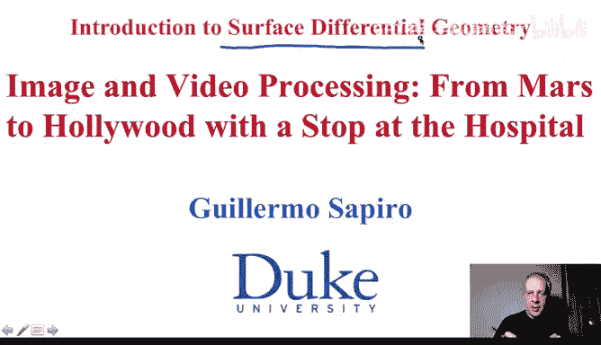
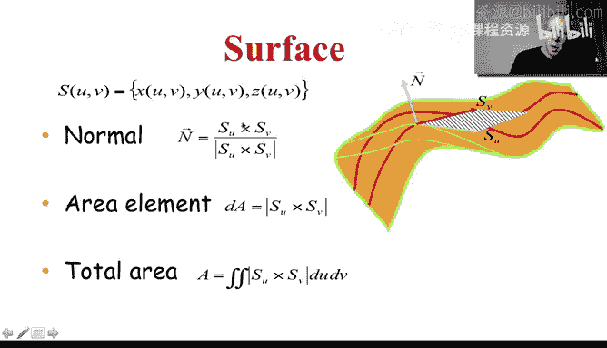
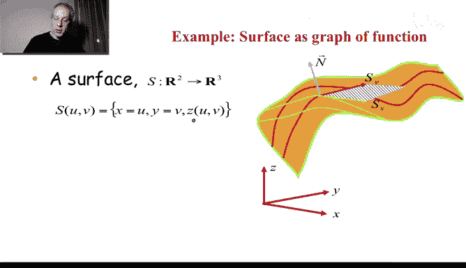
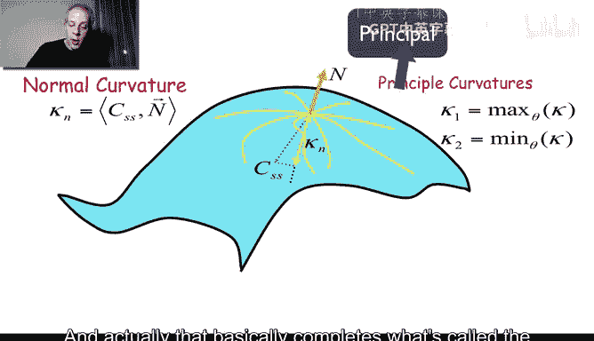

# 图像与视频处理：P53：曲面微分几何

## 概述
在本节课中，我们将学习三维空间中曲面的微分几何基本概念。我们将从平面曲线扩展到三维曲面，理解曲面的参数化、法向量、面积元以及曲率等核心概念。这些知识是理解后续课程中主动曲面、三维图像分割等高级主题的基础。

---

## 曲面参数化与法向量

上一节我们介绍了平面曲线的微分几何，本节中我们来看看三维空间中的曲面。

曲面在三维空间中非常优美。我们可以用两个参数 `U` 和 `V` 来描述一个曲面。这与平面曲线不同，曲线只需要一个参数 `t`。对于曲面，每个参数对 `(U, V)` 对应三维空间中的一个点 `(x, y, z)`。

在曲面上，我们可以画出许多曲线。每条曲线本身也存在于三维空间中。为了分析曲面，我们可以对参数化函数 `S(U, V)` 求偏导数。

以下是计算曲面法向量的步骤：
1.  计算曲面关于参数 `U` 的偏导数向量 `∂S/∂U`。这个向量是曲面上一条切向曲线的切线。
2.  计算曲面关于参数 `V` 的偏导数向量 `∂S/∂V`。这个向量是曲面上另一条切向曲线的切线。
3.  这两个切线向量张成了一个**切平面**，该平面与曲面在给定点相切。
4.  计算这两个向量的**叉积**：`N = (∂S/∂U) × (∂S/∂V)`。得到的向量 `N` 垂直于切平面，因此是曲面的**法向量**。
5.  通常，我们会将法向量**归一化**（即转化为单位长度），以便于后续计算。

所以，通过求导我们得到了切线，再通过叉积得到了法线。

---

## 面积元

如果我们有了导数（即切线向量），我们就可以定义**面积元**。

我们知道，由两个向量构成的平行四边形的面积，等于这两个向量构成的矩阵的行列式的绝对值。在曲面上，由 `∂S/∂U` 和 `∂S/∂V` 这两个无穷小的切线向量张成的平行四边形，其面积就是曲面在该点处的**面积元** `dA`。

**公式**：`dA = || (∂S/∂U) × (∂S/∂V) || dU dV`

通过对整个参数域 `(U, V)` 积分这个面积元，我们就可以得到曲面的**总面积**。这与平面曲线中通过积分弧长微分 `ds` 来求总长度是类似的概念。

---

## 图像作为曲面的例子

让我们看一个你熟悉的例子：**函数图像**。就像我们在平面上有函数图像一样，在三维空间中我们也可以有函数图像。

我们有一个坐标系 `(x, y, z)`。我们可以定义一个“图”，它漂浮在空间中。其参数化可以特别简单：
*   `x = U`
*   `y = V`
*   `z = f(U, V) = f(x, y)`

这里，`z` 是曲面的高度，也就是二元函数 `f` 的值。

**一个重要的特例是图像**。你可以将一幅图像看作一个特殊的曲面：
*   图像平面坐标 `(x, y)` 对应参数 `(U, V)`。
*   图像的灰度值（或强度值）对应高度 `z`。

因此，图像可以被视为一种曲面，更具体地说，是一种函数图。这个观点非常有趣，它允许我们将微分几何的许多概念引入图像处理。例如，我们可以将图像当作曲面，计算其导数、法向量，甚至曲率。

---

## 曲面曲率

现在我们来讨论曲面的**曲率**。基本思想很简单，但比曲线复杂。

在曲面上任意一点 `P`，有无数条曲线穿过该点。每一条曲线（作为空间曲线）都有自己的曲率。问题是：如何定义曲面在 `P` 点本身的曲率？

方法是研究所有穿过 `P` 点的曲面上曲线的曲率。你会发现：
*   在所有方向中，存在一个方向，其对应的曲线曲率**最小**。
*   在所有方向中，存在一个方向，其对应的曲线曲率**最大**。

这两个极值曲率被称为曲面在该点的**主曲率**（Principal Curvatures）。通常，给出最大和最小曲率的那两条曲线方向是彼此垂直的。

以下是理解主曲率的关键点：
*   **最大主曲率**：曲面在该点弯曲最剧烈的方向。
*   **最小主曲率**：曲面在该点弯曲最平缓的方向。
*   **例子（圆柱面）**：想象一个圆柱体。如果你沿着垂直于轴线的方向切割，得到的是一个圆，其曲率为 `1/半径`（这是一个主曲率）。如果你沿着平行于轴线的方向切割，得到的是一条直线，其曲率为 `0`（这是另一个主曲率）。因此，圆柱面上每一点都有一个主曲率为 `1/半径`，另一个主曲率为 `0`。

从这两个主曲率，我们可以定义两个更常用的曲率度量：
1.  **平均曲率**：两个主曲率的算术平均值。`H = (k1 + k2) / 2`
2.  **高斯曲率**：两个主曲率的乘积。`K = k1 * k2`

高斯曲率是微分几何中一个极其重要的概念，它揭示了曲面的内在性质（即不依赖于如何在三维空间中嵌入的性质）。例如，圆柱面的高斯曲率处处为 `0`，这与平面相同，意味着它可以被无拉伸地摊平。

---

## 总结与展望

本节课中我们一起学习了三维曲面微分几何的核心概念：
1.  曲面使用两个参数 `(U, V)` 进行参数化。
2.  通过对参数化函数求偏导得到切向量，其叉积给出**单位法向量**。
3.  切向量张成的平行四边形定义了**面积元**，用于计算曲面面积。
4.  图像可以解释为特殊的曲面（函数图），从而应用微分几何工具。
5.  曲面上一点有无数个方向的曲率，其中**最大**和**最小**值称为**主曲率**。
6.  由主曲率可导出**平均曲率**和**高斯曲率**，后者是描述曲面内在性质的关键。

现在，通过这两节关于曲线和曲面微分几何的视频，你已经掌握了理解后续内容的基本工具。接下来，我们将学习**曲线演化**，即形状的形成，以及它与**主动轮廓**、**主动曲面**的关系。

这将会非常令人兴奋，因为即使是图像去噪和增强，也可以利用我们刚学到的工具——毕竟，图像就是曲面，它们拥有曲率、法线等所有微分几何概念。希望你能享受这个过程，我们下个视频再见！