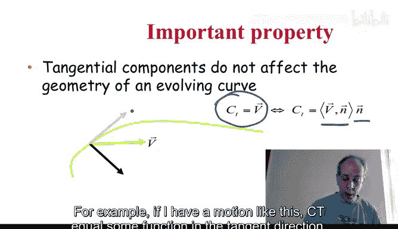
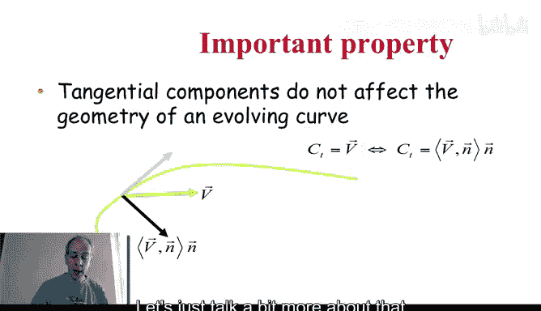
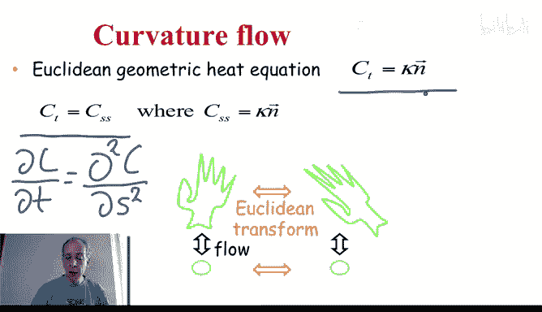
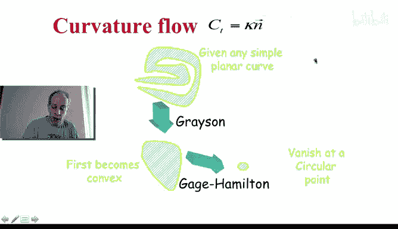
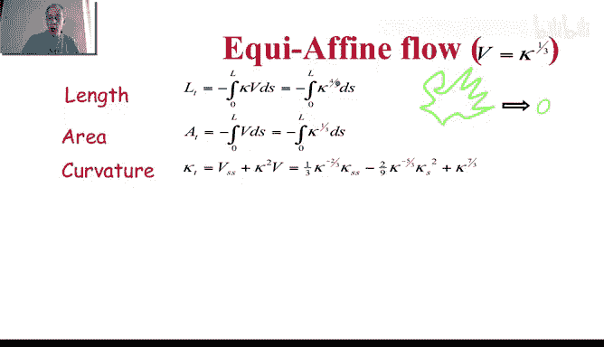
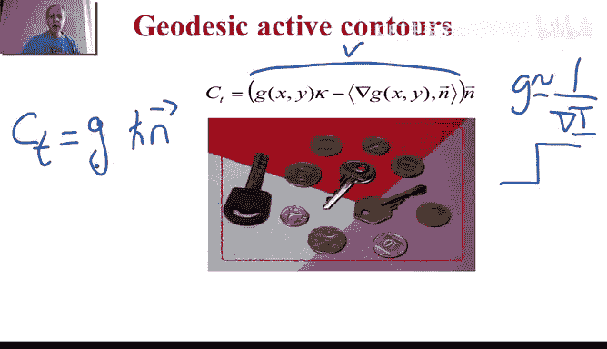
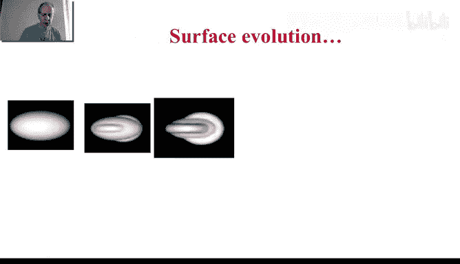
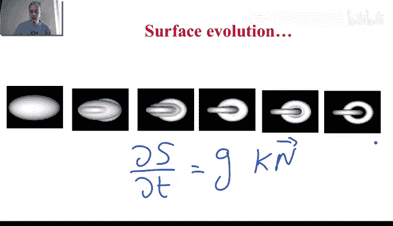

# 杜克大学《图像与视频处理：从火星到好莱坞，途中停靠医院｜Image and Video Processing： From Mars to Hollywood 》 - P54：54_06_04_4-曲线演化-时长-31-10-可选休息点-08-50-19-25和24-22.zh_en - GPT中英字幕课程资源 - BV1KYBrBxEsH

Hello and welcome back。 Now we are going to be talking about curve evolution。

 This is the concept I is going to bring us to the understanding of active counters。

 as we have seen in the previous week and as we have talked in the previous videos as well。

 So what is curve evolution。 very， very simple concept。 The basic idea is that as we see here。

 we have a curve。 And at every point we have a velocity that defines how that curve is moving。

And that's represented by this equation。 So it's a partial differential equation。

 If I'm going to write it in explicit form。It's going to say that the derivative of the curve。

 Remember， the curve is parameterized by a parameter P。The derivative of the curve， in time。

So the curve changing in time is equal to certain velocity。And the velocity is， again。

 at a given point。And the velocity might be changing in time。 So this is the complete equation。

 Its a partial differential equation。 and we write in shorter form。 as here。

 we know that the subscripts represent derivatives。 So at every point， we're moving the curve。

 So at some time， we are going to have these curve a bit later。

 we might have a curve like here and a bit later， we might have maybe a curve like this。

 depending on the velocity at every single point。 And as we are going to see this type of deformations of curves。

 Remember， curves are boundaries of shapes。 these type of deformations， we bring us some very。

 very interesting。😊，Movements inside images and inside videos。

 So let us see a few properties of this and also a few examples that will illustrate the importance of this concept。

The first important property is the following。We have a velocity at every point。

 That's the formation velocity。 Now， that velocity can be decomposed， of course。

 into the component that is normal to the curve， Perpendicular to the curve。

 We have defined normals and tangents。 Well So we have a vector。

 We decompose it into its normal and tangent components。

It turns out that this tangent component does not change the shape of the curve。

 So it's not relevant。 So that's written here。 This is the general equation that we have。

 but we basically project the velocity towards the normal direction。

And we take only that projection and we move in the normal direction。

 So basically from the geometric point of view， the most general deformation is that deformation in the normal direction to the curve。

 you can add velocities in the tangential direction， they just don't change the shape。 Remember。

 the tangent is the velocity you're traveling the curve。

 So all in these terms is kind of changing the velocity that things are moving。

 but they're moving along the curve。 They're not really deforming the shape of the curve。

 So often we are going to just right。 curve evolution as deforms in the normal direction。

 That's all what we curve。 Sometimes for convenience， if you want， you can add tangential components。

 you can add them as you wish to add them， because they don't deform the curve。 For example。

 if I have a motion like this。 C。

Equal some function in the tangent direction。So， no normal component， this。

Does not change the shape of the curve at all。 It's only like making a lot of effort around the curve。

 but not changing the curve at all。 So the general deformations are in the normal direction。

 Let's just talk a bit more about that。 And let's just see a few examples。 By the way。

 this property is not very hard to prove。 And you can do that as an exercise if you wish to do so。

So the first one that we want to talk is what's called curvature motion。 So the deformation。

In the normal direction is proportional to the curvature。 at that point。

 Before I tell you what basically that type of the formation is doing to the curve。

 let's just look a bit more。 Remember， that the second derivative of the curve。

 when we take the derivative with respect to the Euclidean arc length。 is this。

 So the second derivative of the curve， we know is a vector perpendicular to the curve and the magnitude of that vector is the curvature。

 So this， the formation is like the first derivative in time equal second derivative according to arc length。

 For those that are familiar a bit more with differential equations。

 This is like what's called the heat flow but very geometric because of this arc length。

 So in explicit form， this says that this C。😊，DT。Is equal to the second derivative of C。According。

To the a。Okay， it's a very interesting。Deformation of curves and what it does， is basically。

 first of all， is a Euclidean invariant。 Curvature is auc clidean invariant。

 meaning is invariant to rotations and translations， and the normal is also a Euclidean invariant。

 So if you do a rotation and translation or an Euclidean transform and。First。

 you do the deformation and you do the deformation here Also here along the way of the deformation。

 the curves are related by exactly the same rotation and translation。

 So you start from a curve you rotate it， you start the forming both according to this motion at any time you stop the same rotation and translation relates the deform curve that will happen as long as you use properties which are invariant to rotation and translation。

 Now this motion that some very beautiful things to curves and the basic idea and this has been proven a number of times but was first proof by gra some time ago that you take any curve。

 think about any curve that is not selfinsecting So that's call a simple curve。

 that's actually the boundary of a shape。 you take any curve you deform with this and the curve becomes convex。

It just opens up， it just gets very smoothly into a convex shape。Once it convets， if you keep going。

 starts rounding。 and basically， it ends in what's called a round point。

 So it's actually will vanish。 It will keep shrinking。Basically。

 will keep going inside proportional to the curvature。 And at the end。

 it will look like a round point。 So if you dilate it all the time。

 if you just make the area constant all the time， you will see that becoming round and round。

 So what you see is that no matter how crazy and how difficult your shape is。

 as long as this doesn't itself intersect。And basically。

 it just opens up So it's becoming smoother and smoother until it becomes a circle。 Remember。

 the circle has constant curvature。 So this is basically going from a very crazy curve。

 It might be a curve that does a lot like this。😊。

As much as you want and then smoothly its becoming just nicer。

 So it's actually regularizing the curve。 And if you wait all the way， it becomes round。

 constant curvature。If you remember the heat flow takes heat， no matter the distribution of the heat。

 AM becomes constant in the room。This， no matter what the curvature is all around at the end。

 it becomes constant， it becomes one over the radius， how much it takes it to get to here。

 we're going to know that in a couple of minutes， don't worry this is a very simple property to prove how long it takes for the curve to completely collapse into this round point。

Before we do that， let's do a couple of additional examples。Now， that was the Uuclian case。

 What about the fine case， The fine case turns out to be this function。

 This is the Ouclian curvature。 Where do we get it from， We are going to do。

 Let me just write it here for a second。 We' are going to do the same as we did before。 But now。

According to the fine as， Now， remember， when you take second derivative。

 according to the fine a lengths， you are not necessarily perpendicular to your curve。

But we know that the tangential component does not matter， so you have to project it。

 and we already saw before in one of the previous videos that the projection of the fine normal。

 the second derivative into the Euc Cidean normal is Kappa to the one third is the curvature to the one third so。

These two equations are from the geometric point of view， equivalent。

 They're absolutely the same equations。 But this has motion in the tangent direction that is not relevant。

 So once we project it to the normal direction。 We get this beautiful equation looks like a Euclidean that has this magic exponent that makes it a fine invariant。

 that means。😊，That if I take a shape and I do an a fine transform of that shape。

 and how I evolve both of them， then all the time， I can relate them by exactly the same a fine transform。

 So this is a fine invariant， So I can be doing smoothing in a fine regularization。

 cleaning my curve in an a fine invariant fashion， meaning invariant to tilts of the camera。

 when we are under the assumptions that the fine model is a good model as we discussed before。

 And now you can also prove a number of interesting properties， similarly to the clideion case。

 What happens here is that the curve， no matter how crazy it is。 it becomes convex again。

 And then it goes into an ellipse。 It doesn't go into a circle。 We are in a fine domain。

 circles an ellipses are the same in the fine domain because。😊。

As a circle with an a transform goes into an ellipse。Moreover， the lips has constant a fan curvature。

 Remember this mue that we discussed that is the curvature。 So as in the Euclidean case。

 we start from something that might have a crazy a fan curvature。

 slowly this crazy or this very changing a fan curvature is deforming towards a constant a fan curvature。

 and that's where this is called the fine heat flow is taking curvature that is very nonuniform and is making it uniform at the end。

 So that's another very interesting motion。 The Euclidean and the fander both kind of cleaning the curves。

 meaning cleaning the shapes。 Now， not every motion does that。 If we take the simplest of the motion。

😊，Constant speed in the normal direction。 Just at every point， Mo a step。

 I don't care the curvature about the curvature of my curve。

 I just move a step at every single point now。This is a very important equation iss the question that creates offsets。

 You are creating a curve， which is。Parallel to the previous curve。

 you can move inwards or you could do minus here and move outwards。

 So you're creating another curve that is parallel。 It's equal distance all the time。 And basically。

 if you keep going， you get another equal distance and then you get another equal distance here and so on。

 depending how far you go， remember， this is a differential equation in time。

 you can stop or you can keep going。 Now， this curve。Is obtained by doing this deformation。

 but is also obtained in the following fashion。You basically draw a circle center on the curve and with a given radius。

 And then for every point， you draw a circle with exactly the same radius。

 and then you take the envelope of that circle。 and that gives you this。😊，Constant motion， theform。

 And that's related to what's called the hogans principle in physics。

 That's how waves propagate basically when they don't have obstructions。

 So if you had maybe you did these experiments in physics where you basically propagate waves。

 And that's what this constant motion does or the hogans principle。

 So maybe you knew that so this is a wave。 and maybe you knew the hogans principle basically the one that governed the motion of the waves without any obstructions。

 So that's just nothing as then this type of curve evolution。

 So this curve evolution is important in image processing。

 but it also explains a lot of very interesting physical phenomena。Constant motion。 Now。

 this constant motion is very interesting。 For example。

 it can actually change the topology of a curve。 If you start from this curve。

And then you move with constant velocity。 After a while， the curve splits into。

 This cannot happen in the curvature motion for Eccideon or a fine that we saw。

 The curve stay simple， stay smooth here。 actually， it can split into pieces。

 It's like the waves can split into pieces。 There even more things happening。

 If you start with a smooth curve。 and you move inwards。 After a while， these size will collapse。😊。

They don't have a curvature term here， so they don't have any way to understand that the curvature is becoming very。

 very high。 It's going to collapse。 It's going to get to a corner。 Corner has infinite curvature。

 Just you really turn very fast。Doesn't know because there is no curvature term here。

 So after some time it will basically collapse and it will create what are called shocks。

And we know that from waves， when waves are coming。

 they can collapse and they can create these shocks。

 This doesn't happen with curvature motions for the fine or euclidean case。

 The curve stays smooth all the time。 It will never collapse。

 the constant flow creates this collapse。 So we have the both extremes。

 the constant flow can change topology can collapse thing can create corners。 Now。

 the curvature regularizes， this great corners。 So maybe it sharpest shapes。 So we have both motions。

 depending of what we want to do in the image processing arena。 Now， once we have this type of。

Carvature motions。 And I'm basically gonna write them here again。

 So you remember them we have the constant flow， no speed here or speed equal one。

 The curvature flow Euclideon and the fine flow。 the constant motion can split curves can do can do shocks can do corners。

 the Euclidean one regularizes everything into a circle and the fine regularizes everything into an ellipse。

 which ellipse， we don't know we're in a fine space。 All ellipses are the same。

 Now we can write a lot of properties of these deformation。

 And those are just interesting curiosityiosities， sometimes they are very useful for image processing。

 sometimes they are just9 things one of the things we're gonna see when does this curve in the Euclidean case collapses。

 And this is just some calculus。 So it's not very hard to do。 But if you take a certain deformation。

 So remember， we only consider。😊，The normal， deformation， and with velocity with speed V。So。

 for example， how is the length changing and forming a curve。

 What's happening to the length of the curve。 So we have to take the derivative of the length。

 and this is。The definition of the length of curve。 So the integral all around the curve。

 That's the symbol with the circle there。 So you go all the curve。

 We' are talking about close curves in this case， So you go all around the curve。

 And this is a function of basically the length。 Now， I have to put the derivative inside。

 and we have already seen that we take the derivative of the first component。

Times the second plus the second times the first。 these are symmetric。

 So that's where we get these two here。 And then we get here。

 and we're gonna to have to reverse the order here of thes。

 and instead of C derivative with respect to P and then T， we' are gonna to reverse that。

 So it's a bit of calculus。 and we get at the end this expression。

 So this is the expression that governs the change of length。

 and we're gonna to see an example in a second for different Vs。 we can do the same for area。

 basically instead of inner product， we take the outer product or the determinant。

 we have already seen that。 we take basically the two vectors and we take the determinant of that matrix and that compute area。

 we can also look at the change of basically curvature。 And these are the equations again。

 I don't want to take too much time to do the whole derivativerivation， theyre not very hard。

 and they appear in the。Book， for example， that that I mentioned。 But here we have the。

General formulas of the change of length， area and curvature。

 This is actually a very interesting formula。 Its basically， in some cases。

 it's called a reaction diffusion equation。 It' the same type of equations that people use to model how basically patterns in the skin patterns in the zebra are created。

 It has kind of a diffusion term and has kind of a shock term here for certain types of V。

 So let's just pick some examples and see what happens for different Vs for example for v equal1。

 the constant motion。 So for the constant motion， we have v equal1 And then the change of length。

 we put here V equal1 So it's the integral all around the curve from0 to L now。

The integral of the curvature around a closed curve is always equal to two pi。

 That's basically a fundamental theorem in differential geometry。

 And that basically says that the length is changing at constant rate。 The length is changing。

 So the derivative of the length is changing at constant length。And that if you integrate that。

 he tells you， when are you starting to see crazy things happening。

 as we're going to see in a second。 So the time that things change So you can either write it as a function of the initial length or as a function of time。

 you get it here。The area is basically this was the general formula， but v is equal1。

 and basically we have the integral from 0 to L of1 Thats L。

 So the area is changing proportional to the length。 Now the length is changing。

 so this is not constant。 This is constant。 This is not constant。

 The area is changing proportional to the length。The curvature。

This was the general formula and we have the then the derivative is equal to the curvature square because v is constant。

 so second derivative vanishes now you can solve this equation of derivative of curvature according to time equal curvature square。

 you solve it and you get this equation and look what happens here。This， basically。

 the curvature blockss。 It becomes infinity。When T is one over the curvature。At the original curve。

 remember， we say that things can create shocks。 Basically， the waves are coming and boom。

 they collapse， and that's basically very high curvature， Inite curvature， When that happens。

 when this term is 0， When is that happening when T is one over the initial curvature at this point。

1 over curvature is radius， So you know， exactly when are you expecting a shock to happen。

 When are expecting this waves from both sides to collapse。 you go around your initial curve。

 And you say， where do I have basically my curvature of this form， When is that going to happen。

 When is this curvature going to become infinity because it's collapsing from both sides。

 or at time1 over the curvature， the larger the curvature。

 the shorter the time it will become a shock， So if you have something which is。

Already almost almost a corner very fast。 It will become a shock。 So from these equations。

 you understand the overall behavior of that。 You can， of course。

 do that also for the curvature flow for the Euclidean case。 and once again。

 you plug in the same equations。 And in this case。This is the general formula of the area now the velocity now is curvature so you integrate again the integral of the curvature is constant so you get that in the constant motion。

 the length was changing at constant rate in the Euclidean motion the area in the Euclidean curvature motion。

 the area is changing at constant rate and then I can solve for this and I can tell you exactly when is the curve collapsing is collapsing at time which is the initial area divided by two pi so you look at your initial area you divide by two pi and say at this time my whole curve will become a point remember this motion collapses everything to a point but all the way is smooth in contrast with a constant motion here everything is smooth it just gets cleaner and cleaner and goes into a round point when exactly at this。

So that's why these formulas are important to understand how the length is changing。

 how the area is changing or even how the curvature is changing。 So those are really。

 really interesting properties。 we can do the same for the fine case and you get these formulas。

 There is no kind of very clean way to solve this type of integraltes。 So you just get this formulas。

 there is no constant basically things here， although you can make an interpretation of some of the things as constant。

 but let's just not discussed about that in this moment。

 So basically we have properties of these motions now。

One of the motions。 So these are curvature motions， constant motions。

 the active contours we talk about basically are this type of deformations， nothing else in that。

 And let me just give you one example of active contours velocity。

 and when we learn in one of the next videos calculus of variations After that。

 we're going to be able to derive this motion in a more formal way。

 but even now I can write it down and explain it to you。 So this is V。 what we have here is V。

So this equation looks very long， but is nothing less than a deformation with a certain velocity in the normal direction。

Now， what are the terms inside here。 So this curve。Is basically gonna deform with a certain velocity。

 Now， what are these terms。 Here is the curvature。 No problem。 We know it。 Here's the normal。

 Here' is the normal。 What's G。 G is， for example， It's a function that depends on the image。 And。

 for example， one over the gradient of the image。 Now， why do we need this function。

 Let's say that this function was not here。 Let's just leave aside this term for a second。

 Let's assume that this function was never here。 So we have C equal K Kappa curvature。

 collapsells to a point。 I wonder， I want this red curve here。Basically， to stop。Basically。

 at the boundaries of the shapes。 I don't want it to collapse to a point。 So how do I do that。

 I make it stop at high gradients。 So if G。Is proportional to one over the gradient of the image。

Then let's say that I have a very strong boundary。 The gradient is very high。

 Let's assume it's infinity。 and then G is 0。 So the curvature is trying to collapse， collapse。

 but it gets multiplied by 0。 and then stops。 say， hey， I cannot move anymore。 I need to stop。

 There is no more velocity。 And that's why you have this term here。 now。😊，We never have ideal shapes。

 So this derivative of G。 remember， G is one over derivative of the image。 For example。

 the gradient or any other type of function。 you take another derivative of that to make that stop in term。

 even stronger even when there are no perfect edges that this will not be0。

 you basically create a potential value by taking the second derivative。 And of course。

 that doesn't have to be in the normal direction， So you have to project。

 We know that every time we have something that is not in the normal direction。

 we have to project it to the normal direction。 So this is almost nothing else than curvature motion。

So a simplified version of active conours is this。Carvature motion。In the normal direction。

 multiplied by G G is a function of your image is the one that tells stop when you get to very high gradients。

 And this second term just make that stopping even stronger。 So here it is。

 we saw active contours in the previous week。 And now we have been talking about differential geometry。

 And we have been talking about。Cvature curve motions and how things they。

 Why one of the reasons is to get to active counters。

 You' are an expert now in differential geometry， and you're an expert now in curve evolution。

 curve theform。 So here it is， you could have defined this。 If I give you five minutes to say。

 define design a curve evolution motion that will get you active cons。 Many of you。

 most of you probably would have come with this solution。

 Just the form it smoothly move towards the objects。 But when you get to the objects， stop。

 And then people have done many different variations of this。 But this is the underlying concept。

 You can add some constant motion。

That helps you to move faster， but be very careful。 You can get shocks， and you can， you keep moving。

 So always， you have to add terms that depend on the image， not just depend on the curve。

 depend on the image。 So it makes you stop。 And you can basically go while and do very。

 very interesting things in curve evolution to get to active contours。 Now， remember。

 we know how to define these properties also for surfaces。 So we could do that for surfaces as well。

 And basically， here is just an example of a surface。

 So these are snapshots of a surface that started basically from here。😊。

And in the form， it the form， in the form。 and in discovered inside， there were basically two rings。

 basically touching each other。 And this motion is nothing else than the motion I just wrote for you。

 But now on surface domain。 And here this was an ideal object， white and black。

 So the gradient was very strong。 and one of the over the gradient was very weak。 So basically。

 when I did the surface evolution， the S。D T equal。

 let's say one of the curvatures and can be the Gaussian can be the mean。 You know。

 we could discuss more about that。 What curvature exactly to put here。

 the normal direction that will basically say， move， move， move。

 And then we have G that basically you say will say when you get to very， very high gradients stop。

 And so this is just a artificial examples。 we're gonna see more examples of active contours later on now that we're becoming experts in this curve evolution and differential geometry。

 And this is just， as I say， snapshots of this evolution。

 So a lot of very interesting mathematical tools。That give us active counters。

 which is one of the most useful techniques for doing image segmentation。

 as we have seen many examples last week， and as we're going to keep looking at more examples。

 So now we are experts on curve evolution。 and'm looking forward to seeing you in the next video when we're going to keep learning。

 keep building the tools that will let us understand everything about these active counters and this type of deformation。

 as well as some of the material coming later on。 Thank you very much and seeing in the next video。😊。

