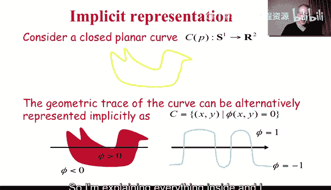
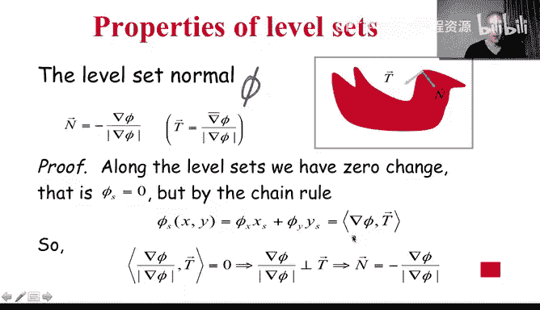
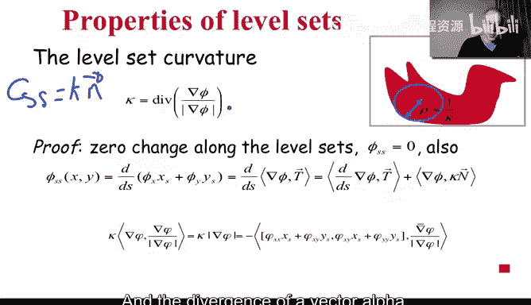
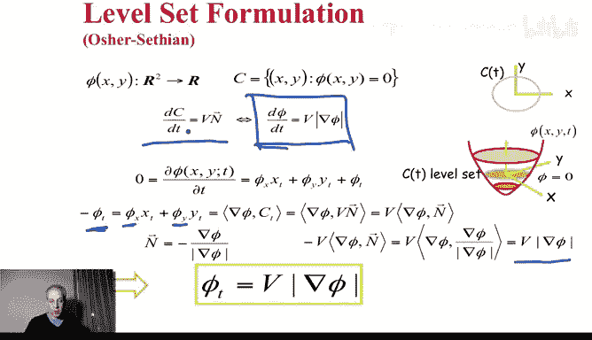
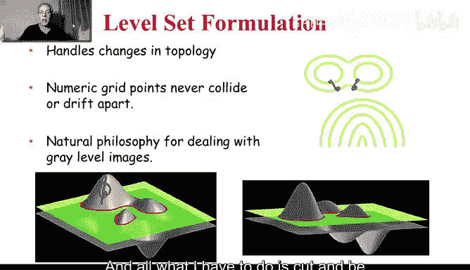
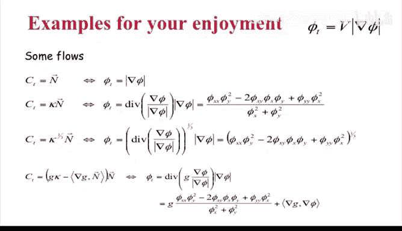

# 图像与视频处理：P55：水平集与曲线演化

## 概述
在本节课中，我们将要学习如何将曲线演化理论在计算机上实现。我们将重点介绍水平集方法，这是一种在图像处理领域，特别是处理偏微分方程时具有巨大影响力的框架。通过水平集，我们可以以一种对计算机友好的方式实现任何类型的曲线或曲面演化。

---

## 曲线表示：参数化与隐式表示

上一节我们介绍了曲线演化，本节中我们来看看如何表示曲线。

我们之前讨论过曲线及其参数化表示。在这种表示中，曲线上的每个点都由一个参数 `p` 决定，例如 `C(p) = (x(p), y(p))`。

然而，这不是表示曲线的唯一方法。还有一种截然不同且更直观的方式，即隐式表示。

以下是隐式表示的核心思想：
*   我们不再用参数描述曲线，而是用一个函数 `φ(x, y)` 来定义曲线。
*   曲线被定义为所有满足 `φ(x, y) = 0` 的点 `(x, y)` 的集合。这被称为函数 `φ` 的 **零水平集**。
*   通常，我们定义 `φ` 在曲线内部为正，在曲线外部为负。一个常见的例子是使用**有符号距离函数**：曲线上点的距离为0，内部点距离为正，外部点距离为负。

通过这种方式，我们通过一个定义在整个平面上的标量函数 `φ` 隐式地定义了一条曲线。这两种表示法描述的是同一条曲线。

---

## 从隐式函数计算几何属性

有了曲线的隐式表示，我们需要能够从中计算切线、法线和曲率，否则无法进行曲线演化。

### 法线与切线的计算

**核心公式**：
*   单位法向量 **N** = - ∇φ / |∇φ|
    *   负号是一个约定，通常使法向量指向内部（即 `φ` 值增加的方向）。
*   单位切向量 **T** 是与 **N** 垂直的向量。

**推导简述**：
沿着曲线，`φ` 值恒为0。因此，`φ` 沿曲线弧长 `s` 的导数为0：
`dφ/ds = (∂φ/∂x)(dx/ds) + (∂φ/∂y)(dy/ds) = ∇φ · T = 0`
这证明了梯度 `∇φ` 与切向量 **T** 垂直。将其归一化并加上方向约定，即得到法向量公式。

### 曲率的计算

**核心公式**：
曲率 `κ = div( ∇φ / |∇φ| )`
其中 `div` 是散度算子。对于二维向量 `(α, β)`，`div = ∂α/∂x + ∂β/∂y`。

**重要性**：
这个公式极其重要。我们不需要知道显式的曲线参数 `C`，只需要知道定义在网格上的函数 `φ`，然后计算其在 `x` 和 `y` 方向上的常规导数（例如，用相邻像素的差值），就能得到曲率。这比沿着曲线求导要简单得多。

现在，我们知道了如何从隐式表示中计算法线和曲率。那么，如何让曲线变形呢？

---

## 曲线演化在水平集框架下的实现

下一步是学习如何变形曲线，即如何改变 `φ`，使得其零水平集（即曲线）按照我们期望的速度运动。

假设我们希望曲线沿着法线方向以速度 `V` 运动。那么，对应的水平集函数 `φ` 的演化方程是：

**核心演化方程**：
`∂φ/∂t = V |∇φ|`

**推导简述**：
对隐式方程 `φ(C(t), t) = 0` 两边关于时间 `t` 求导，应用链式法则，并代入曲线运动速度 `∂C/∂t = V N` 以及法向量 `N = -∇φ/|∇φ|`，经过化简即可得到上述方程。

**关键优势**：
*   所有计算都在固定的图像网格上进行，涉及的是 `φ` 在像素间的导数（如 `φ(x+1,y) - φ(x,y)`），易于实现。
*   要得到 `t=5` 时刻的曲线，只需将上述方程演化到 `t=5`，然后找出 `φ=0` 的位置即可。

---

## 水平集方法的优势：拓扑变化

为什么水平集方法如此重要？让我们通过一个关键概念来阐释。

有时，曲线在变形过程中，其拓扑结构会发生变化（例如，一条曲线分裂成两条）。如果直接对离散化的曲线点进行操作，当相邻点不再相邻时，数值处理会变得非常复杂。

然而，在水平集方法中，我们操作的是定义在整个网格上的函数 `φ`。`φ` 根据 `∂φ/∂t = V |∇φ|` 在网格上上下移动。要查看当前曲线，我们只需“切割” `φ` 函数，找出 `φ=0` 的等高线。

无论曲线拓扑如何变化（分裂、合并），我们都不需要关心曲线点之间的连接关系。我们始终在规则的网格上处理 `φ` 函数，拓扑变化会在提取零水平集时自动、自然地处理。这就是水平集方法的精髓，它极大地简化了数值计算。

---

## 应用实例：活动轮廓模型

有了这个工具，我们就可以实现上节课讨论的活动轮廓模型。

在活动轮廓模型中，曲线演化速度 `V` 通常包含两部分：一是使曲线平滑的曲率项 (`κ`)，二是使曲线停在图像边缘的数据项（例如，与图像梯度 `|∇I|` 相关的函数 `g`）。一个简化的速度公式是：
`V = g * κ`

将其代入水平集演化方程：
`∂φ/∂t = g * κ * |∇φ|`

由于 `κ` 和 `∇φ` 都可以直接从 `φ` 计算出来，因此整个活动轮廓模型的演化完全可以通过在网格上更新 `φ` 来实现。同样，常数速度运动 (`V = constant`) 的实现也极其简单：`∂φ/∂t = constant * |∇φ|`。

这些公式不仅适用于平面曲线，也完全适用于更高维度的曲面演化。

---

## 总结

本节课中我们一起学习了：
1.  **曲线的隐式表示（水平集）**：用函数 `φ` 的零等高线 `φ(x,y)=0` 来表示曲线。
2.  **几何属性的计算**：从 `φ` 可以计算出法向量 **N = -∇φ/|∇φ|** 和曲率 `κ = div(∇φ/|∇φ|)`。
3.  **曲线演化的实现**：为了让曲线沿法向以速度 `V` 运动，只需演化水平集函数：`∂φ/∂t = V |∇φ|`。
4.  **核心优势**：水平集方法将所有计算转移到固定的网格上进行，避免了参数化表示中处理离散点连接关系的复杂性，并能优雅地处理曲线拓扑结构的变化。
5.  **实际应用**：此框架为实现活动轮廓模型等复杂的曲线演化算法提供了强大而简单的数值工具。

现在，你已经掌握了曲线演化理论及其在计算机上的实现方法。这些工具将帮助我们构建更高级的图像处理和分析算法。