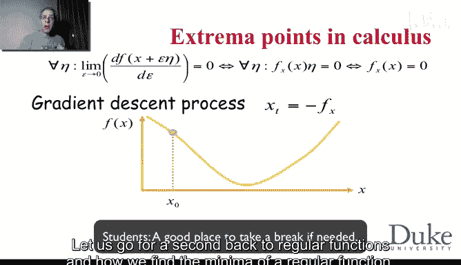
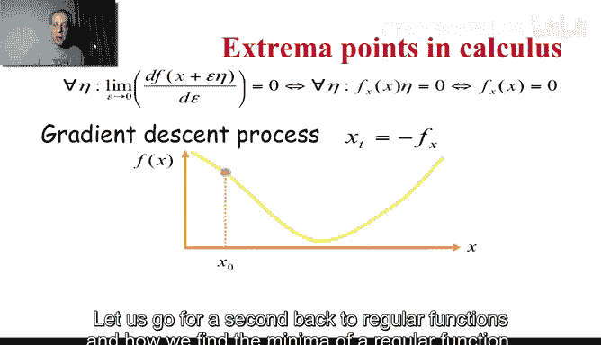
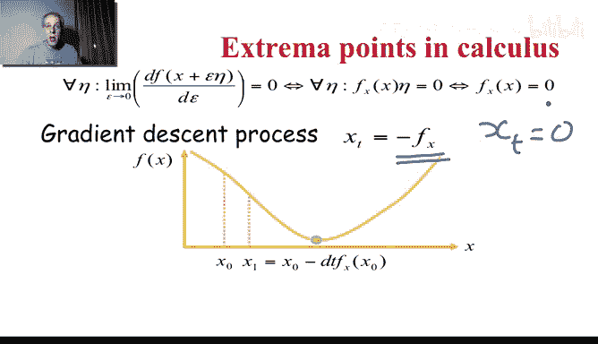
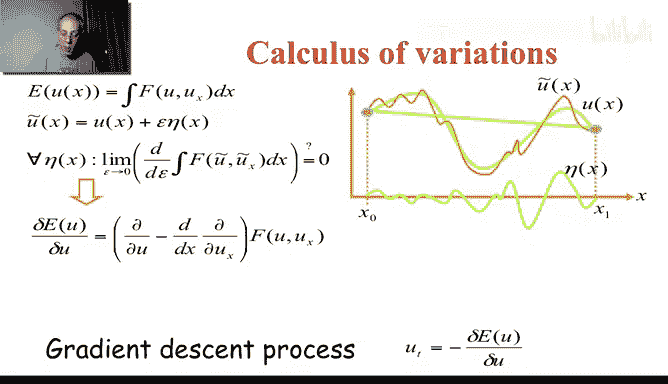
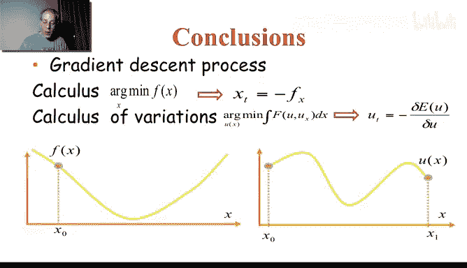
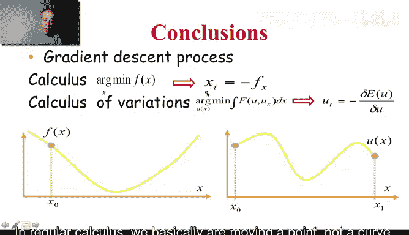
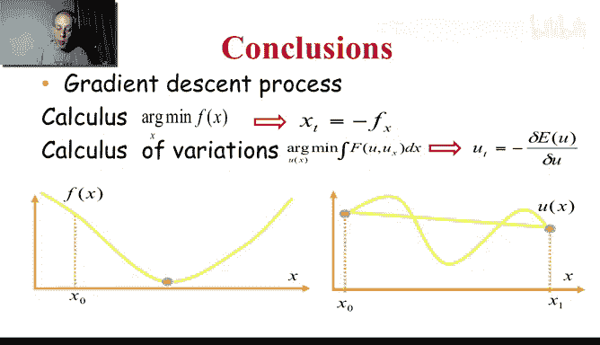

# 杜克大学《图像与视频处理：从火星到好莱坞，途中停靠医院｜Image and Video Processing： From Mars to Hollywood 》 - P56：56_06_06_6-变分法-时长-14-03-可选休息点-06-23.zh_en - GPT中英字幕课程资源 - BV1KYBrBxEsH

Hello and welcome back。 One of the fun things of this week is that we are learning a lot of background material。

 While the background material is important for image processing is important for many other disciplines。

 For example， in the previous video we learn about level sets。

 Le sets are important in image processing to do curve evolution like active contours as we have seen numerous examples last week we saw a few this week and we' are going to see more even in the next coming videos。

 Another topic that is very important in mathematics and is also important in image processing is the calculus of variations。

 and that's why we're gonna to be talking right now in this video， and then in the next video。

 were going to see an example of that for image denoing and image enhancement。

 So what is calculus of variations。The idea is very simple because it's an extension of finding extrea of functions。

 but now we're going to be finding extrea of functional， and what do I mean by that？

We're going to have images like you。And its derivatives。 So this is going to be an image for us。

 and we're going to be looking at minimizing a function of the image。 maybe the image square。

 maybe the gradient of the image， maybe the application of the image。

 So we're going to be trying to find what's the image that minimizes that function in the same way that we try to find what's the point that minimizes a given function。

 for example， if I draw this function， then you say， oh， this is the point that minimizes it。

 but here you is by itself， well we are looking for So we are not looking for a coordinate。

 we're looking for a function that minimizes this。 This is going to be very clear。

 even in the next slide with an example， and we are going to make all the connection of the minimization of functional with the minimization of function。

 Now we're going discuss in a couple of minutes。That a condition for you to be a minimizer of this is to hold this equation which is called the Eulerrangerange equation and this is the type of partial differential equation that we are going to be solving in image processing Let me illustrate a bit more about this and then how we come to this equation which is completely parallel to the minimization of regular functions that we are away from regular staing calculus so let's just illustrate first of all。

 what do I mean by a function let's assume that I'm giving two points and I'm asking you what's the curve connecting these two points has the minimal length so I'm asking you for the function of that curve the minimizer is going to be a function not a point。

The length of any curve， absolutely any curve connecting these two points is basically written here。

 The curve is parameterized as X， U X。 We know about that。

 That's a particular case of a parameterization for basically any curve that goes。

And connects those points。 And the length is。As we know the derivative of the first coordinate square。

 so that's one square， derivative of the second coordinate square。

 so it's this function that we're going to try to optimize we already know what's a function that minimizes the length between two points it's a straight line but let's see how we get that using calculus of variation so I'm trying to find U connecting these two points。

This is the condition for。Function to be a minimizer of this functional。

 So it's an integral over a function of functions。And we haven't arrived it yet。

 but we're going to discuss it in a few slides， but this is what happened。

 So F is square root of1 plus UX square。 So if you just do the numbers and takes you know you take this。

And do the derivative， according to U minus。The derivative that is written here。

 you get this expression， So this expression is nothing else than applying this to F as written here。

Now， this equal to0 is a condition for the particular U we are looking for to solve the problem that we are searching for。

 meaning the minimizer of the length connecting these two points。Now we have this equals 0。

 The denominator doesn't matter。In when we have a over B equals0， one needs to be equals 0 is U。

 So u double derivative equals 0。 That means that the first derivative is constant。

And that means that the function is a X plus B。 That's a straight line。

And A and B are found by what's called the boundary conditions。

 we know that it has to go through these points。 So if I replace here x by x0。

 I have to get this point and if I replace by x1， I have to get this point。

 and in that way I get A and B。 So we see that for length the function that basically solves the Oular branch and that's a necessary condition is a straight line。

 So basically if we take this curve here， it will have certain length。But actually。

 the one that minimizes is not this because this is not a straight line。

 The one that minimizes is this one。So a function to be a minimizer has to hold the O larangerange equation。

 Why is that important and how do we get to the O larangerange equation。

Let us go for a second back to regular functions and how we find the minimum of a regular function。

So you might not remember exactly how we do that， but you do remember the result which is going to explain next。

 the basic idea you have a function and you have to function around a certain point and you do a small perturbation of that function and you take the derivative according to that perturbation and the condition for a point to be a maxima or a minima is that when you do any perturbation。

 the derivative is equal to0。If you compute the derivative according to the permutation。

 you get this and this has to hold for every n so the derivative of the function for every n has to be equal0 which means that this has to be0 and we know that we know that the condition of a point to be an extreme of a function is that it's derivative have to be equal to0 now why is that so important we know that but why is that so important because then I can write this differential equation。

X T， so I can make x change in the direction of minus the derivative and that basically says that you start from a point and your next point because x is changing in time。

 it just you move a bit in the direction of the derivative of the function。

 remember derivative is tangent so you move a bit to the next point。

This is how you move your next point is this point minus a tiny step in the direction of the derivative。

 that's what this equation is telling us because if we were to discretize this equation。

 we get that that。Ex。Which I saw the result there。 We get that x at T plus。Dell the tea。Mus x at T。

Divided by deelta T。That's a dispersization of this。This expression is equal to minus Fx。

 and that's what we have here So we go slowly in the direction of the derivative of x until we get to this point。

 lets just see that again we go one step and then we will go another step and another step until basically we get to the steady state in the steady state we have the x T。

Equals0， nothing is changing anymore。 and therefore， this。Is equal to 0， which is our condition。

 So once again， we know that the condition for a point to be a minima of a function is it has to be the derivative equal to 0。

 So we take a point。I'm going to just show that to you， again。We take a point， and we move it。

In the direction of the derivative and then slowly we're moving it in the direction of the derivative and we're moving it again until it doesn't move anymore when it doesn't move anymore。

 this is equal to 0， which is the condition for it to be a minima。

 so we arrive to a point that this in this case a minima。

 So this concept extends to functional in the same function。

Very simple again。We start from a functional。And then we're going to ask you to be an exer。

 so we do a perturbation。So you is here， the yellow curve。Is basically our original function。 Now。

 we do a perturbation。 Now， the perturbation now is another function because we are not talking about points。

 We are talking about entire functions。 So this is the perturbation。

And then utilda is the sum of my function and the perturbation。

And what I want is when I replace u by u tilde， I replace it by the perturbation and I take the derivative according to the perturbation has to be equal to 0。

 the same way than when I did a point perturbation for functions， I got0。

 if I do a function perturbation here， I have to get0 from this。

 after a few lines of just taking derivatives we get the O larangerange equation。

 So that's how we get basically the O lagrangerange equation。Doing the derivative。

 according to the perturbations that we are using， once you have basically the oil larange equation。

 you can do the same that with it for functions。You can move your function in the direction of the oilrangee equation until steady state when you get to state state you have solved your oil erangee equation so let's just illustrate that here look what happened I want to put that basically I want to do that again。

Okay so you're going to basically move until you get to the steady state when you get to steady state。

 basically we got0， so let us recap what we just saw。

In regular calculus， we basically are moving a point。

Not a curve。 We're moving a point in the direction of minus the derivative。 and basically we get。

The solution， which is the minimum in the case of the calculus of variations。

 we we move the function in the direction of the oil larangerange。

 basically again the derivative for the perturbation， we do that all the way to steady state。Okay。

 let me just do that again。We do it all the way to stay state and at the point of steady state。

 basically this。

Became0， and we have solved the O lagrangee， which is the condition basically forgetting an extrea。

 In this case， a minima。 we can change the size and get a maxima。

 So we are going see in the next video how we can take you to be an image。

 do some interesting function of F and get， for example。Blarring the image or get image denoing。

 So once again， our unknown is the image that basically optimizes this function。

And we get the complete analogy between regular calculus and calculus of variations and as I say for level sets and even more for calculus of variations。

 this type of techniques go way beyond image processing what image processing did and in particular the area of partial differential equations is to borrow this techniques from continuous mathematics into this area。

 Once again， I'm going to show you in the next video and example of a functional that is very useful for image processing。

 I see in the next video Thank you very much。