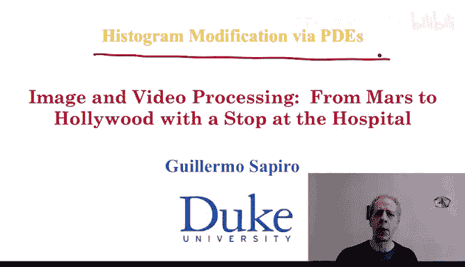
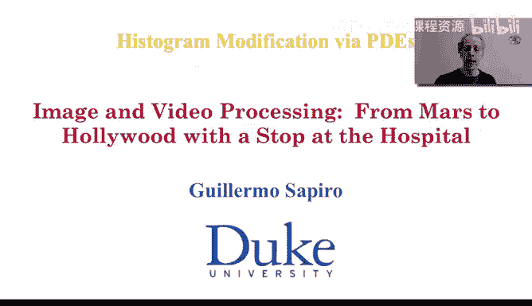
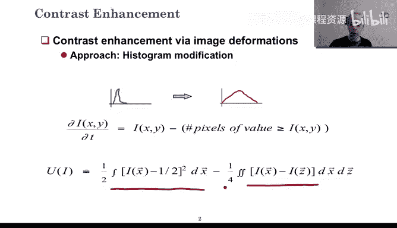
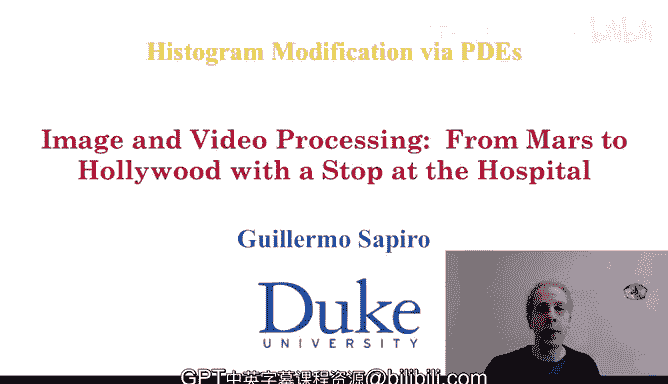

# 图像与视频处理：从火星到好莱坞，途中停靠医院｜P59：59_06_09_9-附加内容：基于偏微分方程的酷炫对比度增强 📈

在本节课中，我们将要学习如何利用偏微分方程和变分公式来实现图像对比度增强。这是一种将我们近期所学概念整合起来的、非常有趣且强大的应用。

## 概述

上一节我们介绍了偏微分方程的基本概念。本节中，我们来看看如何将其应用于图像对比度增强。我们将从简单的直方图均衡化出发，逐步深入到更灵活、更具创造性的变分方法。

## 基于偏微分方程的对比度增强

偏微分方程的核心思想是让图像朝着某个目标“变形”。对于对比度增强，我们的目标是拉伸图像的灰度值分布。

以下是实现这一目标的一个偏微分方程示例。其基本思路是：图像中每个像素值的变化，取决于该像素自身的值减去图像中所有大于该值的像素数量。

**公式描述：**
`∂I/∂t = I(x, y, t) - N( I(x, y, t) > threshold )`

其中，`I(x, y, t)` 是图像在位置 `(x, y)` 和时间 `t` 的像素值，`N(·)` 表示满足条件的像素数量。

当这个方程达到稳态时（即变化率为零），每个像素的最终值将等于图像中所有大于该像素值的像素数量。这正是**直方图均衡化**的数学条件。

## 为何使用偏微分方程？

你可能会问，既然有简单的查找表方法可以实现直方图均衡化，为何还要使用计算更复杂的偏微分方程？原因有以下几点：

以下是几个关键原因：

1.  **教学目的**：它完美展示了偏微分方程如何精确实现我们想要的图像处理目标。
2.  **过程可控**：与查找表方法一步到位不同，偏微分方程允许我们在变形过程中的**任何时刻停止**。如果达到某个中间状态的对比度已经令人满意，或者比完全均衡化效果更好，我们就可以停止迭代。
3.  **灵活性高**：这为创造性处理打开了大门，而查找表方法（从输入到输出的简单映射）则无法做到。

## 基于变分公式的对比度增强

同样，我们也可以通过求解一个变分问题（即最小化某个能量函数）来实现对比度增强。设计变分公式的艺术在于，组合不同的项来实现目标。

以下是一个示例性能量函数 `E(I)`：

**公式描述：**
`E(I) = ∫ [ (I - 0.5)² - λ * (I - μ)² ] dΩ`

其中，`I` 是归一化到 [0, 1] 区间的图像，`μ` 是图像的局部或全局均值，`λ` 是控制对比度强度的参数，`∫ dΩ` 表示在图像区域上积分。

*   **第一项 `(I - 0.5)²`**：鼓励像素值向中间值0.5靠拢，防止图像变得“太奇怪”。
*   **第二项 `-λ * (I - μ)²`**：**注意这里的负号**。它鼓励像素值远离均值 `μ`，从而增强对比度。如果没有这一项，所有像素都会变成同一个常数（例如0.5），毫无对比度可言。

通过调整积分区域 `Ω`（例如只在图像的特定区域计算能量）或参数 `λ`，你可以非常有创意地设计处理效果，实现局部增强或针对特定灰度范围进行增强。

## 效果展示与应用

让我们看一些应用这些方法得到的结果。

以下是两个处理效果的例子：

1.  **人工图像示例**：展示了变分公式如何在增强对比度的同时，完美保持图像中物体的形状。不同区域独立变化，没有发生混淆。
2.  **自然图像示例**：一张非常昏暗的图像经过处理后，色彩变得更加鲜艳生动，视觉效果大幅改善。

这些效果是通过巧妙设置偏微分方程或变分公式中的参数（如积分限、能量项权重）来实现的，展示了这些方法在定制化对比度增强应用方面的强大能力。

## 总结

本节课中，我们一起学习了基于偏微分方程和变分公式的图像对比度增强技术。

*   我们看到了偏微分方程如何通过迭代变形，精确实现直方图均衡化这一经典条件。
*   我们探讨了变分方法如何通过设计能量函数，为我们提供了极高的灵活性，以实现各种创造性的、可定制的对比度增强效果。

希望这个例子能帮助你理解，偏微分方程和变分公式是极其强大的工具，几乎可以实现我们想要的任何图像处理条件，并在对比度增强这一重要应用中大放异彩。

非常感谢，期待在未来的课程中与你再见。