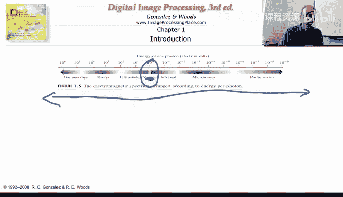
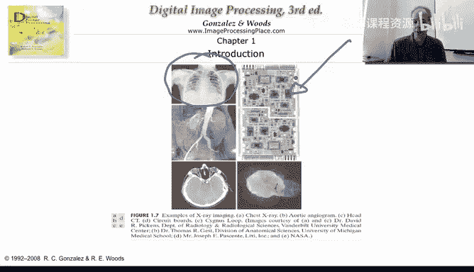
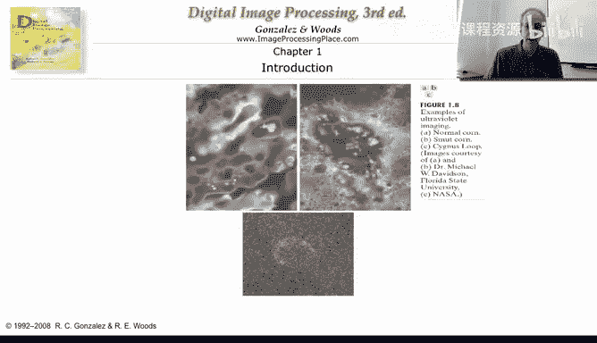
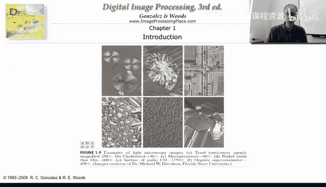
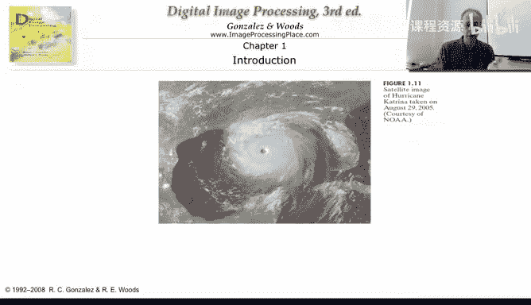
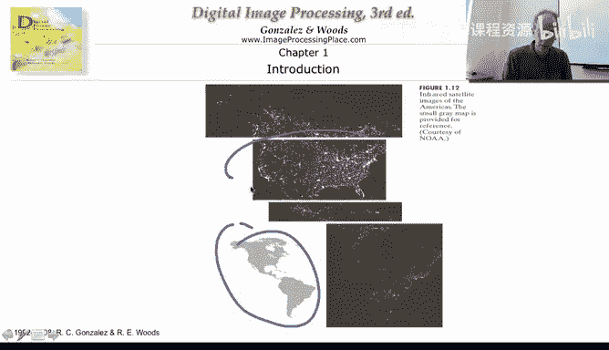
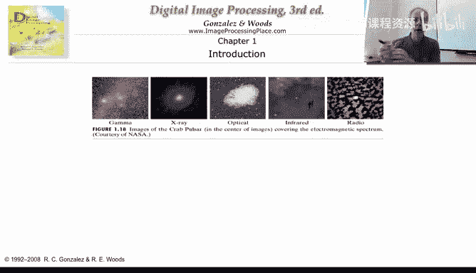
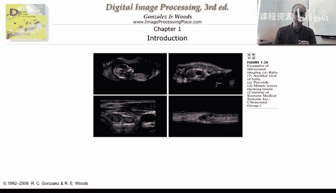
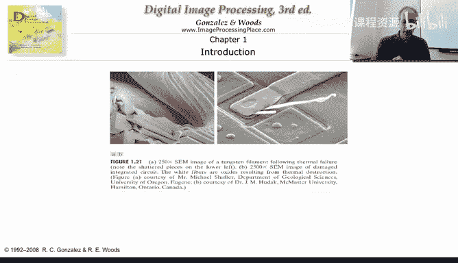
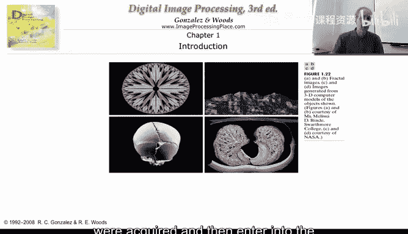

# 杜克大学《图像与视频处理：从火星到好莱坞，途中停靠医院｜Image and Video Processing： From Mars to Hollywood 》 - P5：05_01_05_3-无处不在的图像-时长-06-31.zh_en - GPT中英字幕课程资源 - BV1KYBrBxEsH

Hello， in the first twove years in this class， we saw a lot of examples of images。

If you manage to see behind me， I wrote images are everywhere， images are everywhere。

 and I want to show you a few additional examples just to make clear that almost any area you are interested on or you' are working on。

 images are part of that area。So let's just illustrate something that is important to understand some of the slides that I'm going to be using next and I'm going to use this image that basically is the beautiful image is basically the first picture that was taken by a US spacecraft off the moon so the image was taken from from the spacecraft basically some of the slides that I' going to be using。

 you're going to see that have the cover of the book and basically the title of the book。

 one of the books that we recommend in the website for this class and often also the captions from that figure。

 So a lot of the material a lot of the images or the slides for the first few weeks of the class are taken from this book and then basically this will help you to go in case you have the book or you have access to a library with the book you can go。

And look at the images and the material around it at the book， not only from my video lectures。

So let's just continue with different examples of images。

 One important thing that I want to illustrate is that we are mostly familiar with images that we can see with our naked eye。

 but these are actually a very， very small part。 just this very， very small part of the spectrum。

 Images actually can be captured。In a much， much larger spectrum， as you can see here， really。

 really the images that we take with our cameras are a very。

 very small portion of the whole spectrum。 And let me just give you a few examples of that。

 For example， these are examples from x rays。 and its x ray imaging。 Some of it。

 we are very familiar when we hear about x ray， we normally have this in mind。

 But x rays are also used， for example， as we can see here for the inspection of printed circuits。

 Actually， one of the most successful areas of image processing is in the automatic inspection of basically every。

Printed circuit， every computer， every piece of electronic that gets to our homes。

We can have also ultraviolet imaging。

As we can see here， different examples。We can have also light microscopy imaging。

 This is normally used a lot in for biological images。

 but not only once again we see microscopic imaging use for the inspection of printed circuits。

 So we see here that similar applications actually use imaging in different parts of the spectrum。

These are satellite images， so a modality called landsat that basically take images in different spectral band。

And these are very important for numerous applications as well。Here is an our satellite image。

Same technology， same type of technology， not exactly same technology。

 but same type of technology for a very different application the previous slide was， for example。

 to understand the material in the ground here is basically to track a hurricane。

We have also satellite images of the Americas， and this illustration is just to basically help you locate in the map where are these images from。

 So here we have this region。

And of course， we have the natural images that we are used to see。

 basically images that we can take with our cameras。

 and then we can look at them with our own naked eyes。 And once again。

 those are used for numerous applications coming again， printed circuit applications， inspection。

 for example， of different manufacturing， processing or different kind of applications。 Of course。

 our own images。 This is just， you know， a picture of a dollar bill。

Or a picture of a license of a car， all these taken with the same type of technology。

 but probably for very， very different applications。And once again。

 it's very important to understand that there is not only a large variability in the type of images that we can acquire。

 but sometimes we use multiple modalities to acquire the same。Image and obtain different information。

 The different modalities will give us different information about the same sin。 So we are looking。

 we are observing the same sin， but with different modalities with different cameras to say it in one word。

 and we can obtain different types of information。

This is ultraan another basically spectrum of the type of images that we can acquire。

 and we are normally very familiar with this type of technology and。

Yet another type of images that we can acquire。 And finally。

 the last example I want to give you in this very， very large ensemble and very broad ensemble of images are basically artificial images that are being created in the computer。

 Normally， the image processing that is done for this type of images is very different than the image processing that is done for images that are acquired and then and then。

😊。

Enter into the computer。 We are not going to be talking a lot in this class about basically images that were created in the computer from scratch。

 We are going to be talking about images that basically were acquired and then enter into the computer for some analysis or processing。

 So these are just some examples。 And now what we are going to do next is basically go inside and understand the basic components of images。

 What are pixels and how images are manipulated and we are going to already see some examples of very simple processing in images。

 but still very useful ones。

