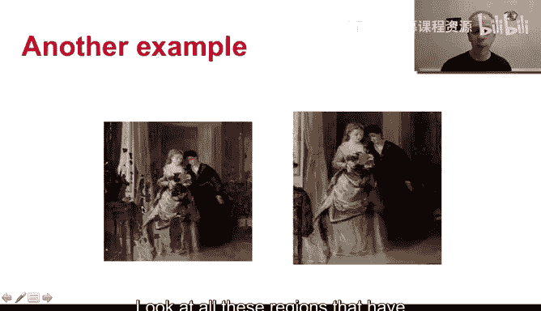
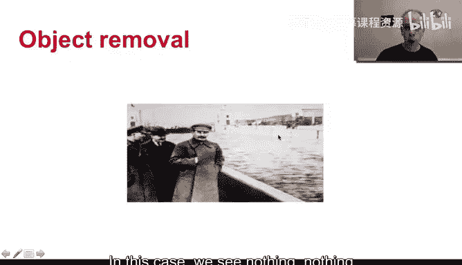

# 杜克大学《图像与视频处理：从火星到好莱坞，途中停靠医院｜Image and Video Processing： From Mars to Hollywood 》 - P60：60_07_01_1-图像修复导论-时长-08-16.zh_en - GPT中英字幕课程资源 - BV1KYBrBxEsH

Hello and welcome back。 This week， we are going to be talking about image and video in painting in contrast with the topics that we described last week。

 where we perform a description of fundamental tools to solving a number of problems like an isotropic diffusion。

 active contours and even image in painting。 This week is about a particular problem。

 It's not about tools for multiple problems It's about solving one particular problem in image and video processing。

 Of course， some of the tools that we are going to be using for this might be used for other techniques。

 and we often learn from the solutions of a problem towards another problem。

 but it's a very important difference between providing fundamental tools for solving multiple problems and solving one particular problem。

 So what is image and video painting。 And let's start with image in painting。😊。

Imageaging painting is basically the art of changing an image in a non-detectable form。

 So here we see a painting that has a lot of degradation and here is the restoration of that painting This was。

 of course done by professionals manually it's a painting is not a picture was not done in the computer although the computer can help as well as we're gonna to see later on when you go and see this picture in the museum。

 you believe it's the original picture。 some experts actually might be able to notice the difference and be able to see the regions that we're actually in painted or fill with information from different regions But the basic idea is that in in painting we show you an image or a video and we make you believe that's the original one In this case is to solve thes in painting is sometimes also called fill in because were。

filling in the regions of problems， the regions of deterioration with information from the surrounding。

 and we're going to see that sometimes we' filling with information from the near areas。

 sometimes with information from far away areas from the whole image。

 there's even techniques that do image imp painting using database of images where you look for similar things。

So this is one example of what imaging painting needs to be done。

 remember is modifying an image in a non detecttectable form。And when we say non detectectable。

 we say at least by the nonext， here is an error example， a lot has been done to this image。

 basically to transform it into this one。 Of course it has been impa。

 you see these regions have been filled in， but also there were color corrections and error things。

 but this illustrates yet an error example of image painting。

 Look at all these regions that have missing information and there were basically restored im painted filled in with nice information that looks like natural in the surrounding regions of the image。

Of course， it's natural to extend this to regular photography in particular when we were talking about pictures。

 not digital pictures， but analog pictures and here we see examples。

 some of the examples like here have a few additional restoration techniques but we see these for example。

 the picture was turned into two pieces then was put together and to repair that you basically see that it was impa。

 a region of missing information or and ceable information was filled with other types of information we see here the same there is a scratch now this scratch is gone and here there is a similar example like this。

 Basically the picture was folded and when you unfolded you see this kind of scratch in the middle and then here is gone so these are all examples of image in painting to restore basically。

😊，Image to a muchr looking image。Of course， this is an example that we saw in the first week where image painting is done with a completely different target in this case。

 and this illustrates the idea of modifying an image in an undetectable form in this case we seen nothing nothing wrong with this image that we know if we remember from the first week of class that basically。

This was the original image。 So what was in painting now is the object that the user wants to remove from the image。

 So basically this region becomes the region of missing information that we're gonna im paint in and we need to recover the water and we need to recover the column。

 So we need to recover texture。 we need to recover structure straight lines and water that is basically non-train lines。

 So very different types of information need to be。

Fill in in painted in order to solve this problem of removing objects。

And we discussed in the first week， this is used all the times in the movie industry。

 I show you a few examples of objects that need to be removed in the movie industry。

Here is yet another example from this era where basically we see here a picture of Lein and a picture and next to him。

 thetrosky。 and here， basically Trotsky has been removed from the picture。

 So once again an object has been removed from the picture。 and yeah。

 you can have multiple examples of this， for example。

 in this website or in the website that was linked in the previous slide。 So again。

 in painting in order to remove objects。That from the image or from the video。

 I want to explain something that in painting in its basic form cannot do。

 I don't wantna you have the wrong understanding that in painting is an extremely smart technique that can fill in with whatever you want。

 So let me use this example to illustrate that。Here， this person was removed。

And then it was in painting。 So when you look at this image。

 it holds everything that in painting is about。Modifying the image in an undetectable form。

 But look what happened here when the person was removed， two chairs were brought in。

This is done by an expert， is not done by the computer。

 There is no way for the computer to understand that what you want here are chairs。Maybe in a very。

 very advanced technique， when you basically provide a lot of side information。

 you could in the computer with programs like Photoshop。Catch chairs from here and put them here。

 And this is the kind of stuff that was done here。 So it's a cat and paste。

 and we're gonna to see how to do that。 but basically in painting does not have that highle knowledge of what needs to be there。

 The computer and the user can interact to basically bring that into the scene as we're gonna see later on。

 but if you don't interact， if you just say do something with this region。

 the computer does not know what is that you want why is that you want chairs there and not。

 for example， green， not for example， some of the background。 but with interaction with the user。

 we might be able to do this kind of a cat and paste。

 So this is about image in painting in the next video。

 I'm going to show you that we are actually familiar in nature with image and video painting and that's actually very interesting。

See you in the next video， Thank you very much。