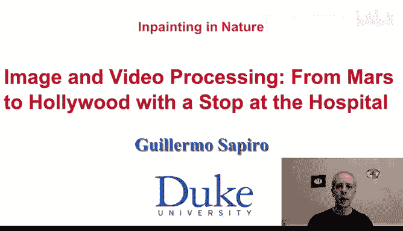
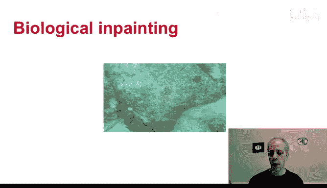
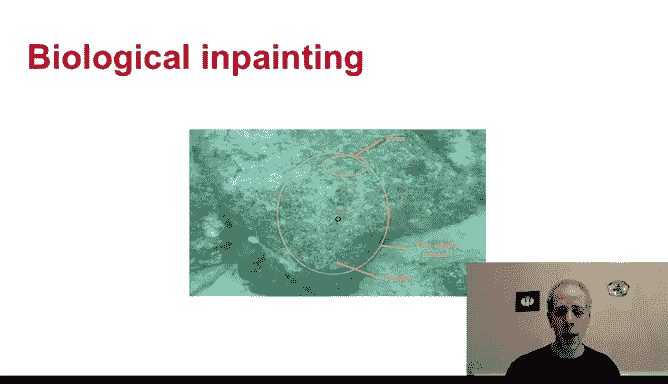

# 图像与视频处理：P61：自然界中的修复现象

在本节课中，我们将要学习图像修复（Inpainting）这一概念，并探索其在自然界中的有趣体现。我们将看到，修复不仅是计算机视觉中的一项技术，也是自然界中生物生存的一种策略。

## 自然界中的修复现象

上一节我们介绍了图像修复的基本概念，本节中我们来看看修复现象在自然界中的具体表现。

我们实际上在自然界中经常能观察到修复现象。以下是一些例子。

你在这里看到了什么？你很可能只看到了一块岩石。但实际上，这块岩石里隐藏着别的东西。让我来为你揭示。有一条鱼正隐藏在这块岩石中。你可能已经看到了，我希望如此，但我还是来帮你指出来。你可以在这里看到眼睛，在这里看到尾巴。整条鱼都在这里。这非常神奇，不是吗？这就是伪装，但这也是一种修复。这条鱼“修复”了自身，以达到伪装的目的。这本质上是一种自然界中的物体移除。非常神奇。

章鱼等生物也有类似的能力。我将再举一个例子，展示这种鱼的神奇之处。这张图片质量不高，但足以说明问题。

在拉马钱德兰及其合作者进行的一项实验中，他们将一条鱼放入一个带有圆点图案的鱼缸中。这个图案就像一张带有圆点的纸。有趣的是，如果你观察这里，这条鱼转过身，在自己的身体上“创造”出了两个圆点。我再次为这张从论文中扫描出来的、质量相对较低的图片表示歉意。将图片导入电脑的过程比较漫长。同时，鱼还会转身，将自己的眼睛对准其中一个圆点。本质上，这条鱼正试图“修复”自己，试图伪装自己，从而不被捕食者发现。

因此，我们在自然界中看到了修复现象，例如在鱼、章鱼和其他生物身上。

## 人类视觉系统中的修复

我们人类实际上也在无时无刻地进行着修复。当你看这个视频时，你就在进行修复。这是为什么呢？当我们回想起关于人眼的知识时，我们知道在视网膜的后部，有一个区域没有任何传感器。没有视锥细胞，也没有视杆细胞。这个区域是传感器将信号传回大脑的通道所在，因此实际上没有感光细胞。那么，如果没有传感器，会发生什么？我们应该在视觉世界中看到一个洞。也就是说，当你看这个视频时，应该会有一个信息缺失的区域。但人类的视觉系统通过各种技术，一直在填充这个区域。

实际上，你可以做一些练习来体验这一点。我从这里提供的网站上获取了这些图片。基本想法是，如果你设法凝视一个点，例如站在离屏幕一米远的地方，集中注意力凝视这个点，过一会儿，你会发现太阳消失了。你正在强迫你的视觉系统不去修复那个没有感光细胞的区域。如果你不这样做，不凝视那个点，你就能毫无问题地看到太阳。这个练习就是试图阻止视觉系统进行修复。

这里还有一个练习。你可以凝视这里。你可能现在就能尝试，或者等我们看完这个视频后，你可以暂停在这里，然后调整你与屏幕的距离，凝视这里，集中注意力。你可能会看到，例如，班加尔的耳朵消失了，或者太阳消失了。你正在强迫视觉系统不去修复。否则，我们一直在进行修复，所以我们观察场景时看不到这些“洞”。

这些例子表明，当我们观看一个常规场景（本质上就是进入我们眼睛的视频）时，实际上也在进行图像和视频修复。自然界中充满了这样的例子。

## 总结

本节课中我们一起学习了图像修复在自然界和人类自身视觉系统中的体现。我们看到，修复不仅是计算机处理图像缺失部分的技术，也是生物用于伪装和视觉感知的基本机制。自然界中的生物，如鱼类和章鱼，利用修复原理进行伪装。同时，人类视觉系统也在持续工作，填充我们视网膜上的盲点，确保我们看到连贯的世界。

现在，我们已经准备好了解计算机是如何进行图像修复的了。我们将在下一个视频中探讨这个问题。