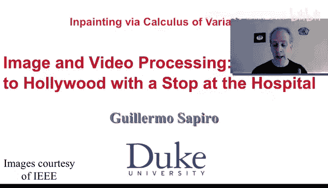
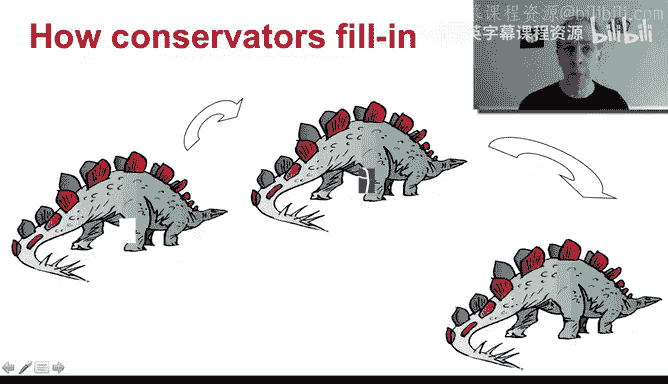
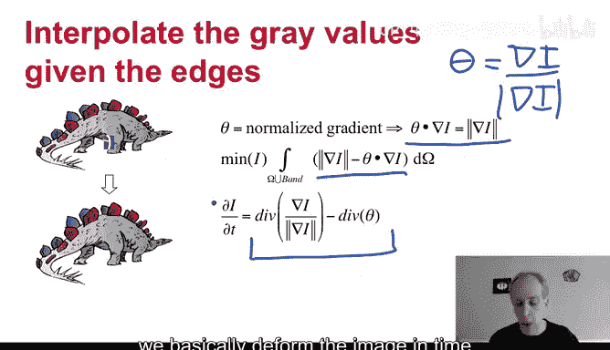
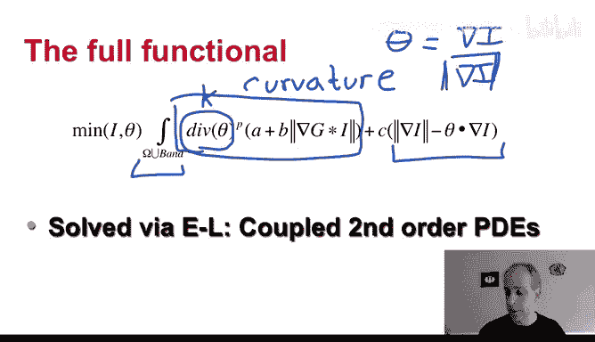
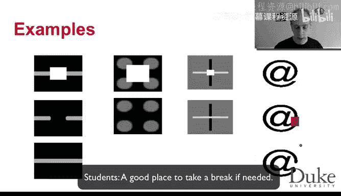
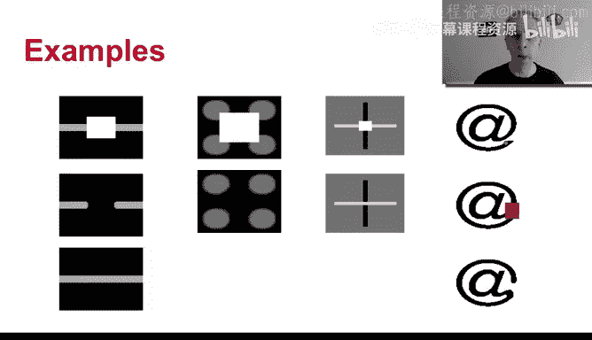

# 杜克大学《图像与视频处理：从火星到好莱坞，途中停靠医院｜Image and Video Processing： From Mars to Hollywood 》 - P63：63_07_04_4-基于变分法的修复-时长-15-32-可选休息点-10-06.zh_en - GPT中英字幕课程资源 - BV1KYBrBxEsH

Hello and welcome back。 In this video。 What we're going to do is we're going to show a different technique of imaging painting that is based on calculus of variations。

 instead of starting with a partials differential equation from the very beginning。

 we're going to start with an energy formulation that through the oil branch is going to be transformed into a differential equation。

 Now， were going to keep the same concepts that we learned before。😊。

If we have a region of missing information。We're going to try to kind of model the continuation of the edges as we represent here and then filling the color。

 We might do both of them at the same time as were going to see in a second。

 But we want to keep that important concept of continuing edges and then letting the color flow in。

 as we say， as water， actually， why do I say as water。

 because some of these equations are very related to the same type of mathematical equations that model the motion of fluids and gases in nature。

 So this analogy of letting the pixel values flowing like water is not an artificial analogy because it's the same type of equations what were doing here are transport equations。

 So we are going to basically derive a variational formulation that does this type of process。

Now let us start by assuming that somebody came and already told us the boundaries。

 somebody basically say hey， I don't know really what's happening there。

 but here are the boundaries I'm going to extend them for you and basically it has given us the normalized gradient at every single pixel inside the region that we need to in paint。

 remember the normalized gradient we basically say that theta is the gradient。dived。By its market。

Now， we have to be a bit careful when the magnitude to is0。 Basically， there is no gradient。

 So we basically leave that aside for the second。 So this is what we were giving。

 Some gave us basically， the gradient。And if you plug that in here。

 you get gradient square divided by gradient， which is equal to gradient。

 and the goal now is to find an image inside the region to be painted that is consistent with this gradient。

And we do that in a variational formulation。 we basically are going to optimize for the image。

In such a way that is consistent with the gradient that we were giving。

 that consistency is exactly what we have here， when the image。Holds this。

This this becomes zero and then what's inside here is as small as possible。 Once again。

 the basic idea is you find an image then when you take its gradient and you normalize it you get what was given to you So you look for consistency and the integral is inside the region to be painted and a small band around it were basically we take the information to propagate in and in that band we have the real image not just the given gradients。

 the real image and that's why as I say before， you basically optimize in the region and in the region to be painted and a small band around it So this is your equation you're looking for consistency of the image with basically the gradients that you were given the O branch of this is what we have。

Here， that's the O branch of this equation。 And as we have seen many times。

 we basically the form the image in time， according to the Ola branch。

 and then we go to steady state。

And we get to state state， we basically got that the divergence remember div is for divergence of this vector。

 we get basically the divergence of the normalized image is equal to the divergence of the gradients。

 the normalized gradients that we were giving and then we got an image that is consistent with the information that we were giving that's exactly what we wanted Now if we do that for example。

 for this image。We basically remove the eye。 There's no eye here。 We block it。

 but remember somebody gave us the gradients the normalized gradients。

 which is equivalent to give us basically the Hs。 and then we can recover the gray values are not exactly as we wanted。

 we are going to repair that very soon， but you can observe the basic geometry here。

 and that's because somebody gave us theta。 somebody gave us the normalized gradients。

 That's a first step。 Now we need to basically get those normalized gradients because in real scenario we don't have nothing in there。

 and here is the complete equation。 So。Here is what we have before， we had before。

 somebody gave us theta。 We basically recover an image that is consistent with theta。

 This is this term。What this term is doing。Is exactly helping us to propagate the gradients inside the region to be painted I'm going to explain that more in just one second again the integral is as before in the same region and A B and C are just some parameters that control basically the weight between these two terms and we are minimizing not only over theta。

Not sorry， not only over I as within the previous life we also normalized over theta if we had theta。

 this is all we need， but here is we're building the edges and the image consistent with the edges at the same time。

here is the consistency and here is building the edges and here what we have is a smooth continuation of edges as we saw as we learn from professional resttorators。

 Let us look at this term for a second。If theta is the normalized gradient。As we write it here。

What is the divergence。Of this。We saw that in the previous week。

What's the divergence of the normalized gradient？Let's think， for a second。That's the curvature。

This term。Is。Carfeture。Of what of the level lines of my image， which are kind of ages。

 so we are saying。Proroppaate the edges inside in such a way that the curvature doesn't go crazy。

 if the curvature basically goes crazy， then we're gonna to be paying a lot of penalty for that。

 piece a parameter that says， how much penalty do we want to pay for that。 So basically。

 we're doing a smooth propagation of ages In such a way that the curvature is relatively mild inside。

 And at the same time， we are recovering an image that is consistent with those ages that we are propagating。

 This term is to make everything even smoother and more regular。

 And so say has a mathematical justification with this term， this complete formulation。

 you can prove a lot of beautiful math for it。 And without the term。

 the things become a bit more difficult and are what is called ill pose。

 they are not very well defined。 So it's a technical term that we are。

To make this equation actually look okay。Now， how do we solve this。Oularrange equations。

 but now we have two unknowns， theta and the image it's exactly the same。

 You compute the Olage like I is constant， you compute the Oularrange for theta that gives you one equation and then you keep theta constant and you compute the Oularrangee for I that gives you the second equation。

 So instead of one equation as we have before when we knew theta you get two equations one that is evolving I the other that is evolving theta and you're solving both of them at the same time。

 So it's like fixing one for a short time， solving for the other fixing the other solving for one of them。

 and then you iterate and you get this couple partial differential equation on both I and theta。

 but this is very elegant because we can think about what we want and we assign a variational formulation that。

😊，chihiefs that for us we want the image to be consistent with the edges。

 we design that we want the edges to continue smoothly， we know smoothness is curvature。

 we design for that we put that into an energy that penalizes for not achieving what we want and then we compute the oil branchrange and we solve that equation let us see some examples。

Again， we start by artificial examples。

So we block this line。So basically， this is what we get。

By blocking it and by running this equation with smoothly contient a very nice continuation。

Similar examples as we had before， we block this and we get a smooth and nice continuation of this。

We do the same here， we block this cross and we get a smooth continuation now you may ask why did we get a smooth continuation of the bright and not the dark？

Now this is a deterministic algorithm when you implement it basically it chose one over the other。

 there is no way for the algorithm to know which one is the one that you might want here we have the famous@ symbol we block it and look。

😡，We get not the a symbol， we get this Now this is the samples like the chair I showed at the very beginning of this week。

😡，The computer doesn't know the a symbol。 The computer is just looking for the minimal energy to complete Now the completion。

 the feeling， the painting is beautiful， is perfectly fine。 It's not the a symbol we started。

 but remember， imaging painting is trying to give you back something that looks okay。

 And there' is no way for the computer to know that what you wanted is to get back the a symbol。

 not in this fashion So you get a perfectly fine。 actually。

 this has lower energy According to the energy that we just defined that the a symbol。

 And that's why you went into that one。 So perfectly fine。

 but without this higher level information of the a symbol which cannot be achieved with this type of local algorithms for in painting。

😊，It works nice for artificial examples， let's see if it works for real ones。

Here， there is a nice picture of。G to Mars， and then we have regions that we want to im paint here。

 we kind of see an evolution and this is the result and ice recover along of filling in along those regions。

And our examples we have seen before， we have letters and we get the letters removed。

So the basic image pixels are flowing in by solving this variational formulation。Now。

 those are simple examples， and I want to conclude these examples with going back to the very beginning when I say we are in painting structure and colors。

 What about kind of the noise， the granularity of the image。

 This is one way of doing that and even going beyond that。So you start from an image。

And these are the regions that we want to imped。You first take this image and decompose in two parts。

One， and I'm going to say in a second how we do that。 Let me just explain the diagram first。

One is like peacefulway smooth， it has no granularity， no texture at all。😡。

And the other is where all the texture has gone。Now you imat the structure part with the techniques I just mentioned to you。

 you basically continue the boundaries and continue these flat colors inside and you get a very beautiful continuation。

The texture， the granularity， you use a technique that is designed to im paint granularity。

 We're going to explain that technique actually in the next video。 So you see， for example。

 how here the texture has been very nicely continue here and then you go and add those to again。

 and you get a cr reconstruction that has the structure continue as the colors continue has also the texture and the granularity continue。

 Here's the structure and the colors Here is the texture。How do we do this decomposition？

 There are a few techniques out there that follow something developed by Ismaer just to give one example and we get this decomposition into something which is pieceway smooth so has not a lot of oscillations and variations and something that has all the oscillations and variations。

 you im paint here with the techniques that I just show to you either the partial differential equations based one or the variational one。

 for example， you in paint the texture here， the granularity with something we're going to discuss next。

 which is kind of a cut and paste type of technique and then you add them back and you get the beautiful reconstruction and you get everything in one image So in the next video I'm going to talk a bit more about this type of cut and paste technique。

 you actually already know it and I'm going remind you what it is in。

Next video I'm looking forward to that。 Thank you very much。😊。

