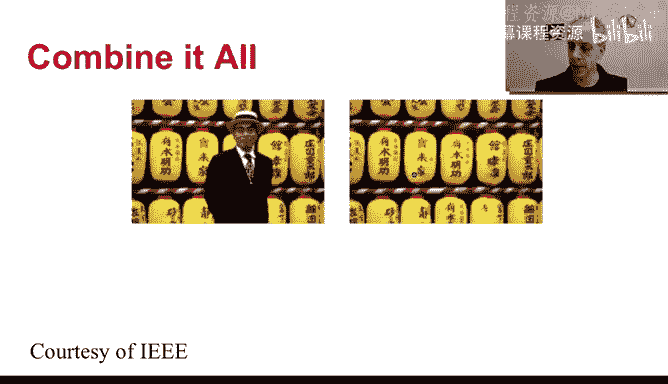
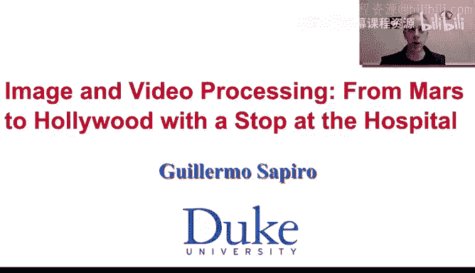

# 杜克大学《图像与视频处理：从火星到好莱坞，途中停靠医院｜Image and Video Processing： From Mars to Hollywood 》 - P64：64_07_05_5-智能剪切与粘贴-时长-07-51.zh_en - GPT中英字幕课程资源 - BV1KYBrBxEsH

Hello and welcome back。 Let us now introduce a different concept into imaging painting。 Basically。

 we're going to do a smart Can paste。 We're going to first introduce the concept and then see how we obtain excellent resultss by merging that with the type of variational formulations that we just talk about in the previous videos。

So why do we need another type of in painting， There is a number of reasons。

 But one of them is in the example that we showed in the previous video。 We discussed the fact that。

PDs and variation formulations are excellent tools for in painting smooth regions。

 They're not as good for im paintinging texture as we see here that we need to basically extend this nice texture inside the region to be painted。

 And that's where this other type of techniques become extremely powerful。

 Let me blow this region so we can explain what's going on。

We need now to im paint inside here and we see that there are patterns that we want to extend。

 we could actually write partial differential equations， that extend that flow towards this region。

 but it would be much harder to write a partial differential equation that extends this type of texture that goes in multiple directions。

But we have another technique。 Remember， we talk about non local means for image dennoicing。

 We are going to exploit the same type of approach。 but now for imaging painting。

 Here is the basic idea。Let us assume that we take。AAboutge here。This patch is very particular。

 it contains some known information and some unknown information Now in the same way as the nonlocal means I can go around and looking for similar patches。

 but in this case I do the comparison only in the region of known pixels。

 so for example I basically take a patch of the same size as here， but I only look at this region。

And I say， is this region similar to this region。And I keep going around。 For example。

 I might take a page here。And once again， I look only at this region。

 so I basically translate the non region towards thatt patch and I keep going and I find one or more patches thatt in the non region theyre basically equal or very similar let us assume that I find one for example I find it here and withdraw draw the region and we say。

 okay this is very similar to this here， So how can I feel this region I basically copy this。

The unknown becomes the known part of the matching patch。I can copy the whole region。

 I can copy only a few border pixels， and I can copy only from one patch。

 or I can find a number of patches that are similar and copy their average or any other type of function。

 but the concept is the same concept as in nonlocal means， find similar patches。

 but now similarities based only on the non region once you find the similar patches。

Copy the unknown region towards here When we do that we finish and we know here and we can keep propagating this now becomes known because I just fill that in and then we can keep going inside and keep going inside and keep going inside so a basic idea is that we look at every unknown pixel。

We start from pixels that have a lot of known areas surrounding it， we fill them。

 and then we keep going with the other and the other pixels until we finish basically filling in everything and let me go back to the previous slide and we basically see。

That we feel nicely the， we also feel nicely the here。

 and we actually have feel the in a very nice fashion all around。

 just by the same concept as the non localal means。

Now that we can actually combine with variational formulations what I just told you we can write in a variational formulation。

 but we can keep adding additional constraints， for example we could say okay if this patch found a friend here meaning a patch that is very similar to it。

 I want to make sure that the patch next to it let me just use a different pen I want to make sure that the punch next to it finds a similar。

A patch， a similar patch next to the previous one。 So that will help me。In the search。

 it will make it faster， but it will also force that this region is smoothly copied here and that can be posed in a variational formulation by。

 for example， asking that the translation vectors so this patch got translated from here。

 this patch got translated from here， we have two translation vectors we can force the translation vectors to change smoothly and that is a variational formulation for example。

 we can take the derivatives of the coordinates of the translation vectors and penalize when those derivatives are too high。

 that means that basically you're jumping all around to get those new patches all these concepts can be incorporated into one variational formulation can become very rich。

 we can incorporate the PDds type or the variational formulation。

T of smooth continuation that we saw in the previous videos。

 we can incorporate this smart cut and paste all in one large variational formulation。

And then you obtain very nice results， as we see here。

 we basically have an object that has been removed。As we see here。

 by this combination of variational formulations with smart cut and paste。

Here is another example and we are going to see this example again in the next video as I'm going to explain soon。

 again here， remember this image looks perfect， that's the goal of in painting。

 but we basically have removed this lamp from this image and got a very， very nice result。

Here is yet hour example where we basically remove the bars and we get a nice result by this combination of cut paste in a variational formulation。

By now， we have basically seen two types of or three types of concepts。

 PDs and variational formulations。 that's almost one group because the standard variational formulation leads to PDs and then we saw this smart cut and paste and we saw how we can combine them all together to get very。

 very nice imaging painting results。 before I show you some video in painting concepts。

 I want a demo in painting in real time。 and I'm going to do that in the next video Looking forward to seeing you again then thank you。

😊。

