# 杜克大学《图像与视频处理：从火星到好莱坞，途中停靠医院｜Image and Video Processing： From Mars to Hollywood 》 - P68：68_08_02_2-稀疏建模导论-第二部分-时长-18-16.zh_en - GPT中英字幕课程资源 - BV1KYBrBxEsH

We're going to use a very simple diagram to demonstrate and to present the model。Again。

 we are on the search for a model for a signal X that has n dimensions。 What is N， for example。

 if we consider 8 by 8 blocks。As in JP， we have that n is equal to 64。 Y 64。

 We take an 8 by 8 block or image patch， and we take one row after another。 We concatenate them。

 and we get n equal 64。 This is a signal We are looking to model。

Now the next step and actually one of the main components of sparse modeling is the dictionary。

 The dictionary is a matrix which is n by K n is the dimension of the signal we are looking to model K is the size of the dictionary。

 we have k columns， Every column is called an atom， is kind of an image。

 kind of a patch because every column is 64 dimensional and we have K such columns。

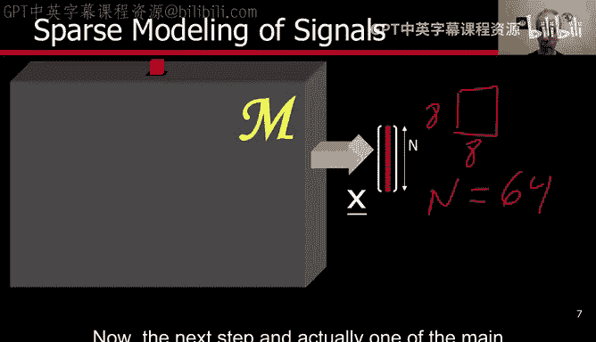

Very often k is larger than n。 That's not necessary， but happens very often， for example。

 when we are going to do imagelynoicing as we're using as an example， if k is larger than n。

 then we say that the dictionary is overcomp。 Now， if K equal to n， then the dictionaries complete。

 for example， for a or discrete cosine transform are complete dictionaries， if k is less than n。

 we say that the dictionary is under complete。Now we have the dictionary。

 the second element of sparse modeling is this vector alpha。

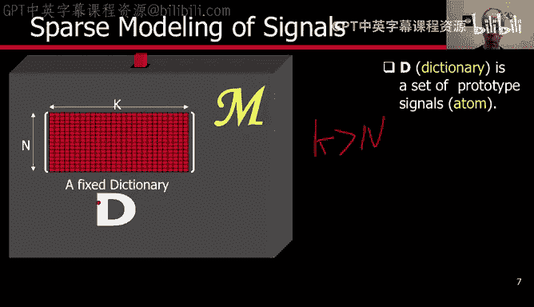

And what we have is a vector alpha that has to have dimensions K， and we multiply the matrix D。

 the dictionary by the vector alpha， and we produce the signal that we are trying to model。

What's particular of this vector alpha is the number of non0ro entries of the vector is very small。

 will represent those by this red dots。 we have at most L non-zero entries and when we multiply this matrix。

 the dictionary D by alpha what we are doing is having a linear combination of the atoms。

 corresponding to the non-zero entries， So we are combining this is the second one。

 it means it picking the second atom， this is speaking its corresponding atom and this is speaking its corresponding atom and we basically have a linear combination according to the coefficients here of those L atoms and because these are only a few nonzero coefficients these vectors very spars and from that the concept of spars。

Modeling， so what we have is basically a signal。Represented as a product。Of the dictionary。

 an vector alpha with only a few non0ro entries， a various parse vector。Now。

 this model is first of all， very， very simple once we have the dictionary D。And alpha。

 we obtain the signal just by a simple product。This dictionary。

 we're going to discuss a lot about it in this video， in the future videos。

 but for now it's a fixed dictionary of dimensions n by K， as we have seen in the previous slide。Now。

 the model is extremely rich。Let's just do some numbers if we have a dictionary of size K。

 meaning K atoms， and we pick L。We have L choose out of k possibilities。 so if L is3。

 we can pick any three out of k。 once we pick them。 each one of those selections defined a subspace。

 a very lowdial subspace。 once we pick we do that selection。

 the signal is just a linear combination of the corresponding atoms and that's a linear subspace。

 but we have many of them we have L out of k a lot of them。 So the model is extremely extremely rich。

 and hopefully that will help us to represent basically any signal of interest。

 So the model is simple。 the model is very rich。

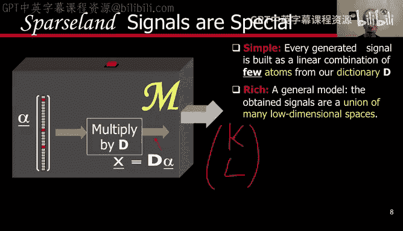

And also the model is actually familiar to us， this is not the first hand that we see such a model of taking basically a signal and representing it as a linear combination of a dictionary with only a few atoms of that dictionary。

Let's think for a minute or for a few seconds。 When have we seen already this model。

 we remember what we have learned in the last few weeks。We have seen this model。In Japan。

When or how in JP。D。I's basically the cosine basis in JPEC， we took an8 by8 block。

 We did a transform into the cosine domain， So this is the cosine basis。

 and alpha its basically the coefficients of the cosine transform and we saw that for example。

 when we quantized。 a lot of the discrete cosine transform coefficients became0。

 so basically alpha was 64 dimensional but a lot of it was0， so it was a very， very sparse vector。

 and it achieved an extremely good representation of the8 by8 parts。With just a few coefficient。

 So Jpeg is a great example of the power of sparssity。

Let me just give you another extreme example of how we can represent signals in a very sparse fashion。

Consider that D includes all the signals of interest。 So if you're talking about images。

 these have huge。Matrix K basically goes over all the possible images。If that happens。

 then every time you want to represent a signal， X， an image。

 you only go and pick the corresponding atom， the corresponding column in D。

 and that means that our sparsity is1。So this extreme example is only to illustrate that we can do sparse representations of signals。

 of course it's not very practical because imagine that you cannot put all the patches or all the images in one dictionary that would be huge and it won't be very useful。

 that JPEC is as we say， probably the most successful image processing algorithm and is's based on sparse representations。

So that's what we want。 We want a sparse representation of sickiness。

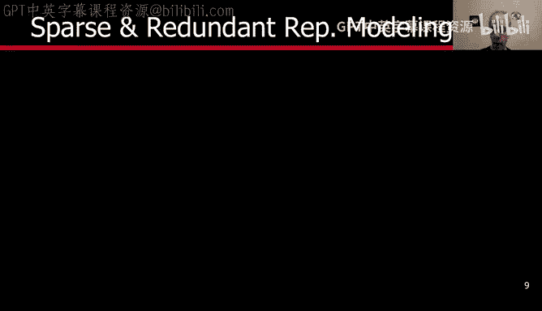

And the basic idea once again is that the signal is a linear combination of a few atoms because alpha is sparse。

 How do we measure sparsity is the next question。

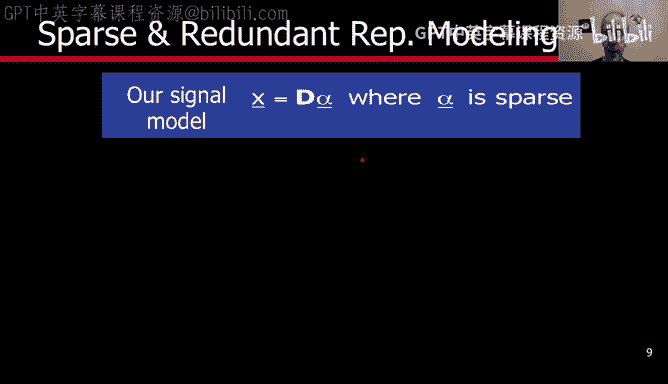

The way we are gonna to measure sparsity is with。This， which is called the LP norm for a given P。

 Remember， alpha is nothing else an adial vector。 And what we are doing here with this formula is that we take every entry of alpha and we take the absolute value and we elevate to the P power and we add all of them。

 and that's the LP norm of the vector let's illustrate this for different values of P。

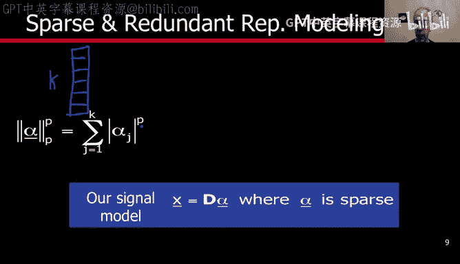

If p is equal to2， we don't really get what we want because what we want is to penalize。

With an equal amount， every time one of the entries of alpha is known 0。And when its 0。

 don't penalize at all。 So that happens。0， no penalization。

 But then the penalization increases quadraically with actually the magnitude of the entry。

 We don't wonder we want kind of an equal penalization。 As long as it's known0， it gets penalized。

 What happens when P is equal to one。At least the penalization now is proportional。

Directly proportional and linearly proportional to the magnitude of the entry。 It's not quadratic。

 That's better。 but it doesn't look like it's good。

 We are going to see later on that this is actually a very good penalty function。 is L1 L4 p equal1。

 It doesn't look like， but we are going to see that under certain conditions。

 this is exactly what we are looking for。 But before we get into that。

 let's keep looking for the ideal case。 If now P becomes less than1。

 then we start to have what we really one。 a penalty of 0， If the coefficient is 0。

 and then the penalty starts to flatten out， meaning。As long as the coefficient is non0。

 we get the same penalty。 If we further decrease P less than1 and getting close to0。

 we get exactly what we want。0ero penalty and equal penalty for everybody that is known0。

 So the way we are going to measure parrssity is with this function。For p equal0。

 and that's often written as in this fashion with a0 here and a0 there。

 this is what's called the L0 pseudoor。 It's not really a norm。

 and that's what's called the pseudoorm， although very often is called also the norm with the understanding that is not exactly a norm。

 and this is how we are going to measure sparssity。

 We are going to count the number of non0ro elements in the vector alpha。

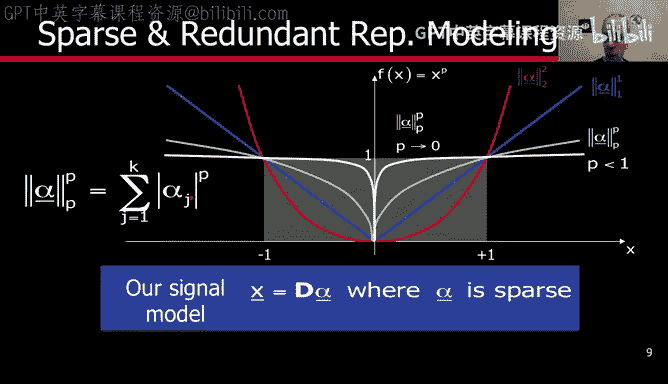

So this is what we basically have here。A signal represented as a linear combination of atoms from D。

 but we are not allowed to pick more than L of those atoms。So back to our problem of image denoicing。

 the maximum a posterior estimation of image denoicing。

 what we have is that we want to represent our signal。

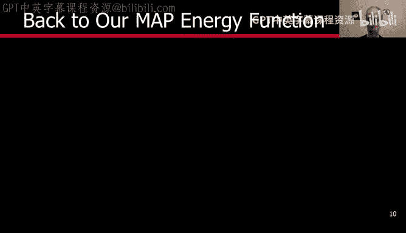

Very closely， this is the measurement and this is what we want to pick。

 we want to have a close representation， meaning very close x have to be as close as possible to y as long as it belongs to the right model and then we replace x by the alpha because we know that now we are going to be represented in the signal as the dictionary multiply by alpha。

 but not every alpha we basically must have that no more than L entries in alpha are non0。

To give back。Illusstrative representation。 And， of course， we get back。

The signal by the alpha where alpha is the optimal。

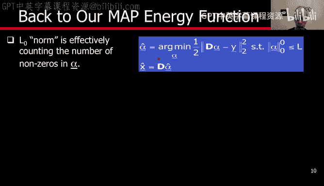

In a very， in a very simple pictorial representation， what we have is the alpha。 This is the。

Has dimensions N by K。This is alpha that has dimensions K which subtract Y。

 That's our approximation error， but we are not allowed to pick any alpha。

 We are only allowed to pick alpha。 that has。Atmost L non zeros。

 which means that we are going to be approximating y by utmost。L columns。

 the linear combination of utmost L columns of D。And from now on。

 the representation is given by alpha。 instead of x， we use alpha。

 and we know if we want to recover the signal， we basically multiply by D。

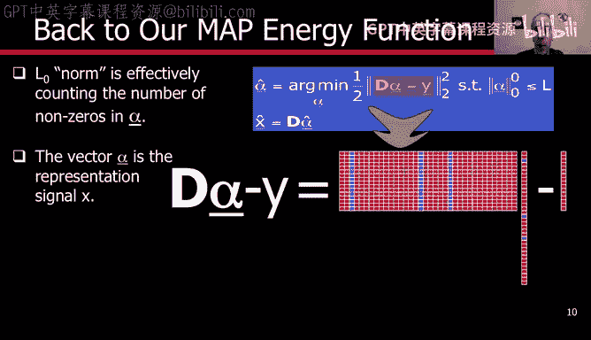

Now， what we have obtained is a very low dimensional representation of our signal and a low dimensional approximation of y and the idea is that if we reduce the dimension of y basically were getting rid of the noise because we are not allowing to use all the atoms。

 we're only allowing to use very few projecting the signal into a low dimension and therefore reducing the noise is the same as we saw with the points。

 we have points。On the plane。But if we say that we are only allowed to represent all these points with a straight line。

We fit a straight line and we are basically projecting the points onto the straight line。

 and by that we are denoicing the points because we go into a much lower dimension in this case which just go from two to one。

 but that illustrates the concept that we go into a lower dimensional space and by that we get rid of the noise。

In order to represent the noise， we will need many additional atoms。

 And that's why we are restricting alpha to be spae。Now， are we done。

 Were only at the very beginning of this week。 So for sure， we are not done。

 Let me illustrate a few of the problems that we need to still solve。

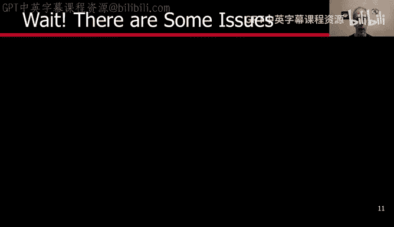

Now。We were talking about this。Minimize the error under the constraint that you are not allowed to pick more than L non0ro entries in alpha I this the problem we need to solve。

 maybe we can solve it in this way， let us constrain here the error you don't want more than a given error and find the sparses possible vector that achieves this error。

Or we can actually have a combination of the sparsity and error and try to optimize for alpha such that it minimizes this sum of the two terms with a coefficient lambda。

 So we have three possibilities here。 Sometimes these three are equivalent。

 Sometimes they are not which one shall we be using。Another problem， in this case。

 a theoretical problem。 Will we always find an alpha。 So I give you why I give you a dictionary。

 will I be able to find， for example， an alpha that is par enough and represents the signal up to certain error。

 Is that possible， And if I find it， will that be unique， will there be only one alpha。

 will any alpha have the same support， the same non zero entries。

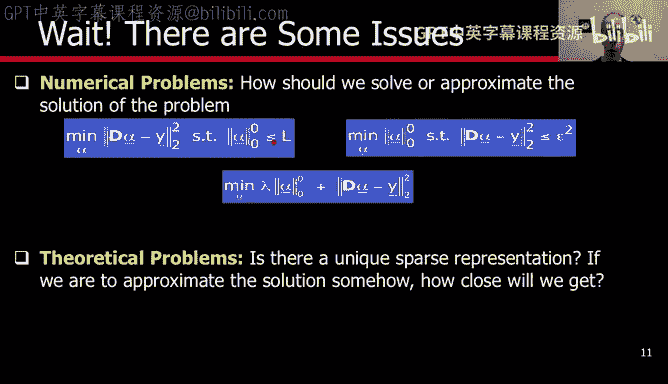

When is that possible。And of course， what about the dictionary。

 which dictionary should I use in order to get alpha as sparse as possible。

 this is going to be something that we are going to discuss quite a lot during this week and these are some of the questions that is very nice sparse modeling and sparse representations open。

So what have we done， We basically started with image denoicing as an example and we say we need to model the signal。

 we need to understand what do we mean by image denoicing。

 what type of clean signal are we looking for and that basically open the question to say we need to define models。

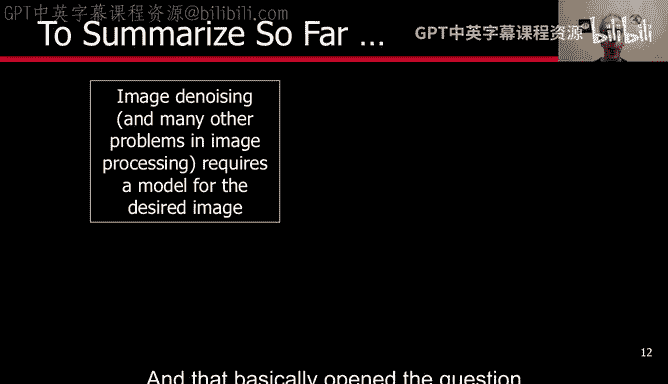

When we say we need to define models， we basically。Describe a model， which is the sparse model。

 The signal is a linear combination of a few elements， a few atoms of a given dictionary。

 Once we define that， Are we done。 Of course， now， we have all these questions that we just mentioned theoretical computational。

 how do I compute that alpha。 And， of course， how do I compute a dictionary that is appropriate for the type of signals that we are looking for。

 So these are some of the questions that we are going to address during the next few videos。

 And I'm looking forward to that， this is， as I say， a very， very exciting topic and very。

 very active topic in image processing right now。 Thank you very much。

 Looking forward to seeing you in the next video。😊。

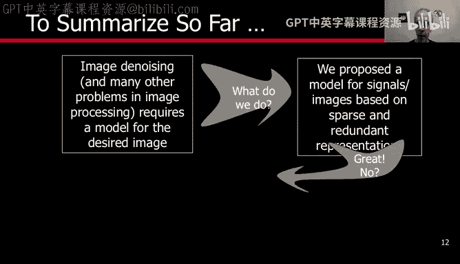