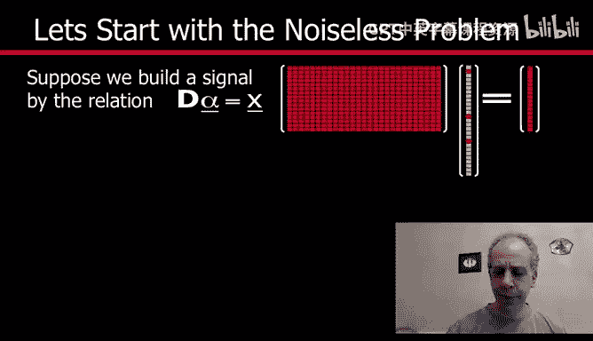
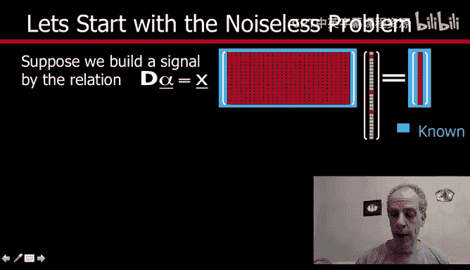
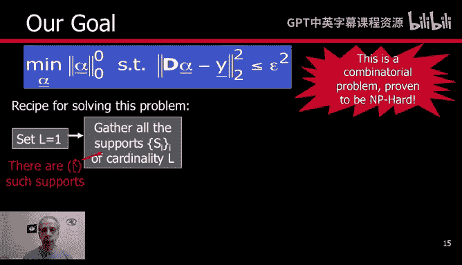
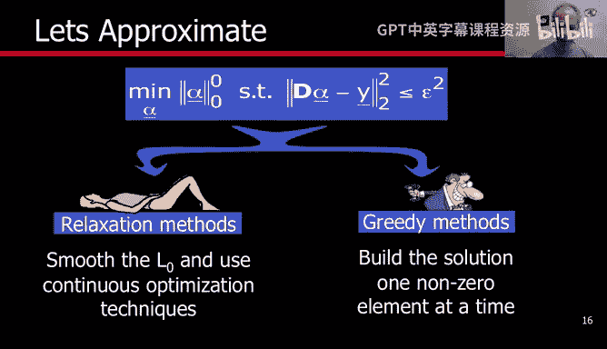
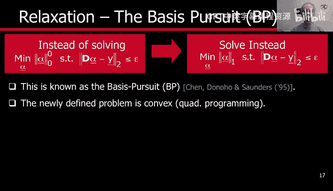
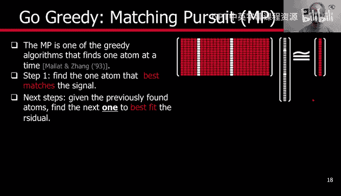
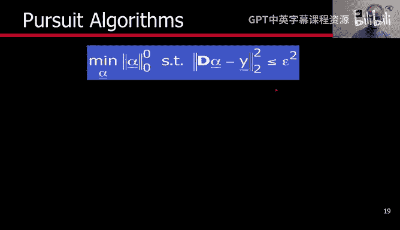
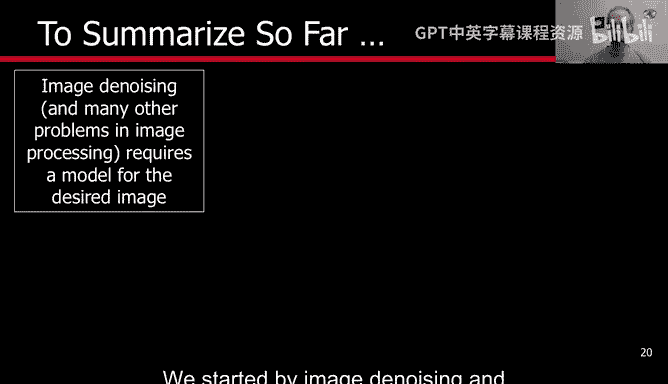
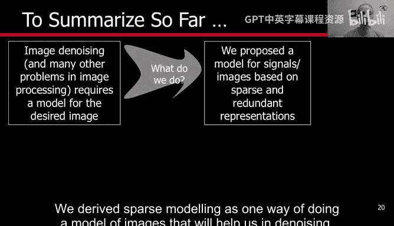

# 图像与视频处理：P69：稀疏建模实现





## 概述
在本节课中，我们将学习如何实现稀疏建模，即如何计算信号在给定字典下的稀疏表示系数α。我们将讨论两种主要的求解方法：松弛方法和贪婪算法，并简要介绍支撑这些方法的重要理论背景。

---

## 稀疏建模问题回顾

上一节我们介绍了稀疏建模的基本概念。现在，我们来看看如何具体计算这个稀疏表示。

假设我们有一个信号 **X**，它是通过一个已知的字典 **D** 和一个稀疏系数向量 **α** 生成的，即 **X = Dα**。我们的目标是：在已知字典 **D** 和信号 **X** 的情况下，找回那个最稀疏的系数 **α**。

我们的目标可以形式化地表示为：
```
min ||α||₀  subject to  X = Dα
```
其中，`||α||₀` 表示 **α** 中非零元素的个数（即 L₀ 范数）。

---

## 关于解的唯一性与存在性

在深入求解算法之前，我们需要思考两个理论问题：解是否唯一？我们能否找到比生成信号时更稀疏的表示？

解的唯一性与字典 **D** 的结构密切相关。例如：
*   如果字典中有完全相同的原子（列向量），那么解就不唯一。
*   对于正交基（如傅里叶基、离散余弦变换基），表示是唯一的。

同样，能否找到更稀疏的解也取决于字典原子之间的相关性。如果某些原子是其他原子的线性组合，那么就可能用更少的原子来精确表示信号。



**核心理论**：存在一系列优美的理论结果，它们基于字典的某些性质（如互相关系数）和信号的稀疏度水平，保证了在特定条件下，我们可以通过后续介绍的算法，唯一地找回生成信号的那个最稀疏的表示。了解这些理论的存在非常重要，它们支撑了我们正在开发和应用的技术。

---

## 精确求解的挑战：组合爆炸

我们的目标现在是求解这个稀疏建模问题。给定观测信号 **Y**（这里我们考虑更一般的有噪声或近似的情况），我们希望找到 **α**，使得在表示误差不大的前提下，非零系数尽可能少。

这本质上是一个组合优化问题，并且是 NP 难问题。原因如下：

设想一种最直接的求解方法——枚举法：
1.  首先尝试所有只使用1个原子（`L=1`）的可能组合。对于每个选定的原子，我们通过最小二乘（即投影）来拟合信号，并计算误差。如果误差满足要求，则停止。
2.  如果 `L=1` 无法满足误差要求，则尝试所有使用2个原子（`L=2`）的可能组合，重复投影和误差计算。
3.  以此类推，不断增加 `L`。

问题在于，当字典大小 `K` 很大（例如1000），且需要的稀疏度 `L` 仅为中等水平（例如10）时，需要尝试的组合数量是“K选L”，这是一个天文数字。即使每次计算仅需1纳秒，总时间也长得不切实际。因此，精确求解原问题是不可行的。



---

## 求解策略：松弛法与贪婪法

既然精确求解不可行，我们就需要寻找高效的近似或替代方法。主要有两类策略：

### 1. 松弛法（Relaxation Methods / Basis Pursuit）



这种方法的核心思想是：用一个可求解的、近似的问题来替换原问题。

具体做法是将难以处理的 L₀ 范数 `||α||₀`（非零元素计数）替换为 L₁ 范数 `||α||₁`（系数绝对值之和）。优化问题变为：
```
min ||α||₁  subject to  ||Y - Dα||₂² ≤ ε
```
这是一个凸优化问题，存在许多高效的算法可以求解。

**理论保证**：在字典满足某些条件（如有限等距性质 RIP）且信号足够稀疏的情况下，可以证明 L₁ 最小化问题的解与原 L₀ 问题的解是等价的。这是一个非常强大的结果，它将一个NP难问题转化为了一个可高效求解的凸问题。相关研究非常丰富，并有成熟的软件包实现。

### 2. 贪婪法（Greedy Algorithms / Matching Pursuit）

这类方法采用逐步构建的思路，每次只选择当前“最重要”的一个原子。

以下是基本步骤：
1.  **初始化**：将残差 `r` 设为原始信号 `Y`。
2.  **原子选择**：遍历字典中的所有原子，找到与当前残差 `r` 内积绝对值最大的那个原子。这个原子就是当前最能解释残差的。
3.  **更新表示与残差**：将该原子加入已选原子集。然后，用所有已选原子对原始信号 `Y` 进行投影（即求解最小二乘问题），得到新的系数估计，并计算新的残差。
4.  **迭代或停止**：如果残差足够小，则停止；否则，返回步骤2。

这种方法的一个著名变体是**正交匹配追踪（Orthogonal Matching Pursuit, OMP）**。它在每次迭代后都对已选原子集进行正交投影，从而能更快地降低残差。贪婪算法计算简单（主要是内积运算），效率很高。



---

## 方法总结与比较

我们已经介绍了两种求解稀疏表示的主要技术：

*   **松弛法（L₁ 最小化）**：通过数学松弛将问题转化为凸优化问题。在理论条件满足时，它能得到精确解。计算相对复杂，但非常强大。
*   **贪婪法（如OMP）**：采用逐步迭代的启发式方法。计算速度快，实现简单。在理论条件满足时也能得到正确解，即使条件不满足，通常也能得到很好的近似。



在实践中，由于原问题无法精确求解，我们通常根据具体场景（如对速度、精度的要求，以及字典的性质）选择其中一种方法。强大的理论为我们提供了这些方法何时能有效工作的指导。

---

## 总结





本节课我们一起学习了稀疏建模的实现方法。我们从回顾问题开始，认识到精确求解的组合爆炸困难。接着，我们探讨了两种主流的解决方案：一是将问题松弛为可求解的 L₁ 范数最小化问题；二是采用贪婪迭代的策略，如匹配追踪算法。我们还了解到，有深刻的理论结果支撑着这些方法在特定条件下的有效性。下一步，我们将探讨如何学习或构造合适的字典 **D**，这是稀疏建模中的另一个关键环节。