# 图像与视频处理：P6：人类视觉系统 👁️

在本节课中，我们将要学习人类视觉系统的基本工作原理。了解我们自身如何“看”世界，是理解图像处理技术为何如此设计的关键。

毫无疑问，图像与视频处理的主要服务对象之一就是我们人类自身。因此，让我们来了解一下我们自己的视觉系统。

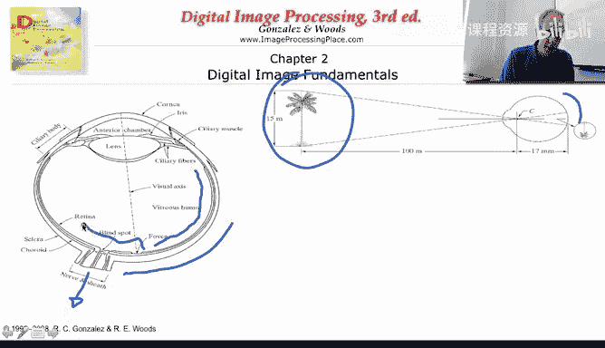

## 眼睛的结构

上一节我们介绍了课程背景，本节中我们来看看人类眼睛的简化结构。

上图展示了人眼的简化剖面图。我们有角膜、晶状体和视网膜。视网膜是我们看到的图像最终投射的地方。基本上，如图所示，现实世界中的场景（即实际景物）被投射到我们眼球后部的视网膜上。

视网膜上布满了感光细胞，图像投射到视网膜后，信息被传送到大脑。视网膜上遍布着传感器。

## 感光细胞：视锥细胞与视杆细胞

视网膜上有两种类型的感光细胞。

以下是它们的分布与功能：

*   **视锥细胞**：在图中用实线标记其密度。它们在**中央凹**区域密度非常高。视锥细胞擅长感知细节和明亮光线。在日常生活中，我们会不自觉地移动眼球，试图让场景尽可能多地投射到视网膜的中央凹区域。
*   **视杆细胞**：在图中用虚线标记其浓度。它们在视网膜上的分布更为均匀。视杆细胞不擅长观察细节，但能获取场景的总体信息。它们非常擅长在**昏暗光线**下视物。

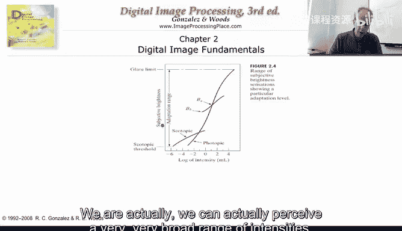

通过结合擅长亮光的视锥细胞和擅长暗光的视杆细胞，我们的肉眼能够观察**极其宽广**的光强范围。

## 视觉适应与韦伯定律

然而，我们无法同时感知全部的光强范围。我们需要进行**视觉适应**。例如，在黑暗的电影院里，起初我们看不清，但适应一段时间后就能看见了。同样，进入明亮的房间也需要适应。

无论背景光如何，我们都需要能区分不同亮度下的细节。适应机制使我们能够做到这一点。为了理解我们在不同光强下的辨别能力，有一个经典的实验。

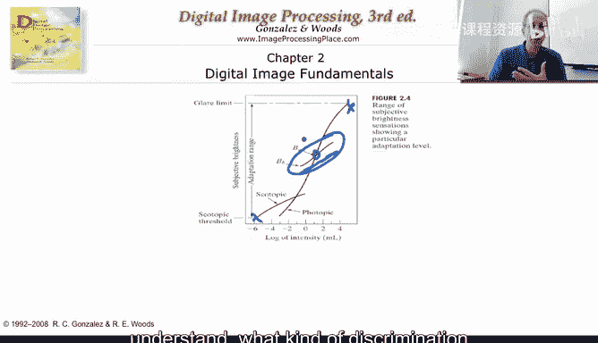

实验很简单：设定一个背景光，在中央显示一个圆形，然后改变圆形的亮度，直到观察者说“我注意到那里有个圆”。我们可以调亮或调暗，然后测量我们能感知到的变化量。

我们能感知到的变化量（ΔI）实际上取决于背景光强度（I）。这就是**韦伯定律**。其核心关系可以表示为：

**ΔI / I ≈ k**

其中 **k** 是一个常数。

这个效应非常有趣：在**低光**条件下，我们需要相对**较大**的变化（ΔI）才能感知到差异；在**高光**背景下，我们不需要那么大的变化就能区分。这意味着，如果两个物体都很暗且亮度相似，我们将难以区分它们。反之，在明亮背景下，物体间较小的亮度差异就足以被我们识别。

韦伯定律对于图像、相机及其他图像采集设备的设计至关重要。如果我们想区分两个都很暗的物体，就必须确保它们之间有足够大的亮度差。在后续课程中，我们还将学习如何通过计算机处理来增大这些差异，以便肉眼区分。

本部分的结论是：我们能够在非常宽的亮度范围内观察和理解图像，但无法同时做到。我们需要适应，并且在适应暗环境时，我们的敏感度低于适应亮环境时。

## 视觉错觉与上下文依赖

我们的视觉感知还依赖于周围的上下文。韦伯定律就是一个例子（中央圆形的可感知性取决于其周围的亮度）。另一个例子是**马赫带效应**。

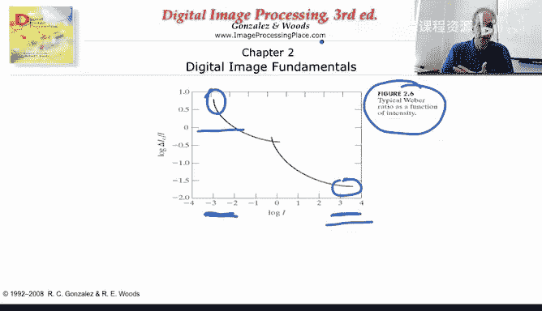

虽然图中每个色块的亮度是恒定的，但我们的感知并非如此。在明暗交界处，我们感觉暗的一侧更暗，亮的一侧更亮。这是一种亮度对比带来的错觉。

以下是一个更清晰的例子，展示了背景如何影响我们对相同物体的感知。

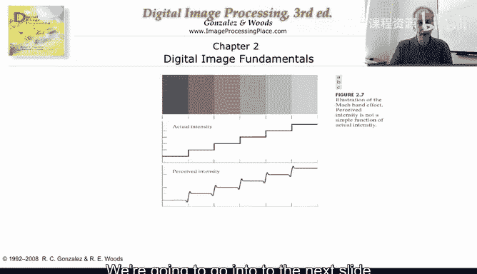

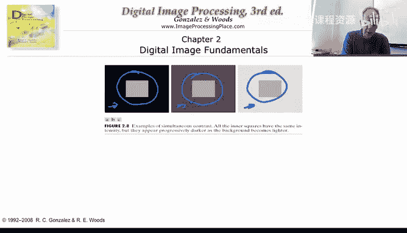

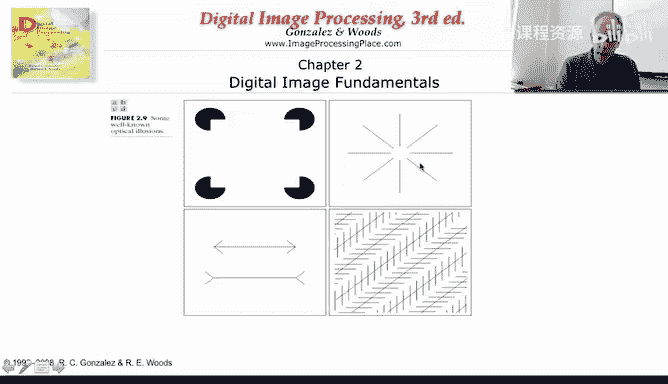

图中三个矩形的**物理亮度完全相同**，但背景灰度不同。你会发现，被明亮背景包围的矩形，看起来比被黑暗背景包围的矩形**更暗**。这再次证明了上下文对感知的强大影响。

我们的视觉系统还会“脑补”出不存在的信息，产生错觉。

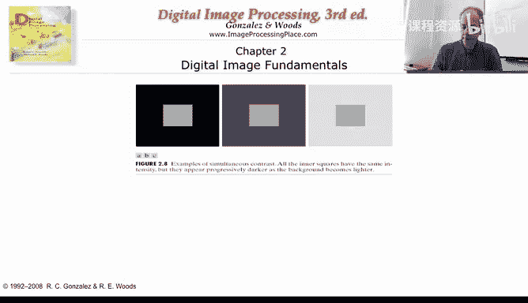

例如，虽然图中并没有画出一个完整的正方形，但你的大脑会感知到一个正方形的存在。中间的灰色区域亮度其实是一致的。同样，一些放射状的线条会让你感觉中间有一个圆形。有趣的是，此时我们视觉系统中某些神经元的激活模式，与真正看到一个圆形时是相似的。

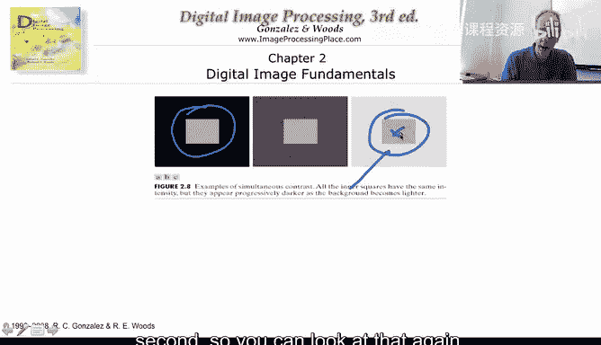

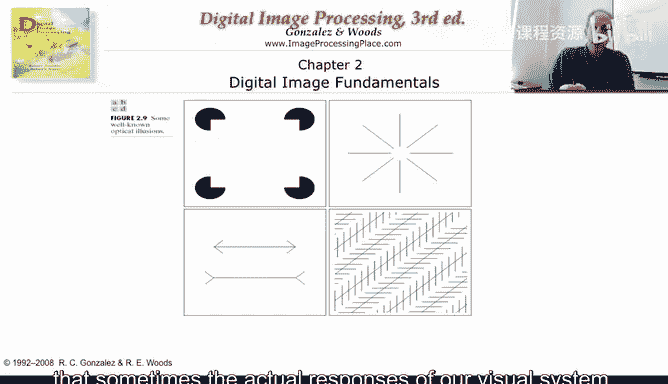

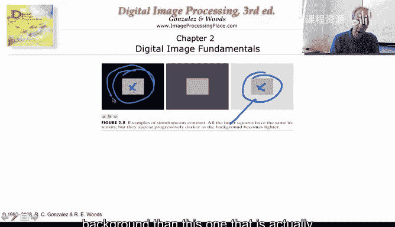

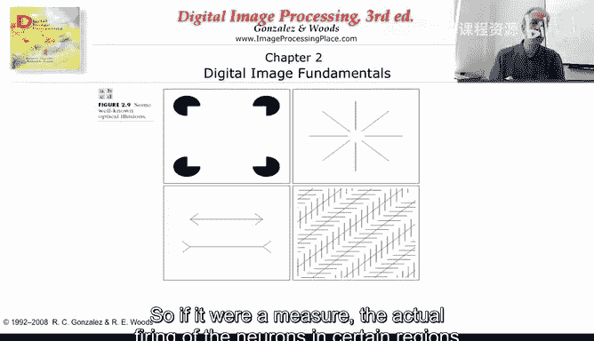

这里还有更多几何错觉的例子。大多数人会感觉左边的竖线比右边的长，但实际上它们等长。右边的两组线看起来不平行，但实际上它们是平行的。这些错觉都是视觉系统处理信息时产生的副产品。

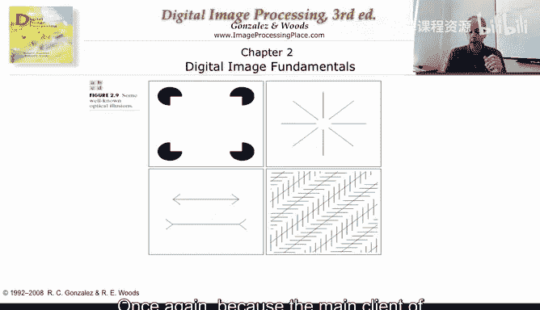

理解这些基本的视觉系统工作原理非常重要，因为图像与视频处理的终极服务对象正是我们人类。

## 总结与预告

本节课中我们一起学习了人类视觉系统的基础知识：眼睛的结构、视锥与视杆细胞的分工、视觉适应现象、关键的韦伯定律，以及视觉感知对上下文的依赖性和常见的视觉错觉。

在下一个视频中，我们将开始接触公式和更具体的概念。迄今为止，我们看了些基本图像并了解了人类视觉系统的一些基本原理。现在，我们将开始探讨什么是像素、量化、采样，以及百万像素甚至十亿像素相机意味着什么。

感谢学习。

