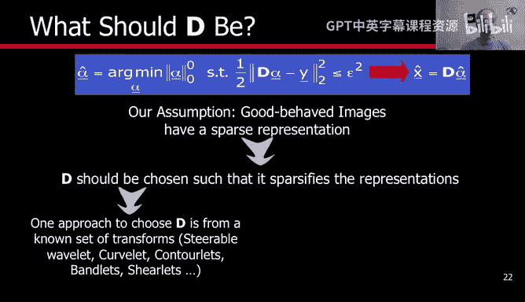
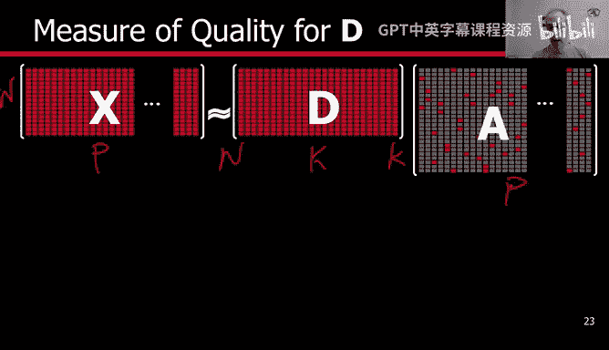
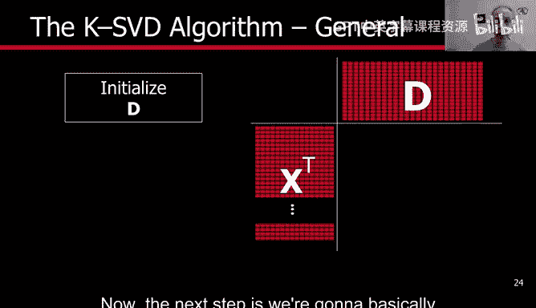
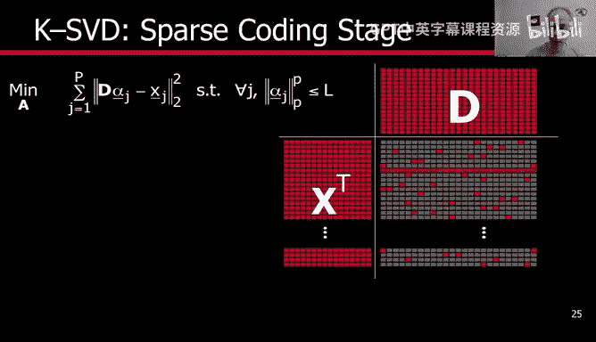
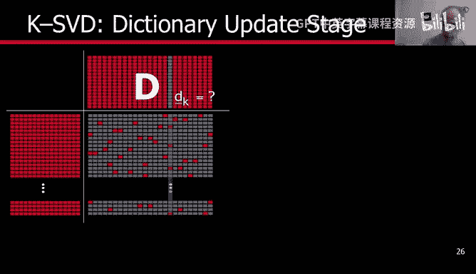
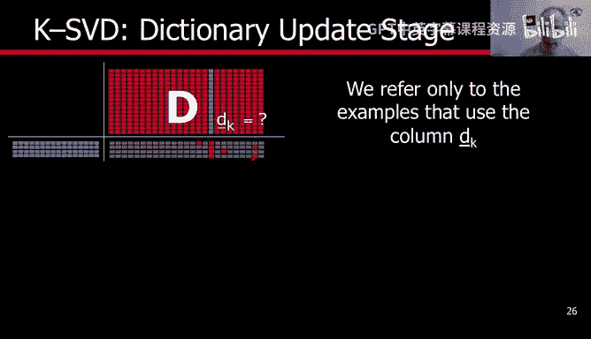
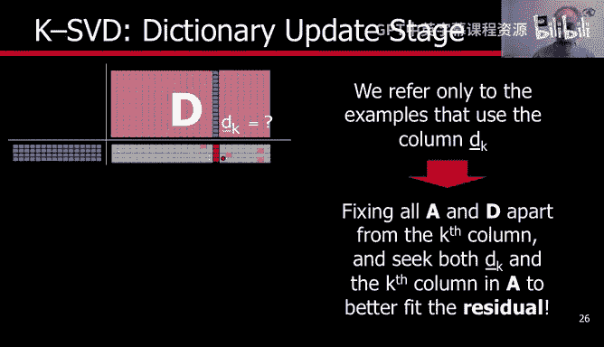
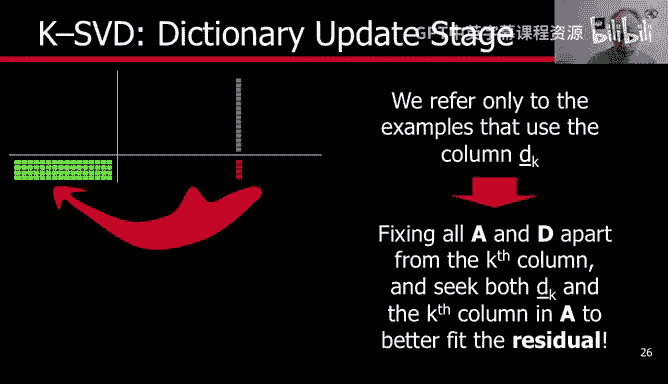
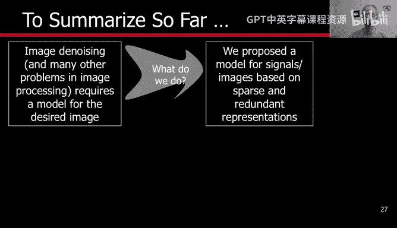

# 杜克大学《图像与视频处理：从火星到好莱坞，途中停靠医院｜Image and Video Processing： From Mars to Hollywood 》 - P70：70_08_04_4-字典学习-时长-17-13-可选休息点-06-03.zh_en - GPT中英字幕课程资源 - BV1KYBrBxEsH

Hello and welcome back。 We are now ready for the last fundamental step in sparse modeling。

 That is dictionary learning。 Let's go into that。😊，Remember what we are trying to solve。

 We are solving this equation。 and this is the dictionary。 This is the data。

 and we already talk a lot about alpha， the sparse representation of the data used in the dictionary。

 So what should the dictionary be the assumption in image processing assumption is that images are behaved in a sparse fashion。

 and we have already seen examples of that using， for example， JP。

 or even this exaggerated example of putting all the images as part of the dictionary。

So how do we design a dictionary。The goal is if we believe in sparsity。

 we should design a dictionary that encourages sparsity the more sparse the vector alpha。

 the better we are going to be because we are trying to create sparse models。

 So the idea is that we are going to have to learn or were going to have to select the dictionary that helps us to sparsify the signal。

 and there are basically two directions in doing that。 One is to take off the shelf dictionaries。

 There are very good dictionaries out there。 We have seen Jpe is an outstanding algorithm so we could use the cosine as a dictionary。

 we could use Fourier。 we can use waveleletth。 They are many， many of the shelf dictionaries。

 The issue with those dictionaries that they're not adapted to the signal。

 so they will be kind of universal they would be very good for the signal that we are。Work with。

 but maybe they're not kind of the best possible。 So the other direction is basically to learn the dictionary。

 Let's start with a lot of examples of data。 And let us learn the dictionary。 And then we can。

 for example， use that dictionary for other images。 And that's what we are gonna discuss now。

 we are gonna be in the dictionary learning regime and not in this regime。

 which is the most classical signal processing。 And we were here when we were doing image compression and we describe JpeEC。

 But now it's our turn to describe this to present a dictionary that will help us to specifyify the signal。

 So we are gonna design the。

And the basic idea is very， very simple in concept and also not very difficult to implement。

 as we are going to see。So now instead having one signal， we have multiple signals。

 Each one of them is a column here。So each column here is， for example。

 an image page which is 64 dimensional a by a。 We have one dictionary that we are going to train for all these images。

And then every one of these images， patches or signals has its own spae representation。 So。

 for example， the first one has this one。The second one has the next one。

 So we have moved from a single column here and a single column here to a matrix。

What's the dimensions of this matrix is N。So that's again。

 the size that we had before and the number of signals， P。What is the， Again， we have N。And。😊，K。

So n here and K in this dimension， there is nothing new here， and here we have K in this direction。

And P in this direction， one per signal。 And the goal now is to design this dictionary。

 What do we want， We want basically a sparse representation for all the signals。

So we are basically summing over P， all the signals。 This is P。Okay。

 and we have one dictionary for all the signals， and we want a sparse representation for each one。

 So see that J runs from one to P。 A unique dictionary。

 and all of them have to be good representations。And they have to be sparse at the same time。

 before that， we didn't have this summation， and we were just talking about one。

 Now we have a summation， and we want a dictionary that is good for all of them。Now。

 let me just make one comment。 I'm going to describe how to do that when we have already P signals and we are going to learn the dictionary。

 Now， as the number of signals increases， we can do a similar type of training of learning that I'm going to show you next online online means。

That we are， basically。Goon to learn and adapt the dictionary as the images are coming。

 so we don't have to have a huge memory to save all the images。

 We're going to do that as the signals are coming。 I'm not going to describe that during this week。

 the algorithms， the implementations that I mentioned that you could download from the web。

 do that in an online fashion so they can deal with millions。

 zillions of images with absolutely no problem。So now my goal is to show you how we do this learning and look at here。

 we have to optimize not only for the sparse code as we were doing before。

 we are going to optimize also for the dictionary， so we are going to learn the dictionary and the sparse representation of the signals at the same time。

And the basic idea， there are a number of techniques。

 I'm going to explain you what's called the KSVD algorithm that is kind of an extension of k means for clustering。

The basic idea is very， very simple to illustrate we have all the signals a rawmas X here。

 and were going to learn a dictionary， so we initialize the dictionary。Any you want。

 one way of initializing is just picking randomly some of these data points。

 So you pick a few data points and you put as columns here。 Remember the dimensions here is K。

We are going to learn k atoms， so you just here there are p signals and p is larger than k otherwise。

 as we talked before， just put the signals in the dictionary。

 so just randomly pick here K of the signals and put them as dictionary that gives us an initialization。

Now， the next step is we are going to basically do sparse coding with that dictionary。

That we already know how to do so we basically go every signal and we solve a sparse coding problem。

 This is going to be the code for the first signal， the code for the second signal again。

 red means active is part of the active set and non zero coefficient so we did the sparse coding。

We went all around， and we basically， for each one of the of them did sparse coding。

 Each one of these blocks。 I'm going to explain a bit more in the next slide。

 I'm just giving you the general idea。The next part is we are going to have to update the dictionary and the basic idea is we go in the other direction。

For doing the sparse coding， we went into this direction。

 We sparsely code every signal in the dictionary。 We' are going to update one atom at a time。

 using the code that we have already produced So we are going to update one atom at a time。

 Now after we have updated we're going to let the signals to be encoded again and we iterate So we start with a dictionary。

 we do sparse coding， we update the dictionary， we do sparse coding again， we update the dictionary。

 until we converge or we do that for a prefixed number of iterations depending on our computational capabilities。

 Now what I have to do is explain each one of these blocks and you're going to see how simple they are this we already know basically that's the sparse coding。

Se coding is very， very simple because we have discussed a number of times and look like I put here P because either we do0 with basically matching pursuit or orthogonal matching pursuit or we do the relaxation P equal one。

 So given the dictionary we do the sparse coding。 We're going go in this direction for every signal we get the sparse code okay so we go in that direction this is just one example。

 and for every signal we have to basically solve a sparse coding problem for that signal and absolutely nothing else and that's again is here。

 so we don't have the sum。

Because we do one at a time， so we don't have to compute the whole matrix A。

 This is the whole matrix A。 We don't compute it all at once。

 We just go one at a time as we have been doing before。

 and that basically solves us the whole matrix A。 So now we have the sparse code with this dictionary。

 Now it's time to update the dictionary， which is the new part。And again。

 we solve this by any pursuit algorithm， as I mentioned before。

 either the L0 with matching in pursuit or L1 with any of the convex solvers。

So now it's time to do the dictionary。Let us speak one of the atoms。 As I say。

 we are going to update one atom at a time。 How do we update this atom。

 The concept is very simple before I run you through。

 We are going to basically pick all the signals that have used that atom。 This signal is using it。

This signal is using it， this signal is using and so on。

 so we basically are going to say which one are the signals I have a non zeroro entry in the alpha vector corresponding to that atom and we're going to make that atom even better for those signals。

So basically we go， we pick one。And we look at all the signals that are using it。Again。

 just that are using data at and we have one here， another here， another here， another here。

 and so on， remember this is our data and this is our matrix， the spae code。

So， we take all of them。And we forget about everybody else， we say。You signals didn't use this atom。

 so I'm not going to pay attention to you at this moment。 I'm going to pay attention to you later on。

 Remember， we iterate this。And now the goal is， as I say， were going to make this atom even better。

 remember please， this atom has been used by these signals。

 but that's not the only atom that those signals use so for example the first one uses this and this the second one uses this and this so I'm keeping all the signals that have used that atom but they have used also other atoms but I'm not going to attach that。

The next thing I do is actually I remove the influence of those。

Let me just explain that， once again。For example， the first signal was a combination of this atom and this atom。

 so I go and sub the contribution of this atom， the same for the second signal。

 I go and sub the contribution of this atom the same for the third the same for the fourth so for every signal I basically go and sub the contribution of all the other atoms but the one that I'm trying to change and then I have an error。

Because I'm not considering now this atom。 I'm subtracting the contribution of everybody else。

And I just keep that contribution of this at。 And that basically gives us kind of an error。

Okay and that's the error we're going to try to redesign the atom to minimize that error that error was the contribution of this atom when we use it for those signals。

 let's see if we can change the atom to make that contribution even better meaning that error even smaller。

And so what we have here is this is the error。 This is the residual。

 This is what was the contribution of this atom。 And now I want to change it。 I want to redesign it。

 And also， I want to redesign the coefficient。 So this I have。This is the amount of information。

 energy that this atom was contributing。 And now I'm gonna， basically。

Try to redesign it to make it even better。 So this is what we have to optimize for。

 And this is very easy。 is what's called a singular value。 decomposition。

 It's a standard tool in linear algebra， It has a close formula。 So once again we pick an atom。

 we can go one atom at a time or we can go randomly， we pick an atom。

 we pick all the signals that have used that atom， we sub the contribution of every other atom。

 And then we say how can I improve this atom in such a way that its contribution to the signal is even better。

 and that's an SD。 So we run an Sd for every single of the atoms， we have updated the dictionary。

 And now as we explain in one of the previous slide。 we let again。

 all the signals to be encode in again with a new dictionary， then we。

Update the dictionary and we run a few iterations， so very simple sparse calling SD。

 sparse calling SD， that's all what we have to do multiple of those as many sparse codes as signals as many SDs are as atoms in the dictionary。

 we do that， we have a new dictionary。So what we have so far is we started from the need of doing signal modeling that basically led us to propose sparse modeling as a technique。

 We had to discuss some theory why is this possible， and then we had to discuss。

How do we do the sparse coding and how do we train the dictionary and that was the topic of the last two presentations and now is will this work？

Let us try with real images and let's see if this works。

 Let me just pay attention to one point before we go into that in order to close this video about dial learning。

Some people have， basically。Decided that instead of training a dictionary， as we have just said。

 we're going to make the dictionary be a subset。Of x of the data itself。

Now I mentioned to you that we initialize the dictionary very often by randomly sampling some of these signals。

But you could actually say， instead of randomly sample， why don't I pick the best one。

 the ones that everybody else is a sparse representation of of those ones。

 those selective ones that I have picked。 And there are also optimization techniques to do that。

 So that's an alternative。 Its still dictionary learning。

 but will restrict the dictionary to be one of the signals。

 basically will restrict every atom of the dictionary to be one of the signals。

 That's an alternative。 It's just a different way of basically learning a dictionary in order to get the sparse as possible representation of our signals。

 So now it's time to show you some examples。 And we're going to do that in the next video。

 Thank you very much。😊。