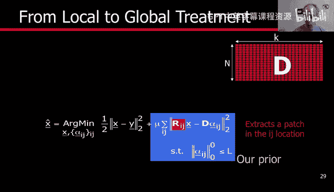
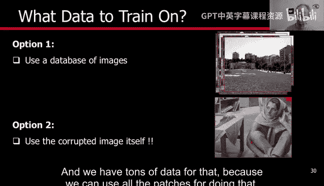
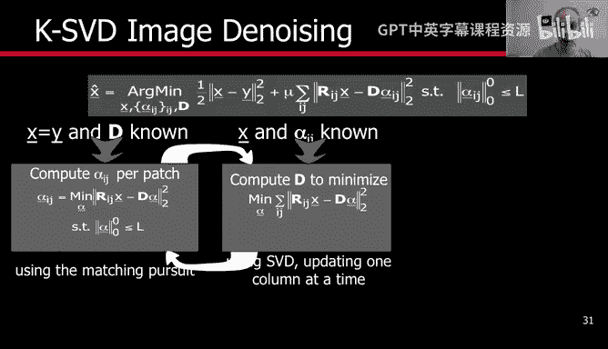
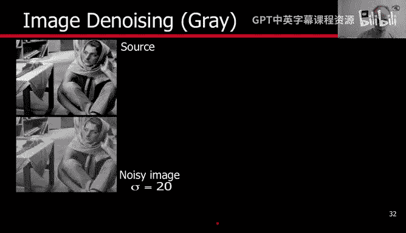
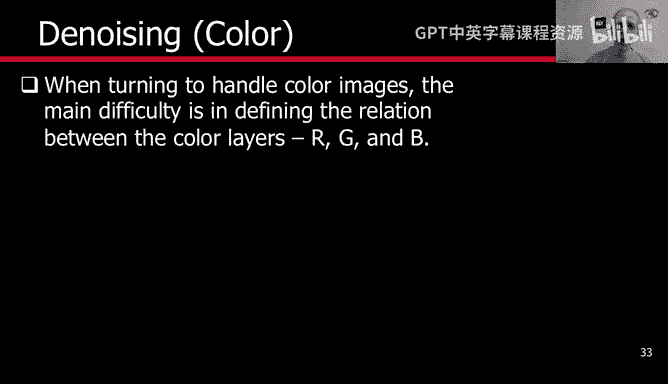
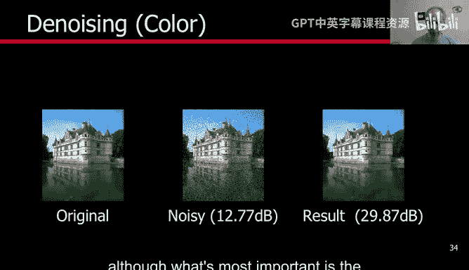
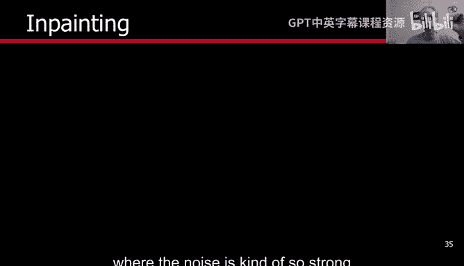
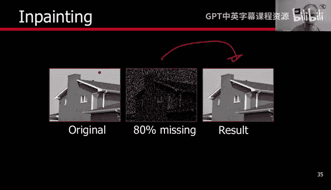
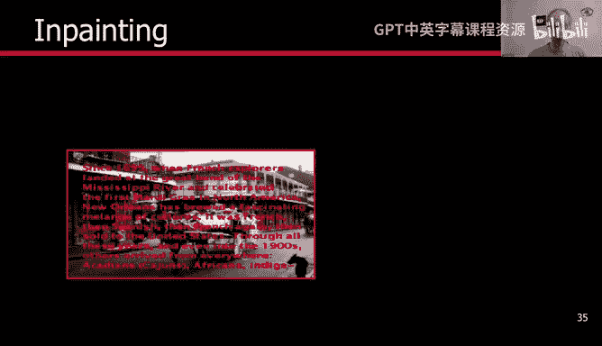

# 杜克大学《图像与视频处理：从火星到好莱坞，途中停靠医院｜Image and Video Processing： From Mars to Hollywood 》 - P71：71_08_05_5-稀疏建模图像处理示例-时长-20-57-可选休息点-09.zh_en - GPT中英字幕课程资源 - BV1KYBrBxEsH

Hello and welcome back。 It's time now to present examples of sparse modeling image processing。

 Before we do that， we have to do one more thing。Now， remember what we have。

 We have a dictionary of K elements， K atoms， and every atom has n dimensions。Now。

 what are basically the basically the signals that were going to process。

 And that's what we need to discuss just for one minute。And the basic idea is very simple。

We're going to be talking about images。 This is going to be our data， the noisy image。

 the whole image。This is what we are looking for。Now we are not going to work on entire images。

 We are going to work on patches。 and this is the R。 The R is just a basic。

 a simple binary matrix that extracts the patch around Ij。 So if we have an image。For every pixel。

 we construct a patch。Around it or we could actually consider IJ the upper left corner anything that is good as a coordinate system。

 and we extract patches， for example， eight by8 patches as we have been talking Now it's very important that we do not take blocks as we did on Jpeg in Jpeg we actually take all the patches they are fully overlapping so we have an image。

And we take a patch， and we take the patch next to it and the patch next to it。 So for every pixel。

 let's say the upper left corner。We construct the8 by8 patch。

 So this is a binary matrix that extracts that patch and it' the patch that we w to have as sparse code for it with a learned dictionary。

 So here's the sparsity。 So we are not working on the whole image at once。

 We are working on all the overlapping patches of the image。

 and what we have is as we discuss before the model is for the individual patches。

 We're going construct a dictionary that works， for example。

 on all the overlapping patches of a given image at the same time。 A note here。

 we are doing basically the optimization of the signal。 This is the whole image。

We are looking for the sparse code。This is the second part and as we are going to see in a second we are also going to learn the dictionary。

 We could learn the dictionary offline or we could learn it an adaptive for the image as we are going to explain once again this is just nothing than a binary image that extracts the patch。

 so think like you have the image， you pick a patch， you do sparse coding， you pick the next patch。

 you do sparse coding。Now， what about then the dictionary。

The first option is to train on a large database， so you do that offline you train on a large database。

 the second option and these are not contradictory as we're going to see in a second is to use the image itself。

 you travel all around the patches of the image that gives you a lot of training data already and the basic idea is that normally we combine both of them。

That's one possibility。 So you learn a dictionary with a bunch of images off the shelf offline and that used as your initialization of the dictionary for KSBD。

 and then you get a new image， even though it's noisy， you adapt the dictionary to the image。

 so you run a few iterations of this dictionary adaptation， KSBD sparse coding。

 dictionary adaptation， sparse coding for the particular image that's one option。

The other is to forget completely about this and start with any initialization and only run it here。

 So there is many options and depending on the application。

 which one you can pick Now if you are in a rush and you don't have computational time to do the denoicing。

 you don't have to update the dictionary， basically you train it with a database。

 let's say that you want to do。Faces， you train it with a database of faces。

 and you use that dictionary。If you have computational time to do that。

 it's always better to basically adapt the dictionary to the particular image。

 and we have tons of data for that because we can use all the patches for doing that。

So once again， this is our general formulation， but now we have D。

Either because we are starting from scratch for the particular image or because we are adapting the pre learnedar dictionary to the current image。

 we have to， this is our data。And we have to basically reconstruct the image。

 we have to compute the code， we have to compute the common dictionary。

 one dictionary for all the patches in the image you' are not allowed to use a dictionary per patch that would be basically ridiculous so we have three things to optimize for and the basic idea is very simple。

 you fix to you optimize for the third one， for example you fix。You ignore X。And basically。

 you assume that x is fixed， so you ignore this term and you fix D and you do sparse coding。

That kind of the first part of KSBD。 Then you fix the code。And you update the dictionary。

 And this is basically an iteration that's basically KSBD。 So you have the image。

 you go over the patches。

Every patch becomes the columns of the large X matrix that we saw in the previous video。

 And then you do KSBD for all of them。 Okay， so you are encoding with spa codinging every patch。

 When you finish， you update the dictionary， you encode again， you update the dictionary。

 When you're done with the dictionary。 All what's left is to compute X。

 So you basically don't touch the code anymore。 Don't touch the dictionary anymore。

And you have to basically solve for this problem when basically D and alpha are already fixed。

 Of course， this is gone。 X only shows up here and shows up here。

 and it's very easy to show that the result is basically the weighted average of the patches。

 So what happened is that every pixel is touch by multiple patches。 So let me just draw that here。

 for example。We have an image。And we have a big set。

Now there are multiple patches that touch that pixel， for example。

 this one that has the picture the pixel can of the on the bottom left corner， there's also this one。

And basically， there is also， let me just use a different color。 There is， for example， a patch here。

There is how many。 If we have 8 by 8， we have 64 patches that are touching that pixel unless the pixel is at the border of the image。

 Let's ignore those for a second。 And basically， for every one of those patches。

 we have sparse coding with the dictionary that we have learned from all the patches in the image。

 So thats sparse coding， basically for every single one of these patches is that we can reconstruct it as。

第。Alpha with the optimal alpha that we have compared for every single of the patches， I J。

Every single one has been reconstructed， how do we reconstruct the pixel we basically average all those patches。

 you can add weights to the average what's basically what the theory tells you if it's the pixel is in the center of the patch then that patch is more important than if the pixel is in the corner of the patch。

 but that's just a technicality you can basically just do the reconstruction of every patch with the sparse code and di that we have learned and just average those 64 if you're using an eight by8 block。

So now this is all what you do， every patch， spae coding and KSBD to learn the dictionary。

 so I think we're ready now to see examples。Let's start from an image in gray values。 No color。

 This is the source image。And this is a noisy image。 have。

 we have added Gaussian noise with these variants。

Now we can initialize the dictionary with random patches。From this image。

 we don't have this image anymore。 This is just for reference。 This is all what we have。

 We can initialize with patches from here。We can initialize with a dictionary that we have learned offline。

 or we can initialize with something that we know is good。 discretere cosine transform dictionary。

 That's the one used JpeEC。 So we know is reasonable， a good algorithm。 So a good dictionary。

 In this case， we have initialized with that。 And basically， we。😊，Update using all the patches here。

 all the possible patches。We learn the dictionary， then we encode every patch with the Learn dictionary using sparse coding。

 then we average。All the patches that touch a given pixel andvoila。

 This is the dictionary that we have learned。 Very interesting how it has changed from the DC cityT dictionary。

 And here is the restore image where we basically have reduced the noise by。😊，Two things。

 one projecting every patch to the space defined by this dictionary。

 using sparse coding and then averaging the patches。And here you have a result。

 this was the original， this is what's available to us and this is the deno data。

 very important that the adaptation of the dictionary is done with the noisy data and still the results are really。

 really good and I want you once again to observe the type of dictionary that we have learned from the image。

 for example， it has learned the texture that we have here the different types of texture I'll learn in the dictionary。

 it was basically adapted to the image。Now how do we deal with color。

 there are numerous ways of dealing with color， but basically one of the simplest ways is to instead of doing eight by8 patches。

 we do8 by8 by3。 we could have done every color independently as we have done。

 for example for in painting or even for compression but we can also take8 by8 by three patches。

 you know we cancatenate all the colors and we do KSVD sparse modeling in exactly the same fashion。

Let's see some results。 So again， we always show the original just for reference because you never have it。

What you have is this image， this is noisy image， a noisy version of this。

 and then you run KSVD on this8 by a by3 or5 by5 by3。

 depending the patch size that you decide to use and you get a very nice result of image denoicing and here are just basically the standard measurements of PsNR in DBs to measure just the quality of the result。

Here is another example。 We start from again， the reference。

 This is only for reference the original image。 We have noy。 Look how bad it is。 This is really bad。

 we have added a lot of noise And we get a beautiful reconstruction from this sparse modeling technique。

 really， really nice reconstruction with a lot of details and a relatively high quantitative measurement。

 Although what's most important is a qualitative quality of the reconstruction。 So we went from here。

😊。

To here and once again， we learn the dictionary， in this case。

 we initialize the dictionary with an off the shelf prelearned dictionary。

 and then we adapt it to this no image for a few iterations of KSBD。

Now we can also do in painting with this in painting is a particular example of noise where the noise is kind of so strong that it makes some pixels disappear and there's many ways of defining the types of challenges of in painting。

 one of them is to take the image and to just drop 80% of the pixels This is related to compressed sensing and we're going to talk about that at the end of this week in just one video。

We basically drop 80% of the pixels。 You say you're gone。

 So that's basically represented here with dark values 0。

 So it's like the noise is so strong that you basically， there is nothing there。 And then you run。

Basically， it sparse modeling and KSBD。Starting with this image， this is the amazing part。

 We startve from this image， and here is the reconstruction。

Once again a very very interesting result we only had 20% of the pixels and we managed to do a nice reconstruction again we go from here to here this is just for reference this image let's just see that in color again 80% missing and here is the reconstruction once again I think a very very nice result。

Again， for this example， we started with addiction that was learned from a database of natural images。

 then we adapted to this image for a few iterations。

 and then we do this by reconstructing every patch and then averaging for every pixel all the patches that touch it again I think a very impressive results showing the power of this technique。

This is another example instead of dropping the pixels we do the same that we did when we were talking about in painting in general。

 we write on top of the image and then we do the reconstruction， again。

 very good results with nothing else than doing sparse modeling。

 learning addiction from this noisy image and being able to reconstruct this image。

Now， we can also do video in painting。 We can drop 80% of the pixels。 And now， again。

 we have a number of options。 We can do every frame by itself。😊。

Or we can do patches in kind of three dimensions， X， Y and T。

 We discuss about that when we were talking about video in painting in the previous week。 Basically。

 we take patches。 Let's say we take three frames together。5 frames together。

 So the patches have also some temporal information。

 After we have decide on what type of patches to use。

 We run sparse modeling with absolutely the same technique that we have been describing。

 and I'm going run a few of them。The original is as always only for reference it actually is not available。

 We always go from here to here doing the dial learning。 Let me run a few frames。 This is one frame。

 This is another frame。 look always at the quality of the result， the reconstruction， another one。

Another one。 So once again， we basically walk through the different frames going from this to this。

 and you can always look at the reconstruction is very。

 very close to the original that is not available to us。Just one more frame here。Now。

 I wna do and yet another frame。I want to finish with demo mosaking。 This will be the last example。

 It's kind of a particular case of imaging painting， as we have seen before。

 Let me explain what's the problem here。 Most digital cameras do not collect full red。

 green and blue。 they basically do a trick， which is one pixel they collect red， red。

 The next they collect green， the next red， the next green and so on。 for the next row。

 they collect green， blue， green， blue， green， blue。 And then they repeat that。

 So at every pixel you have only one color。Red or green or blue。

 And what you have to do is you have to interpolate in order to show me the image。

 you have to let every pixel create the red， the green and the blue。

 This is kind of an interpolation or an in painting of the colors。

 but we can treat this as nothing as than in painting of the colors where basically we have just instead of dropping the entire pixel we drop two of the colors of the pixel per pixel。

 sometimes we drop the red and the green， sometimes we drop the green and the blue。

 sometimes we drop the red and the blue。 So imagine that you have a cube which is n by n by3 with sometimes you have the available。

 sometimes you don't Now we have seen that sparse modeling is extremely successful。

 even when the entire pixel is gone。 even when 80% of the complete pixels are gone。 So let's write。

On this and this is called demo mosaing and has to be done basically in all consumer digital cameras。

 very expensive digital cameras actually collect the full red， the full green and the full blue。

 but normal consumer cameras do this type of mosaic and then the。

Production of the full color image is called the mosaing。 And here you see examples。

Of color images that have been reconstructed from patterns like this using sparse modeling。

 It's a particular case of basically in paintingting in the color domain。

 It's even easier than that because instead of dropping entire 80% of the pixels。

 you just drop some of the colors per pixel。 and the results are really。

 really nice results we have basically zoom in。 and you can see that the results are very。

 very sharp。 and these are really some of the best results produced with for demosaking theyre obtained with sparse modeling techniques。

 So these are just some of the examples of sparse modeling。

 sparse modeling and image processing is being used a lot these days。

 also for image classification and other image processing challenges I have shown you for demonoing。

 in paintinging， demosaking And I think that this basically illustrates。

The importance of this theory has a lot of mathematical components and basically also very。

 very cool applications。We have a couple of additional things to learn this week about sparse modeling and also about compressed sensing and the connections between the two。

 And I'm going to do that in the forthcoming videos。 Thank you very much。 See you later。😊。

