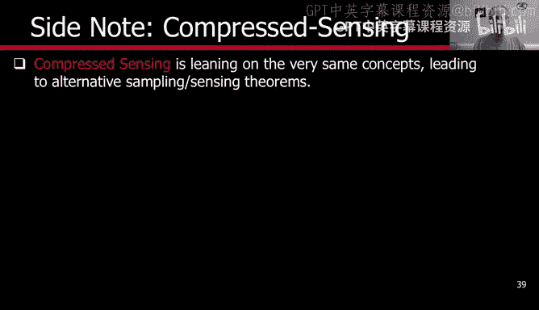
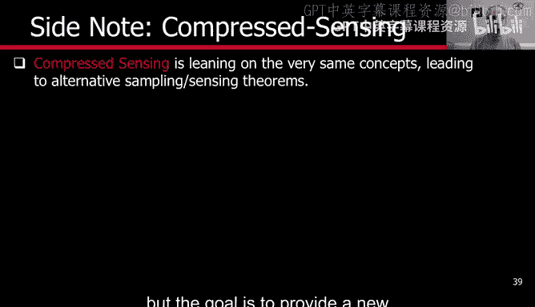
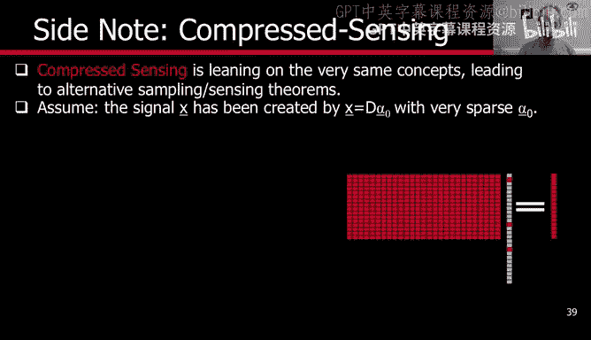
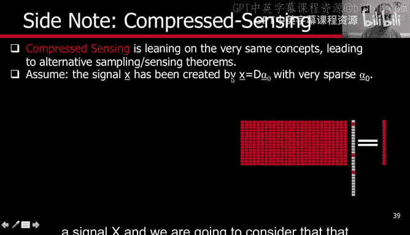
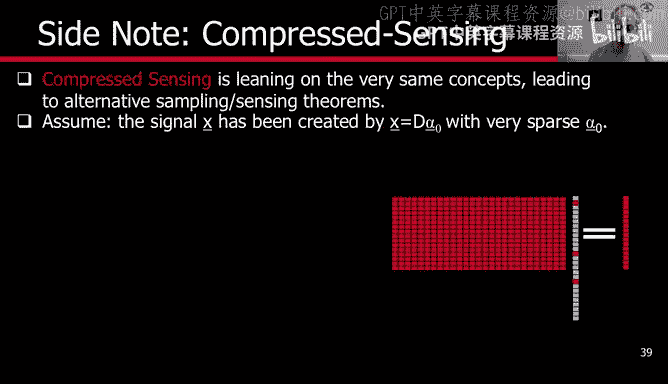
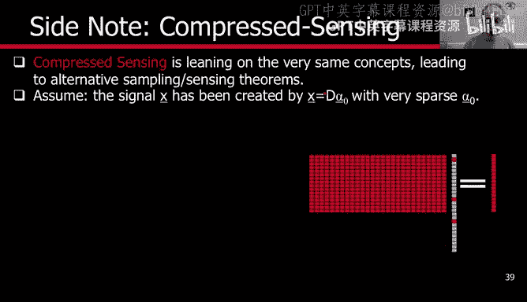

# 杜克大学《图像与视频处理：从火星到好莱坞，途中停靠医院｜Image and Video Processing： From Mars to Hollywood 》 - P72：72_08_06_6-关于压缩感知的说明-时长-05-10.zh_en - GPT中英字幕课程资源 - BV1KYBrBxEsH

Hello and welcome back Before we continue with parse modeling。

 I want to make a side note on the topic of compress sensing。

Compressed sensing basically is using some of the same concepts that we have been learning。

 but its goal is not to model a signal， to represent a signal。

 but the goal is to provide a new sampling or a new sensing paradigm。 Let us explain that。

We have， as we had before， a signal X， and we are going to consider that that signal is exactly what we have seen before。

 A dictionary multiply by a sparse vector。 So this is the signal that we want to sense in compressed sensing。

 we multiply that by a matrix that reduces the number of rows。

 So we had a signal which was n dimensional， and we are going to represent as dictionary times a sparse vector。

 but we are not going to sense end points。 We are going to sense the product of this Q matrix。

 with x and Q is what's called a fat matrix。 So it has here it has n。😊。

But here it has less than n。 So we're going to sense less。 That's why it's called compressed sensing。

 Now， let us write that down in formulas。We have the alpha equal x， that's what we have here。

 but we multiply both sides by Q the sensing matrix， so Q times D defines a new dictionary。

 this D tilde scan of a new dictionary times alpha the same sparse vector is equal not to x but to x tilde。

 the s vector which is shorter than it was before， so we end up basically sensing less。Points。

And the goal is to recover from this， which is what we sense and the knowledge of D because we know the sensing matrix。

 we know the dictionary。 the goal is to recover alpha。

 So mathematically this looks very similar to sparse modeling。

 we have a signal we have a dictionary and we need to reconstruct alpha。

 Now while compressed sensing does it deals with this fundamental problem。

 and basically the idea is to provide conditions for the recovery to be possible。

 the conditions have to be on Q， the sensing matrix， they have to be on D。

 the dictionary that we use for the sparse representation and also on the level of sparsity of alpha。

 So compressed sensing provides a lot of very nice mathematical theory。

And conditions under which we can do the recovery。 If we can recover alpha from the sense。X tilda。

 then we will be able to recover the original signal X by doing D alpha。 And once again。

 the same way that we have a lot of interesting math in sparse modeling。

 There is a lot of related math in compressed sensing that provides conditions for this to be possible。

 but it's very important to make a clear distinction。

What we have been discussing about sparse modeling is a model of signals。

Compressed sensing is about designing new sensing protocols。 Now。

 for what type of signals we design new sensing protocols。

 most of compressed sensing has been dealing with the design of new sensing protocols for sparse signals。

 meaning signals that can be represented with actionary in a sparse fashion。

 So those use the same type of tools， but theyre very different goals。

 and basically what compressed sensing is trying to do is trying to extend Nqui。

 which is the classical sampling or sensing theory for band limited signals。

 compressed sensing says what should be the sampling or sensing theory for sparse signals。

 And that's a relationship between compressed sensing and sparse modeling。

After this very short note on compressensing， and we could spend weeks teaching about compressensing。

 but it's not the topic of this week or of this， of this class that after this short note。

 we're going to come back in the next video with。One more concept in the area of sparse modeling。

 See you then。 Thank you very much。