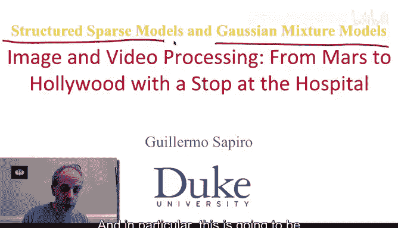
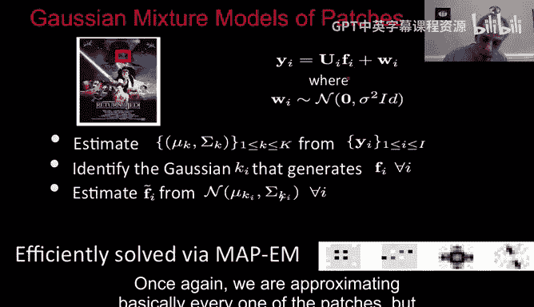
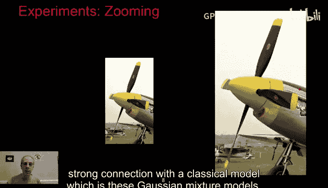
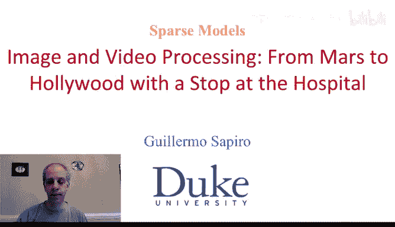

# 图像与视频处理：P73：高斯混合模型与结构化稀疏性 📊

在本节课中，我们将学习高斯混合模型及其与稀疏建模的联系。这有助于我们引入**结构化稀疏模型**的概念。

## 概述

上一节我们介绍了稀疏建模的基本方法。本节中，我们将探讨一种特殊的稀疏模型——高斯混合模型，并揭示其如何自然地引出了**结构化稀疏性**的概念。我们将看到，这种模型在处理图像修复、去模糊和超分辨率等任务时，既能保持稀疏表示的优势，又能带来更高的计算稳定性和效率。

## 图像处理任务背景

我们将使用与之前稀疏建模视频中相同类型的图像处理任务作为示例。

我们的目标是从观测图像 **Y** 中恢复原始图像 **F**。图像 **F** 被某个算子 **U** 退化，并附加了高斯噪声，这与我们之前看到的情况一致。

我们考虑以下几种算子 **U**：
*   **掩码**：允许部分像素通过，阻挡其他像素。我们的任务是**图像修复**。
*   **卷积**：模糊图像。我们的任务是**去模糊**。
*   **下采样**：从小图像生成大图像。我们的任务是**图像缩放**。

## 高斯混合模型方法

与直接对 **F** 进行稀疏建模不同，我们现在考虑对 **F** 使用**高斯混合模型**。

和稀疏建模一样，我们并不直接处理整幅图像，而是处理图像块。我们提取图像中所有可能的重叠图像块。

对于每个图像块 **F_i**，其观测值 **Y_i** 由下式给出：
`Y_i = U_i * F_i + 噪声`
其中，噪声为高斯噪声。

我们将使用 **K** 个不同的高斯分布来建模这些信号块。例如，如果图像块是 8x8 的，我们就有 64 维的向量。我们使用 K 个 64 维高斯分布来建模。为了有个具体概念，我们通常设 K=10，这意味着只需要少量高斯分布。

对于每个高斯分布，我们需要计算其 64 维向量的**均值**和**协方差矩阵**。

## 与PCA和字典学习的联系

将一个高斯分布作为模型，等价于使用**主成分分析** 作为模型。基本思想是，我们可以计算每个协方差矩阵的特征向量和特征值，这些特征向量就构成了一个字典。

每个高斯分布（例如共10个）会给出64个原子（特征向量）。因此，我们最终会得到一个包含 640 个原子的字典，并且这些原子具有特定的结构：每64个原子块对应于一个高斯分布的协方差矩阵的特征向量。

核心思想是：每个图像块由且仅由这K个高斯分布中的一个来建模。我们需要从带噪声的观测图像中估计以下内容：
1.  这K个高斯分布本身（即它们的均值和协方差矩阵）。
2.  对于每个图像块，确定哪一个高斯分布最适合它。
3.  基于以上估计，从观测值中重建原始图像。

## 最大后验期望最大化算法

尽管这个问题看起来很复杂，但实际上并非如此。它可以被**最大后验期望最大化** 算法高效且简单地解决。

基本思路是：如果我们知道了每个图像块最适合的高斯分布，那么重建过程就简化为对该高斯分布进行线性滤波操作。因此，整个重建过程是**分段线性**的。

MAP-EM 算法交替进行以下两步：
1.  **估计高斯分布**：基于当前对图像块所属高斯分布的判断，重新估计每个高斯分布的参数（均值和协方差）。
2.  **估计归属**：基于当前的高斯分布参数，为每个图像块重新分配最可能的高斯分布。

这个过程与 K-SVD 算法类似，但这里我们估计的是整个高斯分布（即一个PCA基），而不是独立的字典原子。通常迭代3-4次即可收敛。

在实践中，我们会用不同颜色标记图像中每个像素（根据其所在图像块选择的高斯分布）。经过几次迭代后，图像中相似的区域会选择同一个高斯分布。

最后，我们通过对覆盖每个像素的所有重建图像块进行平均，来得到最终的图像，这与稀疏建模中的做法一致。

## 与结构化稀疏性的关联

目前看来，我们似乎没有在进行稀疏建模，而是在用高斯混合模型表示图像块。然而，这实际上是稀疏建模的一个特例。

以下是两种模型的对比：

**普通稀疏建模**：
*   我们有一个大的、通常是过完备的字典（例如1000个原子）。
*   我们被允许从中选择 **L** 个原子（例如L=5）。
*   可选择的原子组合数量极其庞大（从K个中选L个的组合数）。这虽然使模型非常丰富，但也导致模型不稳定——图像块的微小变化可能导致完全不同的原子组合被选中。

**高斯混合模型（结构化稀疏）**：
*   字典具有**块状结构**。每个高斯分布对应一个原子块（例如64个PCA基向量）。
*   当我们选择一个高斯分布时，我们选择了**整个原子块**。
*   因此，选择的可能性从天文数字减少到了大约 **K** 种（例如10或20种）。这极大地**稳定了**系统。

这种“原子成组出现、成组使用”的概念，就是**结构化稀疏性**。高斯混合模型是其中一种特例（非重叠的块状结构）。结构化稀疏性意味着原子之间存在相关性，它们要么被一起选中，要么都不选。

## 算法优势与应用示例

这种方法的优势在于，仅需10到20个高斯分布，就能获得与普通稀疏编码相似的结果，但算法更简单、更稳定。它本质上是**融合了结构信息的稀疏建模**。

以下是该方法的应用示例：

1.  **图像修复**：仅使用20%的像素进行观测，通过高斯混合模型重建出高质量的图像，边缘清晰。
2.  **图像超分辨率（缩放）**：从小图像开始，通过该方法放大后，能得到细节丰富、边缘锐利的结果。

## 总结

本节课中，我们一起学习了高斯混合模型及其在图像处理中的应用。我们了解到：
*   高斯混合模型可以视为一种特殊的、具有**块状结构**的稀疏表示。
*   通过**最大后验期望最大化** 算法，可以有效地同时学习模型参数并完成图像重建。
*   这种**结构化稀疏性**的概念，通过限制原子的选择模式（成组选择），在保持模型表现力的同时，显著提高了算法的**稳定性**。
*   该方法与主成分分析等经典技术有紧密联系，为稀疏建模提供了一个新的、有力的视角。

结构化稀疏性是当前图像和信号处理领域非常活跃的研究方向。希望本章内容能帮助你理解这一重要概念。我们下周再见！