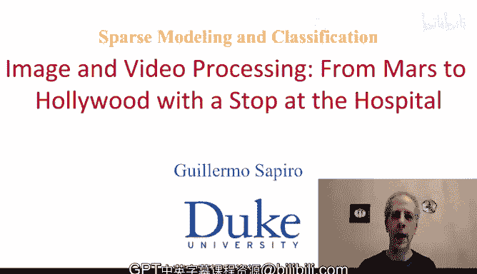
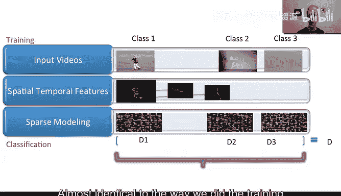
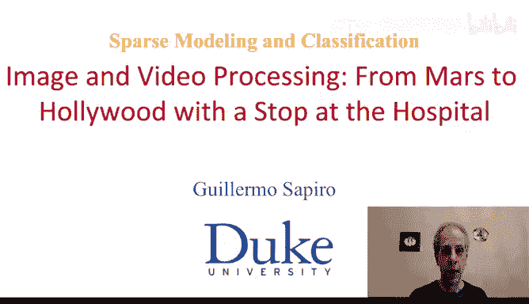

# 图像与视频处理：P74：稀疏建模与分类-活动识别

## 概述
在本节课中，我们将要学习如何利用稀疏建模技术来解决图像与视频分类问题，特别是极具挑战性的视频活动识别任务。我们将从监督分类的基本概念入手，逐步讲解如何为不同活动类别训练专用字典，并利用这些字典对新视频进行分类。最后，我们还将探讨在无监督场景下如何检测活动变化。

---

## 监督分类的基本思路

上一节我们介绍了稀疏建模在分类问题中的应用前景。本节中我们来看看监督分类的具体做法。其核心思想是：我们拥有一组带有标签的训练数据。例如，某个视频被标记为“跳跃”，另一个视频被标记为“奔跑”。我们的目标是利用这些带标签的数据，为每一类活动学习一个专用的字典。

以下是监督分类的关键步骤：

1.  **特征提取**：并非视频中的每一帧都包含有用的活动信息。一种简单有效的特征提取方法是计算**帧差**。当画面静止时，帧差很小；当有物体（如人）运动时，帧差会变大。因此，我们计算连续帧之间的差值来突出活动区域。
2.  **选取有效片段**：我们从帧差视频中提取三维片段（例如，空间上8x8像素，时间上连续5帧）。我们只选择那些能量（即非零像素值或高像素值）超过一定阈值的片段，这些片段包含了主要的运动信息。
3.  **字典学习**：使用上一步选取的有效片段，为每一个活动类别训练一个专用的字典。这个字典在时空维度上都有定义。
4.  **构建全局字典**：为所有类别完成字典学习后，我们将所有类别的字典**拼接**起来，形成一个大型的全局字典。这个全局字典的每个“块”都对应一个特定的活动类别。

经过训练，我们得到了一个结构化的全局字典，其中每个子字典块都编码了一类活动的特征模式。

---

## 对新视频进行分类

在训练阶段，我们为每个类别学习了专用字典。现在，当一个新的、未标记的视频到来时，我们如何利用这些字典对其进行分类呢？

分类过程与训练时的特征提取步骤相似，但核心在于利用已构建的全局字典进行编码和决策。

以下是对新视频进行分类的步骤：

1.  **特征提取**：对新视频进行同样的帧差计算。
2.  **选取与编码**：选取能量足够的时空片段，并使用训练得到的**全局字典**对这些片段进行稀疏编码。编码过程旨在用字典原子的线性组合来重构输入片段，同时要求编码系数尽可能稀疏（即非零系数尽可能少）。
    *   编码目标可表示为：`min ||x - Dα||² + λ||α||₁`，其中 `x` 是视频片段，`D` 是全局字典，`α` 是稀疏编码系数，`λ` 是控制稀疏性的参数。
3.  **类别决策**：由于全局字典是各类别子字典的拼接，编码系数 `α` 也会相应地按块分布。我们检查编码系数的能量主要集中在哪个子字典块上。例如，如果大部分能量集中在第二个块，则判定该视频属于第二类活动。决策规则可以是计算每个块内编码系数的 L1 范数（即绝对值之和），并选择能量最大的那个块所对应的类别。

这个方法的本质是：在训练阶段为每类活动进行字典学习，在测试阶段通过稀疏编码观察新数据与哪个字典“最匹配”，从而完成分类。

---

## 实际应用与结果

为了验证上述方法的有效性，我们使用了一个从YouTube收集的标准视频数据库进行测试。该数据库包含多种活动，如踢足球、跳跃、骑自行车、骑马、跳水等，视频在摄像机、分辨率、质量方面存在很大差异。

我们为每类活动训练一个字典，然后对测试视频进行分类。结果通常以**混淆矩阵**的形式呈现。

混淆矩阵的每一行代表视频的真实类别，每一列代表算法的预测类别。对角线上的数值表示正确分类的百分比。理想情况下，我们希望所有非对角线元素都为0，对角线元素都为1。

实验表明，这种基于稀疏建模和字典学习的方法，即使面对高度可变的视频数据，也能取得当时最先进的分类结果。这证明了该方法的强大鲁棒性和有效性。

---

## 无监督活动变化检测

之前我们讨论了有监督标签情况下的分类。那么，当我们没有任何活动标签时，能否检测视频中活动的变化呢？答案是肯定的。

其核心思想与监督学习类似，但以在线、自适应的方式进行：

1.  **初始化**：取视频开头一段时间（例如1秒）的数据，为其学习一个字典 `D₁`。
2.  **滑动窗口与编码**：将时间窗口向后滑动（如下一个1秒），尝试用之前学习的字典 `D₁` 对新窗口内的数据进行稀疏编码。
3.  **变化判断**：
    *   如果编码效果很好（即编码系数非常稀疏，重构误差小），说明当前窗口的活动与字典 `D₁` 所表示的活动相同，未发生变化。
    *   如果编码效果很差（需要大量字典原子才能重构，即编码系数不稀疏），则说明当前窗口的活动与 `D₁` 所表示的活动不同，发生了**活动变化**。
4.  **字典更新**：当检测到变化时，为新的活动段学习一个新的字典 `D₂`。后续过程可以继续，使用 `D₁` 和 `D₂` 来编码新的数据段，并可能随着新活动的出现而学习更多的字典。

这种方法可以完全无监督地分割视频，标识出其中不同的活动段落。实验显示，其自动检测出的活动变化边界与人工标注的真实边界高度吻合。

此外，通过比较为不同人或不同场景学习的字典是否可以互相很好地编码对方的数据，我们还可以在无监督情况下判断两段活动是否属于同一类别。

---

## 总结
本节课中我们一起学习了如何将稀疏建模应用于视频活动识别。

*   在**监督分类**中，我们为每个活动类别训练一个专用字典，拼接成全局字典后，通过分析新视频在全局字典上的稀疏编码系数的能量分布来进行分类。
*   在**无监督变化检测**中，我们通过在线学习字典并观察其对新数据段的编码稀疏性，来检测视频中活动的切换点。

这种方法概念清晰、实现相对简单，但却在复杂的活动识别任务上展现了强大的性能。它揭示了稀疏表示不仅适用于重建，更是进行有效分类和模式发现的强大工具。