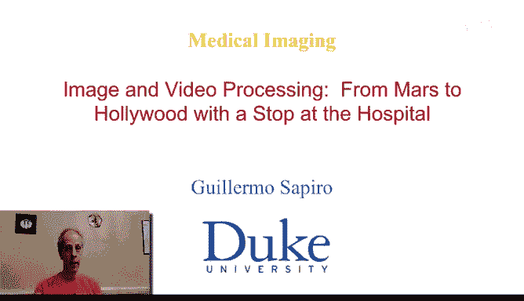
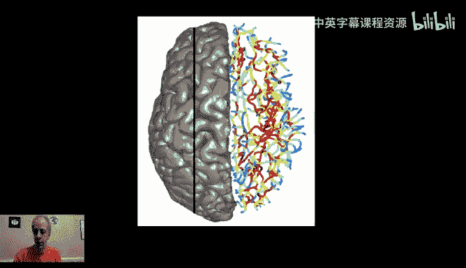
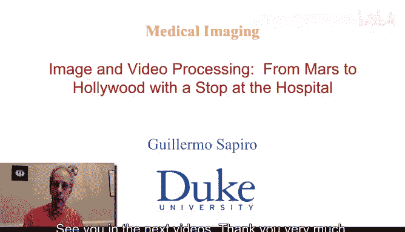

# 图像与视频处理：P75：医学成像导论 🏥

在本节课中，我们将要学习医学成像领域的基本概念、面临的独特挑战以及其巨大的社会价值。医学成像将图像处理技术应用于解决医学和生物学问题，是一个充满机遇的跨学科领域。

## 医学成像的独特性

上一节我们介绍了课程的整体背景，本节中我们来看看医学成像与其他图像处理领域的核心区别。医学成像的一个显著特点是，研究工作通常始于一个具体的、由医学专家提出的实际问题。

以下是两个典型的应用场景示例：

*   **皮肤病变分析**：医生可能带来一些皮肤病变的常规照片，请求帮助自动分割出病变区域，测量其面积、内部特征，甚至在不同时间点跟踪其变化。这可以直接应用**主动轮廓（Active Contours）** 等图像分割技术。处理流程可能包括先进行**图像去噪（Image Denoising）**，再应用主动轮廓算法让初始曲线变形至目标边界。
*   **囊性纤维化汗液检测**：通过检测皮肤贴片上特定曲线的位置，并计算曲线内区域的面积比，可以评估汗液中氯化物的浓度。如果目标曲线接近椭圆，可以使用**霍夫变换（Hough Transform）** 来检测这种参数化曲线；对于非参数化区域，则可以使用**主动轮廓**或**自动阈值算法（Auto-thresholding Algorithm）** 进行分割。

## 基础研究与实际应用

除了解决具体的临床问题，医学成像也涉及大量的基础科学研究。研究人员会利用医学影像数据来探索基本的科学问题。

例如，在神经科学中，通过MRI扫描获取的大脑灰质表面图像上，存在被称为“脑沟（Sulci）”的折叠结构。自动计算这些三维空间中的脑沟曲线，对于构建脑沟网络、理解大脑功能具有重要的基础研究价值，而不仅仅是针对某个特定的医疗应用。

## 跨学科合作与持续学习

医学成像领域最引人入胜的一点在于它是一个持续学习的过程。图像处理专家必须与医生、生物学家、神经科学家等紧密合作。这种合作迫使技术人员不断学习新的医学问题，同时也促使医学专家了解新的技术方法。这种跨学科的紧密协作既充满挑战，也极具乐趣。

在接下来的视频中，我将通过挑选的几个具体例子，进一步阐述医学成像中的一些问题、挑战以及取得成果时的回报。

---

本节课中我们一起学习了医学成像的导论。我们了解到医学成像始于解决具体的医学问题，涵盖了从临床辅助诊断到基础科学研究的广泛应用。它是一个高度跨学科的领域，要求图像处理专家与医学专业人员紧密协作，共同面对挑战，并在此过程中实现持续的学习与成长。