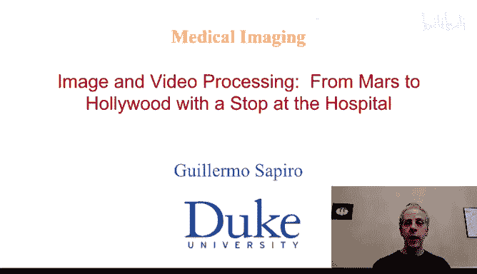
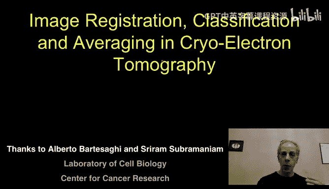
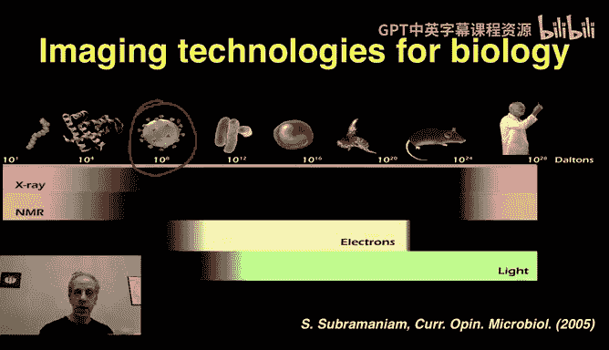
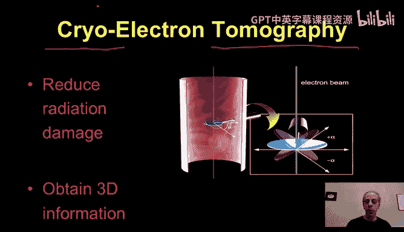
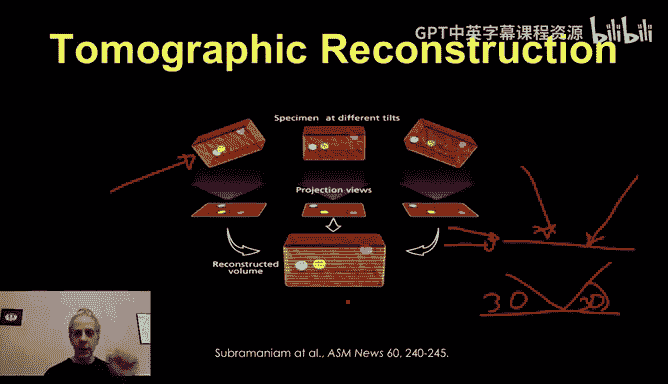
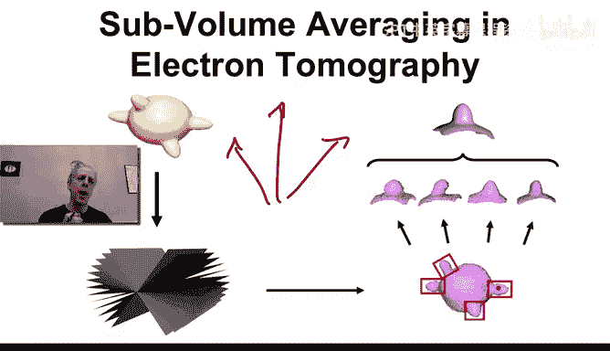
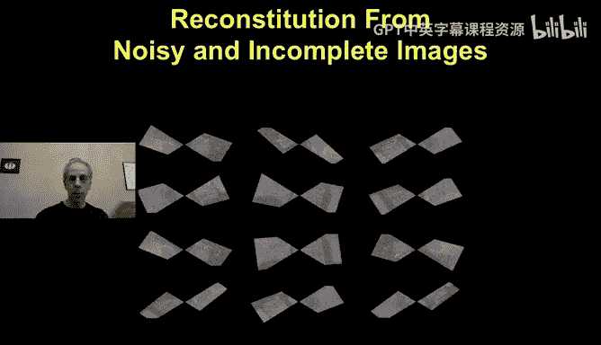
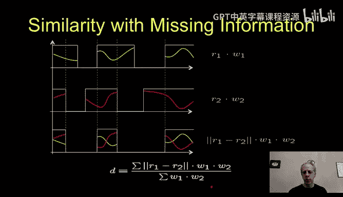
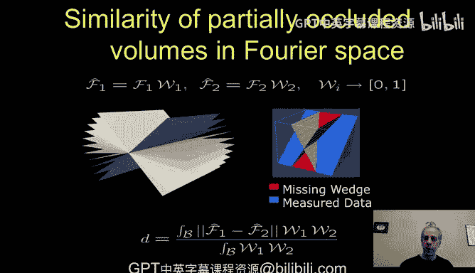
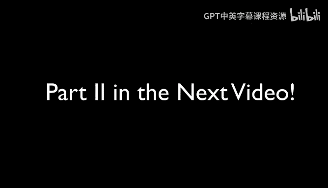

# 图像与视频处理：P76：图像处理与HIV病毒分析 - 第一部分

## 概述

在本节课中，我们将探讨图像处理在医学成像领域的一个特定应用：用于理解病毒形态的图像处理技术，特别是针对HIV病毒。我们将了解如何利用图像处理技术，从极其微小且嘈杂的数据中，重建出HIV病毒表面关键结构的清晰三维图像。

---

## 图像采集：从宏观到纳米尺度

上一节我们介绍了课程主题，本节中我们来看看如何获取用于分析的图像。图像采集有多种方式，而选择何种技术，首先取决于我们试图观察的结构尺寸。

以下是不同尺度结构的示例，以及可能使用的成像技术：
*   **宏观物体**：使用常规相机和可见光。
*   **细胞级别**：使用光学显微镜。
*   **病毒/分子级别**：使用电子显微镜。

在本视频中，我们关注的是病毒，其尺度在纳米或埃米级别。因此，我们不能使用可见光，而需要使用电子来获取图像。

---

## 为何关注HIV病毒？

现在，让我解释为何我们对HIV病毒这种微小结构如此感兴趣。下图虽然略显复杂，但它清晰地展示了我们将面临的挑战以及此项研究的重要性。

图中展示了一个HIV病毒（约100埃米大小）试图附着到宿主细胞上。病毒通过其表面的**包膜**或**刺突**（图中标记为Env）与宿主细胞膜结合，从而实现入侵。我们的研究重点正是这些刺突结构。如果我们能理解其三维结构，就有可能设计方法阻断这种结合，从而阻止病毒传播。这就是我们的目标。

---

## 电子显微镜与断层扫描技术

由于目标结构极其微小，我们必须使用电子显微镜而非光学显微镜。在**透射电子显微镜**中，电子束穿透样本，我们通过测量电子穿透后的情况来形成图像。

然而，仅从一个角度拍摄一张投影图像（如下图）不足以获得三维结构信息，且图像质量通常不佳。

为了获得三维信息，我们采用**断层扫描**技术。具体做法是旋转样本，从多个角度获取一系列投影图像。

此外，我们使用**冷冻**技术。即在成像前将样本冷冻在极低温度下。这有助于减少电子辐射对样本的损伤（电子束会破坏样本形状），并且结合多角度倾斜成像，使我们能够获得三维信息。因此，完整的技术称为**冷冻电子断层扫描**。

下图展示了通过该技术获得的一张切片图像。我们的目标是图中那些微小的刺突结构，但图像噪声非常大。

---

## 数据采集与对齐的挑战

我们通过旋转样本获得多个角度的投影图，然后将它们组合起来重建三维结构。通常，我们会使用**金颗粒**作为标记物。将这些金颗粒嵌入样本，由于它们在每个投影图中的位置已知，我们可以据此对齐所有图像。

然而，这里存在一个关键问题：**缺失楔**。由于样本非常薄，我们无法从所有角度（完整的180度）进行投影，通常会缺失两端各约30度的数据。这意味着我们采集的数据本身就不完整。

---

## 图像处理的核心任务与挑战

经过对齐和初步重建，我们得到的是一个充满噪声的三维数据体（如下图切片所示）。我们几乎无法用肉眼直接识别出刺突结构。

但幸运的是，我们拥有**多个**病毒颗粒的拷贝，因此也就有多个刺突结构的拷贝。图像处理的核心思路就是利用这一点。如果我们能将多个相同结构的噪声版本对齐并平均，噪声就会被抑制，从而得到清晰的结构。

这引出了三大挑战：
1.  **图像非常嘈杂**：信噪比极低。
2.  **需要对齐**：所有拷贝都处于随机旋转状态，必须精确对齐才能进行平均。
3.  **存在缺失数据**：“缺失楔”问题使得对齐和比较更加困难。

下图生动地模拟了这一难题：我们有三类原始结构，经过冷冻电镜断层扫描后，得到的是大量经过随机旋转、充满噪声且带有数据缺失的混合图像。图像处理的任务就是从这堆混乱的数据中，重新分类、对齐并还原出清晰的结构。

---

## 定义鲁棒的距离度量

解决上述问题的第一步，是定义一个能够处理噪声和缺失数据的**距离度量**。我们需要判断两个图像（或三维结构）是否已经对齐。

假设我们有两个一维信号（用于简化说明），每个信号都因“缺失楔”而只在部分区域有值。两个信号的缺失区域由于旋转而不同。

我们只能在两个信号**都有数据**的区域进行比较。因此，距离公式需要加权处理，只考虑这些重叠区域。

一个常用的方法是计算加权欧氏距离。设两个图像为 **I₁** 和 **I₂**，它们的有效区域掩膜为 **M₁** 和 **M₂**（有数据处为1，缺失处为0）。则距离 **D** 可以表示为：

**D(I₁, I₂) = Σ [ (M₁(x) * M₂(x)) * (I₁(x) - I₂(x))² ] / Σ [ M₁(x) * M₂(x) ]**

其中，求和仅在所有位置 **x** 上进行。分子计算的是重叠区域内的像素差平方和，分母是重叠区域的面积，用于归一化。这个距离度量对缺失数据具有鲁棒性，并且为了方便计算（以及表示缺失楔），通常在傅里叶域内进行。

---

## 总结

本节课中，我们一起学习了图像处理在HIV病毒结构分析中的应用背景。我们了解到，由于病毒尺度极小，必须使用冷冻电子断层扫描技术来获取三维数据，但这带来了低信噪比、随机旋转和数据缺失（缺失楔）等严峻挑战。图像处理的任务，就是从这些嘈杂、不完整的多个结构拷贝中，通过定义鲁棒的距离度量进行对齐和分类，最终通过平均来抑制噪声，重建出清晰的三维结构。在接下来的部分，我们将继续探讨如何实现这一对齐和分类过程。