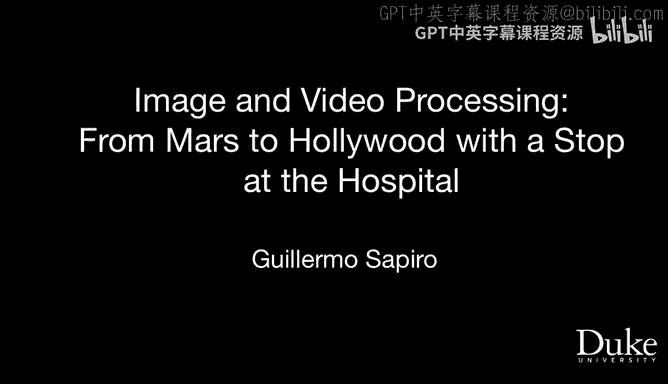

# 图像与视频处理：从火星到好莱坞，途中停靠医院｜P79：致谢

## 概述
在本节课中，我们将一起回顾并整理课程最后一节视频的内容，完成本系列学习的收尾工作。

---

大家好，欢迎来到我们图像处理课程的最后一个视频。

非常感谢大家与我们共度了九周的学习时光。

我想感谢这些伙伴们，他们帮助了你们，也帮助我将这门课程组织起来。你们在论坛中可以看到他们非常活跃，基本上回答了你们所有的问题。

我再次感谢你们花费九周时间与我们在一起，并投入了大量的时间。我希望你们在学习过程中感到愉快，并且学到了很多关于图像和视频处理的知识。

期待再次见到你们，也许就在杜克大学。

非常感谢，再见。

---

## 总结
本节课中我们一起学习了课程最后一节致谢视频的内容，回顾了整个学习旅程，并对所有参与者和学习者表达了感谢。至此，本系列课程圆满结束。