# 图像与视频处理：P8：基础图像操作

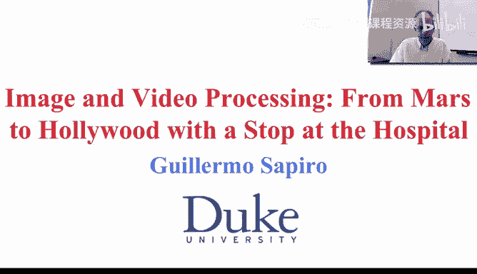

## 概述
在本节课中，我们将学习计算机中图像的基本表示方法，并探索一系列可以在这些二维像素数组上进行的简单而强大的操作。我们将从理解像素邻域的概念开始，逐步介绍图像加法、减法、逻辑运算、空间滤波、几何变换等基础操作，并了解这些操作的实际应用。

---

## 像素邻域

上一节我们介绍了图像在计算机中表示为离散的二维数组。本节中，我们来看看如何定义和处理像素之间的关系，即“邻域”。

在图像处理中，有两种标准的邻域定义：

*   **四邻域**：一个像素的邻居仅包括其正北、正南、正东、正西四个方向的像素。其关系可以表示为：一个像素 `(x, y)` 的四邻域是 `{(x-1, y), (x+1, y), (x, y-1), (x, y+1)}`。
*   **八邻域**：一个像素的邻居包括其周围所有八个方向的像素（包括对角线方向）。其关系可以表示为：一个像素 `(x, y)` 的八邻域是 `{(x-1, y-1), (x-1, y), (x-1, y+1), (x, y-1), (x, y+1), (x+1, y-1), (x+1, y), (x+1, y+1)}`。

选择哪种邻域定义至关重要，它会直接影响后续图像处理操作（如分割）的结果。八邻域是目前更常用的定义。

---

## 基础算术与逻辑运算

既然图像是二维数组，我们就可以像处理数字矩阵一样对它们进行运算。以下是几种核心操作：

### 图像加法
图像加法是指将两幅图像对应位置的像素值相加。公式为：
`结果图像(x, y) = 图像A(x, y) + 图像B(x, y)`

一个经典应用是**图像平均降噪**。例如，NASA拍摄同一静态星系的多张照片，每张都含有随机噪声。将这些对齐的图像相加并取平均后，信号（不变的星系）得到增强，而随机噪声则相互抵消，从而得到更清晰的图像。

### 图像减法
图像减法是指计算两幅图像对应像素值的差。公式为：
`差值图像(x, y) = 图像A(x, y) - 图像B(x, y)`

这在医疗影像分析中非常有用。例如，对比注射造影剂前后的血管图像，通过减法可以突出显示发生变化的区域（如新增的血管），辅助医生诊断。

### 逻辑运算
我们可以对二值图像（像素值通常为0或255）进行逻辑运算。

*   **并集 (OR)**：`结果 = A | B`，合并两幅图像中的白色区域。
*   **交集 (AND)**：`结果 = A & B`，只保留两幅图像中均为白色的重叠区域。

### 图像取反
图像取反是将图像的灰度值进行反转，使黑色变白，白色变黑。转换关系通常为：
`新像素值 = 255 - 原像素值`

这有时能使图像中的某些物体更容易被观察。

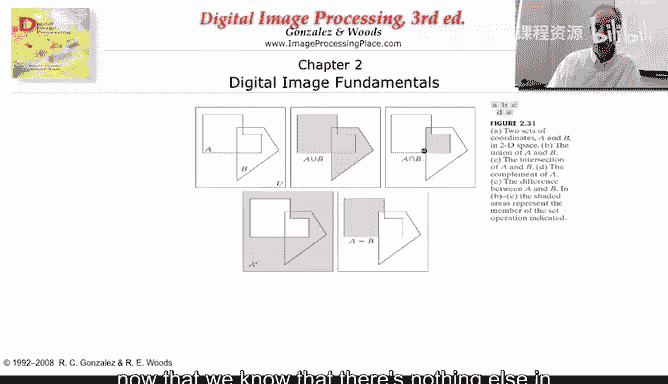

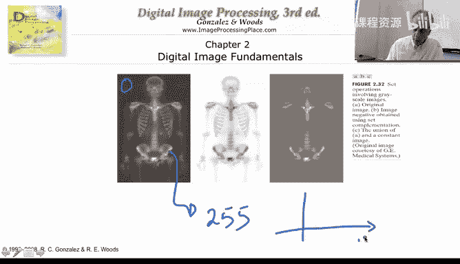

---

## 空间滤波：邻域平均

除了对整个图像进行运算，我们还可以基于像素的局部邻域进行操作，这称为空间滤波。

一个最简单的例子是**邻域平均滤波**。其操作是：对于图像中的每一个像素，用其周围像素（包括自身）的平均值来替换它。

假设我们采用八邻域，对于一个像素 `I(x, y)`，其新值计算公式为：
`新I(x, y) = (1/9) * Σ I(x+i, y+j)`，其中 `i, j ∈ {-1, 0, 1}`

这个操作能有效平滑图像、抑制噪声，但副作用是会使图像变得**模糊**，因为边缘和细节也被平均化了。后续课程将学习更智能的滤波方法，能在降噪的同时更好地保持边缘。

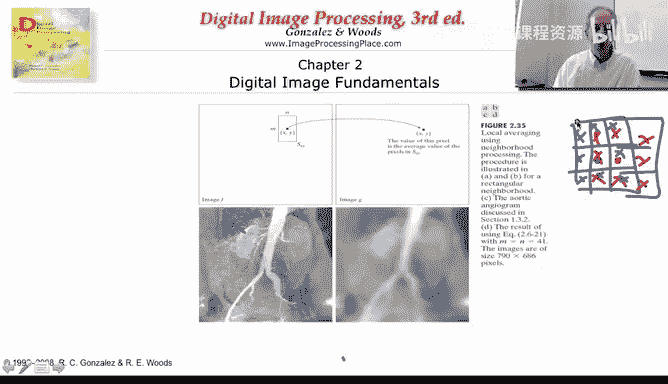

---

## 几何变换

我们还可以对图像进行整体的几何变换，这相当于对像素坐标进行重排。

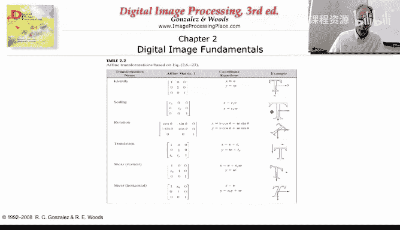

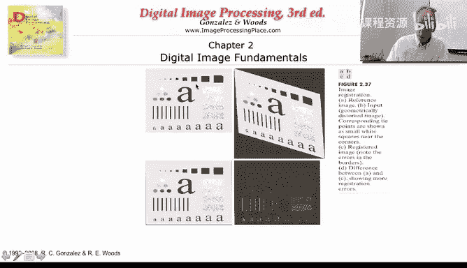

常见的几何变换包括：
*   **平移**：将图像整体移动。
*   **旋转**：将图像绕某点旋转一定角度。
*   **缩放**：改变图像的尺寸。

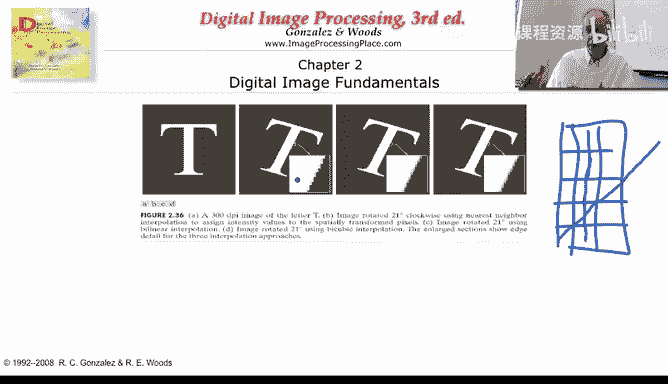

在数字图像中进行这些变换时，会遇到**采样和量化**带来的问题。例如，旋转一条直线后，在离散的像素网格上，它可能呈现锯齿状。变换次数越多，这种由离散化引起的误差积累可能越明显。

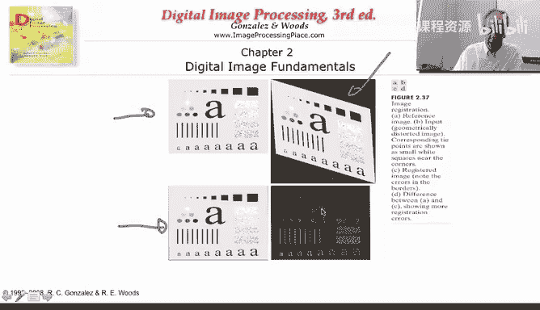

---

## 频域变换简介

另一种强大的图像处理方式是将图像从空间域转换到**频域**（例如通过傅里叶变换或离散余弦变换）。

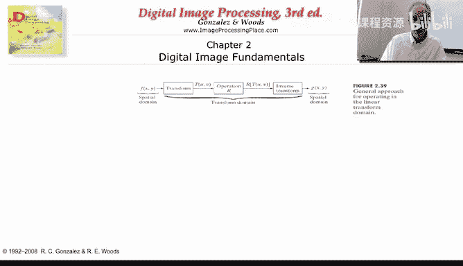

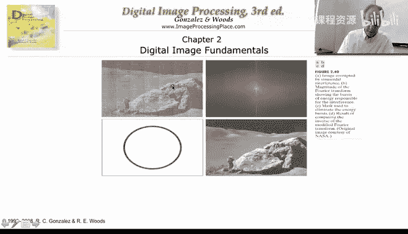

基本流程是：
1.  将图像 `I` 通过某种变换（如傅里叶变换）得到频域表示 `F(I)`。
2.  在频域 `F(I)` 中对特定频率成分进行滤波或修改。
3.  将修改后的频域数据通过逆变换还原回空间域，得到处理后的图像。

这种方法在图像压缩和某些类型的去噪中非常有效。即使不了解变换的数学细节，也可以将其理解为一种在图像的另一种“表示形式”中进行操作的手段。

---

## 总结

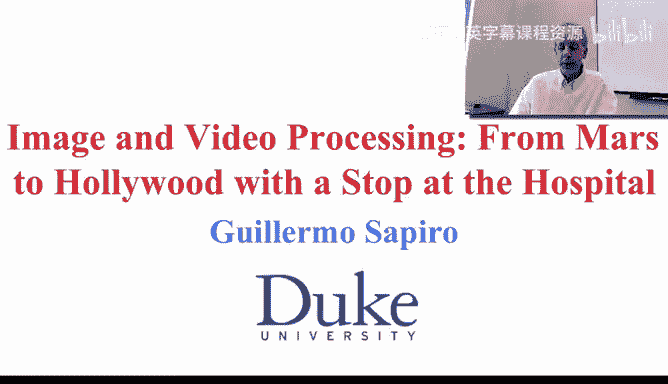

本节课我们一起学习了计算机中图像的基础操作。我们了解到图像本质上是二维像素数组，因此可以对其进行：
1.  **像素级运算**：如加、减、取反、逻辑运算，用于图像增强、比较和合成。
2.  **邻域操作**：如平均滤波，利用像素周围的局部信息进行平滑或特征提取。
3.  **几何变换**：如旋转和缩放，改变了图像的坐标空间。
4.  **域变换**：如转换到频域进行处理，为压缩和滤波提供了强大工具。

这些简单操作是构建复杂图像处理算法的基石。同时，我们也看到了离散化表示带来的挑战，如图像模糊和旋转失真，这提醒我们在设计算法时需要仔细考虑数字图像的本质。