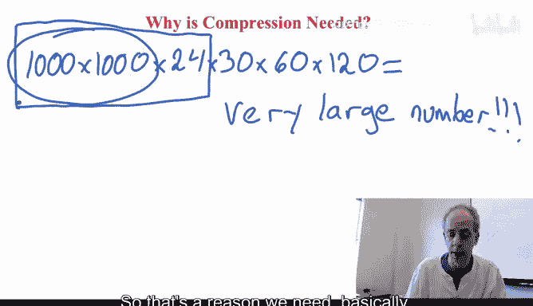
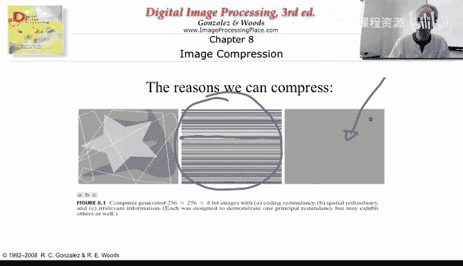
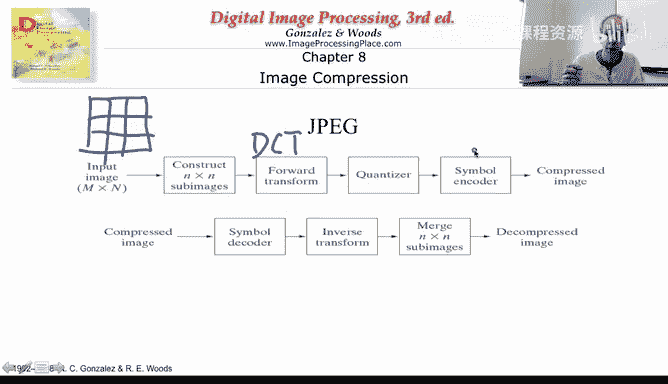
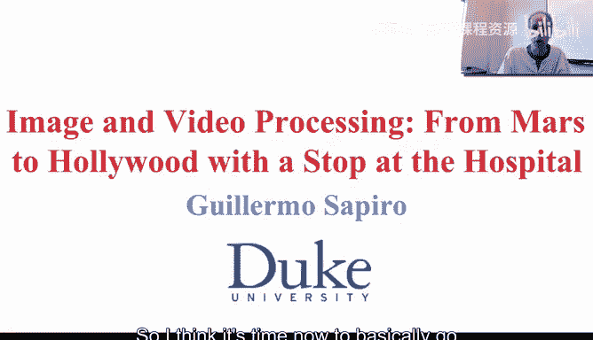

# 图像与视频处理：P9：09_02_01_1-压缩的原理与方法

在本节课中，我们将要学习图像与视频压缩的基本原理与方法。压缩技术是图像与视频处理领域最成功的应用之一，它使得我们能够在有限的存储空间和带宽下保存和传输海量的视觉信息。

## 为什么需要压缩？📊

上一节我们介绍了课程的整体安排，本节中我们来看看为什么压缩是必要的。这并不难解释，我们可以通过一些数字来理解。

假设我们有一幅分辨率为1000x1000像素的图像。按照今天的标准，这属于低分辨率图像。我们通常使用8位（即256个级别）来表示每个颜色通道（红、绿、蓝）。这意味着每个像素需要24位（3通道 x 8位/通道）来表示。

因此，单张图像的数据量为：
`1000 * 1000 * 24 bits = 24,000,000 bits`

如果考虑视频，情况会变得更加严峻。标准视频每秒有30帧。那么：
*   一秒钟视频：`24,000,000 bits/frame * 30 frames = 720,000,000 bits`
*   一分钟视频：`720,000,000 bits/sec * 60 sec = 43,200,000,000 bits`
*   一部两小时的电影：`43,200,000,000 bits/min * 120 min = 一个极其庞大的数字`

即使对于单张图像，数据量也非常大。如果不进行压缩，我们无法在手机或电脑中保存大量图像和视频。因此，压缩技术是存储和传输这些视觉数据的必要条件。

## 为什么能够压缩？🔍

既然数据量如此庞大，我们为什么能够对其进行压缩呢？主要有三个原因。

第一个原因是**冗余**。在图像中，并非所有像素值出现的频率都相同。某些灰度值或颜色值会出现得更频繁，而另一些则很少出现。例如，在一幅图像中，背景的灰色可能占据了大部分像素，而白色的线条只占少数。如果我们用8位（256种可能）只表示4种实际出现的颜色，就是一种浪费。我们可以利用这种统计特性进行压缩。

第二个原因是**空间冗余**。这可以通过一个简单的例子来说明。假设图像中有一条非常长的水平线，其灰度值恒定为128，并且这条线有10000个像素长。

以下是两种极端的表示方法：
*   **低效方法**：连续存储10000次“128”。这需要 `10000 * 8 bits = 80,000 bits`。
*   **高效方法（行程编码）**：只存储两个数字：像素值“128”和重复次数“10000”。这只需要很少的比特数。

虽然这是一个极端例子，但图像中经常存在大片的均匀区域或具有几何一致性的部分，我们可以利用这种空间连贯性进行高效压缩。视频中的连续帧之间也存在大量相似性，这为视频压缩提供了巨大空间。

第三个原因是**视觉冗余**。图像中包含大量人类视觉系统不敏感或无关紧要的信息。例如，一个平坦区域的灰度值从128变为127，人眼可能根本无法察觉。因此，我们可以在不显著影响主观视觉质量的前提下，舍弃或近似表示这部分“不相关”的信息。

我们将利用以上所有原因来实现高效的压缩。

## 压缩标准的重要性 📜

图像与视频压缩之所以如此成功，很大程度上得益于其标准化。标准确保了不同设备、软件之间的兼容性。

对于静态图像，最流行的标准包括：
*   **JPEG**：绝大多数数码相机使用的有损压缩标准，我们将在后续重点讲解。
*   **JPEG-LS**：一种无损压缩标准，能够精确还原原始图像，不丢失任何信息。
*   **JPEG 2000**：更新的压缩标准，采用了更先进的技术。

对于视频，同样存在广泛使用的标准，例如MPEG家族（如MPEG-2, MPEG-4）等。当我用手机拍摄一段视频并发送给朋友时，我希望他们能够播放它，这就要求我们都遵循相同的压缩和解压规则。

正是这些通用标准的存在，使得制造商可以放心地在设备中集成压缩技术，用户也可以无障碍地分享视觉内容。

## 通用压缩流程 🧩

通用的图像压缩技术流程主要包含三个核心步骤，它们分别对应了我们之前提到的压缩原理。

整个流程从原始图像开始，首先经过一个**映射器**。映射器的作用是将图像从原始像素域转换到另一个更有利于压缩的域。常见的映射包括傅里叶变换、离散余弦变换（DCT）等，有时也会直接在空间域处理相邻像素的关系。我们稍后会详细讨论。

映射之后是**量化**。量化是引入误差、实现压缩的关键步骤，它处理的是视觉冗余。例如，一个像素值为17，如果我们采用步长为2的均匀量化器，可能会将其近似为16或18。量化会损失一些信息，使我们无法精确重建原始图像，但只要设计得当，人眼几乎察觉不到差异。JPEG中使用的正是这类量化技术。

最后一个步骤是**符号编码**。经过映射和量化后，我们得到了一系列待传输或存储的数值。符号编码利用信息论原理，高效地表示这些数值。它主要解决的是统计冗余问题，即用更短的代码表示出现频率高的值，用较长的代码表示出现频率低的值（如哈夫曼编码）。这一步在比特层面实现了进一步的压缩。

压缩后的数据形成一个文件。在解码端，过程正好相反：先进行符号解码，然后进行反量化（但无法完全恢复量化损失的信息），最后进行逆映射，最终得到重建的图像。如果压缩是无损的（如JPEG-LS），重建图像将与原始图像完全相同；如果是有损的（如JPEG），重建图像将是原始图像的一个高质量近似。

这个流程也解释了为什么需要标准：编码器使用的映射、量化和编码方法，解码器必须完全知晓并能够逆向执行，才能正确还原图像。

## JPEG：一个成功的范例 🖼️

JPEG是上述通用压缩流程的一个完美范例，也是应用最广泛的图像压缩标准。

JPEG的工作流程如下：
1.  **分块**：将整幅图像划分为多个 `8x8` 像素的小块。我们后续会解释为什么选择这个尺寸。
2.  **变换**：对每个 `8x8` 块进行**离散余弦变换（DCT）**。这就是“映射”步骤，将图像从空间域转换到频率域。
3.  **量化**：对DCT系数进行量化。JPEG使用一个量化表来定义不同频率分量的量化步长，通常对高频信息（人眼不敏感）采用更粗的量化。
4.  **编码**：对量化后的系数进行**熵编码**（如哈夫曼编码）。这实现了最终的比特压缩。

解码器则执行相反的过程：解码、反量化、逆DCT变换，最后将各个 `8x8` 块拼接起来，形成重建的图像。

此外，JPEG还会利用颜色空间（如从RGB转换到YCbCr）和色度下采样来利用颜色通道之间的冗余，从而获得更高的压缩比。

JPEG的成功证明了映射、量化和符号编码这一流程的有效性。在本单元的后续课程中，我们将深入探讨每个环节的细节。

## 总结 📝

本节课中我们一起学习了图像与视频压缩的基础知识。我们首先通过计算理解了**为什么需要压缩**——因为原始视觉数据量极其庞大。接着，我们探讨了**为什么能够压缩**，这归因于数据中的统计冗余、空间冗余和视觉冗余。然后，我们认识了**压缩标准**的重要性，它保证了技术的通用性和互操作性。之后，我们剖析了**通用压缩流程**的三个核心步骤：映射、量化和符号编码。最后，我们以**JPEG标准**为例，看到了这一流程在实际中的成功应用。从下一节课开始，我们将深入这个流程的每一个组成部分。