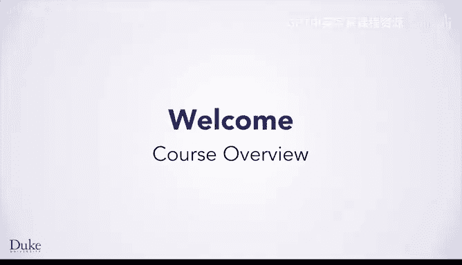
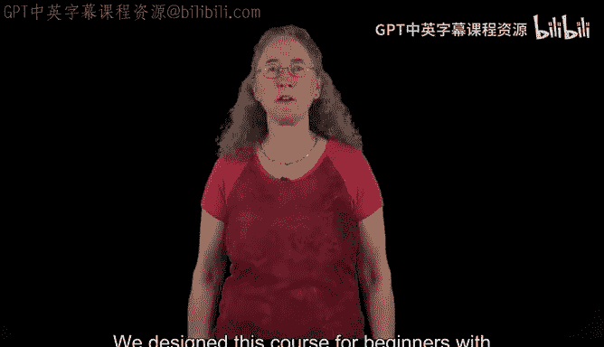
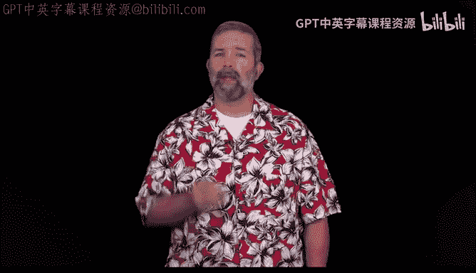
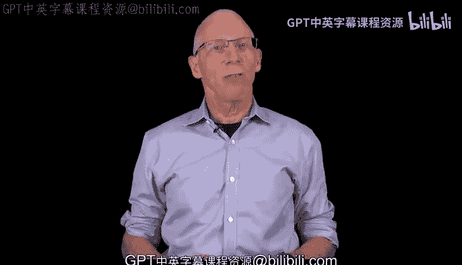

# 编程基础：01：课程概览 🚀

在本节课中，我们将要学习杜克大学《Java编程和软件工程基础》专项课程的第一门课。这门课程专为编程初学者设计，旨在教授如何使用JavaScript、HTML和CSS进行编程和网页开发。我们将从基础开始，逐步学习如何像程序员一样思考、分析和解决问题。

## 课程介绍与目标

大家好，我是Susan。我很高兴能与杜克大学的团队合作，为大家介绍这门使用JavaScript、HTML和CSS的计算机编程基础课程。这门课程专为没有任何编程经验、但希望开始探索编程职业的初学者设计。

在本课程中，你将开始学习如何像程序员一样思考。这包括分析问题、设计被称为“算法”的解决方案，以及将你的算法转化为程序。

## 你将学习的内容

以下是本课程的核心学习路径：

*   **第一周：网页结构基础**
    在第一周，你将学习使用HTML创建自己的网页。HTML是定义网页结构的语言。同时，你将学习CSS，这种语言可以让你轻松改变网页的外观。

*   **第二周：编程与图像处理**
    接下来在第二周，我们将解决“绿幕”问题。我和Drew（你稍后会认识他）将带着恐龙一起进入外太空。为了实现这个目标，我们将使用我们设计的特殊JavaScript库，学习一些重要的JavaScript编程概念，重点是操作图像。你将获得的编程概念和技能，无论你将来使用JavaScript还是任何其他编程语言，都将使你受益匪浅。

*   **第三周：创建交互式网页**
    在第三周，我们将把HTML、CSS和JavaScript技能结合起来，使你的网页具有交互性。到本课程结束时，你将设计出一个允许用户上传图像文件并应用你创建的图像滤镜的网页。

## 核心编程思维

大家好，我是Drew。你将学习的最重要的概念之一是如何解决编程问题。这将为你理解计算机科学家在编写程序时的所思所为打下基础。无论你是继续深入学习编程，还是需要与计算机科学家合作共同创建程序，这些知识对你都很有用。

你将学习的技能适用于任何编程语言，而不仅仅是JavaScript。虽然其他语言的语法可能略有不同，但你将学到相同的基本原则是相通的。

## 后续学习路径

大家好，我是Owen。完成这门课程后，你将准备好制作网页，并能够使用JavaScript以及其他语言进行编程。

如果你决定继续学习我们的Java编程专项课程，你将运用本课程中学到的编程基础，学习如何使用Java解决问题和编写代码。

此外，你在本课程中学到的网页开发技能，将在我们的毕业设计项目中派上用场。在那里，你将学习创建一个网页来托管你构建和开发的推荐系统，类似于亚马逊或网飞根据用户偏好推荐书籍或电影的方式。

## 总结

本节课中，我们一起学习了这门编程基础课程的整体概览。我们了解到，课程将从零开始，通过HTML、CSS和JavaScript，带领我们学习分析问题、设计算法、编写程序，并最终创建交互式网页。这些技能是编程的通用基础，为我们后续学习Java或其他编程语言铺平了道路。

现在你已经了解了这门课程的内容，让我们开始学习吧！