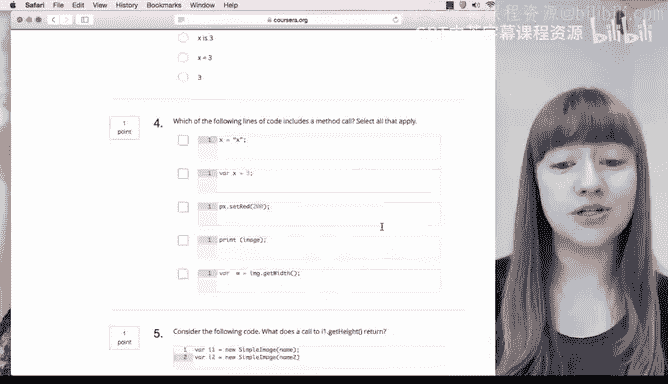

# Java编程和软件工程基础：1：助你成功的资源 🛠️

在本节课中，我们将介绍本课程的重要资源，并为你提供一些成功学习的建议。了解这些工具和材料将帮助你更有效地学习编程。

我是杜克大学教学团队的伊丽莎白。在开始本课程之前，我希望确保你了解一些重要的资源，并为你提供一些取得好成绩的建议。

## 课程结构与资源 📚

在本课程中，你会看到标注为“试一试”的阅读材料和编程练习。“试一试”阅读材料鼓励你亲自尝试视频中看到的内容，以便获得更多编写代码的练习机会。

编程练习包含指导说明，帮助你编写自己的程序。此外，还有测验，以确保你理解视频中的所有内容，并检查你的代码是否正确运行。

## 课程网站导航 🌐

接下来，我想向你展示课程网站：**learn to program dot com**。你可以看到，我们为每门课程都设有专属页面，还有一个关于专项课程的常见问题解答页面。这个页面涵盖了从证书到课程中使用的软件等所有内容。

如果你回到主页并选择你正在学习的课程，你将进入该课程的主页。

### 杜克JavaScript环境

首先，让我们看看杜克JavaScript环境。你将在课程后期详细了解它的功能。目前，只需记住你可以在**Course1 Duke Learner Program**网站上找到它。

**项目资源**包含视频中的示例，你可以更详细地查看这些代码或进行实验。

**文档**部分总结了你在本课程中将学习的HTML、CSS和JavaScript知识。如果你想复习HTML元素的语法或查看可以使用的JavaScript方法，这将非常有用。请注意，这不是所有HTML、CSS和JavaScript的完整文档，但它是本课程的有用参考。

### 常见问题解答页面

此外，我们还有常见问题解答页面。当你对作业或测验有疑问时，首先应该查看FAQ页面，看看我们是否已经为你提供了答案。这个页面包含关于Course1的问题。由于我们处于网站的第一部分，关于整个专项课程的问题，这里有一个链接可以带你回到之前看到的通用FAQ页面。

## 总结与反馈 💡

本节课中，我们一起学习了本课程的结构以及你需要了解的资源。希望这个视频让你对课程结构有了初步了解，并知道了需要掌握哪些资源。如果你对我们如何使这些资源对你更有用有任何反馈，请在Coursera的讨论论坛中告诉我们。