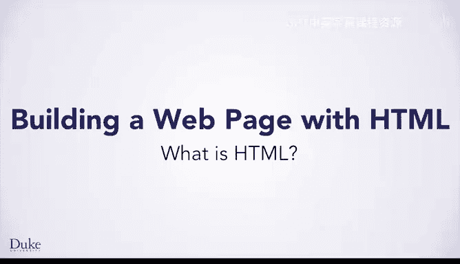
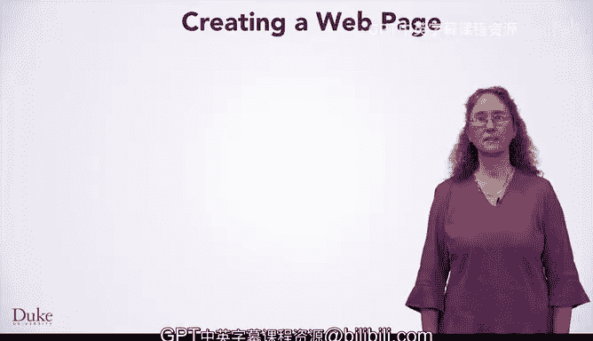
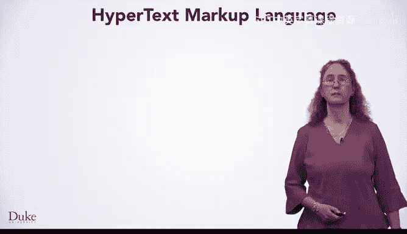

# 005：什么是HTML





## 概述

在本节课中，我们将要学习网页的基础知识，特别是用于创建网页的语言和概念。你将了解什么是HTML，它如何工作，以及如何开始创建你自己的网页。

---

## 什么是网页

你很可能对网页非常熟悉。你浏览过许多网页，例如维基百科的页面。你会发现，有些网页易于阅读，有些则包含有趣的链接、文字、图片、视频等元素。

这里有一个描述网页的维基百科页面。这个页面里包含了一张网页的图片，所以我们是在讨论一个包含网页图片的网页，其中充满了信息和趣味。

你将学习创建网页的基础知识。你自己的想象力和创造力将帮助你应用这些知识来创建属于你自己的页面。

## 网页的构成要素

以下是网页中常见的几种元素：

*   **强调文本**：网页上可能有加粗或强调的文本。你将学习如何让网页的某些部分比其他部分更突出。
*   **超链接**：网页上包含指向其他页面的链接。链接彻底改变了人们使用互联网的方式，通过跟随链接，你可以学习到惊人的知识。
*   **多媒体**：网页可以包含图片。你也可以在网页上放置视频和音频，但我们将首先学习图片，因为它们的使用和获取相对简单。

## 网页地址：URL

要访问一个特定的网页，你需要该网页的地址。这个地址本身不是网页的一部分，而是用于在线访问网页。一旦你分享了地址，世界上的任何人都可以访问你的网页。在本课程中，你将创建可以与全世界任何人分享的网页。

这个地址被称为**URL**，即统一资源定位符。



## 超文本标记语言

为了编写网页，你将学习**超文本标记语言**。这是用于创建网页的语言。大多数人使用**HTML**作为超文本标记语言的缩写，这样说起来更容易，在网上搜索信息时也更方便。


请注意，学习HTML并不是在学习一门编程语言，而是在学习一种**标记语言**。HTML不像编程语言那样在计算机上运行，而是由**网络浏览器**用来显示网页。

你可能写过文档，在文档中选中文本并将其设置为加粗、下划线或斜体。这是一种标记文本以特定方式显示的方法。HTML使用称为**标签**的结构化标记，网络浏览器使用这些标签来显示网页。

当你编写HTML时，你可以描述你希望在创建的网页中出现什么。浏览器使用HTML来**渲染**网页，使其可以在计算机、手机或任何运行浏览器的地方被查看。

因为HTML是一种标记语言，所以这种描述不仅包括文本和图像，还包括描述你所需格式的标记。例如，你刚才看到的加粗文本、下一课中将看到的表格，或者其他多种显示信息的方式。

你将使用HTML来指定**含义**，比如“加粗”或“链接”，但不会用HTML来指定如何显示加粗文本（例如使用什么颜色）。为此，你将使用另一种语言，稍后也会学到一点。

## 样式与标准

有不同的方式来显示项目。稍后你将学习**CSS**，它提供了增强网页显示效果的方法。

你可以指定想要强调某些文本，但具体如何显示强调文本呢？CSS让你可以描述这一点。可能是斜体，可能是加粗，也可能是巨大且红色的字体。你将在后续课程中学习CSS。

为了让不同的浏览器能够解释HTML和网页，必须存在**标准**。**HTML5**是HTML的当前版本。它是一个协作标准，由世界各地许多人共同制定。

HTML的第一个标准在1993年制定。那时大多数人使用非常慢的调制解调器连接互联网，网页简单得多，图片加载缓慢。如今，我们拥有图像、视频、音频等更多内容，但我们仍然拥有HTML标准，并且这个标准会随着互联网和网络能力的发展而更新。

HTML的最新标准在2014年制定，它随着时代的变化而发展。HTML5支持的多媒体功能在1993年是难以想象的。

## HTML示例解析

下面是一个网页的HTML代码示例及其显示效果：

```html
<!DOCTYPE html>
<html>
  <head>
    <title>Hello World Page</title>
  </head>
  <body>
    <p>Hello world</p>
  </body>
</html>
```

你会看到HTML标记包含许多**标签**。每个标签都用尖括号与标签之间的内容区分开。

我们将查看此页面中使用的标签，同时你也会注意到，显示的网页并不展示标签本身，它只显示短语“Hello world”。你可以在浏览器的标签页上看到网页的标题“Hello World Page”。

1.  首先，你会看到 `<!DOCTYPE html>` 声明，它指示我们正在使用HTML来定义网页的组成部分。
2.  网页内容定义在起始的 `<html>` 标签和结束的 `</html>` 标签之间。所有使用HTML的有效网页都包含这些标签。正如我们将看到的，有一个开始标签和一个结束标签，它们相互匹配，但结束标签带有一个斜杠 `/` 表示结束。
3.  接下来，所有头部信息定义在起始的 `<head>` 标签和结束的 `</head>` 标签之间。同样，结束标签是 `</head>`，匹配的开始标签是 `<head>`。
4.  然后，你会看到 `<title>` 标签。请注意，起始 `<title>` 和结束 `</title>` 标签之间的所有内容都将显示为网页的标题，即“Hello World Page”。
5.  接着，高亮显示的是页面的 `<body>` 标签。你在起始 `<body>` 和结束 `</body>` 标签之间放置的任何内容都将显示为网页的主体部分。
6.  最后，我们看到在起始 `<p>` 和结束 `</p>` 标签之间有一个简短的段落。你可以看到该内容“Hello world”显示在网页中。

我们经常会看到这种HTML结构：位于 `<body>` 标签之间的内容，就是用户查看网页时实际看到的部分。

---

## 总结

本节课中，我们一起学习了网页的基础构成和创建网页的核心语言——HTML。我们了解到HTML是一种标记语言，使用标签来描述网页的结构和内容，如文本、链接和图片。浏览器读取这些HTML标签并将其渲染成可视化的网页。我们还简单了解了网页地址（URL）的作用以及HTML标准（HTML5）的重要性，并通过一个简单的“Hello World”示例，直观地看到了HTML代码与最终网页显示效果之间的关系。掌握这些基础知识，是迈向创建你自己网页的第一步。