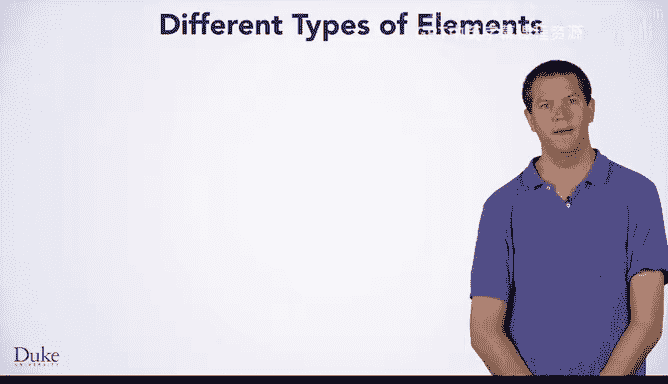

# 006：元数据与分区元素 📄

在本节课中，我们将更深入地了解HTML中不同类型的标签或元素。我们将重点介绍两大类元素：元数据元素和分区元素。理解这两类元素是构建网页结构的基础。



## 元数据元素 🔍

上一节我们提到了HTML的基本结构，本节中我们来看看元数据元素。元数据元素包含了关于网页本身的信息，它们不直接显示在页面上，但对浏览器和搜索引擎至关重要。

以下是几个关键的元数据元素及其作用：

*   **`<html>` 标签**：这是一个元数据元素。所有其他元素都必须定义在 `<html>` 开始标签和结束标签之间。它告诉浏览器应使用HTML标准来显示该网页。
*   **`<head>` 标签**：这也是一个元数据元素。它包含了关于网页的通用信息，例如标题、脚本信息以及使用CSS显示页面的信息。
*   **`<title>` 标签**：这同样是一个元数据元素。它指定了网页的标题文本，并且必须嵌套在 `<head>` 的开始和结束标签之间。

例如，以下是 `Dukelearntoprogram.com` 网页HTML的开头部分，展示了元数据元素：

```html
<html>
  <head>
    <title>页面标题</title>
    <!-- 其他元数据 -->
  </head>
```

## 分区元素 📐

了解了定义页面信息的元数据后，我们来看看定义页面内容区域的分区元素。分区元素用于划分网页的不同部分。

以下是几个常见的分区元素：

*   **`<body>` 标签**：这是一个分区元素。其开始和结束标签定义了整个网页的主体部分。页面上看到的所有文本和其他内容都将位于 `<body>` 标签内部。
*   **`<h1>` 到 `<h6>` 标签**：这些是分区元素，用于定义标题区域。`<h1>` 定义最重要、通常字号也最大的标题区域（H代表节标题）。`<h2>` 也是节标题，但通常比 `<h1>` 稍小。最小的标题标签是 `<h6>`。
*   **`<div>` 标签**：这也是一个分区标签。它定义了网页的一个部分或分区，对于将元素分组以便应用CSS样式非常有用。

同样以 `Dukelearntoprogram.com` 的HTML为例，我们可以在元数据之后找到分区元素：

```html
<body>
  <h1>这是一个H1标题元素</h1>
  <div class="title-bar">
    <!-- 这是页面上的第一个div，它使用了CSS类“title-bar” -->
  </div>
  <!-- 更多页面内容 -->
</body>
```

（注：原页面的结束 `</body>` 标签未显示，因为该页面包含大量HTML代码。）

## 总结 📝

本节课中我们一起学习了HTML的两类核心元素。**元数据元素**（如 `<html>`、`<head>`、`<title>`）提供了关于网页的描述性信息。**分区元素**（如 `<body>`、`<h1>`-`<h6>`、`<div>`）则定义了网页内容的具体区域和结构。希望现在你对网页HTML的布局结构有了更清晰的理解。