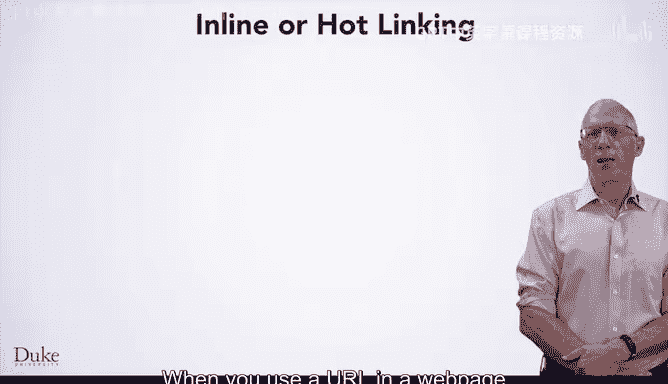

# Java编程和软件工程基础-1：P9：图像与存储


在本节课中，我们将讨论在您创建的网页中使用图像或照片时可能面临的一些问题或注意事项。

## 概述

在本节课中，我们将要学习在网页中使用图像时涉及的两个核心问题：**图像的使用权**和**图像的存储与托管**。我们将了解如何寻找可合法使用的图像，以及理解引用外部图像资源可能带来的影响。

## 图像的使用权

上一节我们提到了在网页中插入图像的基本方法。本节中，我们来看看使用图像时首先需要考虑的法律问题：使用权。

当您在网上找到一张图片并希望将其用于您创建的网站时，您需要找到该图片的URL作为IMG标签的源。但在某些情况下，图片的创作者（个人、组织或团体）可能拥有特定的权利，即**版权**，您需要尊重这些权利。

版权法因国家/地区而异。如果您要制作可能具有商业价值的网页，您应该对您所在国家/地区的版权法有基本了解。通常，如果您仅为个人用途制作网页（例如为本课程创建的页面），则无需过多担心版权法。然而，了解使用权的基本概念仍然有益。

许多图像属于**公共领域**，没有版权限制。例如，本页显示的巴西国旗图像在美国、巴西和许多其他国家都属于公共领域。公共领域的图像您可以自由使用。

以下是寻找和使用图像时的一些关键点：

*   **使用搜索引擎**：您可以使用Google图片搜索来查找图像，并通过搜索工具筛选出允许“重用”的图片。
*   **利用免费资源库**：**Wikimedia Commons** 是一个网站和存储库，可以找到许多更自由使用的图像。
*   **了解知识共享许可**：一些图像采用**知识共享许可**，规定了您如何使用这些图像。例如，有些许可仅允许非商业用途，有些则要求您以类似方式许可您的作品（称为“相同方式共享”许可）。

在本课程中，我们尽量使用公共领域的图像。

## 图像的存储与托管

除了使用权，在您创建的网页中使用图像还可能涉及**图像存储和托管**的问题。

例如，假设您想在网页中加入中国国旗的图像。您通过Google图片搜索找到了一个属于公共领域的图片URL，并将其用于IMG标签的`src`属性。您做得很好，既考虑了使用权，也创建了一个很棒的网页。

但是，假设有100万人浏览了您的网页。这意味着国旗图像被展示了100万次，同时也意味着该图像从其存储的网站通过互联网传输给了遍布全球的100万用户。**有人需要为托管该图像并将其提供给所有人而支付费用**，即使这个人不是您。这是您需要理解的一个潜在问题。

当您在创建的网页中使用一个URL作为IMG标签的一部分时，您实际上创建了一个从您的页面到另一个网页的**内联链接**。



内联链接也称为**热链接**，这意味着图像存储在另一个站点上，但视觉上显示在您创建的站点中。


通常，对于您个人的页面，您无需担心版权和使用问题。然而，如果您创建的网页访问量很大，可能会产生存储成本或服务器成本，这是您应该了解的。不过，对于课程中或您个人使用的页面，这通常不是需要担心的问题。

## 实践指南：在网页中添加图像

当您想在创建的页面中包含图像时，使用Google图片搜索在线查找图像很容易。您需要找到图像的URL，以便在IMG标签的内联链接中使用。

以下是操作步骤：

1.  **查找图像URL**：通常，您可以在Chrome或Firefox等网页浏览器中，通过右键单击（有时在Mac上是Control+单击）图像，然后选择“复制图片地址”来获取URL。
2.  **粘贴到HTML中**：将复制的URL粘贴到您正在创建的页面的HTML代码中，作为IMG标签的`src`属性值。代码格式如下：
    ```html
    
    ```
3.  **注意网站限制**：有些网站不允许您热链接其存储的图像。例如，Pixabay托管许多公共领域图像，但不允许您在创建的网页中直接链接它们。
4.  **测试网页**：您应该测试创建的网页以确保其正常工作。可以使用浏览器的“无痕/隐私浏览模式”来确保您像匿名用户一样访问页面，而不是以登录状态查看，这有助于发现权限问题。最好也能请他人帮忙查看您创建的网页，以确保他们能看到图像。

## 总结

本节课中，我们一起学习了在网页中使用图像的两个重要方面。首先，我们了解了**图像的使用权**，包括版权、公共领域和知识共享许可，并学会了如何寻找可合法使用的图像资源。其次，我们探讨了**图像的存储与托管**，明白了通过内联链接引用外部图像时可能涉及的带宽与成本问题，以及如何在实际操作中获取并正确使用图像URL。记住，对于个人和非商业项目，虽然问题不大，但建立这些基本认知对您未来的Web开发工作非常有帮助。