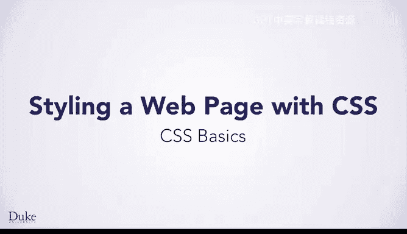
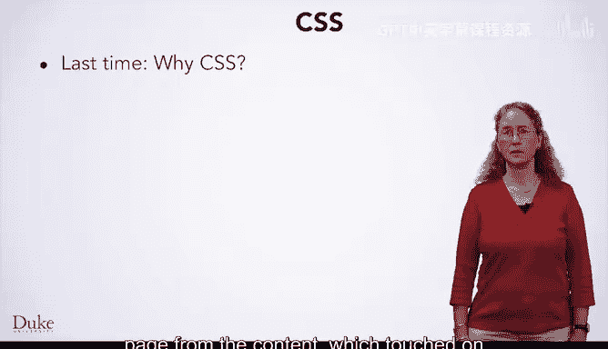

# Java编程和软件工程基础-1：P12：CSS基础 🎨





## 概述
在本节课中，我们将要学习CSS的基础知识。我们将了解CSS的语法结构，学习如何为网页元素应用样式，并探索如何通过类（Class）和ID来更精确地控制样式，以实现样式的复用。

上一节我们介绍了为什么需要使用CSS来分离网页的样式与内容，这涉及到计算机科学中可复用性和可维护性等重要主题。本节中，我们来看看如何编写自己的CSS来为网页添加样式。

## CSS的编写位置
在学习编写CSS之前，我们先了解在哪里编写它。

在CodePen工具中，你一直在左侧面板编写HTML。右侧是CSS面板，其左上角标有“CSS”字样。如果你不使用类似CodePen的工具，从头开始编写网页，可以通过两种方式引入CSS：使用`<style>`标签并在其中编写CSS代码，或者使用`<link>`标签链接到一个外部样式表。这两种标签都应放在HTML文档的`<head>`部分。

## CSS基础语法
我们将从一个描述美食的小型示例网页开始。左侧是无CSS的网页，其`<h1>`标签生成的标题是黑色文本且左对齐。假设你想让这个标题变成蓝色并居中，如右侧所示。

右侧的页面拥有相同的HTML，但我们使用了CSS来改变`<h1>`标签的格式。

以下是我们用来将`<h1>`标签样式设置为蓝色和居中的CSS代码。让我们详细分析它，以便你能编写自己的CSS来随心所欲地设计页面。

```css
h1 {
  text-align: center;
  color: blue;
}
```

首先需要编写的是**选择器**，即你想要样式化的元素名称。在这个例子中，我们想样式化`<h1>`标签，所以在这里写`h1`。

接着，你编写花括号`{}`，其中包含你想应用于`<h1>`标签的样式信息。在CodePen中，当你输入一个左花括号时，它会自动添加右花括号并将光标置于两者之间。

在花括号内的每一行，你先写**属性**，即你想要改变的样式方面。这里我们想改变文本对齐方式，其属性名是`text-align`。在属性名之后，你写一个冒号`:`。

冒号后面是你想给该属性设置的**值**。在这个例子中，我们想将`text-align`设置为`center`。在行末，你写一个分号`;`。

然后，你可以用相同的语法编写更多行。例如，我们写了`color: blue;`来将颜色属性设置为蓝色。CSS中有许多可以设置的属性，我们不会在此一一列举，而是建议你在需要时在线查阅更多资料。对于许多知识，你不应试图死记硬背，而应在需要时查找。如果你最终编写了大量CSS，你会逐渐熟悉那些经常使用的属性。

## 选择特定元素进行样式化
在你的NVIo测验中，你刚刚思考了这段CSS如何将列表项样式化为绿色。然而，这段CSS会使你整个网页中的所有列表项都变成绿色。

如果你想只让其中一些变成绿色，而用另一种方式样式化另一些，该怎么办？

我们将向你展示三种仅样式化特定元素中一部分的方法。

### 方法一：使用类（Class）
第一种方法是使用**类**，即一种命名的样式。要使用CSS类，你需要修改HTML，在想要样式化的标签中写入`class=`和你想要的类名。

现在在你的CSS中，选择器不再是HTML标签名，而是一个点`.`后面跟上类名。这个点表示你正在命名一个类。紧接在点之后，你应该写上你想给类起的名字。这个名字几乎可以是任何你想要的，但必须遵循一些规则，例如名称中不能包含花括号或空格。然而，你应该使名称具有描述性。

在这个例子中，我们选择了`food-li`，因为我们使用这个类来样式化描述食物的列表项。`green`会是这个类的好名字吗？尽管它描述了当前如何样式化列表项，但命名为`green`并不是一个很好的选择。如果我们后来决定将食物列表项样式化为紫色，这个样式名称就会产生误导。相反，我们最好根据页面部分的含义来命名它，我们想要样式化的是食物列表项。回顾HTML代码，你可以看到我们选择的名字的来源，它与我们在CSS中选取的类名相匹配。

以下是使用类的示例：

```html
<!-- HTML -->
<li class="food-li">Pizza</li>
```

```css
/* CSS */
.food-li {
  color: green;
}
```

### 方法二：使用ID（ID）
另一种仅样式化特定元素类型中一部分的方法是使用**ID**。ID用于命名一个特定的元素。请注意类（可应用于多个元素）和ID（只能应用于一个元素）之间的区别。

在这个例子中，网页有一张蛋糕的图片，我们想以特定的方式样式化它。我们在``标签内指定了`id="cake-img"`。现在在CSS中，我们可以描述`cake-img`的样式。请注意，ID的选择器以井号`#`开头。

以下是使用ID的示例：

```html
<!-- HTML -->

```

```css
/* CSS */
#cake-img {
  border: 2px solid brown;
}
```

### 方法三：组合器（Combinators）
我们将提及但不深入探讨的最后一种方法称为**组合器**。它们允许你指定标签之间的关系。例如，你可以指定想要以特定方式样式化`<ul>`内部的`<li>`，你可以通过将选择器写为`ul li`来实现。

还有更高级的关系，例如兄弟选择器。组合器是一个更高级的主题，你不需要掌握，但我们为那些想进一步探索的人提及它。

## 命名与复用样式
类和ID都允许你命名一种样式化元素的方式。

命名样式使你可以根据需要复用该样式。对于类，你可以在同一页面中以相同方式样式化多个元素。对于ID和类，你都可以在多个页面间复用同一样式。例如，如果你有一个徽标，想显示在网站每个页面的角落，你可以为它编写一次样式，然后在每个页面上复用该样式。

命名和复用是计算机科学中的一个常见主题。随着你更深入地学习编程，你会发现命名常量、算法或数据以便复用它们通常非常有用。

## 总结
本节课中，我们一起学习了CSS的基础知识。你了解了在CodePen中编写CSS的位置、CSS的基本语法，以及如何创建类和ID来命名和复用样式。掌握这些基础将帮助你开始为自己的网页设计独特而一致的视觉效果。