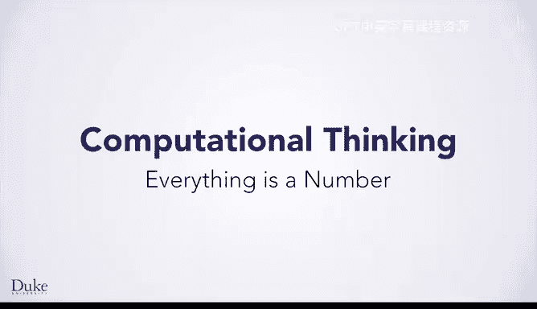
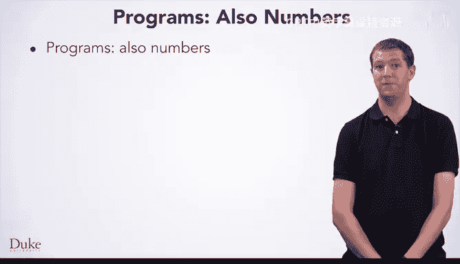

# Java编程和软件工程基础：P15：万物皆数字

欢迎回来。在本节课中，你将学习计算机科学的一个重要原则：万物皆数字。或者换一种说法：计算机只处理数字。

如果我们深入研究硬件，会发现它只处理比特，即0和1。我们不会深入探讨硬件的细节，但需要知道的重要一点是，计算机只能处理数字，并且实际上只能进行数学运算。事实上，计算机能做的任何事情，你也能做。计算机只是运算速度非常快，因此它们能比你或我手动操作更快地处理大量数据，速度可达数十亿倍。

幸运的是，由于一个称为“抽象”的绝妙原则，你通常不需要考虑比特的细节。在我们进一步讨论“万物皆数字”之前，我们先花点时间谈谈抽象。

## 什么是抽象？🤔

抽象是将接口（一个事物做什么或你如何使用它）与实现（它如何做到这一点，或它如何工作）分离开来。你可以通过一个与计算机无关的例子来理解抽象及其用处。

想一下开车。抽象让一个人可以在不知道汽车如何工作的情况下驾驶它。我知道如果我踩下油门踏板，我的车会加速。然而，我并不了解使这一切发生的、汽车内部复杂的运作机制。

抽象通常以层级形式存在，你需要工作在哪个层级取决于你需要做什么。对于一个开车的人来说，适合思考的抽象层级是汽车的控制装置做什么。引擎盖下的内部运作是隐藏的，并不重要。然而，对于一个机械师来说，引擎盖下的细节很重要，是她日常工作的内容。但即使在那里，也存在不同的抽象层级。机械师关心的是发动机的各个部件如何组合在一起并协同工作，但可能不关心设计发动机所涉及的物理学原理。

设计汽车的工程师会在那个抽象层级上工作，应用物理学来制造一辆正常工作的汽车。当然，还有更低的抽象层级，比如更理论化的物理学，他们并不关心。我们可以一直向下追溯，直到触及人类知识边界最理论化的物理学。所有这些，都是你开车不需要知道的事情。

这些相同的概念也适用于编程。你需要的抽象层级取决于你正在做什么。在上这门课之前，你可能在使用计算机时对程序如何工作一无所知。现在你将学习程序如何工作，但还会有更深层次的抽象，你通常不需要了解。

## 万物皆数字：窥探内部🔢

现在你了解了抽象，让我们回到“万物皆数字”的原则，给你一点窥探内部的机会。你可能会对这个想法感到有点惊讶，因为你习惯于使用计算机处理那些看起来不像数字的东西，比如字母。然而，这些东西相对容易编码为数字。我们可以设定 A=1，B=2，依此类推。

计算机实际做的是表示字符，即可以是字母、数字、标点符号等的符号。编码字符的一种方式是ASCII码，其中大写A是65，小写a是97，感叹号是33，其他各种字符也有其他数值。如果你需要查找一个字符的数值，你可以在ASCII码表中找到它们。然而，由于抽象带来的便利，你通常不需要担心具体的数值。

一旦我们有了字符，我们也可以有字符串，即字符的序列，例如“Hello!”。字符串在计算机科学中经常出现，因为程序员经常需要处理文本。事实上，你已经在HTML中见过字符串。字符串是抽象的另一个绝佳例子。你可以写下“Hello!”，它会被转换成你的计算机可以处理的数字。你通常不需要考虑数字表示形式，但如果你的编程任务需要，你可以操作它。

## 为什么“万物皆数字”如此重要？🤔

那么，为什么知道“万物皆数字”如此重要呢？首先，有时你想对那些看起来不像数字的东西进行数学运算。密码学，即保护信息安全的科学，依赖于对字符串进行数学运算的能力。当你使用HTTPS访问一个网站时，你的计算机和网络服务器之间来回发送的信息是加密的，这样其他人就无法读取。这个过程涉及对这些数据进行数学运算。

其次，理解“万物皆数字”很重要的另一个原因是，这就是为什么编程语言有“类型”，类型告诉它如何对这些数字进行操作。尽管万物皆数字，但程序员希望以不同的方式解释这些值。这些数字是代表字母吗？它们代表图片吗？它们实际上只是代表普通的数字吗？数据的类型告诉了我们这些数字的含义，从而决定了如何对它们进行操作。

以下是两种不同类型数据相加的例子：
*   **字符串相加**：如果我们把两个字符串加在一起，我们可能想要连接它们，将一个放在另一个后面以形成更长的字符串。在这种情况下，字符串“1”加上字符串“1”会是字符串“11”。
*   **数字相加**：如果我们只有数字1，并将它与1相加，我们会得到2。

第三，“万物皆数字”原则很重要的另一个原因是，每当你想要处理数据时，你都需要将其表示为数字。你可以利用现有的类型，比如字符串（它已经将信息表示为数字）来帮助你，这要归功于抽象带来的便利。

## 程序本身也是数字💻

另一件可能让你惊讶的事情是，程序本身也是数字。不过，既然你刚刚学到万物皆数字，这可能也不会让你太惊讶。

正如你已经看到的，你通过编写文本来向计算机表达你的算法。你输入的代码就是一个字符串。另一个程序接收这个字符串，并找出如何将其转换为计算机可以执行的数字指令。

程序是数字这一事实实际上非常强大。这意味着你可以在计算机上下载并运行新程序，它们就像其他所有东西一样，只是数据。程序也像数据一样，这一事实是许多安全问题的核心。黑客提供程序输入，这些输入包含他们想要执行的指令的数字编码，然后诱骗程序运行它。

当然，当你编写程序时，你不需要担心数字编码的细节，这都归功于抽象这个绝妙的思想。

## 总结📝

在本节课中，我们一起学习了“万物皆数字”这一重要原则，因为计算机只能进行数学运算。我们还学习了“抽象”，即接口与实现的分离，以及这意味着你并不总是需要考虑事物如何表示为数字才能用计算机处理它们。