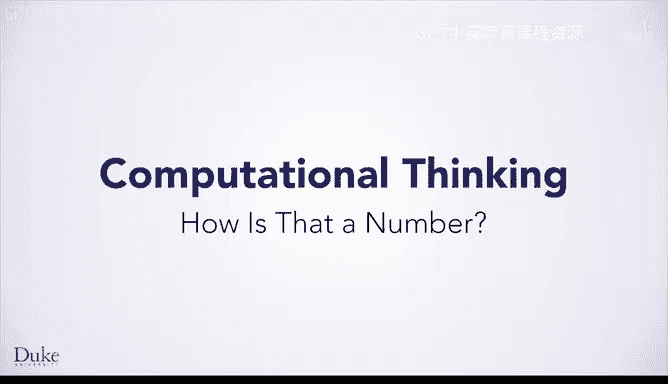
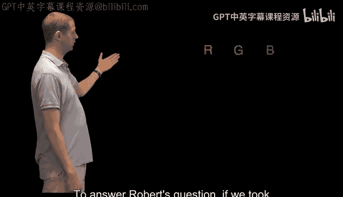
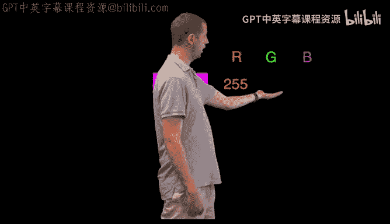
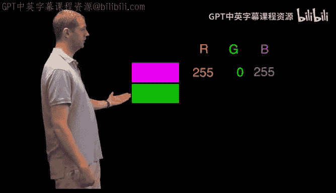
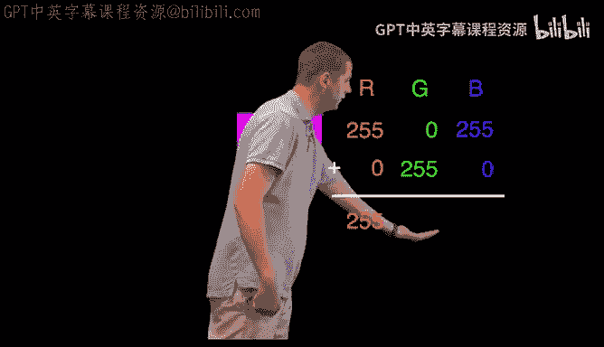
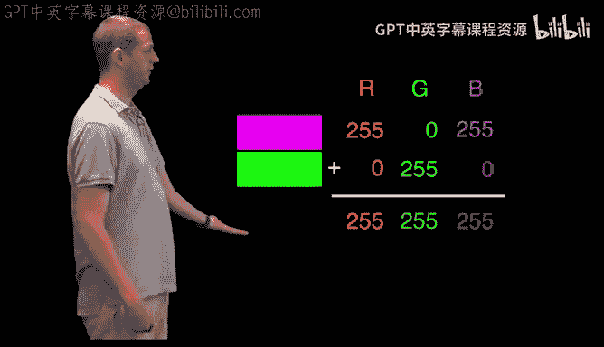

# Java编程和软件工程基础-1：P16：数字的表示原理 🖥️




在本节课中，我们将要学习计算机如何用数字来表示图像等复杂信息。我们将从像素的概念入手，理解颜色如何被分解为数字，并探索如何通过对这些数字进行数学运算来编辑和处理图像。

## 从像素到数字 🎨

上一节我们介绍了计算机用数字表示文字和逻辑的原理。本节中我们来看看图像是如何被数字化的。

计算机屏幕上的图像由无数微小的点组成，这些点被称为**像素**。每个像素都是一种单一的颜色。

每个像素的颜色在计算机中由三个数字分量来共同表示：
*   **红色分量**
*   **绿色分量**
*   **蓝色分量**

每个分量的数值范围是 **0 到 255**。其中，**0** 表示完全不包含该颜色，**255** 表示该颜色的最大强度。因此，一个像素可以表示为 `(R, G, B)` 的形式，例如纯红色是 `(255, 0, 0)`。

由于整幅图像由成千上万个像素组成，因此整幅图像就对应着成千上万个这样的数字组合。

## 对颜色进行数学运算 ➕

既然颜色被表示为数字，我们就可以对它们进行数学运算。以下是颜色加法的一个例子。





如果我们取洋红色（Magenta）和绿色（Green）相加：
*   洋红色的 RGB 值为：`(255, 0, 255)`
*   绿色的 RGB 值为：`(0, 255, 0)`







将它们的每个分量分别相加：
```
红色分量：255 + 0 = 255
绿色分量：0 + 255 = 255
蓝色分量：255 + 0 = 255
```
得到的结果 `(255, 255, 255)` 代表白色（White）。

## 图像处理的应用实例 🛠️

通过对构成图像的像素数字进行数学运算，我们可以解决许多实际问题。

以下是几种常见的图像处理操作：
*   **调整亮度**：使图像变亮或变暗。
*   **调整色调**：使图像更红或更蓝。
*   **图像压缩**：例如生成JPEG文件，在几乎不影响人眼观看效果的前提下，减少文件大小，加快网络传输速度。
*   **视频编解码**：电影编解码器软件通过对构成视频每一帧的图像进行大量数学运算，来实现视频的编码和解码。

## 绿幕算法实践 💚

一个经典的应用是“绿幕”（或蓝幕）技术。其核心算法是遍历图像中的所有像素，识别出特定颜色（如绿色）的像素，并将其替换为另一幅图像的对应像素。


例如，我们可以实现一个算法，将视频中所有绿色的背景替换成恐龙或外太空的场景。这正是许多电影特效和虚拟演播室所采用的技术。

本节课中我们一起学习了计算机用数字表示图像的基本原理。我们了解到图像由像素构成，每个像素的颜色通过红、绿、蓝三个数字分量来定义。正因为颜色是数字，我们可以对其进行数学运算，从而实现亮度调整、压缩、绿幕合成等多种强大的图像处理功能。理解这一原理是进行更高级编程和软件工程开发的重要基础。