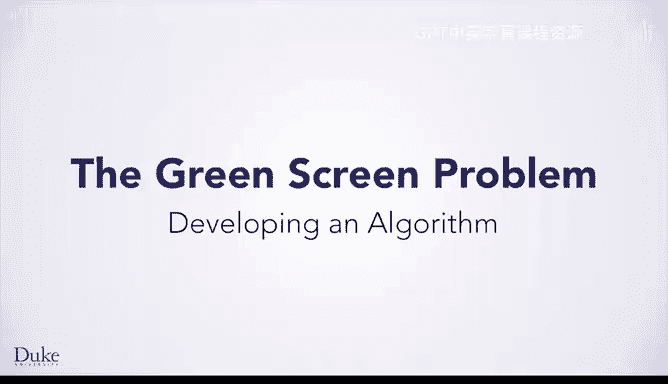
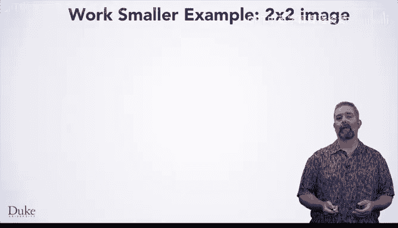
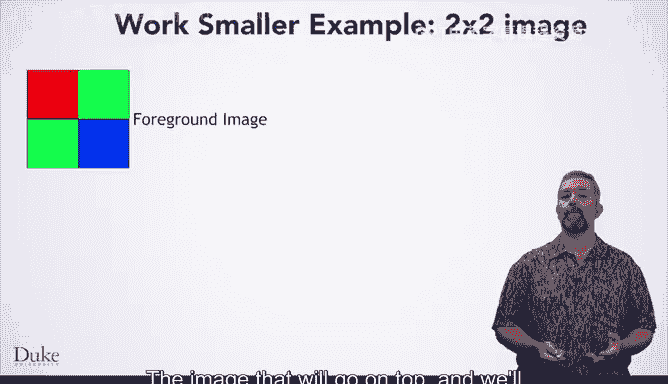
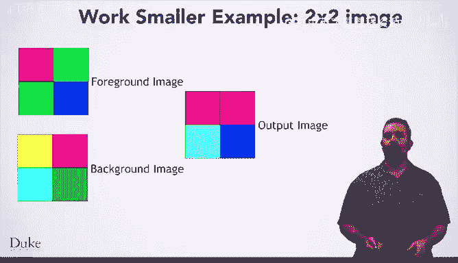
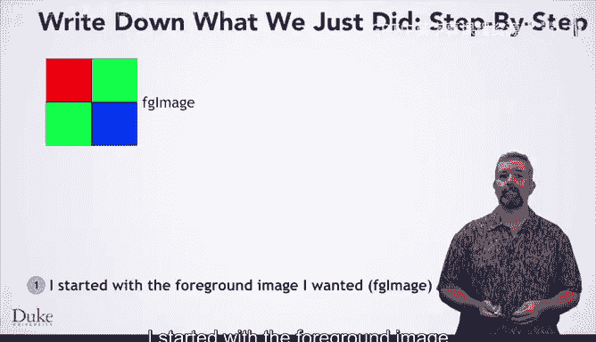

# 017：算法开发 🧠

在本节课中，我们将学习如何通过一个具体问题——绿幕（色度键）问题——来理解算法开发的一般过程。我们将从手动解决一个小规模问题开始，逐步推导出通用算法，并最终为编写代码做好准备。

---

## 理解问题 🎬

绿幕问题，也称为色度键问题，因为它基于颜色的色度或色调。就像在闪光灯拍摄的照片中去除红眼一样，这在影视制作中很常见。它允许演员在摄影棚中被录制，然后被放置在一个由另一张图片或视频构成的背景前。这个算法就是让我和Drew能在太空中与恐龙对话的原因。

现在，我们将通过解决这个问题，作为学习如何应对一般编程问题的示例。

---

## 第一步：手动解决问题 ✋

在解决编程问题之前，我们需要做的第一件事是，自己完全弄清楚如何解决这个问题。在你完全理解如何以精确的、一步一步的方式完成任务之前，你无法编写程序、向计算机解释它需要做什么。事实上，这通常是编程中最难的部分。

现在，尝试解决这个特定的绿幕问题示例会非常困难，因为这些图像每张大约有200万个像素。手动操作它们将花费不可能完成的时间。相反，手动解决一个较小规模的问题实例是一个好主意，以便深入理解如何解决问题。

在本例中，我们将查看一个2像素乘2像素的图像。

我们将首先选择一个2x2的图像作为前景，即要放在顶层的图像。然后选择一个2x2的图像作为背景。

此外，我们还需要一个图像来保存最终结果或输出。这也应该是2x2的。

现在示例已经选定，让我们来弄清楚输出图像的每个像素应该是什么颜色。

很好，现在我们手动解决了一个问题实例。

---

## 第二步：写下步骤 📝

下一步是以一步一步的方式准确写下我们所做的事情。

1.  我从前景图像（我称之为FG图像）开始。
2.  以及背景图像（我称之为BG图像）。
3.  然后我创建了一个相同大小的空白图像，称之为输出图像。
4.  我查看了FG图像中的第一个像素，它是红色的。因此，我将输出图像中对应的像素也设置为红色。
5.  我查看了FG图像中的第二个像素，它是绿色的。因此，我查看了BG图像中相同位置的像素，并将输出图像中对应的像素设置为BG图像的像素颜色。
6.  我查看了FG图像中的第三个像素，它是绿色的。因此，我查看了BG图像中对应的像素，它是蓝色的。于是我将输出设置为相同的颜色。
7.  然后我查看了FG图像中的第四个像素，它是蓝色的。因此，我将输出图像中对应的像素设置为蓝色。

很好，现在我们有一套一步一步的指令，准确地描述了我们如何为这一对特定图像解决问题。但是，要编写程序，我们需要能够为任何大小、任何图像解决这个问题。

---

## 第三步：泛化与模式识别 🔍

现在，如果你仔细观察这些步骤，你会发现有很多相似之处。我们对图像中的每个像素所做的操作几乎相同，但又不完全一样。

当FG图像的像素是绿色时，我们使用BG图像的像素；当FG图像的像素不是绿色时，我们直接使用FG图像的像素。

回到我们一步一步的指令，我们将重写每一步，使其更通用一些，考虑到我们刚刚观察到的这种条件行为。

你可以为每个像素的步骤都这样做，现在每一步都更通用、更相似，它们将适用于任何2x2的图像，但仅限于2x2的图像。

在这里，我们改进了逐步指令，以表达对每个像素的重复操作。现在，这些步骤已经足够通用，可以适用于任何尺寸的图像。事实上，我们所做的是设计一个算法。算法是一套清晰的、一步一步的指令，用于解决你想要解决的任何问题实例。你可以用英语表达算法，就像我们在这里所做的那样，或者用代码表达，就像我们需要让计算机运行它那样。

---

## 第四步：测试算法 🧪

每个人都会犯错。在设计算法时，有很多不同的犯错方式。例如，你可能没有正确识别模式，或者可能没有正确地泛化每个步骤。为了防范这类错误，让我们在一个不同的示例上测试我们的算法，看看它是否按预期工作。如果有效，我们将更有信心认为我们做对了。如果无效，我们就在编写代码之前及早发现了错误。当然，一旦我们编写了代码，我们将希望更彻底地测试它，但这我们稍后再谈。

当你逐步执行算法时，你需要跟踪你正在执行哪一步。对我们来说，我们将画一个绿色箭头来显示我们在算法中的位置。

然后，你需要完全按照所写的方式执行每一步。

在这里，我选择了一个3x1的图像作为前景，这个3x1的图像作为背景，以及一个3x1的图像作为输出。

我将在上面的绘图中用蓝色箭头跟踪哪个像素是当前像素。

第一个像素是绿色的，所以算法说查看背景图像中的相同像素，它是黄色的。并将输出图像中的相同像素也设置为黄色。

这就是该像素的所有步骤。所以现在算法说转到下一个像素并重复这个过程。

我们将继续按照这些步骤执行。完全按照所写的方式。直到我们完成所有步骤。

此时，我们想看看输出的图像是否符合预期。在本例中，输出是正确的。

---

## 总结 📚

本节课中，我们一起学习了算法开发的核心流程。我们从手动解决一个小规模绿幕问题实例开始，然后精确记录步骤。接着，我们识别并泛化了操作模式，将其转化为一个适用于任意尺寸图像的通用算法。最后，我们通过另一个示例测试了算法，验证其正确性。这个过程——理解问题、手动求解、记录步骤、识别模式、泛化算法、测试验证——是解决任何编程问题的通用方法。现在，既然我们的算法看起来有效，是时候编写代码了。