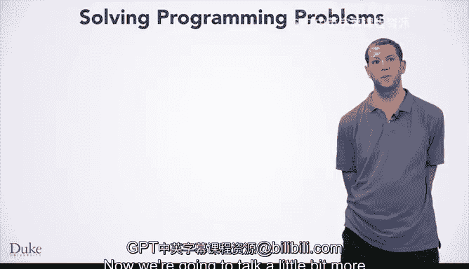

# 018：解决编程问题的七步法 🧩

在本节课中，我们将学习一个系统性的方法来解决编程问题。我们将详细介绍一个包含七个步骤的流程，它能帮助你从问题描述出发，最终得到可运行的代码。这个方法不仅适用于本课程，也能成为你未来解决任何编程问题的有效工具。

在上一课中，我们通过“绿幕”问题的实例，一步步地将问题描述转化为可工作的代码。本节中，我们将更深入地审视解决编程问题的过程，并正式介绍这个七步法。

## 第一步：手动解决一个小规模实例

首先，你需要手动解决一个具体且小规模的问题实例。这能帮助你理解问题的本质。

*   **目的**：避免一开始就处理复杂情况（例如包含数百万像素的真实图像），而是从一个可管理的规模入手。
*   **难点**：如果这一步遇到困难，可能有两个原因。
    *   一是问题描述本身不清晰，你需要寻求澄清（例如询问老师、技术负责人或客户）。
    *   二是你可能缺乏相关的领域知识（例如物理公式），这时你需要先补充相关知识。

## 第二步：写下解决该实例的确切步骤

在成功手动解决一个小实例后，接下来需要将你的思考过程精确地记录下来。

以下是你在这一步需要做的事情：
*   **具体化**：写下你为解决那个特定小实例（例如四像素图像）所采取的每一步操作。
*   **精确性**：计算机没有常识，因此你必须非常精确。我们人类许多下意识的思考过程，都需要被明确地表述出来。

## 第三步：寻找模式

现在，我们需要将解决特定实例的步骤，推广为能解决所有同类问题的通用算法。

上一节我们记录了具体步骤，本节中我们来看看如何从中抽象出通用模式。
*   **寻找循环**：观察哪些步骤被重复执行，以及执行的次数。这将引导你使用循环结构。
*   **识别条件**：观察在什么情况下执行某些操作，而在其他情况下不执行。这将引导你使用条件结构，如 `if-else`。
*   **分析数值**：思考你使用的特定数字是输入的一部分，还是与输入相关。你需要理解使用它的原因。
*   **应对困难**：如果在此步骤遇到困难，可以返回第一步和第二步，用不同的输入重新操作，以收集更多信息来寻找模式。

## 第四步：手动检查算法

在得出你认为的通用算法后，不要急于编码，先用手动计算来验证它。

*   **目的**：检查算法中可能存在的错误，例如忽略了某些特殊情况，或无意中使用了特定于测试参数的值。
*   **方法**：使用一个或多个不同的、易于手动计算的小规模输入来测试你的算法。

## 第五步：将算法转化为代码

当你对算法有信心后，就可以将其转化为具体的编程语言代码了。

到目前为止，我们都在抽象地设计算法。现在，我们将进入实现阶段。
*   **实现**：根据你使用的编程语言（例如JavaScript）的语法，将算法表达出来。
*   **公式/代码示例**：例如，一个简单的条件判断在代码中可能表现为：`if (pixel.getGreen() > threshold) { ... }`。

## 第六步：运行测试用例

代码编写完成后，需要通过运行测试来验证其正确性。

*   **执行与验证**：运行你的程序，检查输出结果是否符合你对问题解决方案的预期。
*   **结果处理**：如果测试通过，则增加你对程序的信心。如果测试失败，则进入下一步。

## 第七步：调试失败的测试用例

当测试失败时，你需要使用科学的方法来定位和修复问题。

*   **科学方法**：这是一个系统化的调试过程，我们将在下一课详细讨论。
*   **问题定位**：调试过程将帮助你理解问题所在。
*   **修复路径**：
    *   如果问题是**算法性**的（逻辑错误），你需要返回**第三步**修正算法。
    *   如果问题是**实现性**的（代码编写错误），你需要返回**第五步**修正代码。

本节课中，我们一起学习了解决编程问题的七步法：从手动解决小实例开始，到精确记录步骤、寻找通用模式、手动验证算法、翻译成代码、运行测试，最后系统化地调试。掌握这个系统性的方法，将为你应对未来各种编程挑战打下坚实的基础。