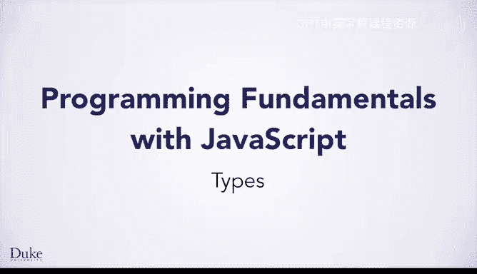

# 杜克大学《Java编程和软件工程基础-1》：P22：类型




在本节课中，我们将要学习编程中的一个核心概念——**类型**。我们将了解什么是类型，为什么它很重要，以及它在JavaScript中是如何工作的。

## 类型的重要性

上一节我们介绍了处理图像和数字的代码。但如果我们尝试做一些没有意义的事情，比如对一个数字调用获取宽度的方法，会发生什么呢？

例如，以下代码会引发错误：
```javascript
let w = 480;
w.getWidth(); // 这行代码会导致程序崩溃
```

程序会在执行到这行代码时崩溃。那么，为什么对图像调用`.getWidth()`方法可以，而对数字调用就会使程序崩溃呢？

如果我们回顾描述程序状态的图示，会发现我们处理的是两种不同类型的数据。`fgImage`引用的是一个简单的图像，它拥有`getWidth`方法。而`w`是一个数字，这种类型的数据没有`getWidth`方法。

## 什么是类型？

请记住，计算机中一切数据本质上都是数字。但我们希望这些数字能代表许多不同的事物：字母、图像、声音，或者就是纯粹的数字。

**类型**告诉我们这些数字的含义，即数字所代表的是哪一种事物。这一点至关重要，因为类型不仅规定了程序应如何解释数字（即数值的意义），还规定了如何对其进行操作。

同一个操作在不同类型的数据上可能具有不同的行为。这听起来可能有些令人困惑，让我们来看一个例子。

## 操作符的行为取决于类型

以下是包含两个加法操作的代码。正如你将看到的，由于操作的数据类型不同，这两个加法操作将执行不同的功能。

```javascript
let n1 = 26;
let n2 = 16;
let s1 = "A"; // s1是一个字符串，即字母序列。这个序列只有一个字母“A”。
let s2 = "B";

let n3 = n1 + n2; // 第一个加法操作
let s3 = s1 + s2; // 第二个加法操作
```

让我们逐步执行这段代码：
1.  `n1`等于26，`n2`等于16。
2.  `s1`是字符串“A”。
3.  `s2`是字符串“B”。
4.  现在执行第一个加法操作：`n1 + n2`。两个操作数都是数字，所以我们执行的是数值加法。26加16等于**42**。
5.  接下来执行第二个加法操作：`s1 + s2`。然而，这里是对两个字符串“A”和“B”进行加法操作。对于字符串，`+`不代表数值相加，它代表**连接**。

**连接**是一个术语，指将两个字符串首尾相接拼在一起。因此，`s3`的结果是字符串“**AB**”。

请注意，`+`操作符根据其操作数据的**类型**不同，表达了两种不同的含义。

## JavaScript如何管理类型？

JavaScript在将每个值存储到计算机内存时，会**显式地**将类型信息与值一起保存。每当需要处理一个值时，它就从内存中读取该值的类型和数值，以确定该做什么。

因为JavaScript在内存中保存了所有值的类型信息，即在程序运行时跟踪并处理类型，所以它被称为**动态类型语言**。

## 静态类型语言简介

如果你继续学习第二门及以后的课程，你将学习Java，其类型的工作方式有所不同。Java是一种**静态类型语言**，这意味着每个变量和每个表达式都有且仅有一个类型，并且这个类型必须在程序运行之前就确定。

为了实现这一点，在Java中，**你作为程序员**需要在代码中明确写出变量的类型。这样，你的代码就可以在运行之前被检查出某些类型的错误，例如尝试对数字调用`getWidth`方法。在程序运行前发现这类错误非常有帮助。

你将在课程2中学习更多关于Java类型的知识。不过现在，我们还需要学习一些JavaScript知识，以便你能实现绿屏算法。

## 总结

本节课中我们一起学习了**类型**的概念。我们了解到类型定义了数据的含义以及可对其执行的操作。同一个操作符（如`+`）在不同类型的数据上可能产生不同的行为。JavaScript是一种动态类型语言，它在运行时跟踪值的类型。相比之下，Java是一种静态类型语言，要求类型在代码编写时就被明确声明，这有助于在程序运行前发现错误。理解类型是编写正确、高效程序的基础。