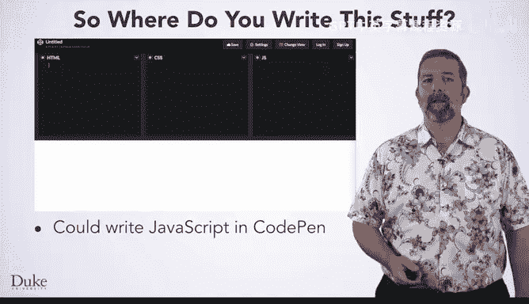
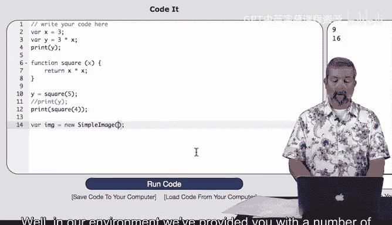
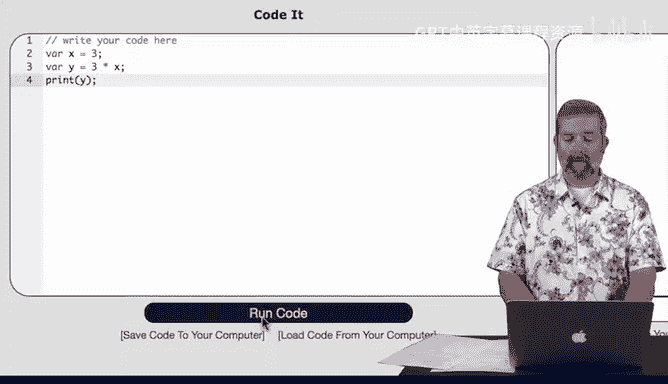
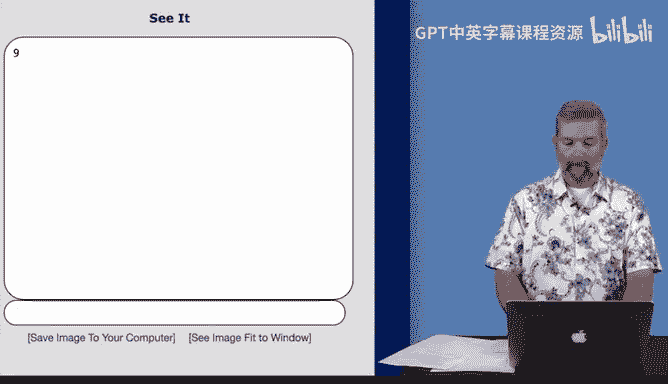
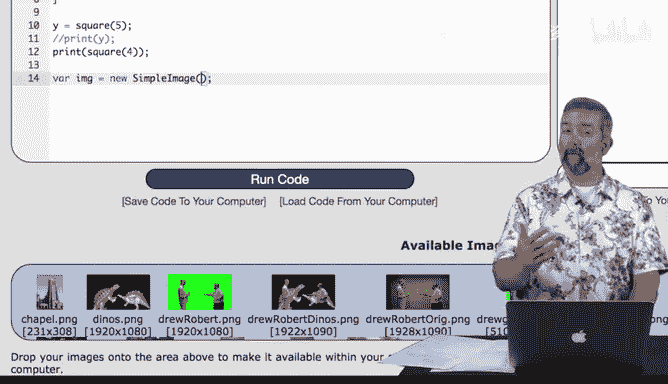
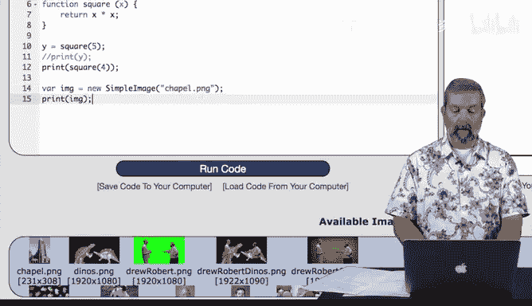
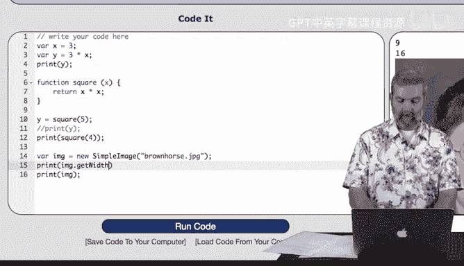

# 023：DukeLearnToProgram环境介绍 🚀

在本节课中，我们将学习如何开始编写和运行JavaScript代码，并重点介绍杜克大学提供的DukeLearnToProgram编程环境。这个环境专为初学者设计，能帮助我们更轻松地编写、调试和理解代码。



## 编写JavaScript代码的位置

现在你开始学习JavaScript，可能会想知道在哪里编写或如何运行它。

在CodePen中，你可以在右侧框架中编写JavaScript，我们已在此处高亮显示。


如果你使用其他工具编写网页，通常也可以轻松地在网页中编写JavaScript代码，尽管具体方法取决于所使用的工具。

## DukeLearnToProgram环境介绍

为了帮助你入门，我们提供了一个对新手更友好的环境，希望能让你更轻松地编写和调试代码。

如果你想在其他地方为网页编写JavaScript，可以始终使用此环境来开发代码，然后再将其复制到你的网页中。

以下是DukeLearnToProgram.com网络环境的截图，用于开发JavaScript代码。这是一个绿屏算法页面，右侧的代码框位于左侧，已预加载了我们在之前视频中共同开发的算法。



如果点击底部的此按钮，它将在此处运行代码。代码尚未完成，因此不会发生太多变化。但如果我们很快完成此代码，输出将显示在右侧。

实际上，如果我们在点击运行代码之前完成了此代码，你会看到Drew和Robert与他们的恐龙一起出现。

## 为什么使用DukeLearnToProgram.com

那么，为什么使用DukeLearnToProgram.com而不是直接在CodePen中编写代码？

首先，我们设置了DukeLearnToProgram环境，以提供更友好的错误消息。这将使你更容易修复代码中的语法错误或查找和修复问题。

我们还设置了它，以便你可以打印各种内容，例如简单图像和简单像素。这些功能使你更容易查看输出，并可以帮助你进行调试。

说到简单图像和简单像素，这些不是标准的JavaScript库。相反，我们为你设置了这些库，以便你可以在学习的早期阶段解决有趣的问题。

这些库使操作图像变得更容易，无需大量复杂的JavaScript知识。当然，如果你想在别处制作的网页中使用它们，可以导入这些库并在你构建的任何网页中使用它们。

在本课程后期，我们将研究如何在CodePen中使用它们。这些页面还预加载了图像和伪代码，供你解决问题时使用，以便你有一个良好的起点。

最后，大多数程序员使用这样的环境来使编程任务更容易，无论是CodePen、BlueJ（将在下一门课程学习Java时介绍）还是DukeLearnToProgram.com。

## 环境实际操作演示

好的，让我们看看它的实际效果。欢迎来到DukeLearnToProgram环境。这是我们为你创建的，旨在帮助你学习JavaScript编程。我们这样做是因为我们相信它提供了一个更好的环境。

让我们开始编写一些代码并尝试一下，看看会发生什么。

### 创建变量和打印输出

我要做的第一件事是简单地创建一个变量。将其命名为`x`并赋予初始值。

```javascript
var x = 3;
```





然后创建另一个变量，并赋予一个依赖于`x`的值。

```javascript
var y = x * 3;
```

现在我想查看该计算的结果，看看我是否做了预期的事情，因此我可以打印出`y`的值。

```javascript
print(y);
```

当我运行它时，当我按下此处的运行代码按钮时，我在此处的输出窗口中看到结果。所以3乘以3的结果是9，正如我们所期望的那样。


### 编写自定义函数

让我们做一些更复杂的事情。编写我们自己的函数，以`function`关键字开头，然后可以给它任意名称。

我将编写一个非常小的函数，它只是对传入的任何值进行平方。

```javascript
function square(x) {
    return x * x;
}
```

你会注意到，当我输入初始大括号时，它会自动为我补全一个。这再次是为了帮助你填充内容。你还会注意到，我在这里使用变量名`x`与上面这里的变量名`x`没有任何关系。这只是一个通用名称，我选择它来引用调用`square`时传入的任何值。

现在让我们尝试实际使用它，我们将为`y`进行新的赋值，并说，哦，我们希望`y`是调用`square(5)`的结果。

```javascript
y = square(5);
print(y);
```

当我运行该代码并想查看结果时，我将再次打印出`y`。运行该代码后，你会看到第一个打印仍然被调用。所以这些行被执行了，我得到了结果，即9。然后我定义了我的函数。

然后我用值5调用该函数，将5乘以5并将该值赋给`y`，然后打印出该值，得到25。所以两个打印语句都执行了，我可以看到它们的结果。

如果愿意，我也可以直接打印调用函数的结果。我不必将其赋值给一个变量。如果我只想看到它，我可以说打印`square(4)`，同样，你会看到它为我填充了那些括号，我想在行尾放一个分号来标记我已完成该行。

```javascript
print(square(4));
```

然后我说运行代码。再次，我所有的打印语句都按照代码中看到的顺序执行。所以首先我得到9，和之前一样，然后我得到25，和之前一样。现在我得到16，这是直接调用它的结果。

### 使用注释

如果我想，我可以选择不执行任何这些打印，通常的做法是，如果我不完全准备好删除代码，我可以在它前面加上注释。我可以放那两个斜杠，再次，你会注意到环境会像你在CodePen环境中看到的那样进行颜色编码。这是大多数开发环境的常见功能。

所以它将其变为绿色以表示那是注释。通常你会使用像我们第一行这样的注释来描述你的代码或解释发生了什么，但你也可以用它来注释掉一段代码，表示在这次程序运行期间我还没有准备好执行它。

所以现在你只会看到两个打印语句：9和16。

### 处理图像

好的，让我们再尝试一件事，让我们创建一个表示图像的变量。

如果我创建一个新的简单图像。

```javascript
var myImage = new SimpleImage("chapel.png");
```

然后我可以继续打印出该结果，但我应该用什么值来初始化我的简单图像呢？在我们的环境中，我们为你提供了一些标准图像，这些图像已经上传并准备就绪，不同的问题可能关联不同的图像集。




所以在这种情况下，我们可以看到这里的第一个图像是`chapel.png`，所以如果我只把那个字符串放在那里`chapel.png`，那么它将引用这里已经加载的图像。




然后我可以继续说打印我的图像。

```javascript
print(myImage);
```

当我运行该代码时。


你会看到我仍然得到前两个：9和16，这些打印仍然被执行，然后我还在那里打印出一张图像，这是我加载的图像。

如果我想，我可以继续更改它。所以在这里的另一端是Roger教授的图像。所以我要继续把`Roger`放在那里而不是`Chapel`，当我运行该代码时，我得到一张不同的图像。



如果你愿意，你也可以拖放自己的图像。所以这里我有一些图像，我可以继续将图像拖到那个空间。你可以看到它加载了`brownhorse.jpeg`。它还包括该图像的大小，以便我可以基于此进行计算或检查是否正确。

所以我要继续将其更改为`brownhorse.jpeg`，除了打印图像外，我还要打印该图像的宽度。

```javascript
print(myImage.getWidth());
```

当我运行该代码时，你可以看到我得到1280作为宽度，这在此处有注明，你可以看到我得到一张非常大、在输出区域占用大量空间的图像，但如果我想，我可以看到该图像。


## 数据安全与代码保存

我想花点时间向你保证，你上传到浏览器以显示和处理图像的任何内容都将保留在你的本地机器上。所以通过此环境发生的所有工作都在你本地机器的本地浏览器中进行。没有任何内容发送到Coursera。没有任何内容发送到杜克大学。没有任何内容从你的计算机发送出去，因为你在这样做。

为了确保在使用网页浏览器时不会丢失代码，如果你尝试转到其他页面但尚未保存代码，你会收到一个对话框，询问你是否确定要这样做，然后你可以选择留在此页面，然后将代码保存到计算机，以确保你有一个满意的版本，现在我可以离开页面，因为我有一个已保存的版本。

## 总结

在本节课中，我们一起学习了DukeLearnToProgram编程环境的基本使用方法。我们了解了如何在该环境中创建变量、定义函数、打印输出结果，以及如何处理图像。这个环境提供了友好的错误提示和丰富的库支持，非常适合JavaScript初学者上手实践。记住，你编写的代码和上传的图像都安全地保存在本地，同时要养成及时保存代码的好习惯。