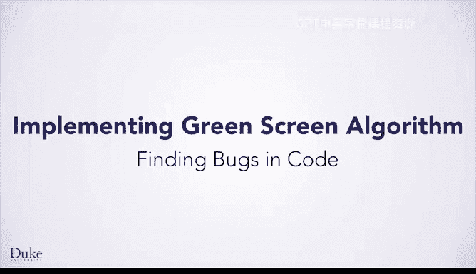
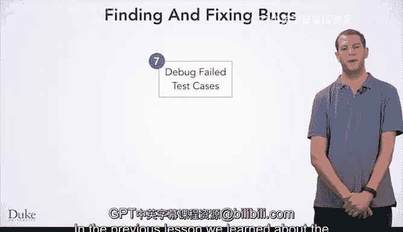

# 028：代码调试

在本节课中，我们将深入学习编程七步法中的第七步：调试失败的测试用例。我们将探讨如何系统地应用科学方法来定位和修复程序中的错误。

上一节我们介绍了编写程序的七步流程。本节中，我们来看看其中的第七步——调试失败的测试用例。这是一个至关重要的步骤，因为程序通常不会在第一次就完全正确。每个人都会犯错，程序中很容易出现导致错误行为的小问题。我们需要一个有效的方法来进行调试，而科学方法正是我们的工具。

## 科学方法回顾

你可能在小学或中学学过科学方法，或者学过略有不同的版本。我们在此简要回顾一下。

**第一步是观察现象**。对于程序而言，这通常意味着在测试时程序崩溃或表现出某些错误行为。

**第二步是提出问题**。在其他科学领域，问题可能是“为什么苹果会落到地上？”或“为什么这些鸟的喙略有不同？”。在编程中，问题通常是“为什么我的程序出错了？”以及“我的程序是如何出错的，以便我能修复它？”。

**第三步是收集信息并应用专业知识**。你可能想直接跳到形成假设，但形成一个好的假设通常非常困难。如果你是牛顿，你不会仅仅因为看到一个苹果落地就推导出万有引力理论。你可能需要进行多次实验，用许多不同的苹果或其他物体，才能得出他所发现的物理方程。

对于编程，我们需要收集关于程序内部运作的信息。我们可能需要进行多次实验来观察内部发生了什么。我们还将应用专业知识，即编程领域的知识，来帮助我们思考收集到的数据，分析并理解问题所在。

这个过程是迭代的。随着你收集信息，你会意识到需要收集的其他信息以及需要思考的其他方面。你会不断重复这一步，直到准备好形成假设。

**第四步是形成假设**。你需要做出一个能预测程序行为的陈述，例如“我认为当我的程序执行这个操作时，会发生以下情况”。

**第五步是测试假设**。一旦形成假设，你就可以进行测试。你将进行一些实验，如果程序的行为与假设相矛盾，则拒绝该假设。在这种情况下，你需要回到第三步，再次收集更多信息并应用专业知识。此时，你从假设错误的事实中学到了新东西，因此有了更多知识基础，可以形成更好的假设。

另一种可能是，我们确信我们的假设是正确的，因为所有证据都支持它。在这种情况下，我们接受假设，理解了程序的问题所在，并准备采取行动修复程序。

## 深入探讨信息收集

由于信息收集是过程中最耗时的步骤之一，我们来深入探讨一下具体如何操作。

我们需要查看程序的内部运作，以了解其每一步操作的情况。

以下是几种收集信息的方法：

*   **添加打印语句**：打印变量的值、打印到达特定代码行的时间，或在此过程中可能发现有用的任何其他信息。
*   **使用调试工具**：有专门编写的程序来帮助人们调试。它们允许你逐行执行代码、检查变量的值，甚至可以更改变量的值或观察变量何时会改变。具体可用的工具取决于你使用的编程语言，但掌握这些工具会非常强大和有用。
*   **手动执行代码**：在某些情况下，手动逐行执行代码、写下每一行的效果并弄清楚发生了什么，也很有指导意义。这能让你确切地看到程序中正在发生什么，从而可能让你对其行为有所洞察。

在进行所有这些操作时，你将应用专业知识。随着你成为一名更有经验的程序员和调试者，你会通过经验获得更多专业知识。事情对你来说会变得更自然，因为你会见过类似的情况，能识别程序某些症状的含义，并能更轻松地进行调试。

## 关于假设

我们来进一步谈谈假设。

一个好的假设应该是怎样的？

*   **可测试的**：即我们应该对程序的行为做出具体的预测，如果程序行为与该预测不符，我们可以反驳它；或者我们可以确信情况就是如此。
*   **可操作的**：即一旦我们确信它是真的，我们就可以去修复程序，因为我们现在知道问题所在。
*   **具体的**：尽可能具体地表述假设有助于实现以上两点。

让我们看几个例子。

首先是一个非常糟糕的假设例子，它没有提供任何有用信息：
> 我的假设是：我的程序坏了。

虽然这可能是真的（事实上，如果我们观察到一个失败的测试用例，很可能就是如此），但这并没有告诉我们任何关于如何修复程序的有用信息。

一个稍好一点的假设是：
> 问题出在第5行。

这告诉了我们代码中出错的大致位置。我们或许可以采取一些行动，比如去查看第5行，看看能发现什么问题，但它并没有真正告诉我们具体是什么错了。

一个更好的假设是：
> 问题是我们程序第5行出现了除以零的情况。

这具体地告诉了我们错误是什么以及在哪里。我们可以测试这一点，看看是否真的除以零，并且我们或许可以采取行动，但我们还可以做得更好。

这里有一个非常好的假设：
> 问题是在第5行除以零，特别是对于满足特定条件的输入（例如，`red < 30` 且 `green > 245`）。

这个假设是可测试的。我们可以去设计特定的输入，来验证是否正是这些条件和这种行为。它也是高度可操作的。一旦我们确信这个假设是真的，我们就确切地知道该如何修复程序。我们回到七步流程的第1、2、3步，看看这类特定输入有什么特别之处，它们如何需要作为特殊情况融入我们的算法，然后调整算法并修复代码。

## 测试假设

当我们想要测试假设时，我们将运行程序。我们会选择我们认为合适的测试用例，将其作为程序的输入并运行，然后观察结果。程序行为是否符合我们的预测，将是测试用例的结果。

如果行为不匹配，我们将拒绝该假设。任何时候得到矛盾的信息，都表明我们的假设不正确，我们需要去形成一个新的假设。

如果行为与我们预测的相同，我们不会立即接受假设，而只是对假设稍微更有信心。我们会继续测试，直到我们有足够的信心接受假设。

检查假设与收集信息非常相似。我们可能只需要运行并查看输出，但有时我们需要更多信息，可能希望打印内部变量的状态或检查程序行为的其他方面。

## 避免临时修改

现在，我们已经教你了一个调试程序的好方法。然而，许多程序员常常会陷入一种诱惑，即进行临时性的修改。“也许我只要改一下这里，在这里加个1或减个1，也许就能行。”“如果我稍微调整一下代码，希望它能修复问题。”“我可能会走运，节省一些时间，因为收集信息和形成假设可能是项艰苦的工作。”

这很诱人，但确实是个糟糕的主意。我们想用一个看医生的比喻来说明这一点。

假设你生病了去看医生。“医生，我咳嗽，感觉不舒服。”医生的职责是诊断你，这与你的职责是诊断和修复你的程序非常相似。

你的医生会随机尝试方法吗？“吃这个药，看看会发生什么？”如果是这样，我会换个医生。不，你的医生会使用科学方法。他或她会收集信息，进行一些测试，应用专业知识（所有在医学院学到的以及从其他病人工作中获得的经验），想出一个好的假设，测试那个假设，然后一旦他或她确信你的问题所在，就会根据诊断采取纠正措施。

## 总结

本节课中，我们一起学习了科学方法，并讨论了将其作为调试程序的基础。我们回顾了科学方法的步骤，深入探讨了如何收集程序内部信息，学习了如何形成具体、可测试、可操作的假设，并强调了避免临时修改、坚持系统性调试的重要性。