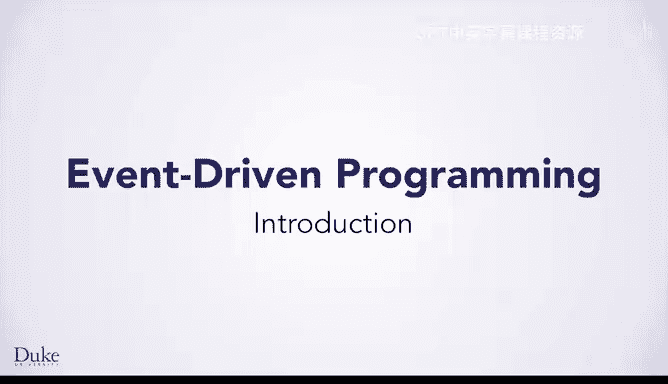
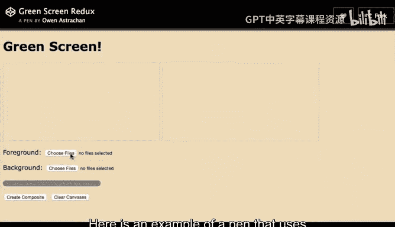
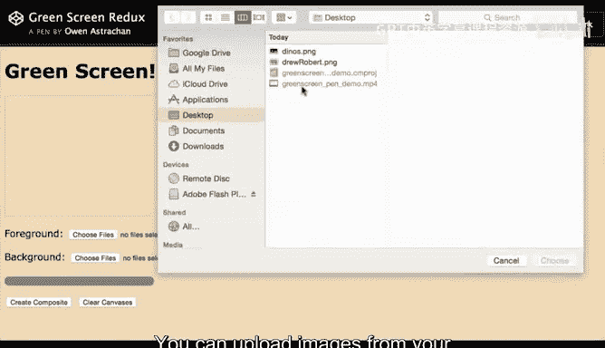
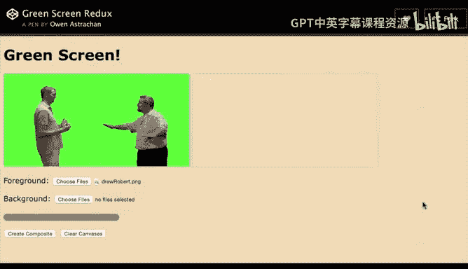
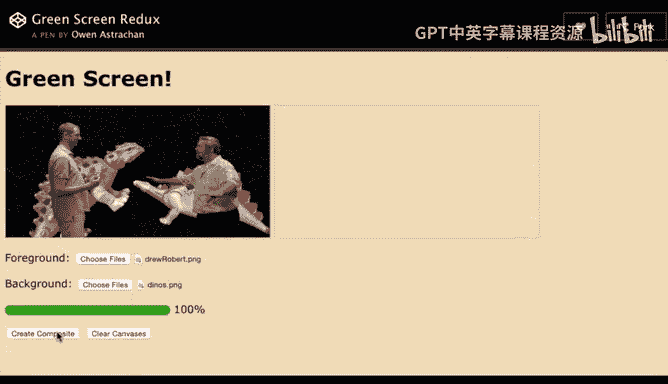

# Java编程和软件工程基础：P29：创建交互式网页入门

在本节课中，我们将学习如何结合HTML、CSS和JavaScript来创建交互式网页。我们将从事件驱动编程的基础概念开始，并动手实践，制作一个能让用户上传图片并应用绿幕合成算法的网页应用。

---

你已经学习了创建网页的基础知识以及Java编程的一些核心概念。现在，你已准备好探索如何使用HTML和CSS创建交互式网页。

通过之前的学习和实践，你能够创建并美化简单的基础网页。然而，你可能见过许多可以以多种方式改变的交互式网页。

交互的核心在于**事件驱动编程**。你可以创建一个事件（如点击按钮）来触发各种响应动作，例如上传文件、切换视图、排序信息、显示图片或在页面中选择特定功能。

新的HTML5标准支持各种交互功能。虽然我们在这里只探索其中一部分，但你将学习使用JavaScript进行简单事件驱动编程的基础，从而创建交互式网页。

我们将基于你已掌握的JavaScript知识进行扩展。具体来说，你将学习如何创建一个交互式网页，来支持你之前用JavaScript完成的绿幕图像处理。

通过结合HTML、CSS和JavaScript的知识，你将能够制作一种新型网页——一个你可以或任何用户可以与之互动的网页。

编程将隐藏在幕后，你编写的代码将通过点击网页上创建的按钮来调用。你将能够点击按钮，将图片上传到网页的不同部分，如下图所示，这两张图片将用于创建合成的绿幕图像。

以下是一个示例，它使用按钮让用户可以尝试你的绿幕处理流程。你可以从计算机上传图片作为前景和背景图像。

你将能够选择计算机或设备上的图片，并将它们上传到你创建的网页中。

当你点击“创建合成图”按钮时，你为绿幕算法编写的JavaScript代码将被调用来创建合成图像。

通过一些练习和研究，你甚至可以在最终合成图显示之前，创建一个进度条来展示图像已处理的进度。

---

你将学习创建类似`histography.io`网站页面的基础知识。这个网站以复杂的方式运用HTML、CSS和JavaScript，创建了一个有趣的交互式网页，用于探索信息。

你通过HTML元素和JavaScript与页面进行交互。按钮允许你改变显示信息的年份范围，例如查看400年间的各类信息，或仅选择1956年至1981年这25年间的音乐事件，甚至可以筛选特定年份的少数特定事件，比如20世纪70年代披头士乐队录制《Let it be》的时刻。

掌握HTML、CSS和JavaScript的基础知识，将为持续提升你的技能奠定坚实的基础。让我们开始吧。

---

本节课中，我们一起学习了事件驱动编程的基本概念，并了解了如何将HTML、CSS和JavaScript结合，通过按钮等交互元素来创建动态的网页应用。我们从绿幕合成的具体例子出发，看到了交互如何让用户控制网页行为，最后展望了这些基础知识在构建更复杂交互体验（如历史时间线浏览器）中的应用。