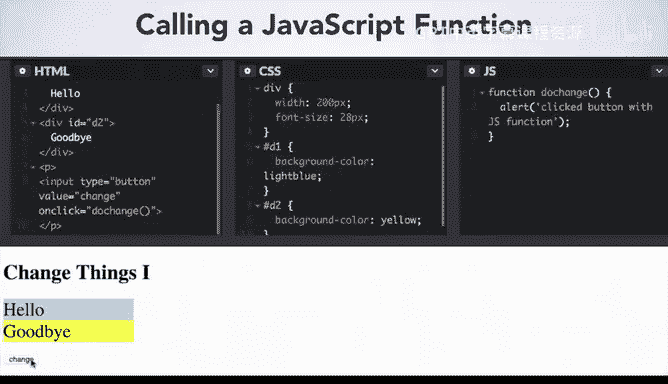
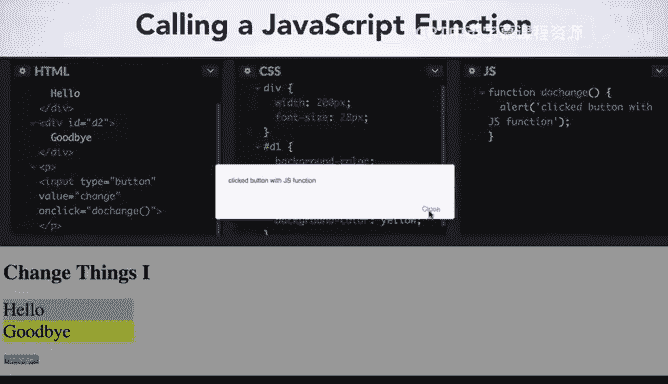

# 030：Div按钮实现 🖱️


在本节课中，我们将学习如何使用JavaScript与网页内容进行交互。我们将从简单的HTML和CSS示例开始，然后向这个简单的网页添加JavaScript。通过从一个基础网页入手，你将能够理解如何为其添加交互性。

## 概述

我们将首先创建一个非常简单的网页，然后为其添加JavaScript。网页的第一个版本将只使用HTML和CSS，包含两个通过CSS类ID进行样式化的`<div>`元素。接着，我们将引入一个新的HTML元素——按钮，并将这个按钮连接到最终能与网页元素交互的功能上。点击按钮将触发由你（程序员）决定的不同操作。

## 从HTML和CSS开始

首先，我们来看一个基础的网页结构。以下是代码示例，包含HTML和CSS部分。

```html
<!-- HTML -->
<div id="d1">这是第一个div</div>
<div id="d2">这是第二个div</div>
```

```css
/* CSS */
#d1 {
  width: 200px;
  font-size: 16px;
  background-color: lightblue;
}
#d2 {
  width: 200px;
  font-size: 16px;
  background-color: yellow;
}
```

在这个简单的网页中，我们有两个`<div>`元素。ID为`d1`的`<div>`背景色被设置为浅蓝色，ID为`d2`的`<div>`背景色被设置为黄色。这就是我们将要使其变得具有交互性的起点。

## 创建HTML按钮

上一节我们介绍了基础的网页结构，本节中我们来看看如何创建一个HTML按钮，并为其编程，使其在被按下时产生效果。

我们将使用一个新的HTML标签：`<input>`标签。它类似于你之前见过的用于显示图像的``标签，因为这个标签没有独立的开始和结束标签，而是一个内部包含选项的单标签。

以下是创建按钮的关键属性：

*   **`type`**： 指定输入元素的类型。在我们的第一个例子中，只使用`"button"`作为输入类型。稍后我们将看到，你可以使用颜色选择器作为输入类型，让用户可以选择颜色作为与网页交互的一部分。我们还会看到其他类型的输入，包括滑块、文件上传器等。
*   **`value`**： 指定按钮上显示的文本。
*   **`onclick`**： 这是一个事件属性，用于告诉按钮在发生特定事件（本例中是用户点击鼠标）时该做什么。其他常见的HTML事件示例包括网页加载完成、用户鼠标悬停在文本或图像上、或输入字段发生改变（例如输入密码时）。

`onclick`关键字是一个HTML事件属性，表示其后的JavaScript代码应在点击事件发生时做出反应。这会调用一个**事件处理程序**，它规定了按钮被按下或点击时会发生什么。

让我们看一个直接在HTML中内联使用`alert`的简单例子：

```html
<input type="button" value="点击我" onclick="alert('按钮被点击了！')">
```

当用户点击这个按钮时，会弹出一个包含指定消息的警告框。用户需要关闭这个警告框才能处理更多事件。

## 使用JavaScript函数处理事件

但是，如果我们需要执行比简单弹窗更复杂的指令集呢？与其将`alert`直接写在`<input>`标签内，我们更希望能够使用JavaScript来处理按钮生成的事件。

我们可以通过编写一个JavaScript函数来实现，就像你已经做过的那样。我们将这个函数命名为`doChange`，在函数体内，我们将显示一个文本为“按钮被点击”的警告。

然后，我们可以在`onclick`事件中调用这个函数。

*   HTML的`<input>`创建了用户与之交互的元素。
*   当用户点击按钮时，与`onclick`事件关联的事件处理程序（即JavaScript函数）被触发或调用。
*   在这里，事件处理程序通过调用我们刚刚编写的`doChange`函数连接到JavaScript代码。

让我们看看具体的代码实现：

```javascript
// JavaScript 函数
function doChange() {
    alert('这是由JavaScript函数触发的警告！');
}
```

```html
<!-- 更新后的HTML按钮 -->
<input type="button" value="点击我" onclick="doChange()">
```



现在，当按钮被按下时，调用的是我们定义的JavaScript函数`doChange`，从而弹出相应的警告框。这是一个开始学习事件处理的好方法。



## 总结

本节课中我们一起学习了如何使用HTML元素让用户与网页交互。我们创建了一个按钮（稍后还会看到其他类型的输入）。我们学习了如何为用户点击按钮的事件创建事件处理程序。由于JavaScript命令有时可能很复杂，我们还学习了如何创建一个可以被事件处理程序调用的函数。

你将在CodePen的JS（JavaScript）面板中编写JavaScript，但你所获得的关于HTML、CSS和JavaScript的知识，将使你能够创建可以部署在网络上任何地方的页面，而不仅仅是在CodePen内。你将能够运用关于循环、变量和`if`语句的知识来交互和修改网页。

祝你学习愉快！