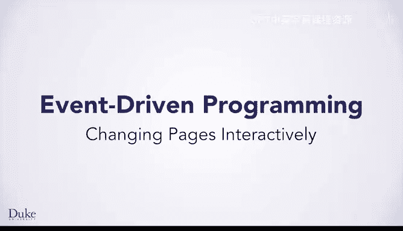

# Java编程和软件工程基础-1：P31：交互式页面切换

## 概述
在本节课中，我们将学习如何使用JavaScript来交互式地改变网页内容。这是为网页编程绿屏算法以及创意设计网页的基础。

## 访问网页元素
要改变一个网页，你需要编写JavaScript代码来访问页面中的元素，例如H1标签、div元素或其他带标签的元素。

以下是访问元素的几种主要方式：
*   可以通过标签名访问所有同类元素，例如所有H1标签或所有li标签。
*   可以通过ID访问单个元素。
*   可以通过类名访问一组元素。

我们主要使用ID来访问HTML元素，因为ID是唯一的，每个元素必须有一个不同的ID。相比之下，许多元素可以共享同一个类名。

## 改变元素样式
在我们的示例中，你将看到如何向HTML元素（如div）添加CSS类。这允许你改变元素的背景颜色、宽度或高度。

也可以改变元素中显示的文本或其他特性。

## 一个简单的交互示例
让我们看一个使用交互式JavaScript改变网页的简单例子。我们将使用两个CSS类，每个类为div指定不同的背景颜色。通过点击按钮，你将使用JavaScript为每个div分配一个CSS类，使div的外观发生变化，从无背景色变为不同的背景色。

基本思路是通过ID以编程方式访问每个div，并更改与该div关联的CSS。我们将先概览，然后查看细节。

## 示例解析：改变颜色
你刚才看到了div改变颜色。你可能记得每个div都有不同的ID：显示“hello”的div的ID是D1，显示“goodbye”的div的ID是D2。

`onclick`事件属性告诉页面创建一个事件处理器来执行其后的JavaScript代码。你将能够使用JavaScript来访问带有ID“D1”的div或其他任何元素，这使得改变元素的特性成为可能。

在这个例子中，JavaScript函数名为`changeColor`。让我们通过查看JavaScript代码来了解这个函数。

## JavaScript函数详解
`changeColor`函数如下所示。记住，当用户点击与网页交互的按钮时，会调用这个函数。该函数被`onclick`事件处理器调用或触发。

JavaScript方法`getElementById`用于通过其关联的ID访问HTML元素。你可能记得，方法是对对象执行的操作，前面有一个点号。在这种情况下，`getElementById`方法使用HTML文档来访问其元素。标签`document`指的是整个HTML网页。

`getElementById`方法有一个参数，这里是“D1”，即与特定HTML元素关联的ID标签。该方法返回具有作为参数传递的ID标签的HTML元素，也就是带有单词“hello”的div元素，因为关联的ID标签是“D1”。

我们需要创建一个变量来存储这个返回的HTML元素，这里用`var dd1`表示。现在，这个变量可以用来访问元素并改变其颜色。

下一行创建了一个类似的变量`dd2`，它存储了当参数为“D2”时，`document.getElementById`返回的HTML元素。

接下来，要改变此页面中使用的背景颜色，我们需要为每个div设置背景颜色。我们将通过设置div的CSS类来实现。

代码行`dd1.className = "blueback"`改变了ID为D1的div的颜色。记住，这个div存储在变量`dd1`中。属性`className`是HTML元素的一个特性，可以在JavaScript中访问。正如我们将在后面的例子中看到的，HTML元素还有许多其他属性，你也可以通过JavaScript访问来改变它们。这些属性有时被称为字段，在JavaScript程序中使用点号表示法访问。

该代码将类名“blueback”分配为存储在变量`dd1`中的div的类。正如你在我们展示的CodePen页面的CSS面板中看到的，类`blueback`具有特定的背景颜色。如果其他CSS特性是此类`blueback`的一部分，那么这些特性也将成为标签为D1的div的一部分，这是将类`blueback`分配给JavaScript中变量`dd1`的结果。

下一行类似地将类`yellowback`分配给变量`dd2`，该变量存储着ID为D2的HTML元素。

再次演示，使用`onclick`事件处理器调用JavaScript函数`changeColor`，将这些CSS类分配给选定的HTML元素，我们就看到了背景的变化。

## 改变元素文本
也可以改变HTML元素的其他属性，例如与元素关联的文本。函数`changeText`使用了与我们刚才在`changeColor`中看到的非常相似的方法。

前两行创建变量来存储HTML元素，这些行与我们在`changeColor`中看到的完全相同。

与之前一样，要访问HTML元素的属性，你将使用点语法和将在JavaScript中使用的属性或字段的名称。这里显示的属性`innerHTML`访问元素内的HTML内容。在这种情况下，就是div内部的所有内容，即文本。

代码行`dd1.innerHTML = "Bonjour"`改变了由变量`dd1`访问的HTML元素的文本。这是ID为D1的同一个HTML元素，在代码执行前显示单词“hello”，在代码运行后将显示“Bonjour”。

值得指出的是，虽然`dd1`是一个HTML元素（在本例中特指一个div），但一般来说，它只是一个对象，就像CSS样式或简单图像都是对象一样。你总是可以使用文档来了解哪些方法可以对不同的对象进行操作。

在操作中，你可以看到点击“change text”按钮时会发生什么。`onclick`事件处理器调用我们刚才看到的JavaScript函数`changeText`，该函数访问div内部的HTML并将其设置为新文本“Bonjour”和“Sayonara”。

## 总结
本节课中，我们一起学习了如何使用JavaScript交互式地改变网页。我们掌握了通过ID访问HTML元素、修改元素的CSS类以改变样式（如背景色），以及使用`innerHTML`属性来动态更新元素内的文本内容。这些技术是实现网页动态交互功能的基础。